# System Specification (As-Built)

> **注意**: このドキュメントは実装コードから自動生成されています。
> 人間が記述した仕様書は `ABDD/intention/spec.md` を参照してください。

## 解析メタデータ

- **解析日時**: 2026-03-04T10:48:55.848Z
- **ファイル数**: 769
- **サブシステム数**: 569

---

## 全体フロー

---

## サブシステム一覧

| サブシステム | 責務 | 主要ファイル | エクスポート数 |
|-------------|------|-------------|---------------|
| agent-teams | - | `.pi/extensions/agent-teams/bond-integration.ts` | 174 |
| code-structure-analyzer | - | `.pi/extensions/code-structure-analyzer/extension.ts` | 29 |
| loop | - | `.pi/extensions/loop/iteration-builder.ts` | 32 |
| mcp | - | `.pi/extensions/mcp/tools/connection.ts` | 11 |
| repograph-localization | - | `.pi/extensions/repograph-localization/index.ts` | 5 |
| search | - | `.pi/extensions/search/call-graph/builder.ts` | 329 |
| shared | - | `.pi/extensions/shared/pi-print-executor.ts` | 12 |
| subagents | - | `.pi/extensions/subagents/live-monitor.ts` | 29 |
| web-ui | - | `.pi/extensions/web-ui/config.ts` | 261 |
| lib/data-dictionary | - | `.pi/lib/__tests__/data-dictionary.ts` | 6 |
| lib/abdd-types | - | `.pi/lib/abdd-types.ts` | 27 |
| lib/abort-utils | - | `.pi/lib/abort-utils.ts` | 2 |
| lib/adaptive-rate-controller | - | `.pi/lib/adaptive-rate-controller.ts` | 29 |
| lib/adaptive-total-limit | - | `.pi/lib/adaptive-total-limit.ts` | 7 |
| lib/adaptive-penalty | - | `.pi/lib/agent/adaptive-penalty.ts` | 14 |
| lib/agent-common | - | `.pi/lib/agent/agent-common.ts` | 11 |
| lib/agent-errors | - | `.pi/lib/agent/agent-errors.ts` | 27 |
| lib/agent-memory | - | `.pi/lib/agent/agent-memory.ts` | 9 |
| lib/agent-types | - | `.pi/lib/agent/agent-types.ts` | 1 |
| lib/agent-utils | - | `.pi/lib/agent/agent-utils.ts` | 5 |
| lib/index | - | `.pi/lib/agent/index.ts` | 0 |
| lib/live-view-utils | - | `.pi/lib/agent/live-view-utils.ts` | 8 |
| lib/model-timeouts | - | `.pi/lib/agent/model-timeouts.ts` | 4 |
| lib/output-validation | - | `.pi/lib/agent/output-validation.ts` | 11 |
| lib/runtime-error-builders | - | `.pi/lib/agent/runtime-error-builders.ts` | 1 |
| lib/runtime-utils | - | `.pi/lib/agent/runtime-utils.ts` | 7 |
| lib/structured-logger | - | `.pi/lib/agent/structured-logger.ts` | 21 |
| lib/subagent-types | - | `.pi/lib/agent/subagent-types.ts` | 9 |
| lib/team-types | - | `.pi/lib/agent/team-types.ts` | 16 |
| lib/global-state-provider | - | `.pi/lib/agent-runtime/adapters/global-state-provider.ts` | 1 |
| lib/index | - | `.pi/lib/agent-runtime/adapters/index.ts` | 0 |
| lib/index | - | `.pi/lib/agent-runtime/application/index.ts` | 0 |
| lib/interfaces | - | `.pi/lib/agent-runtime/application/interfaces.ts` | 9 |
| lib/runtime-service | - | `.pi/lib/agent-runtime/application/runtime-service.ts` | 1 |
| lib/capacity-check | - | `.pi/lib/agent-runtime/domain/capacity-check.ts` | 6 |
| lib/index | - | `.pi/lib/agent-runtime/domain/index.ts` | 0 |
| lib/runtime-state | - | `.pi/lib/agent-runtime/domain/runtime-state.ts` | 15 |
| lib/index | - | `.pi/lib/agent-runtime/index.ts` | 0 |
| lib/extension-adapter | - | `.pi/lib/agent-runtime/infrastructure/extension-adapter.ts` | 2 |
| lib/index | - | `.pi/lib/agent-runtime/infrastructure/index.ts` | 0 |
| lib/aggregator | - | `.pi/lib/analytics/aggregator.ts` | 6 |
| lib/anomaly-detector | - | `.pi/lib/analytics/anomaly-detector.ts` | 5 |
| lib/behavior-storage | - | `.pi/lib/analytics/behavior-storage.ts` | 7 |
| lib/efficiency-analyzer | - | `.pi/lib/analytics/efficiency-analyzer.ts` | 4 |
| lib/index | - | `.pi/lib/analytics/index.ts` | 0 |
| lib/llm-behavior-types | - | `.pi/lib/analytics/llm-behavior-types.ts` | 12 |
| lib/metric-collectors | - | `.pi/lib/analytics/metric-collectors.ts` | 5 |
| lib/index | - | `.pi/lib/awo/index.ts` | 2 |
| lib/meta-tool-extractor | - | `.pi/lib/awo/meta-tool-extractor.ts` | 3 |
| lib/meta-tool-registry | - | `.pi/lib/awo/meta-tool-registry.ts` | 3 |
| lib/state-graph | - | `.pi/lib/awo/state-graph.ts` | 3 |
| lib/trace-collector | - | `.pi/lib/awo/trace-collector.ts` | 3 |
| lib/types | - | `.pi/lib/awo/types.ts` | 15 |
| lib/boundary-enforcer | - | `.pi/lib/boundary-enforcer.ts` | 5 |
| lib/checkpoint-manager | - | `.pi/lib/checkpoint-manager.ts` | 11 |
| lib/circuit-breaker | - | `.pi/lib/circuit-breaker.ts` | 10 |
| lib/comprehensive-logger-config | - | `.pi/lib/comprehensive-logger-config.ts` | 4 |
| lib/comprehensive-logger-types | - | `.pi/lib/comprehensive-logger-types.ts` | 19 |
| lib/comprehensive-logger | - | `.pi/lib/comprehensive-logger.ts` | 3 |
| lib/concurrency | - | `.pi/lib/concurrency.ts` | 5 |
| lib/consciousness-spectrum | - | `.pi/lib/consciousness-spectrum.ts` | 6 |
| lib/context-breakdown-types | - | `.pi/lib/context-breakdown-types.ts` | 9 |
| lib/context-breakdown-utils | - | `.pi/lib/context-breakdown-utils.ts` | 12 |
| lib/context-engineering | - | `.pi/lib/context-engineering.ts` | 20 |
| lib/context-reporter | - | `.pi/lib/context-reporter.ts` | 5 |
| lib/context-repository | - | `.pi/lib/context-repository.ts` | 4 |
| lib/context-summarizer | - | `.pi/lib/context-summarizer.ts` | 6 |
| lib/cross-instance-coordinator | - | `.pi/lib/coordination/cross-instance-coordinator.ts` | 51 |
| lib/dynamic-parallelism | - | `.pi/lib/coordination/dynamic-parallelism.ts` | 12 |
| lib/index | - | `.pi/lib/coordination/index.ts` | 0 |
| lib/priority-scheduler | - | `.pi/lib/coordination/priority-scheduler.ts` | 15 |
| lib/hybrid-scoring | - | `.pi/lib/coordination/task-scheduler/hybrid-scoring.ts` | 4 |
| lib/index | - | `.pi/lib/coordination/task-scheduler/index.ts` | 0 |
| lib/preemption | - | `.pi/lib/coordination/task-scheduler/preemption.ts` | 4 |
| lib/scheduler | - | `.pi/lib/coordination/task-scheduler/scheduler.ts` | 4 |
| lib/types | - | `.pi/lib/coordination/task-scheduler/types.ts` | 7 |
| lib/utils | - | `.pi/lib/coordination/task-scheduler/utils.ts` | 4 |
| lib/task-scheduler | - | `.pi/lib/coordination/task-scheduler.ts` | 0 |
| lib/unified-limit-resolver | - | `.pi/lib/coordination/unified-limit-resolver.ts` | 10 |
| lib/error-utils | - | `.pi/lib/core/error-utils.ts` | 9 |
| lib/errors | - | `.pi/lib/core/errors.ts` | 32 |
| lib/format-utils | - | `.pi/lib/core/format-utils.ts` | 6 |
| lib/fs-utils | - | `.pi/lib/core/fs-utils.ts` | 1 |
| lib/index | - | `.pi/lib/core/index.ts` | 0 |
| lib/validation-utils | - | `.pi/lib/core/validation-utils.ts` | 6 |
| lib/cost-estimator | - | `.pi/lib/cost-estimator.ts` | 8 |
| lib/creative-destruction | - | `.pi/lib/creative-destruction.ts` | 17 |
| lib/creative-transcendence | - | `.pi/lib/creative-transcendence.ts` | 7 |
| lib/adaptorch-adapter | - | `.pi/lib/dag/adaptorch-adapter.ts` | 6 |
| lib/base-executor | - | `.pi/lib/dag/executors/base-executor.ts` | 2 |
| lib/hierarchical-executor | - | `.pi/lib/dag/executors/hierarchical-executor.ts` | 1 |
| lib/hybrid-executor | - | `.pi/lib/dag/executors/hybrid-executor.ts` | 1 |
| lib/parallel-executor | - | `.pi/lib/dag/executors/parallel-executor.ts` | 1 |
| lib/sequential-executor | - | `.pi/lib/dag/executors/sequential-executor.ts` | 1 |
| lib/index | - | `.pi/lib/dag/index.ts` | 0 |
| lib/orchestrator | - | `.pi/lib/dag/orchestrator.ts` | 4 |
| lib/synthesis | - | `.pi/lib/dag/synthesis.ts` | 7 |
| lib/topology-router | - | `.pi/lib/dag/topology-router.ts` | 4 |
| lib/types | - | `.pi/lib/dag/types.ts` | 15 |
| lib/dag-errors | - | `.pi/lib/dag-errors.ts` | 6 |
| lib/dag-executor | - | `.pi/lib/dag-executor.ts` | 7 |
| lib/dag-generator | - | `.pi/lib/dag-generator.ts` | 5 |
| lib/dag-types | - | `.pi/lib/dag-types.ts` | 5 |
| lib/dag-validator | - | `.pi/lib/dag-validator.ts` | 3 |
| lib/dag-weight-calculator | - | `.pi/lib/dag-weight-calculator.ts` | 10 |
| lib/dag-weight-updater.example | - | `.pi/lib/dag-weight-updater.example.ts` | 0 |
| lib/dag-weight-updater | - | `.pi/lib/dag-weight-updater.ts` | 3 |
| lib/core | - | `.pi/lib/deep-exploration/core.ts` | 3 |
| lib/index | - | `.pi/lib/deep-exploration/index.ts` | 0 |
| lib/meta-metacognition | - | `.pi/lib/deep-exploration/meta-metacognition.ts` | 1 |
| lib/non-linear | - | `.pi/lib/deep-exploration/non-linear.ts` | 1 |
| lib/paraconsistent | - | `.pi/lib/deep-exploration/paraconsistent.ts` | 2 |
| lib/self-destruction | - | `.pi/lib/deep-exploration/self-destruction.ts` | 3 |
| lib/seven-perspectives | - | `.pi/lib/deep-exploration/seven-perspectives.ts` | 1 |
| lib/types | - | `.pi/lib/deep-exploration/types.ts` | 22 |
| lib/deep-exploration | - | `.pi/lib/deep-exploration.ts` | 0 |
| lib/delegation-quality | - | `.pi/lib/delegation-quality.ts` | 6 |
| lib/desiring-production | - | `.pi/lib/desiring-production.ts` | 8 |
| lib/audit | - | `.pi/lib/dynamic-tools/audit.ts` | 7 |
| lib/index | - | `.pi/lib/dynamic-tools/index.ts` | 0 |
| lib/quality | - | `.pi/lib/dynamic-tools/quality.ts` | 12 |
| lib/reflection | - | `.pi/lib/dynamic-tools/reflection.ts` | 5 |
| lib/registry | - | `.pi/lib/dynamic-tools/registry.ts` | 24 |
| lib/safety | - | `.pi/lib/dynamic-tools/safety.ts` | 5 |
| lib/types | - | `.pi/lib/dynamic-tools/types.ts` | 20 |
| lib/error-classifier | - | `.pi/lib/error-classifier.ts` | 5 |
| lib/execution-rules | - | `.pi/lib/execution-rules.ts` | 9 |
| lib/experience-replay | - | `.pi/lib/experience-replay.ts` | 22 |
| lib/file-filter | - | `.pi/lib/file-filter.ts` | 5 |
| lib/frontmatter | - | `.pi/lib/frontmatter.ts` | 1 |
| lib/global-error-handler | - | `.pi/lib/global-error-handler.ts` | 4 |
| lib/hyper-metacognition | - | `.pi/lib/hyper-metacognition.ts` | 14 |
| lib/inquiry-driven-exploration | - | `.pi/lib/inquiry-driven-exploration.ts` | 9 |
| lib/inquiry-library | - | `.pi/lib/inquiry-library.ts` | 3 |
| lib/inquiry-prompt-builder | - | `.pi/lib/inquiry-prompt-builder.ts` | 5 |
| lib/intent-aware-limits | - | `.pi/lib/intent-aware-limits.ts` | 10 |
| lib/intent-mediator | - | `.pi/lib/intent-mediator.ts` | 4 |
| lib/runtime-snapshot | - | `.pi/lib/interfaces/runtime-snapshot.ts` | 1 |
| lib/mbt-driver | - | `.pi/lib/invariant/application/generators/mbt-driver.ts` | 1 |
| lib/property-tests | - | `.pi/lib/invariant/application/generators/property-tests.ts` | 1 |
| lib/quint | - | `.pi/lib/invariant/application/generators/quint.ts` | 1 |
| lib/validators | - | `.pi/lib/invariant/application/generators/validators.ts` | 1 |
| lib/parser | - | `.pi/lib/invariant/application/parser.ts` | 1 |
| lib/types | - | `.pi/lib/invariant/domain/types.ts` | 11 |
| lib/index | - | `.pi/lib/invariant/index.ts` | 0 |
| lib/learnable-mode-selector | - | `.pi/lib/learnable-mode-selector.ts` | 14 |
| lib/live-types-base | - | `.pi/lib/live-types-base.ts` | 2 |
| lib/long-running-support | - | `.pi/lib/long-running-support.ts` | 12 |
| lib/love-thinking-modes | - | `.pi/lib/love-thinking-modes.ts` | 7 |
| lib/auth-provider | - | `.pi/lib/mcp/auth-provider.ts` | 5 |
| lib/config-loader | - | `.pi/lib/mcp/config-loader.ts` | 6 |
| lib/connection-manager | - | `.pi/lib/mcp/connection-manager.ts` | 1 |
| lib/tool-bridge | - | `.pi/lib/mcp/tool-bridge.ts` | 4 |
| lib/types | - | `.pi/lib/mcp/types.ts` | 33 |
| lib/mediator-history | - | `.pi/lib/mediator-history.ts` | 15 |
| lib/mediator-integration | - | `.pi/lib/mediator-integration.ts` | 10 |
| lib/mediator-lic-rules | - | `.pi/lib/mediator-lic-rules.ts` | 6 |
| lib/mediator-prompt | - | `.pi/lib/mediator-prompt.ts` | 11 |
| lib/mediator-types | - | `.pi/lib/mediator-types.ts` | 38 |
| lib/context-saturation-gap | - | `.pi/lib/memory/context-saturation-gap.ts` | 10 |
| lib/entity-centric-memory | - | `.pi/lib/memory/entity-centric-memory.ts` | 21 |
| lib/metrics-collector | - | `.pi/lib/memory/metrics-collector.ts` | 17 |
| lib/semantic-evaluator | - | `.pi/lib/memory/semantic-evaluator.ts` | 11 |
| lib/meta-evaluation | - | `.pi/lib/meta-evaluation.ts` | 8 |
| lib/metrics-collector | - | `.pi/lib/metrics-collector.ts` | 23 |
| lib/nonlinear-thought | - | `.pi/lib/nonlinear-thought.ts` | 18 |
| lib/output-schema | - | `.pi/lib/output-schema.ts` | 22 |
| lib/output-template | - | `.pi/lib/output-template.ts` | 5 |
| lib/parallel-search | - | `.pi/lib/parallel-search.ts` | 5 |
| lib/performance-monitor | - | `.pi/lib/performance-monitor.ts` | 5 |
| lib/performance-profiles | - | `.pi/lib/performance-profiles.ts` | 6 |
| lib/perspective-scorer | - | `.pi/lib/perspective-scorer.ts` | 8 |
| lib/aporetic-reasoning | - | `.pi/lib/philosophy/aporetic-reasoning.ts` | 14 |
| lib/aporia-awareness | - | `.pi/lib/philosophy/aporia-awareness.ts` | 9 |
| lib/aporia-handler | - | `.pi/lib/philosophy/aporia-handler.ts` | 13 |
| lib/aporia-tracker | - | `.pi/lib/philosophy/aporia-tracker.ts` | 5 |
| lib/belief-updater | - | `.pi/lib/philosophy/belief-updater.ts` | 21 |
| lib/index | - | `.pi/lib/philosophy/index.ts` | 0 |
| lib/pi-coding-agent-compat | - | `.pi/lib/pi-coding-agent-compat.ts` | 0 |
| lib/plan-mode-shared | - | `.pi/lib/plan-mode-shared.ts` | 6 |
| lib/process-utils | - | `.pi/lib/process-utils.ts` | 0 |
| lib/prompt-templates | - | `.pi/lib/prompt-templates.ts` | 6 |
| lib/provider-limits | - | `.pi/lib/provider-limits.ts` | 15 |
| lib/reasoning-bonds-evaluator | - | `.pi/lib/reasoning-bonds-evaluator.ts` | 5 |
| lib/reasoning-bonds | - | `.pi/lib/reasoning-bonds.ts` | 14 |
| lib/relationship-metrics | - | `.pi/lib/relationship-metrics.ts` | 10 |
| lib/relationship-unmeasurables | - | `.pi/lib/relationship-unmeasurables.ts` | 3 |
| lib/resource-tracker | - | `.pi/lib/resource-tracker.ts` | 5 |
| lib/retry-config | - | `.pi/lib/retry-config.ts` | 7 |
| lib/retry-with-backoff | - | `.pi/lib/retry-with-backoff.ts` | 11 |
| lib/run-desiring-analysis | - | `.pi/lib/run-desiring-analysis.ts` | 1 |
| lib/runtime-config | - | `.pi/lib/runtime-config.ts` | 8 |
| lib/runtime-sessions | - | `.pi/lib/runtime-sessions.ts` | 16 |
| lib/runtime-types | - | `.pi/lib/runtime-types.ts` | 22 |
| lib/sbfl | - | `.pi/lib/sbfl.ts` | 11 |
| lib/schema-validator | - | `.pi/lib/schema-validator.ts` | 7 |
| lib/self-awareness-integration | - | `.pi/lib/self-awareness-integration.ts` | 4 |
| lib/file-adapter | - | `.pi/lib/self-improvement/adapters/file-adapter.ts` | 5 |
| lib/git-adapter | - | `.pi/lib/self-improvement/adapters/git-adapter.ts` | 4 |
| lib/index | - | `.pi/lib/self-improvement/adapters/index.ts` | 0 |
| lib/prompts | - | `.pi/lib/self-improvement/adapters/prompts.ts` | 9 |
| lib/index | - | `.pi/lib/self-improvement/application/index.ts` | 0 |
| lib/loop-service | - | `.pi/lib/self-improvement/application/loop-service.ts` | 4 |
| lib/index | - | `.pi/lib/self-improvement/domain/index.ts` | 0 |
| lib/loop-state | - | `.pi/lib/self-improvement/domain/loop-state.ts` | 8 |
| lib/perspective | - | `.pi/lib/self-improvement/domain/perspective.ts` | 8 |
| lib/types | - | `.pi/lib/self-improvement/domain/types.ts` | 25 |
| lib/index | - | `.pi/lib/self-improvement/index.ts` | 0 |
| lib/self-improvement-cycle | - | `.pi/lib/self-improvement-cycle.ts` | 9 |
| lib/self-improvement-data-platform | - | `.pi/lib/self-improvement-data-platform.ts` | 15 |
| lib/self-revision | - | `.pi/lib/self-revision.ts` | 3 |
| lib/semantic-cache | - | `.pi/lib/semantic-cache.ts` | 5 |
| lib/skill-registry | - | `.pi/lib/skill-registry.ts` | 12 |
| lib/skill-relevance | - | `.pi/lib/skill-relevance.ts` | 5 |
| lib/sleep-utils | - | `.pi/lib/sleep-utils.ts` | 1 |
| lib/spec-analyzer | - | `.pi/lib/spec-analyzer.ts` | 12 |
| lib/index | - | `.pi/lib/storage/embeddings/index.ts` | 2 |
| lib/local | - | `.pi/lib/storage/embeddings/providers/local.ts` | 2 |
| lib/openai | - | `.pi/lib/storage/embeddings/providers/openai.ts` | 2 |
| lib/registry | - | `.pi/lib/storage/embeddings/registry.ts` | 4 |
| lib/types | - | `.pi/lib/storage/embeddings/types.ts` | 7 |
| lib/utils | - | `.pi/lib/storage/embeddings/utils.ts` | 13 |
| lib/index | - | `.pi/lib/storage/index.ts` | 0 |
| lib/pattern-extraction | - | `.pi/lib/storage/pattern-extraction.ts` | 14 |
| lib/pattern-prompt-builder | - | `.pi/lib/storage/pattern-prompt-builder.ts` | 6 |
| lib/run-index | - | `.pi/lib/storage/run-index.ts` | 18 |
| lib/semantic-memory | - | `.pi/lib/storage/semantic-memory.ts` | 16 |
| lib/semantic-repetition | - | `.pi/lib/storage/semantic-repetition.ts` | 8 |
| lib/storage-base | - | `.pi/lib/storage/storage-base.ts` | 21 |
| lib/storage-lock | - | `.pi/lib/storage/storage-lock.ts` | 4 |
| lib/structured-analysis-output | - | `.pi/lib/structured-analysis-output.ts` | 17 |
| lib/file-subagent-repo | - | `.pi/lib/subagents/adapters/file-subagent-repo.ts` | 1 |
| lib/index | - | `.pi/lib/subagents/adapters/index.ts` | 0 |
| lib/runtime-coordinator | - | `.pi/lib/subagents/adapters/runtime-coordinator.ts` | 1 |
| lib/index | - | `.pi/lib/subagents/application/index.ts` | 0 |
| lib/interfaces | - | `.pi/lib/subagents/application/interfaces.ts` | 8 |
| lib/subagent-service | - | `.pi/lib/subagents/application/subagent-service.ts` | 1 |
| lib/index | - | `.pi/lib/subagents/domain/index.ts` | 0 |
| lib/ownership | - | `.pi/lib/subagents/domain/ownership.ts` | 8 |
| lib/responsibility | - | `.pi/lib/subagents/domain/responsibility.ts` | 5 |
| lib/subagent-definition | - | `.pi/lib/subagents/domain/subagent-definition.ts` | 3 |
| lib/index | - | `.pi/lib/subagents/index.ts` | 0 |
| lib/extension-adapter | - | `.pi/lib/subagents/infrastructure/extension-adapter.ts` | 2 |
| lib/index | - | `.pi/lib/subagents/infrastructure/index.ts` | 0 |
| lib/task-dependencies | - | `.pi/lib/task-dependencies.ts` | 5 |
| lib/text-parsing | - | `.pi/lib/text-parsing.ts` | 10 |
| lib/text-utils | - | `.pi/lib/text-utils.ts` | 5 |
| lib/thinking-modes | - | `.pi/lib/thinking-modes.ts` | 5 |
| lib/thinking-process | - | `.pi/lib/thinking-process.ts` | 15 |
| lib/token-bucket | - | `.pi/lib/token-bucket.ts` | 6 |
| lib/tool-compiler-types | - | `.pi/lib/tool-compiler-types.ts` | 14 |
| lib/tool-error-utils | - | `.pi/lib/tool-error-utils.ts` | 17 |
| lib/tool-executor-bridge | - | `.pi/lib/tool-executor-bridge.ts` | 6 |
| lib/tool-executor | - | `.pi/lib/tool-executor.ts` | 3 |
| lib/tool-fuser | - | `.pi/lib/tool-fuser.ts` | 4 |
| lib/trajectory-reduction.test | - | `.pi/lib/trajectory-reduction/__tests__/trajectory-reduction.test.ts` | 0 |
| lib/index | - | `.pi/lib/trajectory-reduction/index.ts` | 4 |
| lib/reflection-module | - | `.pi/lib/trajectory-reduction/reflection-module.ts` | 3 |
| lib/serialization | - | `.pi/lib/trajectory-reduction/serialization.ts` | 11 |
| lib/sliding-window | - | `.pi/lib/trajectory-reduction/sliding-window.ts` | 2 |
| lib/types | - | `.pi/lib/trajectory-reduction/types.ts` | 8 |
| lib/gantt-utils | - | `.pi/lib/tui/gantt-utils.ts` | 6 |
| lib/live-monitor-base | - | `.pi/lib/tui/live-monitor-base.ts` | 22 |
| lib/tui-utils | - | `.pi/lib/tui/tui-utils.ts` | 8 |
| lib/types | - | `.pi/lib/tui/types.ts` | 2 |
| lib/tui-types | - | `.pi/lib/tui-types.ts` | 6 |
| lib/index | - | `.pi/lib/ul-workflow/adapters/index.ts` | 0 |
| lib/file-workflow-repo | - | `.pi/lib/ul-workflow/adapters/storage/file-workflow-repo.ts` | 1 |
| lib/abort-resume-tools | - | `.pi/lib/ul-workflow/adapters/tools/abort-resume-tools.ts` | 2 |
| lib/approve-tool | - | `.pi/lib/ul-workflow/adapters/tools/approve-tool.ts` | 1 |
| lib/start-tool | - | `.pi/lib/ul-workflow/adapters/tools/start-tool.ts` | 1 |
| lib/status-tool | - | `.pi/lib/ul-workflow/adapters/tools/status-tool.ts` | 1 |
| lib/tool-utils | - | `.pi/lib/ul-workflow/adapters/tools/tool-utils.ts` | 4 |
| lib/index | - | `.pi/lib/ul-workflow/application/index.ts` | 0 |
| lib/interfaces | - | `.pi/lib/ul-workflow/application/interfaces.ts` | 9 |
| lib/workflow-service | - | `.pi/lib/ul-workflow/application/workflow-service.ts` | 1 |
| lib/execution-strategy | - | `.pi/lib/ul-workflow/domain/execution-strategy.ts` | 5 |
| lib/index | - | `.pi/lib/ul-workflow/domain/index.ts` | 0 |
| lib/ownership | - | `.pi/lib/ul-workflow/domain/ownership.ts` | 8 |
| lib/workflow-state | - | `.pi/lib/ul-workflow/domain/workflow-state.ts` | 7 |
| lib/index | - | `.pi/lib/ul-workflow/index.ts` | 0 |
| lib/extension | - | `.pi/lib/ul-workflow/infrastructure/extension.ts` | 1 |
| lib/dystopian-risk | - | `.pi/lib/verification/analysis/dystopian-risk.ts` | 6 |
| lib/index | - | `.pi/lib/verification/analysis/index.ts` | 0 |
| lib/inference-chain | - | `.pi/lib/verification/analysis/inference-chain.ts` | 6 |
| lib/metacognitive-check | - | `.pi/lib/verification/analysis/metacognitive-check.ts` | 8 |
| lib/thinking-mode | - | `.pi/lib/verification/analysis/thinking-mode.ts` | 3 |
| lib/index | - | `.pi/lib/verification/assessment/index.ts` | 0 |
| lib/uncertainty | - | `.pi/lib/verification/assessment/uncertainty.ts` | 5 |
| lib/config | - | `.pi/lib/verification/config.ts` | 3 |
| lib/core | - | `.pi/lib/verification/core.ts` | 4 |
| lib/candidates | - | `.pi/lib/verification/extraction/candidates.ts` | 4 |
| lib/index | - | `.pi/lib/verification/extraction/index.ts` | 0 |
| lib/integrated-detection | - | `.pi/lib/verification/extraction/integrated-detection.ts` | 6 |
| lib/improvement-actions | - | `.pi/lib/verification/generation/improvement-actions.ts` | 5 |
| lib/index | - | `.pi/lib/verification/generation/index.ts` | 0 |
| lib/prompts | - | `.pi/lib/verification/generation/prompts.ts` | 5 |
| lib/index | - | `.pi/lib/verification/index.ts` | 0 |
| lib/bug-hunting-aporia | - | `.pi/lib/verification/patterns/bug-hunting-aporia.ts` | 6 |
| lib/index | - | `.pi/lib/verification/patterns/index.ts` | 0 |
| lib/output-patterns | - | `.pi/lib/verification/patterns/output-patterns.ts` | 6 |
| lib/schizo-analysis | - | `.pi/lib/verification/patterns/schizo-analysis.ts` | 3 |
| lib/utopia-dystopia | - | `.pi/lib/verification/patterns/utopia-dystopia.ts` | 4 |
| lib/types | - | `.pi/lib/verification/types.ts` | 25 |
| lib/verification-high-stakes | - | `.pi/lib/verification-high-stakes.ts` | 1 |
| lib/verification-simple | - | `.pi/lib/verification-simple.ts` | 5 |
| lib/verification-workflow-types | - | `.pi/lib/verification-workflow-types.ts` | 9 |
| lib/verification-workflow | - | `.pi/lib/verification-workflow.ts` | 0 |
| extensions/abbr | - | `.pi/extensions/abbr.ts` | 1 |
| extensions/abdd | - | `.pi/extensions/abdd.ts` | 1 |
| extensions/agent-idle-indicator | - | `.pi/extensions/agent-idle-indicator.ts` | 0 |
| extensions/agent-runtime | - | `.pi/extensions/agent-runtime.ts` | 30 |
| extensions/agent-team-dag-wrapper | - | `.pi/extensions/agent-team-dag-wrapper.ts` | 0 |
| extensions/bond-integration | - | `.pi/extensions/agent-teams/bond-integration.ts` | 7 |
| extensions/communication-config | - | `.pi/extensions/agent-teams/communication-config.ts` | 3 |
| extensions/communication-context | - | `.pi/extensions/agent-teams/communication-context.ts` | 8 |
| extensions/communication-history | - | `.pi/extensions/agent-teams/communication-history.ts` | 4 |
| extensions/communication-id | - | `.pi/extensions/agent-teams/communication-id.ts` | 7 |
| extensions/communication-links | - | `.pi/extensions/agent-teams/communication-links.ts` | 5 |
| extensions/communication-references | - | `.pi/extensions/agent-teams/communication-references.ts` | 5 |
| extensions/communication-termination | - | `.pi/extensions/agent-teams/communication-termination.ts` | 3 |
| extensions/communication | - | `.pi/extensions/agent-teams/communication.ts` | 29 |
| extensions/cortexdebate-config | - | `.pi/extensions/agent-teams/cortexdebate-config.ts` | 9 |
| extensions/debate-graph | - | `.pi/extensions/agent-teams/debate-graph.ts` | 3 |
| extensions/definition-loader | - | `.pi/extensions/agent-teams/definition-loader.ts` | 9 |
| extensions/extension | - | `.pi/extensions/agent-teams/extension.ts` | 1 |
| extensions/failure-memory | - | `.pi/extensions/agent-teams/failure-memory.ts` | 5 |
| extensions/index | - | `.pi/extensions/agent-teams/index.ts` | 0 |
| extensions/judge | - | `.pi/extensions/agent-teams/judge.ts` | 21 |
| extensions/live-monitor | - | `.pi/extensions/agent-teams/live-monitor.ts` | 3 |
| extensions/mdm-modulator | - | `.pi/extensions/agent-teams/mdm-modulator.ts` | 3 |
| extensions/mdm-types | - | `.pi/extensions/agent-teams/mdm-types.ts` | 12 |
| extensions/member-execution | - | `.pi/extensions/agent-teams/member-execution.ts` | 9 |
| extensions/result-aggregation | - | `.pi/extensions/agent-teams/result-aggregation.ts` | 6 |
| extensions/storage | - | `.pi/extensions/agent-teams/storage.ts` | 14 |
| extensions/team-formatters | - | `.pi/extensions/agent-teams/team-formatters.ts` | 3 |
| extensions/team-helpers | - | `.pi/extensions/agent-teams/team-helpers.ts` | 2 |
| extensions/team-orchestrator | - | `.pi/extensions/agent-teams/team-orchestrator.ts` | 5 |
| extensions/shared | - | `.pi/extensions/agent-teams/tools/shared.ts` | 7 |
| extensions/agent-usage-tracker | - | `.pi/extensions/agent-usage-tracker.ts` | 1 |
| extensions/append-system-loader | - | `.pi/extensions/append-system-loader.ts` | 0 |
| extensions/awo-optimizer | - | `.pi/extensions/awo-optimizer.ts` | 1 |
| extensions/code-panel | - | `.pi/extensions/code-panel.ts` | 0 |
| extensions/extension | - | `.pi/extensions/code-structure-analyzer/extension.ts` | 7 |
| extensions/extract-structure | - | `.pi/extensions/code-structure-analyzer/tools/extract-structure.ts` | 15 |
| extensions/generate-diagrams | - | `.pi/extensions/code-structure-analyzer/tools/generate-diagrams.ts` | 3 |
| extensions/generate-doc | - | `.pi/extensions/code-structure-analyzer/tools/generate-doc.ts` | 4 |
| extensions/code-viewer | - | `.pi/extensions/code-viewer.ts` | 0 |
| extensions/context-reconciler | - | `.pi/extensions/context-reconciler.ts` | 4 |
| extensions/context-usage-dashboard | - | `.pi/extensions/context-usage-dashboard.ts` | 0 |
| extensions/cross-instance-runtime | - | `.pi/extensions/cross-instance-runtime.ts` | 1 |
| extensions/dynamic-tools | - | `.pi/extensions/dynamic-tools.ts` | 1 |
| extensions/enhanced-read | - | `.pi/extensions/enhanced-read.ts` | 0 |
| extensions/ghost-buster | - | `.pi/extensions/ghost-buster.ts` | 0 |
| extensions/github-agent | - | `.pi/extensions/github-agent.ts` | 0 |
| extensions/inject-system-prompt | - | `.pi/extensions/inject-system-prompt.ts` | 0 |
| extensions/invariant-pipeline | - | `.pi/extensions/invariant-pipeline.ts` | 0 |
| extensions/kitty-status-integration | - | `.pi/extensions/kitty-status-integration.ts` | 2 |
| extensions/iteration-builder | - | `.pi/extensions/loop/iteration-builder.ts` | 15 |
| extensions/reference-loader | - | `.pi/extensions/loop/reference-loader.ts` | 4 |
| extensions/ssrf-protection | - | `.pi/extensions/loop/ssrf-protection.ts` | 3 |
| extensions/verification | - | `.pi/extensions/loop/verification.ts` | 10 |
| extensions/loop | - | `.pi/extensions/loop.ts` | 2 |
| extensions/connection | - | `.pi/extensions/mcp/tools/connection.ts` | 1 |
| extensions/resources | - | `.pi/extensions/mcp/tools/resources.ts` | 1 |
| extensions/shared | - | `.pi/extensions/mcp/tools/shared.ts` | 9 |
| extensions/mcp-client | - | `.pi/extensions/mcp-client.ts` | 0 |
| extensions/mediator | - | `.pi/extensions/mediator.ts` | 1 |
| extensions/pi-ai-abort-fix | - | `.pi/extensions/pi-ai-abort-fix.ts` | 0 |
| extensions/pi-coding-agent-lock-fix | - | `.pi/extensions/pi-coding-agent-lock-fix.ts` | 0 |
| extensions/pi-coding-agent-rate-limit-fix | - | `.pi/extensions/pi-coding-agent-rate-limit-fix.ts` | 0 |
| extensions/plan | - | `.pi/extensions/plan.ts` | 1 |
| extensions/playwright-cli | - | `.pi/extensions/playwright-cli.ts` | 1 |
| extensions/prompt-cache-optimizer | - | `.pi/extensions/prompt-cache-optimizer.ts` | 4 |
| extensions/question | - | `.pi/extensions/question.ts` | 1 |
| extensions/rate-limit-retry-budget | - | `.pi/extensions/rate-limit-retry-budget.ts` | 1 |
| extensions/repo-audit-orchestrator | - | `.pi/extensions/repo-audit-orchestrator.ts` | 10 |
| extensions/index | - | `.pi/extensions/repograph-localization/index.ts` | 5 |
| extensions/rpm-throttle | - | `.pi/extensions/rpm-throttle.ts` | 1 |
| extensions/builder | - | `.pi/extensions/search/call-graph/builder.ts` | 4 |
| extensions/index | - | `.pi/extensions/search/call-graph/index.ts` | 0 |
| extensions/query | - | `.pi/extensions/search/call-graph/query.ts` | 7 |
| extensions/types | - | `.pi/extensions/search/call-graph/types.ts` | 14 |
| extensions/index | - | `.pi/extensions/search/index.ts` | 0 |
| extensions/builder | - | `.pi/extensions/search/locagent/builder.ts` | 4 |
| extensions/index | - | `.pi/extensions/search/locagent/index.ts` | 0 |
| extensions/query | - | `.pi/extensions/search/locagent/query.ts` | 8 |
| extensions/semantic | - | `.pi/extensions/search/locagent/semantic.ts` | 5 |
| extensions/storage | - | `.pi/extensions/search/locagent/storage.ts` | 6 |
| extensions/tools | - | `.pi/extensions/search/locagent/tools.ts` | 8 |
| extensions/types | - | `.pi/extensions/search/locagent/types.ts` | 9 |
| extensions/builder | - | `.pi/extensions/search/repograph/builder.ts` | 6 |
| extensions/egograph | - | `.pi/extensions/search/repograph/egograph.ts` | 4 |
| extensions/index | - | `.pi/extensions/search/repograph/index.ts` | 0 |
| extensions/parser | - | `.pi/extensions/search/repograph/parser.ts` | 11 |
| extensions/query | - | `.pi/extensions/search/repograph/query.ts` | 10 |
| extensions/storage | - | `.pi/extensions/search/repograph/storage.ts` | 6 |
| extensions/types | - | `.pi/extensions/search/repograph/types.ts` | 5 |
| extensions/test-runner | - | `.pi/extensions/search/test-runner.ts` | 0 |
| extensions/ast_summary | - | `.pi/extensions/search/tools/ast_summary.ts` | 2 |
| extensions/call_graph | - | `.pi/extensions/search/tools/call_graph.ts` | 6 |
| extensions/code_search | - | `.pi/extensions/search/tools/code_search.ts` | 2 |
| extensions/context_explore | - | `.pi/extensions/search/tools/context_explore.ts` | 2 |
| extensions/fault_localize | - | `.pi/extensions/search/tools/fault_localize.ts` | 5 |
| extensions/file_candidates | - | `.pi/extensions/search/tools/file_candidates.ts` | 1 |
| extensions/locagent_index | - | `.pi/extensions/search/tools/locagent_index.ts` | 6 |
| extensions/merge_results | - | `.pi/extensions/search/tools/merge_results.ts` | 2 |
| extensions/repograph_index | - | `.pi/extensions/search/tools/repograph_index.ts` | 6 |
| extensions/search_class | - | `.pi/extensions/search/tools/search_class.ts` | 6 |
| extensions/search_history | - | `.pi/extensions/search/tools/search_history.ts` | 5 |
| extensions/search_method | - | `.pi/extensions/search/tools/search_method.ts` | 5 |
| extensions/search_repograph | - | `.pi/extensions/search/tools/search_repograph.ts` | 3 |
| extensions/semantic_index | - | `.pi/extensions/search/tools/semantic_index.ts` | 1 |
| extensions/semantic_search | - | `.pi/extensions/search/tools/semantic_search.ts` | 2 |
| extensions/sym_find | - | `.pi/extensions/search/tools/sym_find.ts` | 4 |
| extensions/sym_index | - | `.pi/extensions/search/tools/sym_index.ts` | 3 |
| extensions/index | - | `.pi/extensions/search/tree-sitter/index.ts` | 0 |
| extensions/loader | - | `.pi/extensions/search/tree-sitter/loader.ts` | 8 |
| extensions/types | - | `.pi/extensions/search/types.ts` | 61 |
| extensions/cache | - | `.pi/extensions/search/utils/cache.ts` | 9 |
| extensions/cli | - | `.pi/extensions/search/utils/cli.ts` | 8 |
| extensions/constants | - | `.pi/extensions/search/utils/constants.ts` | 0 |
| extensions/errors | - | `.pi/extensions/search/utils/errors.ts` | 14 |
| extensions/history-store | - | `.pi/extensions/search/utils/history-store.ts` | 6 |
| extensions/history | - | `.pi/extensions/search/utils/history.ts` | 8 |
| extensions/metrics | - | `.pi/extensions/search/utils/metrics.ts` | 10 |
| extensions/output | - | `.pi/extensions/search/utils/output.ts` | 43 |
| extensions/search-helpers | - | `.pi/extensions/search/utils/search-helpers.ts` | 15 |
| extensions/self-improvement-dashboard | - | `.pi/extensions/self-improvement-dashboard.ts` | 1 |
| extensions/self-improvement-dev-analyzer | - | `.pi/extensions/self-improvement-dev-analyzer.ts` | 4 |
| extensions/self-improvement-loop | - | `.pi/extensions/self-improvement-loop.ts` | 0 |
| extensions/self-improvement-output | - | `.pi/extensions/self-improvement-output.ts` | 10 |
| extensions/self-improvement-pipeline | - | `.pi/extensions/self-improvement-pipeline.ts` | 6 |
| extensions/self-improvement-reflection | - | `.pi/extensions/self-improvement-reflection.ts` | 1 |
| extensions/server | - | `.pi/extensions/server.ts` | 0 |
| extensions/pi-print-executor | - | `.pi/extensions/shared/pi-print-executor.ts` | 6 |
| extensions/runtime-helpers | - | `.pi/extensions/shared/runtime-helpers.ts` | 6 |
| extensions/skill-inspector | - | `.pi/extensions/skill-inspector.ts` | 0 |
| extensions/startup-context | - | `.pi/extensions/startup-context.ts` | 0 |
| extensions/live-monitor | - | `.pi/extensions/subagents/live-monitor.ts` | 2 |
| extensions/storage | - | `.pi/extensions/subagents/storage.ts` | 7 |
| extensions/task-execution | - | `.pi/extensions/subagents/task-execution.ts` | 19 |
| extensions/tool-executor-subagent | - | `.pi/extensions/subagents/tool-executor-subagent.ts` | 1 |
| extensions/subagents | - | `.pi/extensions/subagents.ts` | 6 |
| extensions/task-auto-executor | - | `.pi/extensions/task-auto-executor.ts` | 4 |
| extensions/task-flow | - | `.pi/extensions/task-flow.ts` | 0 |
| extensions/task | - | `.pi/extensions/task.ts` | 0 |
| extensions/tool-compiler | - | `.pi/extensions/tool-compiler.ts` | 4 |
| extensions/trajectory-reduction | - | `.pi/extensions/trajectory-reduction.ts` | 0 |
| extensions/ul-diagnostic | - | `.pi/extensions/ul-diagnostic.ts` | 1 |
| extensions/ul-dual-mode | - | `.pi/extensions/ul-dual-mode.ts` | 2 |
| extensions/ul-workflow | - | `.pi/extensions/ul-workflow.ts` | 8 |
| extensions/usage-tracker | - | `.pi/extensions/usage-tracker.ts` | 0 |
| extensions/config | - | `.pi/extensions/web-ui/config.ts` | 4 |
| extensions/index | - | `.pi/extensions/web-ui/index.ts` | 0 |
| extensions/instance-registry | - | `.pi/extensions/web-ui/lib/instance-registry.ts` | 11 |
| extensions/mcp-helpers | - | `.pi/extensions/web-ui/lib/mcp-helpers.ts` | 3 |
| extensions/runtime-sessions | - | `.pi/extensions/web-ui/lib/runtime-sessions.ts` | 0 |
| extensions/server-utils | - | `.pi/extensions/web-ui/lib/server-utils.ts` | 2 |
| extensions/sse-bus | - | `.pi/extensions/web-ui/lib/sse-bus.ts` | 2 |
| extensions/task-storage | - | `.pi/extensions/web-ui/lib/task-storage.ts` | 5 |
| extensions/ul-workflow-reader | - | `.pi/extensions/web-ui/lib/ul-workflow-reader.ts` | 6 |
| extensions/cors | - | `.pi/extensions/web-ui/middleware/cors.ts` | 3 |
| extensions/error-handler | - | `.pi/extensions/web-ui/middleware/error-handler.ts` | 7 |
| extensions/errorHandler | - | `.pi/extensions/web-ui/middleware/errorHandler.ts` | 3 |
| extensions/analytics | - | `.pi/extensions/web-ui/routes/analytics.ts` | 1 |
| extensions/instances | - | `.pi/extensions/web-ui/routes/instances.ts` | 1 |
| extensions/mcp | - | `.pi/extensions/web-ui/routes/mcp.ts` | 1 |
| extensions/runtime | - | `.pi/extensions/web-ui/routes/runtime.ts` | 1 |
| extensions/sse | - | `.pi/extensions/web-ui/routes/sse.ts` | 1 |
| extensions/tasks | - | `.pi/extensions/web-ui/routes/tasks.ts` | 1 |
| extensions/ul-workflow | - | `.pi/extensions/web-ui/routes/ul-workflow.ts` | 1 |
| extensions/file-lock | - | `.pi/extensions/web-ui/src/lib/file-lock.ts` | 1 |
| extensions/storage | - | `.pi/extensions/web-ui/src/lib/storage.ts` | 3 |
| extensions/error-handler | - | `.pi/extensions/web-ui/src/middleware/error-handler.ts` | 3 |
| extensions/validator | - | `.pi/extensions/web-ui/src/middleware/validator.ts` | 6 |
| extensions/instance-repository | - | `.pi/extensions/web-ui/src/repositories/instance-repository.ts` | 3 |
| extensions/task-repository | - | `.pi/extensions/web-ui/src/repositories/task-repository.ts` | 3 |
| extensions/agent-usage | - | `.pi/extensions/web-ui/src/routes/agent-usage.ts` | 0 |
| extensions/analytics | - | `.pi/extensions/web-ui/src/routes/analytics.ts` | 0 |
| extensions/context-history | - | `.pi/extensions/web-ui/src/routes/context-history.ts` | 0 |
| extensions/indexes | - | `.pi/extensions/web-ui/src/routes/indexes.ts` | 0 |
| extensions/instances | - | `.pi/extensions/web-ui/src/routes/instances.ts` | 0 |
| extensions/mcp | - | `.pi/extensions/web-ui/src/routes/mcp.ts` | 0 |
| extensions/runtime | - | `.pi/extensions/web-ui/src/routes/runtime.ts` | 5 |
| extensions/sse | - | `.pi/extensions/web-ui/src/routes/sse.ts` | 2 |
| extensions/tasks | - | `.pi/extensions/web-ui/src/routes/tasks.ts` | 0 |
| extensions/theme | - | `.pi/extensions/web-ui/src/routes/theme.ts` | 0 |
| extensions/ul-workflow | - | `.pi/extensions/web-ui/src/routes/ul-workflow.ts` | 0 |
| extensions/common.schema | - | `.pi/extensions/web-ui/src/schemas/common.schema.ts` | 0 |
| extensions/instance.schema | - | `.pi/extensions/web-ui/src/schemas/instance.schema.ts` | 0 |
| extensions/task.schema | - | `.pi/extensions/web-ui/src/schemas/task.schema.ts` | 0 |
| extensions/theme.schema | - | `.pi/extensions/web-ui/src/schemas/theme.schema.ts` | 0 |
| extensions/app | - | `.pi/extensions/web-ui/src/server/app.ts` | 2 |
| extensions/index | - | `.pi/extensions/web-ui/src/server/index.ts` | 4 |
| extensions/index-settings-service | - | `.pi/extensions/web-ui/src/services/index-settings-service.ts` | 4 |
| extensions/instance-service | - | `.pi/extensions/web-ui/src/services/instance-service.ts` | 2 |
| extensions/sse-service | - | `.pi/extensions/web-ui/src/services/sse-service.ts` | 3 |
| extensions/task-service | - | `.pi/extensions/web-ui/src/services/task-service.ts` | 2 |
| extensions/theme-service | - | `.pi/extensions/web-ui/src/services/theme-service.ts` | 2 |
| extensions/client | - | `.pi/extensions/web-ui/src/web/api/client.ts` | 1 |
| extensions/index | - | `.pi/extensions/web-ui/src/web/atoms/index.ts` | 0 |
| extensions/index | - | `.pi/extensions/web-ui/src/web/hooks/index.ts` | 0 |
| extensions/use-instances | - | `.pi/extensions/web-ui/src/web/hooks/use-instances.ts` | 5 |
| extensions/use-sse | - | `.pi/extensions/web-ui/src/web/hooks/use-sse.ts` | 2 |
| extensions/use-tasks | - | `.pi/extensions/web-ui/src/web/hooks/use-tasks.ts` | 7 |
| extensions/unified-server | - | `.pi/extensions/web-ui/unified-server.ts` | 9 |
| extensions/vite.config | - | `.pi/extensions/web-ui/vite.config.ts` | 0 |
| extensions/app.tsx | - | `.pi/extensions/web-ui/web/src/app.tsx` | 2 |
| extensions/agent-usage-page.tsx | - | `.pi/extensions/web-ui/web/src/components/agent-usage-page.tsx` | 1 |
| extensions/analytics-page.tsx | - | `.pi/extensions/web-ui/web/src/components/analytics-page.tsx` | 1 |
| extensions/UsageAreaChart.tsx | - | `.pi/extensions/web-ui/web/src/components/charts/UsageAreaChart.tsx` | 5 |
| extensions/context-usage-page.tsx | - | `.pi/extensions/web-ui/web/src/components/context-usage-page.tsx` | 0 |
| extensions/execution-status-indicator.tsx | - | `.pi/extensions/web-ui/web/src/components/execution-status-indicator.tsx` | 3 |
| extensions/indexes-page.tsx | - | `.pi/extensions/web-ui/web/src/components/indexes-page.tsx` | 1 |
| extensions/instances-page.tsx | - | `.pi/extensions/web-ui/web/src/components/instances-page.tsx` | 1 |
| extensions/kanban-task-card.tsx | - | `.pi/extensions/web-ui/web/src/components/kanban-task-card.tsx` | 1 |
| extensions/chart-utils | - | `.pi/extensions/web-ui/web/src/components/layout/chart-utils.ts` | 4 |
| extensions/design-tokens | - | `.pi/extensions/web-ui/web/src/components/layout/design-tokens.ts` | 1 |
| extensions/empty-state.tsx | - | `.pi/extensions/web-ui/web/src/components/layout/empty-state.tsx` | 4 |
| extensions/error-banner.tsx | - | `.pi/extensions/web-ui/web/src/components/layout/error-banner.tsx` | 4 |
| extensions/index | - | `.pi/extensions/web-ui/web/src/components/layout/index.ts` | 0 |
| extensions/loading-skeleton.tsx | - | `.pi/extensions/web-ui/web/src/components/layout/loading-skeleton.tsx` | 10 |
| extensions/loading-state.tsx | - | `.pi/extensions/web-ui/web/src/components/layout/loading-state.tsx` | 4 |
| extensions/page-header.tsx | - | `.pi/extensions/web-ui/web/src/components/layout/page-header.tsx` | 4 |
| extensions/page-layout.tsx | - | `.pi/extensions/web-ui/web/src/components/layout/page-layout.tsx` | 2 |
| extensions/stats-card.tsx | - | `.pi/extensions/web-ui/web/src/components/layout/stats-card.tsx` | 3 |
| extensions/mcp-page.tsx | - | `.pi/extensions/web-ui/web/src/components/mcp-page.tsx` | 1 |
| extensions/plan-viewer.tsx | - | `.pi/extensions/web-ui/web/src/components/plan-viewer.tsx` | 1 |
| extensions/runtime-status-panel.tsx | - | `.pi/extensions/web-ui/web/src/components/runtime-status-panel.tsx` | 2 |
| extensions/task-detail-panel.tsx | - | `.pi/extensions/web-ui/web/src/components/task-detail-panel.tsx` | 0 |
| extensions/task-form.tsx | - | `.pi/extensions/web-ui/web/src/components/task-form.tsx` | 1 |
| extensions/TaskKanban.tsx | - | `.pi/extensions/web-ui/web/src/components/tasks/TaskKanban.tsx` | 3 |
| extensions/tasks-page.tsx | - | `.pi/extensions/web-ui/web/src/components/tasks-page.tsx` | 1 |
| extensions/theme-page.tsx | - | `.pi/extensions/web-ui/web/src/components/theme-page.tsx` | 1 |
| extensions/alert-dialog.tsx | - | `.pi/extensions/web-ui/web/src/components/ui/alert-dialog.tsx` | 9 |
| extensions/button.tsx | - | `.pi/extensions/web-ui/web/src/components/ui/button.tsx` | 1 |
| extensions/card.tsx | - | `.pi/extensions/web-ui/web/src/components/ui/card.tsx` | 6 |
| extensions/chart.tsx | - | `.pi/extensions/web-ui/web/src/components/ui/chart.tsx` | 2 |
| extensions/drawer.tsx | - | `.pi/extensions/web-ui/web/src/components/ui/drawer.tsx` | 8 |
| extensions/index | - | `.pi/extensions/web-ui/web/src/components/ui/index.ts` | 0 |
| extensions/input.tsx | - | `.pi/extensions/web-ui/web/src/components/ui/input.tsx` | 1 |
| extensions/progress.tsx | - | `.pi/extensions/web-ui/web/src/components/ui/progress.tsx` | 1 |
| extensions/shortcut-help.tsx | - | `.pi/extensions/web-ui/web/src/components/ui/shortcut-help.tsx` | 1 |
| extensions/switch.tsx | - | `.pi/extensions/web-ui/web/src/components/ui/switch.tsx` | 2 |
| extensions/tabs.tsx | - | `.pi/extensions/web-ui/web/src/components/ui/tabs.tsx` | 4 |
| extensions/toast.tsx | - | `.pi/extensions/web-ui/web/src/components/ui/toast.tsx` | 1 |
| extensions/index | - | `.pi/extensions/web-ui/web/src/hooks/index.ts` | 0 |
| extensions/useAsyncState | - | `.pi/extensions/web-ui/web/src/hooks/useAsyncState.ts` | 3 |
| extensions/useFetch | - | `.pi/extensions/web-ui/web/src/hooks/useFetch.ts` | 3 |
| extensions/useInstancesNew | - | `.pi/extensions/web-ui/web/src/hooks/useInstancesNew.ts` | 2 |
| extensions/useKeyboardShortcuts | - | `.pi/extensions/web-ui/web/src/hooks/useKeyboardShortcuts.ts` | 4 |
| extensions/useRuntimeStatus | - | `.pi/extensions/web-ui/web/src/hooks/useRuntimeStatus.ts` | 8 |
| extensions/useTaskData | - | `.pi/extensions/web-ui/web/src/hooks/useTaskData.ts` | 3 |
| extensions/useTaskDataNew | - | `.pi/extensions/web-ui/web/src/hooks/useTaskDataNew.ts` | 3 |
| extensions/useTaskFilters | - | `.pi/extensions/web-ui/web/src/hooks/useTaskFilters.ts` | 4 |
| extensions/useToast.tsx | - | `.pi/extensions/web-ui/web/src/hooks/useToast.tsx` | 3 |
| extensions/useUsageData | - | `.pi/extensions/web-ui/web/src/hooks/useUsageData.ts` | 7 |
| extensions/useVisualFeedback | - | `.pi/extensions/web-ui/web/src/hooks/useVisualFeedback.ts` | 1 |
| extensions/utils | - | `.pi/extensions/web-ui/web/src/lib/utils.ts` | 1 |
| extensions/main.tsx | - | `.pi/extensions/web-ui/web/src/main.tsx` | 0 |
| extensions/base-themes | - | `.pi/extensions/web-ui/web/src/theme/base-themes.ts` | 0 |
| extensions/geek-themes | - | `.pi/extensions/web-ui/web/src/theme/geek-themes.ts` | 0 |
| extensions/registry | - | `.pi/extensions/web-ui/web/src/theme/registry.ts` | 1 |
| extensions/runtime | - | `.pi/extensions/web-ui/web/src/theme/runtime.ts` | 1 |
| extensions/types | - | `.pi/extensions/web-ui/web/src/theme/types.ts` | 3 |
| extensions/preact-router.d | - | `.pi/extensions/web-ui/web/src/types/preact-router.d.ts` | 5 |
| extensions/recharts.d | - | `.pi/extensions/web-ui/web/src/types/recharts.d.ts` | 0 |
| extensions/vaul.d | - | `.pi/extensions/web-ui/web/src/types/vaul.d.ts` | 8 |

---

## データフロー

```mermaid
flowchart LR

  agent_teams["agent-teams"]
  lib_core["lib/core"]
  lib_text_parsing["lib/text-par..."]
  lib_output_schema["lib/output-s..."]
  lib_abort_utils["lib/abort-utils"]
  lib_comprehensive_logger["lib/comprehe..."]
  lib_comprehensive_logger_types["lib/comprehe..."]
  lib_cost_estimator["lib/cost-est..."]
  lib_concurrency["lib/concurrency"]
  lib_execution_rules["lib/executio..."]
  lib_plan_mode_shared["lib/plan-mod..."]
  shared["shared"]
  code_structure_analyzer["code-structu..."]
  loop["loop"]
  mcp["mcp"]
  repograph_localization["repograph-lo..."]
  search["search"]
  subagents["subagents"]
  lib_performance_profiles["lib/performa..."]
  web_ui["web-ui"]
  lib_agent_common["lib/agent-co..."]
  lib_agent_errors["lib/agent-er..."]
  lib_comprehensive_logger_config["lib/comprehe..."]
  lib_unified_limit_resolver["lib/unified-..."]
  lib_interfaces["lib/interfaces"]
  lib_deep_exploration["lib/deep-exp..."]
  lib_meta_metacognition["lib/meta-met..."]
  lib_non_linear["lib/non-linear"]
  lib_paraconsistent["lib/paracons..."]
  lib_self_destruction["lib/self-des..."]
  lib_seven_perspectives["lib/seven-pe..."]
  lib_experience_replay["lib/experien..."]
  lib_thinking_process["lib/thinking..."]
  lib_learnable_mode_selector["lib/learnabl..."]
  lib_global_error_handler["lib/global-e..."]
  lib_inquiry_library["lib/inquiry-..."]
  lib_inquiry_driven_exploration["lib/inquiry-..."]
  lib_long_running_support["lib/long-run..."]
  lib_entity_centric_memory["lib/entity-c..."]
  lib_belief_updater["lib/belief-u..."]
  lib_self_improvement_data_platform["lib/self-imp..."]
  lib_pattern_extraction["lib/pattern-..."]
  lib_run_index["lib/run-index"]
  lib_semantic_memory["lib/semantic..."]
  lib_storage_base["lib/storage-..."]
  lib_gantt_utils["lib/gantt-utils"]
  lib_live_monitor_base["lib/live-mon..."]
  extensions_abdd["extensions/abdd"]
  lib_abdd_types["lib/abdd-types"]
  extensions_agent_runtime["extensions/a..."]
  lib_adaptive_rate_controller["lib/adaptive..."]
  lib_runtime_types["lib/runtime-..."]
  lib_provider_limits["lib/provider..."]
  lib_runtime_config["lib/runtime-..."]
  lib_checkpoint_manager["lib/checkpoi..."]
  lib_metrics_collector["lib/metrics-..."]
  extensions_bond_integration["extensions/b..."]
  extensions_communication_context["extensions/c..."]
  extensions_communication_links["extensions/c..."]
  extensions_communication_references["extensions/c..."]
  extensions_communication_termination["extensions/c..."]
  extensions_communication["extensions/c..."]
  extensions_cortexdebate_config["extensions/c..."]
  extensions_debate_graph["extensions/d..."]
  extensions_definition_loader["extensions/d..."]
  extensions_extension["extensions/e..."]
  extensions_judge["extensions/j..."]
  extensions_live_monitor["extensions/l..."]
  extensions_mdm_modulator["extensions/m..."]
  extensions_mdm_types["extensions/m..."]
  extensions_member_execution["extensions/m..."]
  extensions_result_aggregation["extensions/r..."]
  extensions_team_formatters["extensions/t..."]
  extensions_team_helpers["extensions/t..."]
  extensions_team_orchestrator["extensions/t..."]
  extensions_shared["extensions/s..."]
  extensions_agent_usage_tracker["extensions/a..."]
  extensions_generate_diagrams["extensions/g..."]
  extensions_generate_doc["extensions/g..."]
  extensions_context_usage_dashboard["extensions/c..."]
  extensions_cross_instance_runtime["extensions/c..."]
  lib_adaptive_total_limit["lib/adaptive..."]
  extensions_dynamic_tools["extensions/d..."]
  extensions_github_agent["extensions/g..."]
  extensions_invariant_pipeline["extensions/i..."]
  extensions_iteration_builder["extensions/i..."]
  extensions_reference_loader["extensions/r..."]
  extensions_verification["extensions/v..."]
  extensions_loop["extensions/loop"]
  lib_intent_aware_limits["lib/intent-a..."]
  extensions_connection["extensions/c..."]
  extensions_resources["extensions/r..."]
  extensions_mediator["extensions/m..."]
  extensions_plan["extensions/plan"]
  extensions_playwright_cli["extensions/p..."]
  extensions_index["extensions/i..."]
  extensions_builder["extensions/b..."]
  extensions_query["extensions/q..."]
  extensions_semantic["extensions/s..."]
  extensions_storage["extensions/s..."]
  extensions_tools["extensions/t..."]
  extensions_egograph["extensions/e..."]
  extensions_parser["extensions/p..."]
  extensions_test_runner["extensions/t..."]
  extensions_ast_summary["extensions/a..."]
  extensions_call_graph["extensions/c..."]
  extensions_code_search["extensions/c..."]
  extensions_context_explore["extensions/c..."]
  extensions_fault_localize["extensions/f..."]
  extensions_file_candidates["extensions/f..."]
  extensions_locagent_index["extensions/l..."]
  extensions_merge_results["extensions/m..."]
  extensions_repograph_index["extensions/r..."]
  extensions_search_class["extensions/s..."]
  extensions_search_history["extensions/s..."]
  extensions_search_method["extensions/s..."]
  extensions_search_repograph["extensions/s..."]
  extensions_semantic_index["extensions/s..."]
  extensions_semantic_search["extensions/s..."]
  extensions_sym_find["extensions/s..."]
  extensions_sym_index["extensions/s..."]
  extensions_loader["extensions/l..."]
  extensions_cli["extensions/cli"]
  extensions_output["extensions/o..."]
  extensions_search_helpers["extensions/s..."]
  extensions_self_improvement_dashboard["extensions/s..."]
  extensions_self_improvement_loop["extensions/s..."]
  extensions_self_improvement_reflection["extensions/s..."]
  extensions_server["extensions/s..."]
  extensions_task_execution["extensions/t..."]
  extensions_tool_executor_subagent["extensions/t..."]
  extensions_subagents["extensions/s..."]
  extensions_task_auto_executor["extensions/t..."]
  extensions_task_flow["extensions/t..."]
  extensions_task["extensions/task"]
  extensions_tool_compiler["extensions/t..."]
  extensions_usage_tracker["extensions/u..."]
  extensions_server_utils["extensions/s..."]
  extensions_instances["extensions/i..."]
  extensions_mcp["extensions/mcp"]
  extensions_sse["extensions/sse"]
  extensions_tasks["extensions/t..."]
  extensions_ul_workflow["extensions/u..."]
  extensions_error_handler["extensions/e..."]
  extensions_instance_repository["extensions/i..."]
  extensions_task_repository["extensions/t..."]
  extensions_agent_usage["extensions/a..."]
  extensions_context_history["extensions/c..."]
  extensions_indexes["extensions/i..."]
  extensions_theme["extensions/t..."]
  extensions_task_schema["extensions/t..."]
  extensions_app["extensions/app"]
  extensions_instance_service["extensions/i..."]
  extensions_task_service["extensions/t..."]
  extensions_theme_service["extensions/t..."]
  extensions_client["extensions/c..."]
  extensions_use_instances["extensions/u..."]
  extensions_use_sse["extensions/u..."]
  extensions_use_tasks["extensions/u..."]
  extensions_unified_server["extensions/u..."]
  extensions_app_tsx["extensions/a..."]
  extensions_agent_usage_page_tsx["extensions/a..."]
  extensions_analytics_page_tsx["extensions/a..."]
  extensions_UsageAreaChart_tsx["extensions/U..."]
  extensions_context_usage_page_tsx["extensions/c..."]
  extensions_execution_status_indicator_tsx["extensions/e..."]
  extensions_indexes_page_tsx["extensions/i..."]
  extensions_instances_page_tsx["extensions/i..."]
  extensions_kanban_task_card_tsx["extensions/k..."]
  extensions_empty_state_tsx["extensions/e..."]
  extensions_error_banner_tsx["extensions/e..."]
  extensions_loading_state_tsx["extensions/l..."]
  extensions_stats_card_tsx["extensions/s..."]
  extensions_mcp_page_tsx["extensions/m..."]
  extensions_plan_viewer_tsx["extensions/p..."]
  extensions_runtime_status_panel_tsx["extensions/r..."]
  extensions_task_detail_panel_tsx["extensions/t..."]
  extensions_task_form_tsx["extensions/t..."]
  extensions_TaskKanban_tsx["extensions/T..."]
  extensions_tasks_page_tsx["extensions/t..."]
  extensions_theme_page_tsx["extensions/t..."]
  extensions_alert_dialog_tsx["extensions/a..."]
  extensions_shortcut_help_tsx["extensions/s..."]
  extensions_toast_tsx["extensions/t..."]
  extensions_useTaskData["extensions/u..."]
  extensions_useTaskDataNew["extensions/u..."]
  extensions_useTaskFilters["extensions/u..."]
  extensions_useVisualFeedback["extensions/u..."]
  extensions_main_tsx["extensions/m..."]
  extensions_base_themes["extensions/b..."]
  extensions_geek_themes["extensions/g..."]
  extensions_registry["extensions/r..."]
  extensions_runtime["extensions/r..."]

  agent_teams -->|module_import| agent_teams
  agent_teams -->|module_import| lib_core
  agent_teams -->|module_import| lib_text_parsing
  agent_teams -->|module_import| lib_output_schema
  agent_teams -->|module_import| lib_abort_utils
  agent_teams -->|module_import| lib_comprehensive_logger
  agent_teams -->|module_import| lib_comprehensive_logger_types
  agent_teams -->|module_import| lib_cost_estimator
  agent_teams -->|module_import| lib_concurrency
  agent_teams -->|module_import| lib_execution_rules
  agent_teams -->|module_import| lib_plan_mode_shared
  agent_teams -->|module_import| shared
  code_structure_analyzer -->|module_import| code_structure_analyzer
  loop -->|module_import| loop
  loop -->|module_import| lib_core
  %% ...and 250 more flows

```

### データフロー一覧

| 送信元 | 受信先 | トリガー |
|--------|--------|---------|
| agent-teams | agent-teams | module_import |
| agent-teams | lib/core | module_import |
| agent-teams | lib/text-parsing | module_import |
| agent-teams | lib/output-schema | module_import |
| agent-teams | lib/abort-utils | module_import |
| agent-teams | lib/comprehensive-logger | module_import |
| agent-teams | lib/comprehensive-logger-types | module_import |
| agent-teams | lib/cost-estimator | module_import |
| agent-teams | lib/concurrency | module_import |
| agent-teams | lib/execution-rules | module_import |
| agent-teams | lib/plan-mode-shared | module_import |
| agent-teams | shared | module_import |
| code-structure-analyzer | code-structure-analyzer | module_import |
| loop | loop | module_import |
| loop | lib/core | module_import |
| mcp | mcp | module_import |
| repograph-localization | search | module_import |
| search | search | module_import |
| subagents | lib/core | module_import |
| subagents | lib/plan-mode-shared | module_import |
| subagents | lib/execution-rules | module_import |
| subagents | lib/performance-profiles | module_import |
| subagents | shared | module_import |
| subagents | subagents | module_import |
| web-ui | web-ui | module_import |
| lib/agent-common | lib/core | module_import |
| lib/agent-errors | lib/core | module_import |
| lib/comprehensive-logger-config | lib/comprehensive-logger-types | module_import |
| lib/comprehensive-logger | lib/comprehensive-logger-config | module_import |
| lib/comprehensive-logger | lib/comprehensive-logger-types | module_import |
| ... | ... | ... (235 more) |

---

## 変更履歴

このセクションは自動更新されます。バグ修正や機能追加が反映されます。

| 日付 | 変更内容 | トリガー |
|------|---------|---------|
| 2026-03-04 | 初回生成 | spec-ai.md生成ツール実行 |
| 2026-03-04 | タイムアウト処理の追加 | bug_fix (issue-001) |

---

*このドキュメントは ABDD (As-Built Driven Development) システムにより自動生成されています。*
