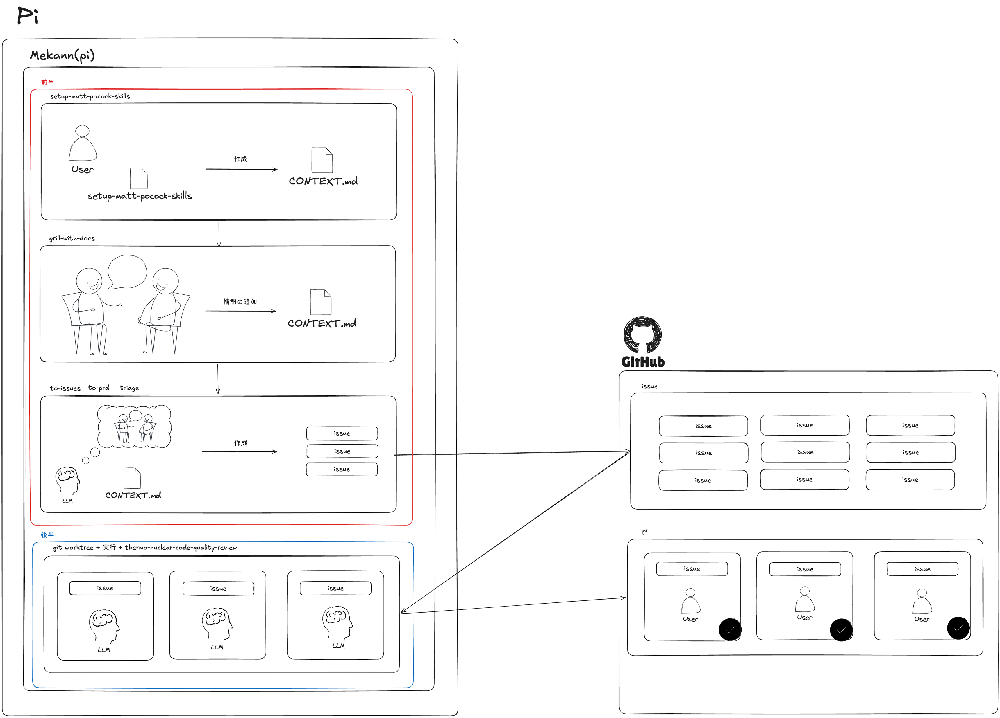

# Mekann Pi extension suite

Mekann は Pi coding agent 向けの extension suite です。安全境界、runtime context 管理、自律作業の継続、terminal 補助をまとめて提供します。Pi-maintained skill も同じ配布単位に含めます。個人開発で長時間の agent 作業を扱いやすくするための基盤です。

このリポジトリでは、設計と実装を次の単位で整理します。用語の詳細は [`CONTEXT.md`](./CONTEXT.md) を参照してください。

- **Pi extension suite**: `core`、`safety`、`autonomy`、`context`、`utils` のような読み込みと配布のまとまり。
- **Feature**: `sandbox`、`output-gate`、`goal`、`review-fixer` のように、明確な責任を持つ個別機能。
- **Skill**: agent が特定の作業のために読む手順書。runtime tool を提供する feature ではありません。

## 目的

Mekann の目的は、coding agent の作業時間を単に延ばすことではありません。長い作業では、context の劣化や危険な shell・git 操作が起きやすくなります。曖昧な委任や review の形骸化も問題になります。Mekann はこれらを制御し、人間が判断すべき境界を残したまま agent の自律性を高めます。

そのために、Mekann は次の方針を採ります。

- 巨大な tool output を context window に残さず、artifact として保存・検索する。
- 決定、task、error、計画などの作業記憶を context ledger に記録する。
- sandbox、read-only mode、policy、git/GitHub 確認フローを安全境界として扱う。
- 汎用 subagent への自由な委任ではなく、issue workflow や review-fixer のような制約された委任を重視する。
- `CONTEXT.md` と ADR に、コードだけでは表現しにくい用語、判断、境界を残す。

## 設計方針

Mekann は、Pi が参照する情報を増やしすぎないことを重視します。長い context window は便利ですが、容量が大きいことと、最後まで正確に使えることは同じではありません。Chroma の context rot に関する調査では、100K tokens 付近の長い入力でも性能低下の影響が見られると報告されています。

大きなコマンド出力や採用しなかった案が同じ session に残り続けると、Pi が判断に使う情報が増えすぎます。すでに否定した前提も混ざりやすくなります。その結果、必要な情報を見落としやすくなります。古い前提をもとに作業してしまうこともあります。

Mekann は、context rot の影響を小さくすることを目指します。必要な情報だけを現在の session に残し、不要な出力は退避します。これにより、Pi の性能を保ちやすくします。同時に、長い入力に伴う token 消費を抑え、コスト面でも効率のよい作業を目指します。

このため、Mekann は開発を前半と後半に分けます。前半では要件や設計を整理します。整理した内容は GitHub issue として登録します。後半では issue ごとに worktree と Pi session を分けて実装します。ひとつの session に計画と実装を詰め込みません。調査や review も分けます。これにより、各 session が扱う情報を小さく保ちます。

Pi session の context window 使用率は、30〜40% 程度に抑えることを理想とします。50〜60% を超えるようであれば、現在の session に残る情報を減らします。たとえば、作業を issue に分けます。新しい session に移すこともあります。不要な出力は保存先に退避します。

Mekann は、Pi を人間の代替として扱いません。Pi は調査や実装を速く進めるための補助役です。検証や文書化も支援します。そのため、何を自動化するかを明確にします。同時に、どこで止めて人間に判断を返すかも明確にします。

安全面でも同じ考え方を取ります。長く任せられる Pi session は、何でも実行できる環境ではありません。shell や git の操作では、必要に応じて確認を挟みます。GitHub 操作や patch 適用でも同じです。別 session の結果を採用するときも確認します。失敗したときの影響を小さくするためです。人間が確認できる形で作業を進めるためでもあります。

また、Mekann はプロジェクト固有の用語や判断を文書として残します。`CONTEXT.md` と ADR は、人間と Pi が同じ前提で作業するための資料です。コードとテストの整合を保ちます。ドキュメントや用語の整合も同じように扱います。これにより、session が変わっても作業の前提を引き継ぎやすくします。

## Suite overview

| Suite | 役割 | 主な feature |
| --- | --- | --- |
| [`core`](./mekann/core/) | prompt の土台、常時ガイドライン、cache-friendly prompt | `prompt-core`, `cache-friendly-prompt`, `agent-guidelines`, `model-optimizer` |
| [`safety`](./mekann/safety/) | 自律作業を許容するための安全境界 | `sandbox`, `modes`, `policy-core` |
| [`autonomy`](./mekann/autonomy/) | 長い作業、issue 実装、独立 context、研究的探索 | `goal`, `subagent`, `autoresearch` |
| [`context`](./mekann/context/) | runtime context management | `command-normalization`, `output-gate`, `context-ledger` |
| [`utils`](./mekann/utils/) | 人間向けの terminal 補助と周辺機能 | `issue`, `dashboard`, `codex-limits`, `codex-web-search`, `terminal-shortcuts`, `settings-editor`, `zip-repo` |

## 主要機能

Mekann は、開発を大きく前半と後半に分けて扱います。前半では要件や設計を整理します。整理した内容は GitHub issue として登録します。後半では、登録された issue を複数の作業ディレクトリに対応させます。実装は issue ごとに独立した Pi session で進めます。

主な狙いは、context window を汚染しないことです。計画と実装をひとつの session に詰め込まないようにします。review や調査も分けます。そうしないと、採用しなかった案や巨大な tool output が判断に混ざり続けます。Mekann では、使用率を 30〜40% 程度に抑えることを理想とします。50〜60% を超えるようであれば、新しい session に切り替えます。issue 用の worktree に移ることもあります。

多くの機能は、ユーザが毎回選んで呼び出すものではありません。通常の Pi session に組み込まれ、必要な場面で自動的に働きます。たとえば、tool output の退避を行います。安全確認や review の補助も行います。

ユーザが明示的に判断して使う入口は、主に次の4つです。

- 初回のセッティングスキル: プロジェクトに agent 向けの前提知識と作業手順を整える。
- issue 系のスキルと workflow: 前半で PRD 化、issue 化、triage を行い、後半で issue 単位の実装に移る。
- `goal`: session をまたいで追跡したい長い目的を登録する。
- `autoresearch`: 候補生成と評価を繰り返す、不確実性の高い調査を任せる。

全体の流れは次の図のようになります。



### 初回セットアップ

`setup-matt-pocock-skills` は、プロジェクトに agent 向けの作業手順を導入するためのスキルです。`AGENTS.md` や `docs/agents/` を整えます。これにより、agent が issue 化や triage の手順を必要に応じて読める状態にします。TDD、診断、設計 review の手順も対象です。

この段階で `CONTEXT.md` を用意しておくと、Mekann はプロジェクト固有の用語、境界、判断を参照しながら作業できます。`grill-with-docs` は、会話を通じて `CONTEXT.md` に足りない情報を追加するための補助として使います。

### Issue workflow

issue workflow は、前半の計画と後半の実装を分離するための中心的な仕組みです。

前半では、issue 系のスキルで曖昧な依頼を agent が扱いやすい単位に分解します。`to-prd` は大きな機能要求を PRD にまとめ、`to-issues` は PRD や計画を実装可能な issue に分割します。`triage` は単一の issue を状態整理し、agent が着手できる形にします。

後半では、`/issue` が GitHub issue ごとに作業環境を分けます。対象 issue 用の git worktree を作成します。その issue を入力として別の Pi session を起動します。Issue Pi は実装と検証を担当します。review-fixer と PR 作成も担当します。

`/issue-autopilot` は、`ready-for-agent` ラベルが付いた issue を順に処理する上位フローです。依存関係が残っている issue や、人間の判断が必要な issue は開始しません。PR の merge は人間が実施します。

### Goal and autoresearch

`goal` は、ユーザが定義した目的を session をまたいで追跡するための軽量な仕組みです。通常の pair-programming では完了しにくい長い目的を扱います。

`autoresearch` は、候補生成と評価を繰り返す高自律な調査 mode です。機械的チェックと構造化された受け入れ基準を使います。LLM judge や人間 review も組み合わせます。単純な実装作業より不確実性の高い探索を扱います。

### 自動的に働く補助機能

`output-gate` は、大きな tool output をそのまま context window に残さないための機能です。出力を artifact として保存し、必要になった部分だけを検索して戻します。

`context-ledger` は、作業中の決定や task を記録します。error や計画も記録します。会話ログを memory として無制限に増やすものではありません。次の判断に必要な情報だけを残すための仕組みです。

`sandbox`、`modes`、policy は、危険な状態変更に安全境界を置きます。対象は bash / git / GitHub / patch 適用です。Mekann では、安全境界を自律性の妨げではなく、自律作業を任せるための前提として扱います。

`review-fixer` は、PR 前の品質ゲートです。余計な文脈を持たない子 Pi を起動し、current diff の review と修正だけを行います。自由な task 委任や PR 作成は行いません。

## Installation

### Recommended environment

Mekann をフル機能で使う推奨構成は次のとおりです。

| 項目 | 推奨 |
|---|---|
| OS | macOS |
| Terminal | Kitty + `kitten` |
| Node.js | `22.19.0`（必須条件は `>=22.19.0`） |
| Package manager | npm |
| Pi | Pi coding agent |
| GitHub CLI | `gh >= 2.94.0` |
| GitHub auth | `gh auth login`、または `GITHUB_TOKEN` / `GH_TOKEN` |

Kitty は `/issue`、subagent / review-fixer の split、dashboard の画像表示で使われます。非 Kitty 環境でも一部機能は fallback しますが、Mekann の terminal integration は Kitty を推奨端末として最適化されています。macOS sandbox integration を使う場合は macOS が必要です。

Node.js `>=22.19.0` が必要です。再現性を重視する場合は `.nvmrc` に合わせて `nvm use` を実行してください。依存関係をインストールしたうえで、Pi の extension 設定に本リポジトリの `mekann` ディレクトリを追加します。

```bash
nvm use
npm ci --workspaces --include-workspace-root
```

`~/.pi/agent/settings.json` の例を示します。

```json
{
  "extensions": ["/path/to/this/repo/mekann"]
}
```

Pi package として利用する場合は、root `package.json` の `pi.extensions` と `pi.skills` から参照されます。詳細は [Installation](./docs/installation.md) を参照してください。

## Development

代表的な検証 command は次のとおりです。

```bash
npm test
npm run typecheck
```

CI、pre-push hook、feature ごとの検証方針は [Testing](./TESTING.md) と [Contributing](./CONTRIBUTING.md) にまとめています。

## Documentation

- [Installation](./docs/installation.md): Pi への追加、Node 要件、初回確認。
- [Configuration](./docs/configuration.md): `mekann.json`、global/workspace 設定、代表例。
- [Architecture](./docs/architecture.md): suite / feature 構成、load order、設計資料への導線。
- [Testing](./TESTING.md): test command、CI、pre-push hook。
- [Skills Guide](./docs/skills.md): Pi-maintained skills の使い分け。
- [Contributing](./CONTRIBUTING.md): issue、PR、ドキュメント更新、検証方針。
- [Security](./SECURITY.md): 脆弱性報告、安全境界、サポート範囲。

設計上の用語と境界は [`CONTEXT.md`](./CONTEXT.md) に、判断の経緯は [ADR](./docs/adr/) に記録します。機能の意味や責任範囲を変更するときは、README だけでなく `CONTEXT.md` と関連 ADR も更新してください。

## Project status

Mekann は実験的な Pi extension suite です。API や設定は `0.x` の間に変更される可能性があります。runtime 挙動も変更される可能性があります。特に安全境界や runtime context management に関わる変更では、実装と文書を同時に更新します。subagent trust transition や terminal integration も同じです。

## Acknowledgements

Mekann は複数の公開 workflow と skill から学んでいます。Engineering skills の多くは [mattpocock/skills](https://github.com/mattpocock/skills) に由来します。`thermo-nuclear-code-quality-review` は [cursor/plugins](https://github.com/cursor/plugins) の `cursor-team-kit` に由来します。GSAP skills は [greensock/gsap-skills](https://github.com/greensock/gsap-skills) に由来します。これらを Pi 向けに翻案・調整して利用しています。

## References

- [How we built our multi-agent research system | Anthropic](https://www.anthropic.com/engineering/multi-agent-research-system)
- [Context Rot: How Increasing Input Tokens Impacts LLM Performance | Chroma Research](https://www.trychroma.com/research/context-rot)
