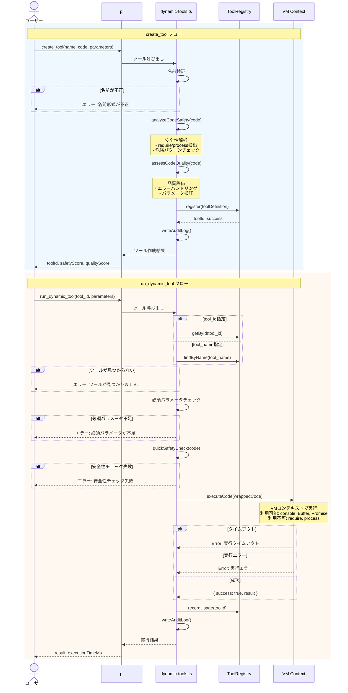
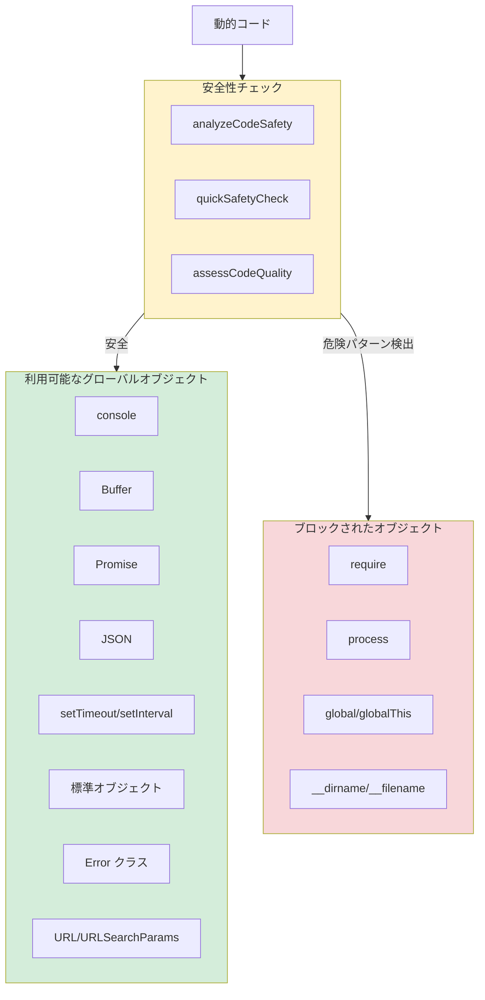

# 拡張機能一覧

> パンくず: [Home](../../README.md) > [User Guide](./) > 拡張機能一覧

pi拡張機能コレクションで利用可能なすべての拡張機能の概要です。

## カテゴリ別一覧

### コア拡張機能

| 拡張機能 | 説明 | 詳細 |
|---------|------|------|
| **question** | インタラクティブUIでユーザー選択 | [→](./02-question.md) |
| **rsa_solve** | 推論スケーリング | [→](./03-rsa-solve.md) |
| **loop_run** | 自律ループ実行 | [→](./04-loop-run.md) |
| **fzf** | Fuzzy finder統合 | [→](./05-fzf.md) |
| **abbr** | 略語管理 | [→](./06-abbr.md) |

### オーケストレーション

| 拡張機能 | 説明 | 詳細 |
|---------|------|------|
| **plan_*** | 計画管理とタスク追跡 | [→](./07-plan.md) |
| **subagent_*** | サブエージェント | [→](./08-subagents.md) |
| **agent_team_*** | エージェントチーム | [→](./09-agent-teams.md) |
| **ul-dual-mode** | デュアルモード強制実行 | [→](./10-ul-dual-mode.md) |

### 検索

| 拡張機能 | 説明 | 詳細 |
|---------|------|------|
| **file_candidates** | ファイル・ディレクトリ列挙（fd/glob対応） | 下記参照 |
| **code_search** | コードパターン検索（ripgrep対応） | 下記参照 |
| **sym_index** | シンボルインデックス生成（ctags） | 下記参照 |
| **sym_find** | シンボル定義検索 | 下記参照 |

### 動的ツール

| 拡張機能 | 説明 | 詳細 |
|---------|------|------|
| **create_tool** | 動的ツールの生成 | 下記参照 |
| **run_dynamic_tool** | 動的ツールの実行 | 下記参照 |
| **list_dynamic_tools** | ツール一覧表示 | 下記参照 |
| **delete_dynamic_tool** | ツール削除 | 下記参照 |
| **tool_reflection** | 実行後の反省とツール生成判定 | 下記参照 |

### ユーティリティ

| 拡張機能 | 説明 | 詳細 |
|---------|------|------|
| **usage-tracker** | LLM使用状況の追跡 | [→](./11-utilities.md) |
| **agent-usage-tracker** | 拡張機能の使用統計 | [→](./11-utilities.md) |
| **context-dashboard** | コンテキスト使用量ダッシュボード | [→](./11-utilities.md) |
| **agent-idle-indicator** | エージェント実行状態の表示 | [→](./11-utilities.md) |
| **kitty-status-integration** | kittyターミナル連携 | [→](./11-utilities.md) |
| **skill-inspector** | スキル割り当て状況の表示 | [→](./11-utilities.md) |
| **startup-context** | 初回プロンプト時のコンテキスト注入 | 下記参照 |

## クイックリファレンス

### question - ユーザー選択UI

```typescript
{
  "tool": "question",
  "input": {
    "questions": [
      {
        "question": "どの操作を実行しますか？",
        "header": "操作選択",
        "options": [
          { "label": "A", "description": "説明" }
        ]
      }
    ]
  }
}
```

### rsa_solve - 推論スケーリング

```bash
/rsa 問題を解いてください
/rsa --n 8 --k 4 --t 5 問題を解いてください
```

### loop_run - 自律ループ

```typescript
{
  "tool": "loop_run",
  "input": {
    "task": "繰り返すタスク"
  }
}
```

### fzf - ファジーファインダー

```typescript
{
  "tool": "fzf",
  "input": {
    "type": "files",
    "pattern": "*.ts"
  }
}
```

### subagent - サブエージェント

```typescript
{
  "tool": "subagent_run",
  "input": {
    "task": "タスク内容"
  }
}
```

### agent_team - エージェントチーム

```typescript
{
  "tool": "agent_team_run",
  "input": {
    "task": "タスク内容"
  }
}
```

### 検索ツール

#### file_candidates - ファイル列挙

```typescript
{
  "tool": "file_candidates",
  "input": {
    "pattern": "*.ts",           // グロブパターン
    "type": "file",              // "file" | "dir"
    "extension": ["ts", "tsx"],  // 拡張子フィルタ
    "exclude": ["node_modules"], // 除外パターン
    "maxDepth": 5,               // 最大探索深度
    "limit": 100                 // 最大結果数
  }
}
```

**パラメータ**:
- `pattern`: グロブパターン（例: `*.ts`）
- `type`: エントリ種別（`file` または `dir`）
- `extension`: 拡張子フィルタ配列
- `exclude`: 除外パターン配列
- `maxDepth`: 最大ディレクトリ深度
- `limit`: 最大結果数（デフォルト: 100）
- `path`: 検索パス（デフォルト: プロジェクトルート）

**戻り値**: ファイル/ディレクトリパスの一覧

#### code_search - コード検索

```typescript
{
  "tool": "code_search",
  "input": {
    "pattern": "function.*export", // 正規表現パターン
    "path": "src",                 // 検索対象パス
    "type": "ts",                  // ファイル種別
    "ignoreCase": true,            // 大文字小文字無視
    "literal": false,              // リテラル検索
    "context": 2,                  // コンテキスト行数
    "limit": 50                    // 最大結果数
  }
}
```

**パラメータ**:
- `pattern`: 検索パターン（正規表現有効）
- `path`: 検索スコープパス
- `type`: ファイル種別フィルタ（ts, js, py等）
- `ignoreCase`: 大文字小文字無視（デフォルト: true）
- `literal`: パターンをリテラル文字列として扱う
- `context`: マッチ周辺のコンテキスト行数
- `limit`: 最大結果数（デフォルト: 50）

**戻り値**: マッチ結果（ファイル、行番号、テキスト、コンテキスト）

#### sym_index - シンボルインデックス生成

```typescript
{
  "tool": "sym_index",
  "input": {
    "path": "src",     // インデックス対象パス
    "force": false     // 強制再生成
  }
}
```

**パラメータ**:
- `path`: インデックス対象パス（デフォルト: プロジェクトルート）
- `force`: 強制的にインデックスを再生成

**戻り値**: インデックス化されたシンボル数、出力ファイルパス（`.pi/search/symbols.jsonL`）

**前提条件**: universal-ctagsのインストールが必要

#### sym_find - シンボル検索

```typescript
{
  "tool": "sym_find",
  "input": {
    "name": "getLogger",           // シンボル名パターン
    "kind": ["function", "class"], // シンボル種別
    "file": "lib",                 // ファイルパスフィルタ
    "limit": 50                    // 最大結果数
  }
}
```

**パラメータ**:
- `name`: シンボル名パターン（ワイルドカード対応: `*`, `?`）
- `kind`: シンボル種別配列（function, class, variable等）
- `file`: ファイルパスフィルタ
- `limit`: 最大結果数（デフォルト: 50）

**戻り値**: シンボル定義一覧（名前、種別、ファイル、行番号、シグネチャ）

### 動的ツール

#### 動的ツール実行フロー



#### セキュリティモデル



#### create_tool - ツール生成

```typescript
{
  "tool": "create_tool",
  "input": {
    "name": "format_json",
    "description": "JSONデータを整形する",
    "code": "async function execute(params) { return JSON.stringify(JSON.parse(params.input), null, 2); }",
    "parameters": {
      "input": { "type": "string", "description": "JSON文字列", "required": true }
    },
    "tags": ["utility", "json"]
  }
}
```

**パラメータ**:
- `name`: ツール名（英字で始まり、英数字、アンダースコア、ハイフンのみ使用可能）
- `description`: ツールの説明
- `code`: TypeScript/JavaScriptコード（`execute(params)` 関数を定義する必要がある）
- `parameters`: パラメータスキーマ（オプション）
  - `type`: パラメータ型（string, number, boolean, object, array）
  - `description`: パラメータの説明
  - `required`: 必須フラグ
  - `default`: デフォルト値
  - `enum`: 列挙値
  - `minimum`/`maximum`: 数値の範囲
- `tags`: タグ配列（オプション）
- `generated_from`: 生成元のタスク説明（オプション）

**戻り値**: ツールID、安全性スコア（0.0-1.0）、品質スコア、検証状態

**セキュリティ**: VMコンテキストで実行。`require`, `process`, `global` は使用不可。

#### run_dynamic_tool - ツール実行

```typescript
{
  "tool": "run_dynamic_tool",
  "input": {
    "tool_id": "abc123",           // または tool_name
    "tool_name": "format_json",    // または tool_id
    "parameters": { "input": "{\"a\":1}" },
    "timeout_ms": 30000
  }
}
```

**パラメータ**:
- `tool_id`: ツールID（tool_nameの代わりに使用可能）
- `tool_name`: ツール名（tool_idの代わりに使用可能）
- `parameters`: ツールに渡すパラメータオブジェクト
- `timeout_ms`: タイムアウト時間（デフォルト: 30000ms）

**戻り値**: 実行結果、実行時間（ミリ秒）

#### list_dynamic_tools - ツール一覧

```typescript
{
  "tool": "list_dynamic_tools",
  "input": {
    "name": "format",              // 名前でフィルタ
    "tags": ["utility"],           // タグでフィルタ
    "min_safety_score": 0.5,       // 安全性スコアの最小値
    "limit": 20                    // 最大表示件数
  }
}
```

**パラメータ**:
- `name`: 名前でフィルタ（部分一致）
- `tags`: タグでフィルタ
- `min_safety_score`: 安全性スコアの最小値（0.0-1.0）
- `limit`: 最大表示件数（デフォルト: 20）

**戻り値**: 登録済みツール一覧（ID、名前、説明、信頼度、使用回数、最終使用日時、検証状態）

#### delete_dynamic_tool - ツール削除

```typescript
{
  "tool": "delete_dynamic_tool",
  "input": {
    "tool_id": "abc123",
    "confirm": true  // 削除を確認
  }
}
```

**パラメータ**:
- `tool_id`: ツールID（tool_nameの代わりに使用可能）
- `tool_name`: ツール名（tool_idの代わりに使用可能）
- `confirm`: 削除確認（`true` で削除実行、必須）

**戻り値**: 削除結果メッセージ

#### tool_reflection - 実行後反省

```typescript
{
  "tool": "tool_reflection",
  "input": {
    "task_description": "JSONファイルを変換する",
    "last_tool_result": "成功: ファイルを変換しました",
    "failed_attempts": 0
  }
}
```

**パラメータ**:
- `task_description`: 実行中のタスクの説明
- `last_tool_result`: 直前のツール実行結果
- `failed_attempts`: 失敗した試行回数（オプション）

**戻り値**: ツール生成推奨判定、推奨理由、次のステップ提案

**判定ロジック**:
- 失敗回数が2回以上の場合、ツール生成を推奨
- 繰り返し・変換・検証・集計パターンを検出した場合、ツール生成を推奨

### startup-context - 初回コンテキスト注入

セッション開始時に自動的に以下のコンテキストをシステムプロンプトに注入します：

- **カレントディレクトリ**: 作業ディレクトリのパス
- **最近のGitコミット**: 最新10件のコミットメッセージ（タイトルのみ）
- **README.md**: プロジェクトのREADME内容（全文）

設定やツール呼び出しは不要です。セッション最初のプロンプト時に自動実行されます。

## 使用パターン

### ユーザー入力が必要な場合

**question**を使用して対話的に選択を受け取ります。

```typescript
question
{
  "questions": [
    {
      "question": "どのファイルを編集しますか？",
      "header": "ファイル選択",
      "options": [...]
    }
  ]
}
```

### 複雑な推論が必要な場合

**rsa_solve**を使用して推論をスケーリングします。

```bash
/rsa この複雑な問題を解いてください
```

### 反復的なタスクが必要な場合

**loop_run**を使用して自律的にタスクを実行します。

```typescript
loop_run
{
  "task": "議論を繰り返して合意を形成してください",
  "maxIterations": 5
}
```

### 専門家が必要な場合

**subagent**または**agent_team**を使用して専門家に委譲します。

```typescript
subagent_run
{
  "task": "コードレビューを実施してください",
  "subagentId": "reviewer"
}
```

### 並列実行が必要な場合

**agent_team_run_parallel**を使用して複数のチームを並列実行します。

```typescript
agent_team_run_parallel
{
  "task": "複数の調査を並列で実行してください"
}
```

### ファイル検索が必要な場合

**file_candidates**または**code_search**を使用してファイルやコードを検索します。

```typescript
file_candidates
{
  "pattern": "*.ts",
  "extension": ["ts", "tsx"],
  "exclude": ["node_modules", "dist"]
}
```

```typescript
code_search
{
  "pattern": "TODO|FIXME",
  "type": "ts",
  "context": 2
}
```

### シンボル定義を探す場合

**sym_index**でインデックスを作成し、**sym_find**で検索します。

```typescript
sym_index
{
  "force": true
}

sym_find
{
  "name": "getLogger",
  "kind": ["function"]
}
```

### 再利用可能な処理をツール化する場合

**create_tool**で動的ツールを生成し、**run_dynamic_tool**で実行します。

```typescript
create_tool
{
  "name": "extract_todos",
  "description": "コードからTODOコメントを抽出する",
  "code": "async function execute(params) { ... }",
  "parameters": { "path": { "type": "string", "required": true } }
}

run_dynamic_tool
{
  "tool_name": "extract_todos",
  "parameters": { "path": "src" }
}
```

## 次のステップ

- [question](./02-question.md) - インタラクティブUIの詳細
- [subagents](./08-subagents.md) - サブエージェントの詳細
- [agent-teams](./09-agent-teams.md) - エージェントチームの詳細

---

## 関連トピック

- [Getting Started](../01-getting-started/) - インストールと初回使用
- [Developer Guide](../03-development/) - 拡張機能の開発

## 次のトピック

[ → question拡張機能](./02-question.md)
