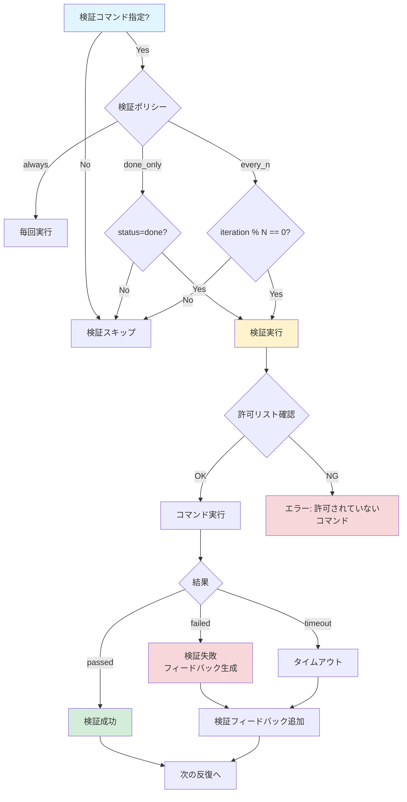
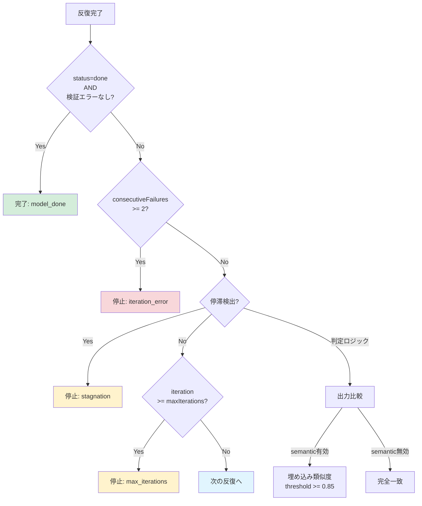

# loop_run - 自律ループ実行

> パンくず: [Home](../../README.md) > [User Guide](./) > loop_run

## 概要

`loop_run` 拡張機能は、タスクを自律的に反復実行するための機能を提供します。モデルが繰り返し自己改善を行い、参照文献に基づいた引用チェックを行いながら、品質の向上を目指します。

### 主な機能

- **自律的反復実行**: 最大反復回数を設定して、タスクを繰り返し実行
- **引用に基づく検証**: 参照文献（R1, R2...）を提供し、モデルによる引用を要求可能
- **進捗追跡**: 各反復のステータス、所要時間、検証エラーを記録
- **ログ保存**: `.pi/agent-loop/` ディレクトリに詳細な実行ログとサマリを保存
- **安定性検出**: 出力が安定した場合、早期終了で効率化

---

## 実行フロー

```mermaid
sequenceDiagram
    actor User as ユーザー
    participant Pi as pi
    participant Loop as loop.ts
    participant Model as LLM Model
    participant Verify as 検証コマンド
    participant Log as ログファイル

    User->>Pi: loop_run(task, maxIterations, goal, verifyCommand)
    Pi->>Loop: ツール呼び出し
    
    Loop->>Loop: normalizeLoopConfig()
    Note over Loop: 設定正規化<br/>maxIterations=4<br/>timeoutMs=60000
    
    Loop->>Loop: loadReferences()
    Note over Loop: 参照文献読み込み<br/>R1, R2, ... にID割り当て
    
    Loop->>Log: run_start ログ書き込み
    
    loop 反復処理 (1 to maxIterations)
        Loop->>Loop: buildIterationPrompt()
        Note over Loop: プロンプト構築<br/>- タスク<br/>- 前回出力<br/>- 検証フィードバック
        
        Loop->>Model: callModelViaPi(prompt)
        
        alt タイムアウト
            Model-->>Loop: Error: Timeout
            Loop->>Loop: consecutiveFailures++
        else 成功
            Model-->>Loop: output
            Loop->>Loop: consecutiveFailures = 0
        end
        
        Loop->>Loop: parseLoopContract(output)
        Note over Loop: LOOP_JSONブロック解析<br/>- status: continue/done<br/>- goal_status: met/not_met<br/>- citations: [R1, R2]
        
        opt verifyCommand指定
            alt 検証ポリシー条件満たす
                Loop->>Verify: 検証コマンド実行
                Verify-->>Loop: passed/failed, exitCode
            end
        end
        
        Loop->>Loop: validateIteration()
        Note over Loop: 検証エラー収集<br/>- 引用チェック<br/>- 目標達成チェック
        
        Loop->>Log: iteration ログ書き込み
        
        alt status=done AND 検証エラーなし
            Note over Loop: ループ完了<br/>stopReason=model_done
        else consecutiveFailures >= 2
            Note over Loop: 連続エラーで停止<br/>stopReason=iteration_error
        else 停滞検出
            Note over Loop: 出力が変化なし<br/>stopReason=stagnation
        end
        
        Loop->>Loop: 前回出力更新<br/>検証フィードバック更新
    end
    
    Loop->>Loop: サマリ生成
    Note over Loop: - completed<br/>- stopReason<br/>- iterationCount<br/>- lastGoalStatus
    
    Loop->>Log: run_done ログ書き込み
    Loop->>Log: summary.json 保存
    
    Loop-->>Pi: summary, finalOutput, iterations
    Pi-->>User: ループ実行結果
```

### 検証ポリシー判定フロー



### 終了条件判定フロー



---

## 使用方法

### ツールとしての実行

```typescript
// 基本的なループ実行
loop_run({
  task: "Build a robust parser and stop when all tests pass."
})

// 最大反復回数を指定
loop_run({
  task: "Refactor the authentication module",
  maxIterations: 10
})

// タイムアウトを設定（反復あたり）
loop_run({
  task: "Write comprehensive documentation",
  timeoutMs: 180000  // 3分
})

// 参照文献を使用
loop_run({
  task: "Summarize the paper with proper citations",
  references: [
    "./docs/paper-notes.md",
    "https://arxiv.org/abs/2501.00001"
  ],
  requireCitation: true
})
```

### スラッシュコマンド

```bash
# ヘルプ表示
/loop help

# 基本的なループ実行
/loop run Build a robust parser and stop when all tests pass.

# オプション付き実行
/loop run --max 8 --timeout 180000 Refactor the authentication module

# 参照文献を使用
/loop run --ref ./docs/paper-notes.md --ref https://arxiv.org/abs/2501.00001 Write a summary with citations.

# 参照ファイルから読み込み
/loop run --refs-file ./references.txt Create documentation with citations.

# ステータス確認
/loop status
```

---

## パラメータ

### loop_run ツール

| パラメータ | タイプ | 必須 | デフォルト | 説明 |
|-----------|--------|------|-----------|------|
| `task` | string | ✅ | - | 実行するタスクの説明 |
| `maxIterations` | number | ❌ | 4 | 最大反復回数（1〜16） |
| `timeoutMs` | number | ❌ | 120000 | 1反復あたりのタイムアウト（ms）（10,000〜600,000） |
| `requireCitation` | boolean | ❌ | true | 参照文献提供時の引用を必須にするか |
| `references` | string[] | ❌ | [] | 参照文献の配列（ファイルパス、URL、インラインテキスト） |
| `refsFile` | string | ❌ | - | 1行1参照形式のファイルパス |
| `verificationTimeoutMs` | number | ❌ | 60000 | 検証コマンドのタイムアウト（ms）（1,000〜120,000） |
| `verifyCommand` | string | ❌ | - | 検証コマンド（例: `npm test`） |
| `goal` | string | ❌ | - | 完了条件の明示的定義 |

### コマンドラインオプション

| オプション | 省略形 | 引数 | 説明 |
|----------|--------|------|------|
| `--max` | `-n` | 数値 | 最大反復回数 |
| `--timeout` | - | 数値 | タイムアウト（ミリ秒） |
| `--ref` | - | パス/URL | 参照文献を追加 |
| `--refs-file` | - | パス | 参照ファイルを読み込み |
| `--require-citation` | - | - | 引用を必須にする |
| `--no-require-citation` | - | - | 引用を任意にする |
| `--help` | `-h` | - | ヘルプを表示 |

---

## 使用例

### 例1: 基本的なコード生成

```bash
/loop run Create a REST API with authentication

# 出力:
# Iteration 1/6 started | focus: Create a REST API with authentication
# Loop iteration 1/6 done (continue, 1.2s) | summary: Created basic Express server structure
# Iteration 2/6 started | focus: next: add authentication middleware
# ...
# Loop completed.
# Iterations: 4/6
# Completed: yes (model_done)
```

### 例2: 参照文献を使用した要約

```bash
/loop run --ref ./docs/spec.md --ref ./api-docs.md \
  "Generate comprehensive API documentation with proper citations"

# モデルは [R1], [R2] の形式で引用を行います
```

### 例3: URLから参照を取得

```bash
/loop run --ref https://arxiv.org/abs/2501.00001 \
  "Summarize this paper with accurate citations"
```

### 例4: 参照ファイルを使用

```bash
# ./references.txt の内容:
# ./docs/paper1.md
# https://example.com/article
# https://arxiv.org/abs/2501.00002

/loop run --refs-file ./references.txt \
  "Create a comprehensive literature review"
```

---

## モデル出力形式

各反復でモデルは以下の形式で出力します:

```
<LOOP_JSON>
{
  "status": "continue|done",
  "goal_status": "met|not_met|unknown",
  "goal_evidence": "短い客観的証拠",
  "summary": "1-3行のサマリ",
  "next_actions": ["具体的な次のステップ"],
  "citations": ["R1", "R2"]
}
</LOOP_JSON>

<RESULT>
<メイン回答>
</RESULT>
```

### 終了条件

1. **STATUS: done**: モデルが完了を宣言し、検証エラーがない場合
2. **maxIterations**: 最大反復回数に達した場合
3. **stagnation**: 出力が一定回数以上変化しない場合（stableRepeatThreshold = 1）
4. **iteration_error**: 連続エラーが閾値を超えた場合（maxConsecutiveFailures = 2）

### 検証機能

`verifyCommand` を指定した場合、反復終了時に検証が実行されます：

- **検証ポリシー**: デフォルトでは完了時のみ実行（`done_only`）
- **許可リスト**: デフォルトで主要なテストコマンド（npm test, pytest, cargo testなど）が許可
- **環境変数**:
  - `PI_LOOP_VERIFY_ALLOWLIST`: 許可コマンドプレフィックスをカンマ区切りで指定
  - `PI_LOOP_VERIFY_POLICY`: `always`, `done_only`, `every_n` のいずれか
  - `PI_LOOP_VERIFY_EVERY_N`: `every_n` ポリシー時のN値（デフォルト2）

---

## 出力ファイル

```
.pi/agent-loop/
├── 20260211-103045-a1b2c3.jsonl      # 詳細実行ログ
├── 20260211-103045-a1b2c3.summary.json # サマリファイル
└── latest-summary.json                 # 最新サマリ（シンボリックリンク相当）
```

### ログファイル内容

- `run_start`: 実行開始情報
- `iteration`: 各反復の詳細（ステータス、所要時間、引用、検証エラー）
- `iteration_error`: エラー発生時の記録
- `run_done`: 実行完了情報

---

## 制限事項

| 項目 | 制限（stable profile） |
|------|------|
| 最大反復回数 | 16 |
| 最小反復回数 | 1 |
| 最大タイムアウト | 600,000ms (10分) |
| 最小タイムアウト | 10,000ms (10秒) |
| 検証タイムアウト最大 | 120,000ms (2分) |
| 検証タイムアウト最小 | 1,000ms (1秒) |
| 最大参照文献数 | 24 |
| 参照1件あたり最大文字数 | 8,000文字 |
| 参照合計最大文字数 | 30,000文字 |
| 前回出力最大文字数 | 9,000文字 |
| 安定判定閾値 | 1回 |
| 最大連続エラー | 2回 |

> **注**: stable profile が有効な場合、デフォルト値はより保守的に設定されています（最大反復回数=4、タイムアウト=120秒）。環境変数で調整可能です。

---

## 関連トピック

- [拡張機能一覧](./01-extensions.md) - 全拡張機能の概要
- [rsa_solve](./03-rsa-solve.md) - 推論スケーリング
- [subagents](./08-subagents.md) - サブエージェントの委任
