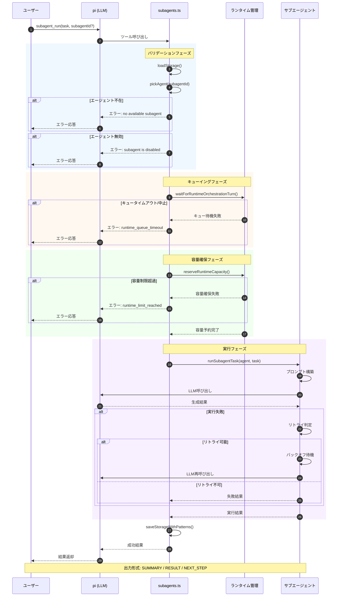
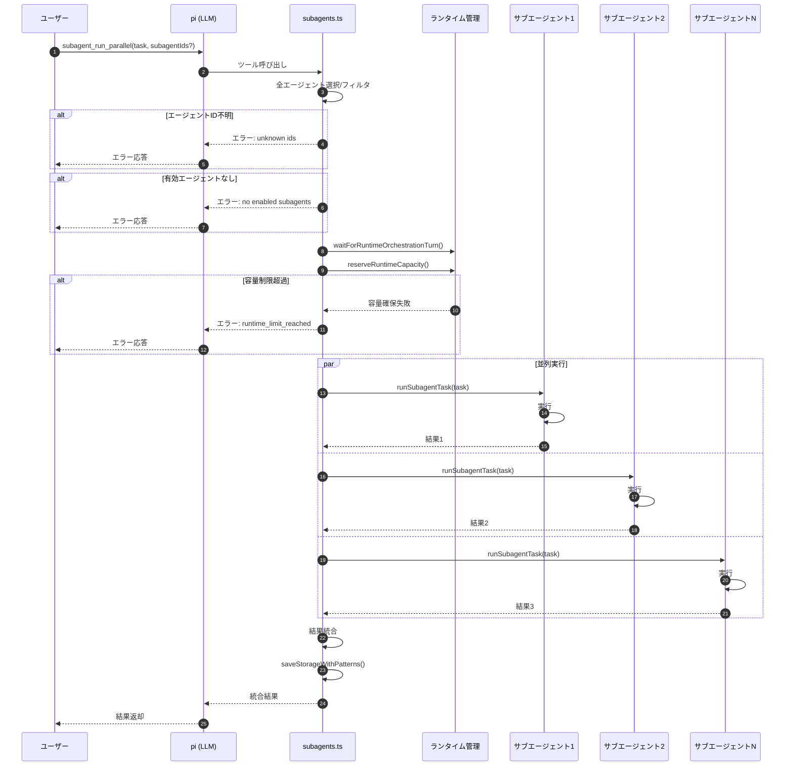
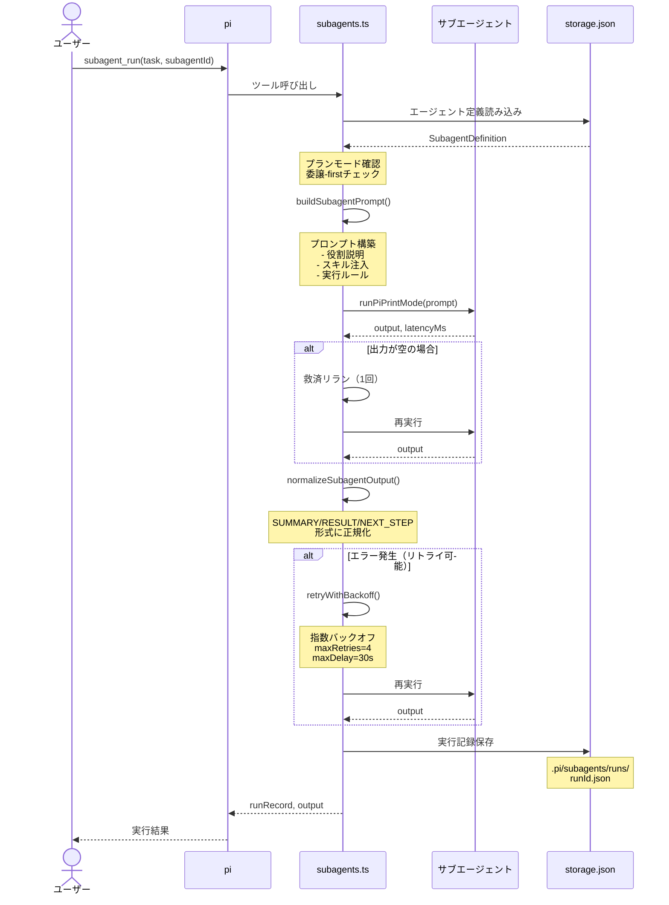
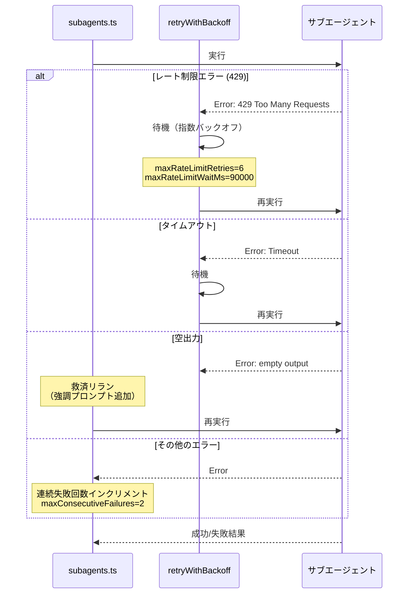

# subagents - サブエージェント

> パンくず: [Home](../../README.md) > [User Guide](./) > subagents

## 概要

`subagents` 拡張機能は、サブエージェントの定義・実行を提供します。タスクを特化したエージェントに委任することで、並列実行と品質向上が可能になります。

### 主な機能

- **サブエージェント定義**: 役割特化したエージェントを作成・管理
- **並列実行**: 複数のサブエージェントを同時に実行
- **実行履歴**: 各実行の記録と結果の保存
- **ランタイム制御**: 実行中のエージェント数の制限と監視
- **リトライ機能**: エラー時の自動リトライ

---

## 実行フロー

### subagent_run シーケンス図



### subagent_run_parallel シーケンス図



---

## 使用可能なツール

| ツール | 説明 |
|--------|------|
| `subagent_list` | 定義済みエージェント一覧 |
| `subagent_create` | サブエージェントの定義作成 |
| `subagent_configure` | サブエージェント設定更新 |
| `subagent_run` | サブエージェントの実行 |
| `subagent_run_parallel` | サブエージェントの並列実行 |
| `subagent_status` | 実行中のエージェント状態 |
| `subagent_runs` | 実行履歴の表示 |

---

## 定義済みサブエージェント

| エージェントID | 名前 | 説明 |
|-------------|------|------|
| **researcher** | Researcher | コードとドキュメントの調査専門家。発見と事実収集に最適 |
| **architect** | Architect | 設計重視のヘルパー。分解、制約、移行計画を得意とする |
| **implementer** | Implementer | スコープ内のコーディングタスクと修正の実装ヘルパー |
| **reviewer** | Reviewer | リスクチェック、テスト、品質フィードバックの読み取り専用レビュー担当者 |
| **tester** | Tester | 検証ヘルパー。再現可能なチェックと最小のテスト計画に焦点 |

---

## 実行フロー



### エラーハンドリングフロー



---

## 使用方法

### ツールとしての実行

```typescript
// サブエージェント一覧
subagent_list()

// 単一サブエージェントの実行
subagent_run({
  task: "Research authentication patterns in this codebase",
  subagentId: "researcher"
})

// 並列実行（推奨）
subagent_run_parallel({
  task: "Review this code for potential issues"
  // 省略時はすべての有効なエージェントが実行される
})

// カスタムサブエージェントの作成
subagent_create({
  name: "Security Auditor",
  description: "Analyze code for security vulnerabilities",
  systemPrompt: "You are a security expert. Focus on OWASP Top 10...",
  setCurrent: true
})

// サブエージェントの設定
subagent_configure({
  subagentId: "researcher",
  enabled: true,
  setCurrent: true
})

// 実行履歴
subagent_runs({ limit: 10 })

// ランタイム状態
subagent_status()
```

### スラッシュコマンド

```bash
# ヘルプ
/subagent

# サブエージェント一覧
/subagent list

# 実行履歴
/subagent runs

# ランタイム状態
/subagent status

# デフォルトサブエージェントの設定
/subagent default researcher

# サブエージェントの有効化
/subagent enable reviewer

# サブエージェントの無効化
/subagent disable researcher
```

---

## データ構造

### SubagentDefinition

```typescript
interface SubagentDefinition {
  id: string;                  // 一意のID（自動生成）
  name: string;                // 表示名
  description: string;         // 使用時期の説明
  systemPrompt: string;         // コア命令プロンプト
  provider?: string;           // プロバイダの上書き
  model?: string;             // モデルの上書き
  enabled: "enabled" | "disabled";
  createdAt: string;
  updatedAt: string;
}
```

### SubagentRunRecord

```typescript
interface SubagentRunRecord {
  runId: string;
  agentId: string;
  task: string;
  summary: string;
  status: "completed" | "failed";
  startedAt: string;
  finishedAt: string;
  latencyMs: number;
  outputFile: string;
  error?: string;
}
```

---

## パラメータ

### subagent_create

| パラメータ | タイプ | 必須 | デフォルト | 説明 |
|-----------|--------|------|-----------|------|
| `id` | string | ❌ | nameから自動生成 | 一意のID（小文字ハイフン区切り） |
| `name` | string | ✅ | - | 表示名 |
| `description` | string | ✅ | - | このサブエージェントを使用する時期 |
| `systemPrompt` | string | ✅ | - | このサブエージェントのコア命令プロンプト |
| `skills` | string[] | ❌ | [] | 割り当てるスキルIDの配列 |
| `provider` | string | ❌ | - | プロバイダの上書き |
| `model` | string | ❌ | - | モデルの上書き |
| `setCurrent` | boolean | ❌ | false | デフォルトサブエージェントに設定 |

#### skills パラメータ

`skills` パラメータを使用すると、サブエージェントに特定のスキルを割り当てることができます。スキルを割り当てられたサブエージェントは、実行時にスキルの詳細情報（SKILL.mdの内容）をプロンプト内で参照できます。

```typescript
subagent_create({
  name: "Data Analyst",
  description: "統計解析と可視化を行うエージェント",
  systemPrompt: "You are a data analysis expert...",
  skills: ["research-statistics", "research-visualization"]
})
```

##### スキル継承機能

親エージェントから子エージェントへのスキル継承をサポートしています：

- **親のスキルは自動継承**: 親エージェントが持つスキルは、明示的に指定しなくても子エージェントに継承されます
- **プロジェクトローカル優先**: プロジェクトローカルスキルがグローバルスキルをオーバーライドします
- **明示的割り当て**: `skills` パラメータで明示的に指定されたスキルが追加されます

##### スキルの確認

割り当てられたスキルは `skill_status` ツールで確認できます：

```typescript
skill_status()
```

##### 利用可能なスキル一覧

詳細は [スキルガイド](.pi/docs/skill-guide.md) を参照してください。主なカテゴリ：

| カテゴリ | 例 |
|---------|---|
| 研究・分析 | research-statistics, research-visualization, exploratory-data-analysis |
| 機械学習 | research-ml-classical, research-ml-deep, research-ml-reinforcement |
| コード解析 | code-metrics, code-search, lint-analyzer |
| セキュリティ | sast-analyzer, secret-detector, vuln-scanner |
| 操作 | git-workflow |

### subagent_configure

| パラメータ | タイプ | 必須 | デフォルト | 説明 |
|-----------|--------|------|-----------|------|
| `subagentId` | string | ✅ | - | 対象サブエージェントID |
| `enabled` | boolean | ❌ | - | 有効/無効の切り替え |
| `setCurrent` | boolean | ❌ | - | デフォルトサブエージェントに設定 |

### subagent_run

| パラメータ | タイプ | 必須 | デフォルト | 説明 |
|-----------|--------|------|-----------|------|
| `task` | string | ✅ | - | 委任されたタスク |
| `subagentId` | string | ❌ | current agent | 対象サブエージェントID |
| `extraContext` | string | ❌ | - | 追加のコンテキスト |
| `timeoutMs` | number | ❌ | 600000 (10分) | タイムアウト（ミリ秒、0で無制限） |
| `retry.maxRetries` | number | ❌ | 4 | 最大リトライ回数 |
| `retry.initialDelayMs` | number | ❌ | 1000 | 初期バックオフ遅延（ms） |
| `retry.maxDelayMs` | number | ❌ | 30000 | 最大バックオフ遅延（ms） |
| `retry.multiplier` | number | ❌ | 2 | バックオフ乗数 |
| `retry.jitter` | string | ❌ | "none" | ジッターモード（full/partial/none） |

### subagent_run_parallel

| パラメータ | タイプ | 必須 | デフォルト | 説明 |
|-----------|--------|------|-----------|------|
| `task` | string | ✅ | - | 全ての選択されたサブエージェントに委任するタスク |
| `subagentIds` | string[] | ❌ | 全有効エージェント | サブエージェントID配列 |
| `extraContext` | string | ❌ | - | 追加の共有コンテキスト |
| `timeoutMs` | number | ❌ | 600000 (10分) | タイムアウト（ミリ秒） |
| `retry` | object | ❌ | - | リトライ設定（subagent_runと同じ） |

### subagent_runs

| パラメータ | タイプ | 必須 | デフォルト | 説明 |
|-----------|--------|------|-----------|------|
| `limit` | number | ❌ | 10 | 表示する実行履歴の数（1〜50） |

---

## 使用例

### 例1: 単一サブエージェントの実行

```typescript
subagent_run({
  task: "Find all files related to authentication in this codebase",
  subagentId: "researcher"
})

# 出力:
# Subagent run completed: 20260211-103045-a1b2c3
# Subagent: researcher (Researcher)
# Summary: Found 12 authentication-related files across 4 modules
# Latency: 2340ms
# Output file: .pi/subagents/runs/20260211-103045-a1b2c3.json
#
# <詳細な結果>
```

### 例2: 並列実行（推奨）

```typescript
subagent_run_parallel({
  task: "Review the proposed authentication implementation"
})

# 研究者、設計者、実装者、レビュアーが同時に実行されます
```

### 例3: 特定のサブエージェントのみを選択

```typescript
subagent_run_parallel({
  task: "Check for potential security issues",
  subagentIds: ["reviewer", "researcher"]
})
```

### 例4: カスタムサブエージェントの作成

```typescript
subagent_create({
  name: "Performance Analyst",
  description: "Analyze code for performance bottlenecks and optimizations",
  systemPrompt: `You are the Performance Analyst subagent.
Focus on:
- CPU-intensive operations
- Memory usage patterns
- Database query efficiency
- Caching opportunities
- Algorithm complexity

Provide concrete metrics and specific optimization suggestions.`,
  setCurrent: true
})
```

### 例5: 実行履歴の確認

```bash
/subagent runs

# Recent subagent runs:
# - 20260211-103045-a1b2c3 | researcher | completed | Found auth files | 2026-02-11 10:30:45
# - 20260211-091522-b2c3d4 | architect | completed | Design flow | 2026-02-11 09:15:22
```

### 例6: ランタイム状態の確認

```typescript
subagent_status()

# 出力:
# Subagent / Agent Team runtime
# - 実行中LLM合計: 3
#   - Subagents: 2
#   - Agent team members: 1
# - 実行中request合計: 2
#   - Subagent requests: 1
#   - Agent team runs: 1
# - 実行上限: requests=10, llm=8, subagent_parallel=4, team_parallel=2, teammates_parallel=4
# - 待機設定: max_wait_ms=30000, poll_ms=100
```

---

## サブエージェント出力形式

各サブエージェントは以下の形式で出力します:

```
SUMMARY: <短いサマリ>
RESULT:
<メイン回答>
NEXT_STEP: <次の具体的なアクションまたは'none'>
```

---

## ランタイム制限

サブエージェントの実行には以下のランタイム制限があります（stable profile）：

| 項目 | デフォルト値 |
|------|-----------|
| 最大同時LLM実行数 | 4 |
| 最大同時リクエスト数 | 2 |
| 1回の実行あたり最大並列サブエージェント数 | 2 |
| 容量待機タイムアウト | 12,000ms |
| 容量ポーリング間隔 | 250ms |

### 容量制限に達した場合

実行中のジョブ数が上限に達すると、以下のエラーが返されます:

```
subagent_run blocked: runtime limit reached.
- 実行中LLM合計が上限を超えています
現在: requests=8, llm=7
上限: requests=10, llm=8

ヒント: 対象数を減らすか、実行中ジョブの完了を待って再実行してください。
```

---

## ストレージ

サブエージェントデータは以下の場所に保存されます:

```
.pi/subagents/
├── storage.json              # エージェント定義と実行履歴
└── runs/
    ├── 20260211-103045-a1b2c3.json  # 個別実行記録
    └── ...
```

### storage.json の形式

```json
{
  "agents": [
    {
      "id": "researcher",
      "name": "Researcher",
      "description": "Fast code and docs investigator...",
      "systemPrompt": "You are the Researcher subagent...",
      "enabled": "enabled",
      "createdAt": "2026-02-11T10:00:00.000Z",
      "updatedAt": "2026-02-11T10:00:00.000Z"
    }
  ],
  "runs": [
    {
      "runId": "20260211-103045-a1b2c3",
      "agentId": "researcher",
      "task": "Find auth files",
      "summary": "Found 12 files",
      "status": "completed",
      "startedAt": "2026-02-11T10:30:45.000Z",
      "finishedAt": "2026-02-11T10:33:05.000Z",
      "latencyMs": 140000,
      "outputFile": ".pi/subagents/runs/20260211-103045-a1b2c3.json"
    }
  ],
  "currentAgentId": "researcher"
}
```

---

## リトライ設定

エラーが発生した場合、自動的にリトライが行われます。リトライは指数バックオフを使用します。

### リトライ可能なエラー

- ネットワーク一時的エラー
- APIレート制限
- 空の出力が返された場合

### リトライ設定例

```typescript
subagent_run({
  task: "Research topic",
  retry: {
    maxRetries: 5,              // 最大5回までリトライ
    initialDelayMs: 2000,       // 初期遅延2秒
    maxDelayMs: 60000,         // 最大遅延60秒
    multiplier: 2,              // 各リトライで遅延を2倍
    jitter: "partial"           // 部分的ジッター
  }
})
```

---

## 関連トピック

- [拡張機能一覧](./01-extensions.md) - 全拡張機能の概要
- [agent-teams](./09-agent-teams.md) - エージェントチーム
- [ul-dual-mode](./10-ul-dual-mode.md) - ULデュアルオーケストレーションモード
