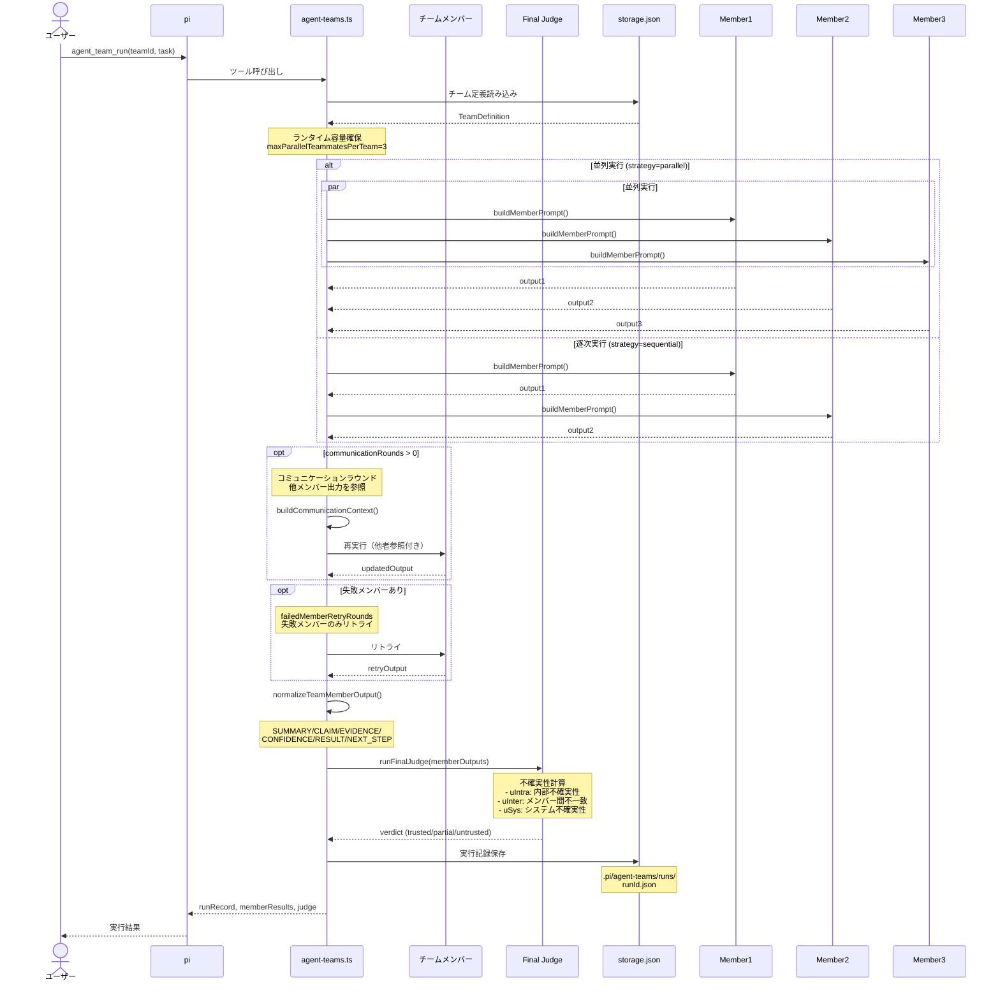
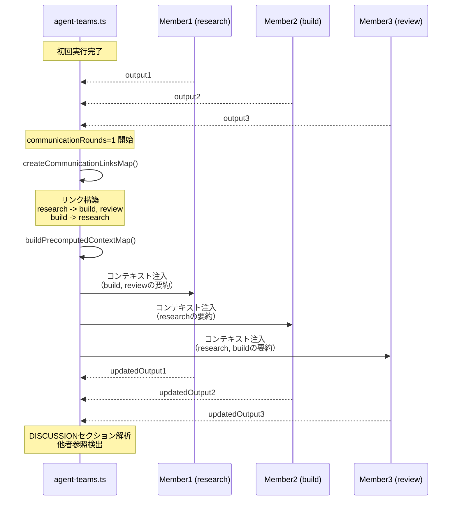

# agent-teams - エージェントチーム

> パンくず: [Home](../../README.md) > [User Guide](./) > agent-teams

## 概要

`agent_teams` 拡張機能は、複数のエージェントを含むチームの定義・実行を提供します。異なる役割を持つエージェントをチームとして統合し、最終判定（judge）で信頼性を評価しながら複雑なタスクを協調的に処理できます。

### 主な特徴

- **チーム定義**: 異なる役割を持つメンバーで構成されたチームを作成
- **並列実行**: チームメンバーを並列で実行して高速化
- **最終判定**: チーム出力を分析して信頼性を評価（`trusted`/`partial`/`untrusted`）
- **不確実性指標**: 内部不一致（uIntra）、部間不一致（uInter）、システム不確実性（uSys）を計算
- **プリセットチーム**: コードレビュー、セキュリティ、調査など様々な用途のチームがプリセット

## 実行フロー

### agent_team_run 実行フロー



### コミュニケーションラウンド詳細



---

## 使用方法

### 基本的な使い方

```bash
# チーム一覧
> agent_team_list()

# チーム実行（並列）
> agent_team_run_parallel(teamId="core-delivery-team", task="コードの品質をレビューしてください")

# チーム実行（逐次）
> agent_team_run(teamId="core-delivery-team", strategy="sequential", task="バグの根本原因を調査してください")

# ランタイム状態確認
> agent_team_status()

# 実行履歴
> agent_team_runs()
```

## 使用可能なツール

| ツール | 説明 |
|--------|------|
| `agent_team_list` | 定義済みチーム一覧を表示 |
| `agent_team_create` | カスタムエージェントチームを作成 |
| `agent_team_configure` | チーム設定（有効/無効、デフォルト）を更新 |
| `agent_team_run` | エージェントチームを実行（逐次） |
| `agent_team_run_parallel` | エージェントチームを並列で実行 |
| `agent_team_status` | 実行中のチーム状態を表示 |
| `agent_team_runs` | 最近の実行履歴を表示 |

## Markdown外部化によるチーム定義

このプロジェクトでは、エージェントチームの定義を Markdown ファイルで外部化しています。これにより、長いプロンプトの記述が容易になり、新しいチームの追加障壁が低くなります。

### 定義ファイルの場所

チーム定義は `.pi/agent-teams/definitions/` ディレクトリに保存されます。

```
.pi/agent-teams/definitions/
├── core-delivery-team.md
├── bug-war-room.md
├── security-hardening-team.md
├── docs-enablement-team.md
├── rapid-swarm-team.md
├── refactor-migration-team.md
├── code-excellence-review-team.md
├── design-discovery-team.md
├── file-organizer-team.md
├── mermaid-diagram-team.md
├── research-team.md
└── template-team.md
```

### 新規チーム追加ワークフロー

1. **テンプレートをコピー**
   ```bash
   cp .pi/agent-teams/definitions/template-team.md .pi/agent-teams/definitions/my-new-team.md
   ```

2. **ファイルを編集**
   - YAML frontmatter にチーム基本情報を記述
   - 本文にメンバーの詳細なプロンプトを記述

3. **チームを確認**
   ```bash
   pi agent_team_list
   ```

4. **テスト実行**
   ```bash
   pi agent_team_run my-new-team "テストタスク"
   ```

### 定義済みエージェントチーム

### core-delivery-team

コーディングタスクに対応するバランスの取れたチーム。研究、実装、レビューの3役割で構成。

| メンバーID | 役割 | 説明 |
|-----------|------|------|
| `research` | Researcher | 事実、制約、影響を受けるファイルを迅速に収集 |
| `build` | Implementer | 最小の実装ステップとエッジケースチェックを提案 |
| `review` | Reviewer | 提案されたアプローチの品質とリスクチェックを実行 |

### bug-war-room

根本原因タスクフォース。競合する仮説、決定的な再現、最終的なコンセンサスを含む。

| メンバーID | 役割 | 説明 |
|-----------|------|------|
| `hypothesis-a` | Hypothesis A | 最もありそうな根本原因を直接証拠と共に調査 |
| `reproduction` | Reproduction Specialist | 境界と環境メモを含む決定的な再現手順を作成 |
| `consensus` | Consensus Analyst | 証拠を統合し、信頼度をランク付けし、1つの根本原因の結論を出力 |

### security-hardening-team

脅威分析、認証チェック、依存関係リスク監査、パッチレビューを行うセキュリティ重視チーム。

| メンバーID | 役割 | 説明 |
|-----------|------|------|
| `threat-modeler` | Threat Modeler | 攻撃面、信頼境界、悪用ケースを深刻度別にマッピング |
| `auth-auditor` | Auth Auditor | 認証、認可、セッション境界のバイパスリスクを監査 |
| `security-reviewer` | Security Fix Reviewer | 提案された修復の完全性と回帰をレビュー |

### docs-enablement-team

README、運用ランブック、例示、簡潔な変更サマリーのためのドキュメントチーム。

| メンバーID | 役割 | 説明 |
|-----------|------|------|
| `readme-owner` | README Owner | オンボーディングとクイックスタートフローを最小の摩擦で更新 |
| `runbook-owner` | Runbook Owner | 運用、トラブルシューティングフロー、復旧手順を記録 |
| `docs-reviewer` | Docs Reviewer | 一貫性、正確性、読者の明瞭性をクロスチェック |

### rapid-swarm-team

スピード重視のチーム。多くの並列ワーカーで独立したスライスを積極的に展開。

| メンバーID | 役割 | 説明 |
|-----------|------|------|
| `swarm-01` | Swarm Worker 01 | 独立したスライスを素早く攻撃し、簡潔な実行可能な出力を返す（APIとインターフェース契約） |
| `swarm-02` | Swarm Worker 02 | 独立したスライスを素早く攻撃し、簡潔な実行可能な出力を返す（データフローと状態遷移） |
| `swarm-synthesizer` | Swarm Synthesizer | 並列ワーカー出力を統合し、重複を削除して1つの実行計画を作成 |

### refactor-migration-team

リファクタ重視のチーム。影響分析、移行計画、実装戦略、互換性チェックを扱う。

| メンバーID | 役割 | 説明 |
|-----------|------|------|
| `impact-analyst` | Impact Analyst | 影響を受けるモジュール、依存関係、リスク集中ゾーンをマッピング |
| `migration-planner` | Migration Planner | チェックポイント、フォールバックポイント、ロールアウトシーケンスを含む段階的ロールアウトを設計 |
| `refactor-implementer` | Refactor Implementer | 動作を保持する最小で安全なコード変更を提案 |

### code-excellence-review-team

包括的なコードレビューチーム。可読性、洗練、保守性、長期運用性をレビュー。

| メンバーID | 役割 | 説明 |
|-----------|------|------|
| `readability-reviewer` | Readability Reviewer | 命名の明瞭度、フローの可読性、認知負荷をチェック |
| `architecture-reviewer` | Architecture Reviewer | 境界、レイヤリング、結合、モジュール責任をレビュー |
| `review-synthesizer` | Review Synthesizer | 所見を重要/すべき/オプションの優先度に統合し、具体的な修正を含める |

### design-discovery-team

創造的な作業を行う前に必ず実施する設計発見タスクフォース。要件収集、トレードオフ評価、設計策定・検証を行い、実装前の完全な設計仕様を確立。

| メンバーID | 役割 | 説明 |
|-----------|------|------|
| `requirements-analyst` | Requirements Analyst | 現在の状況を把握し、目的、制約条件、成功基準を明確化。YAGNI原則を適用して不要な機能を排除 |
| `trade-off-evaluator` | Trade-off Evaluator | 2〜3種類の異なるアプローチを提案し、各選択肢のトレードオフを考慮した評価を実施 |
| `solution-designer` | Solution Designer | アーキテクチャ、コンポーネント、データフロー、エラー処理、テストをカバーした設計案を策定 |
| `validator` | Validator | Solution Designerが提示した各セクションの内容を検証し、設計の完全性と実行可能性を保証 |

### file-organizer-team

ファイル・フォルダの整理に特化したタスクフォース。現状分析、重複検出、整理計画策定、実行・検証を行い、デジタルワークスペースを整頓。

| メンバーID | 役割 | 説明 |
|-----------|------|------|
| `structure-analyzer` | Structure Analyzer | フォルダとファイルをレビューして現在の構造を理解し、ファイルタイプ、サイズ分布、日付範囲、整理問題を特定 |
| `duplicate-finder` | Duplicate Finder | システム全体で重複ファイルを特定し、ファイルパス、サイズ、変更日を表示して保持すべきファイルを推奨 |
| `organization-designer` | Organization Designer | ファイルタイプ、目的、日付に基づいて論理的なグループ化を決定し、新しいフォルダ構造を提案 |
| `cleanup-executor` | Cleanup Executor | 承認された計画を実行し、フォルダを作成してファイルを移動・名前変更し、すべての操作をログに記録 |

### mermaid-diagram-team

コード視覚化タスクフォース。シーケンス図、フローチャート等のMermaid図を厳密なコード整合性で作成・検証する。開発者とLLMの双方が理解できる視覚化を実現。

| メンバーID | 役割 | 説明 |
|-----------|------|------|
| `code-analyzer` | Code Analyzer | 対象コードの構造、制御フロー、データフロー、インターフェースを詳細に分析し、図解に必要な情報を抽出 |
| `diagram-author` | Diagram Author | 解析結果に基づきMermaid記法でシーケンス図、フローチャート等を作成。可読性と正確性のバランスを取る |
| `syntax-validator` | Syntax Validator | mermaid-cliによるstdin/stdoutパイプライン検証で構文正確性を確認。エラーを特定・修正 |
| `consistency-verifier` | Consistency Verifier | Mermaid図と元のコードの厳密な一致を検証。欠落、過剰、歪曲がないことを保証 |

### research-team

データ分析・科学研究プロジェクトを効率的に遂行する専門チーム。研究計画から成果発表まで一貫したワークフローを提供。

| メンバーID | 役割 | 説明 |
|-----------|------|------|
| `research-planner` | Research Planner | 研究計画の策定、目的設定、スコープ定義、リソース配分を担当。研究全体の方向性を管理 |
| `data-analyst` | Data Analyst | データ収集、前処理、統計解析、可視化を実行。research-statistics、research-visualizationスキルを活用 |
| `literature-reviewer` | Literature Reviewer | 文献検索、関連研究の調査、引用管理を担当。research-literatureスキルを活用 |
| `result-synthesizer` | Result Synthesizer | 分析結果を統合し、結論を導出。研究報告書の執筆を担当。research-writingスキルを活用 |

## パラメータ/オプション

### agent_team_create

| パラメータ | 型 | 説明 | 必須 |
|-----------|----|------|------|
| `id` | string | チームID（小文字ハイフン区切り、省略可） | 省略可 |
| `name` | string | チームの表示名 | 必須 |
| `description` | string | このチームの最適な用途 | 必須 |
| `members` | array | チームメンバーの配列 | 必須 |
| `setCurrent` | boolean | 新しいチームをデフォルトに設定 | 省略可 |

#### membersパラメータ

| パラメータ | 型 | 説明 | 必須 | デフォルト |
|-----------|----|------|------|----------|
| `id` | string | メンバーID | 必須 | - |
| `role` | string | メンバーの役割名 | 必須 | - |
| `description` | string | メンバーミッション | 必須 | - |
| `provider` | string | プロバイダーの上書き | 省略可 | - |
| `model` | string | モデルの上書き | 省略可 | - |
| `enabled` | boolean | 有効状態 | 省略可 | `true` |

### agent_team_run

| パラメータ | 型 | 説明 | 必須 | デフォルト |
|-----------|----|------|------|----------|
| `teamId` | string | 対象チームID | 省略可 | デフォルトチーム |
| `task` | string | チームに委譲するタスク | 必須 | - |
| `strategy` | string | 実行ストラテジ（`parallel`/`sequential`） | 省略可 | `parallel` |
| `sharedContext` | string | 全メンバーに共有するコンテキスト | 省略可 | - |
| `communicationRounds` | number | メンバー間のコミュニケーションラウンド数（Stable profile: 固定0） | 省略可 | 0 |
| `failedMemberRetryRounds` | number | 失敗メンバーのリトライラウンド数（Stable profile: 固定0） | 省略可 | 0 |
| `timeoutMs` | number | タイムアウト（ミリ秒、0で無制限） | 省略可 | 600000 (10分) |
| `memberParallelLimit` | number | チーム内での並列実行メンバー数上限（省略時はランタイム容量管理が自動計算） | 省略可 | 自動計算 |
| `retry` | object | リトライ設定 | 省略可 | - |

#### 並列実行の制御（ランタイム管理）

`memberParallelLimit` パラメータは明示的な指定も可能です。省略した場合、ランタイム容量管理システムにより、以下の制限に基づいて並列度が自動的に調整されます：

- `maxParallelTeammatesPerTeam`: チームあたりの最大並列メンバー数
- `maxTotalActiveLlm`: LLM実行数の合計上限
- `maxTotalActiveRequests`: リクエスト数の合計上限

Stable プロファイルでは、`STABLE_MAX_ACTIVE_MEMBERS_PER_TEAM = 3` の上限が適用されます。

### agent_team_run_parallel

| パラメータ | 型 | 説明 | 必須 | デフォルト |
|-----------|----|------|------|----------|
| `teamIds` | string[] | 対象チームIDの配列（省略時は現在の有効チームのみ実行） | 省略可 | デフォルトチーム |
| `task` | string | 全選択チームに委譲するタスク | 必須 | - |
| `strategy` | string | 各チームのメンバーストラテジ（`parallel`/`sequential`） | 省略可 | `parallel` |
| `sharedContext` | string | 全メンバーに共有するコンテキスト | 省略可 | - |
| `communicationRounds` | number | チームメンバー間の追加コミュニケーションラウンド数（Stable profile: 固定0） | 省略可 | 0 |
| `failedMemberRetryRounds` | number | 各チームの失敗メンバーのリトライラウンド数（Stable profile: 固定0） | 省略可 | 0 |
| `timeoutMs` | number | メンバー実行あたりのタイムアウト（ミリ秒、0で無制限） | 省略可 | 600000 (10分) |
| `memberParallelLimit` | number | 各チーム内での並列実行メンバー数上限（省略時は自動計算） | 省略可 | 自動計算 |
| `retry` | object | リトライ設定 | 省略可 | - |

#### ランタイム並列制御

`agent_team_run_parallel` は以下の階層で並列性を制御します：

1. **チーム並列**: 同時に実行するチーム数（`maxParallelTeamsPerRun`）
2. **メンバー並列**: 各チーム内で並列実行するメンバー数（`maxParallelTeammatesPerTeam`）

容量が不足する場合、以下の優先順位で並列度が自動的に削減されます：
- 要求されたチーム並列度
- 要求されたメンバー並列度
- 最終的に適用される並列度

### agent_team_runs

| パラメータ | 型 | 説明 | 必須 | デフォルト |
|-----------|----|------|------|----------|
| `limit` | number | 返す履歴の数 | 省略可 | 10 |

### リトライ設定

| パラメータ | 説明 | デフォルト（Stable プロファイル） |
|-----------|------|--------------------------------|
| `maxRetries` | 最大リトライ回数 | 2 |
| `initialDelayMs` | 初期待機時間（ミリ秒） | 800 |
| `maxDelayMs` | 最大待機時間（ミリ秒） | 10000 |
| `multiplier` | バックオフ乗数 | 2 |
| `jitter` | ジッターモード（`full`/`partial`/`none`） | `none` |

#### Stable プロファイルのリトライ設定

Stable プロファイルでは、429エラーを回避するため以下の追加設定が適用されます：

- `maxRateLimitRetries`: 最大レート制限リトライ回数 = 4
- `maxRateLimitWaitMs`: 最大レート制限待機時間 = 90000ms (90秒)

これにより、即時のレート制限エラーを防ぎつつ、適切な待機時間を確保します。

## 最終判定（Final Judge）

チーム実行後、最終判定が実行されます：

### 判定（Verdict）

| 判定 | 説明 |
|------|------|
| `trusted` | 証拠が一貫しており、失敗は無視できる程度 |
| `partial` | 品質が混在、解決済みではない対立、または一部失敗 |
| `untrusted` | 主要な対立、証拠不足、または大部分の失敗 |

### 不確実性指標

| 指標 | 説明 | 範囲 |
|------|------|------|
| `uIntra` | 内部不確実性（個別の信頼度不足や証拠不足） | 0.0 - 1.0 |
| `uInter` | 部間不一致（チームメンバー間の対立） | 0.0 - 1.0 |
| `uSys` | システム不確実性（全体の信頼性） | 0.0 - 1.0 |

### 崩壊シグナル

判定で警告された場合、以下のシグナルが表示されます：

| シグナル | 説明 |
|---------|------|
| `high_intra_uncertainty` | 内部不確実性が高い（uIntra >= 0.55） |
| `high_inter_disagreement` | 部間不一致が高い（uInter >= 0.55） |
| `high_system_uncertainty` | システム不確実性が高い（uSys >= 0.6） |
| `teammate_failures` | チームメンバーの失敗率が高い |
| `insufficient_evidence` | 証拠が不十分 |

## 使用例

### 例1: バランスの取れたチームの並列実行

```json
{
  "task": "このコードの品質をレビューし、改善点を提案してください"
}
```

### 例2: 特定のチームを指定

```json
{
  "teamId": "core-delivery-team",
  "task": "バグの根本原因を調査してください"
}
```

### 例3: 逐次実行

```json
{
  "teamId": "security-hardening-team",
  "strategy": "sequential",
  "task": "セキュリティ監査を実行してください"
}
```

### 例4: 共有コンテキスト付き

```json
{
  "teamId": "core-delivery-team",
  "task": "機能を実装してください",
  "sharedContext": "要件: 高パフォーマンス、RESTful API、OAuth2認証"
}
```

### 例5: 並列数の制限

```json
{
  "teamId": "rapid-swarm-team",
  "task": "独立したタスクを並列で処理してください",
  "memberParallelLimit": 4,
  "communicationRounds": 1,
  "failedMemberRetryRounds": 2
}
```

### 例6: カスタムチームの作成

```json
{
  "name": "カスタムレビューチーム",
  "description": "プロジェクト固有のコードレビュー",
  "members": [
    {
      "id": "code-reviewer",
      "role": "Code Reviewer",
      "description": "コードの可読性と保守性をレビュー"
    },
    {
      "id": "security-checker",
      "role": "Security Checker",
      "description": "セキュリティリスクをチェック"
    },
    {
      "id": "performance-auditor",
      "role": "Performance Auditor",
      "description": "パフォーマンス上の問題を特定"
    }
  ],
  "setCurrent": true
}
```

## 出力形式

### agent_team_run_parallel

```
Agent team run completed: 2026-02-11-093045-abc123
Team: core-delivery-team (Core Delivery Team)
Strategy: parallel
Communication rounds: 0
Failed-member retries: 0/0
Failed-member retry policy: rate-limit/capacity excluded, round1=quality/transient only, round2+=remaining failures
Status: completed
Summary: 3 teammates completed. communication_rounds=0 failed_member_retries=0 recovered=0
Output file: .pi/agent-teams/runs/2026-02-11-093045-abc123.json
Communication links:
- research -> build, review
- build -> research
- review -> build
Communication audit:
- summary: referenced_any=0/3, referenced_all=0/3
Final judge: trusted (94%)
Uncertainty: intra=0.08, inter=0.05, sys=0.09
Collapse signals: none
Judge reason: All teammates completed and no runtime failures were reported.
Judge next step: Proceed, but validate high-impact claims with direct evidence if needed.

Member results:
- research [ok] プロジェクト構造と要件を収集
- build [ok] 実装ステップを定義
- review [ok] 品質レビューを実施

Detailed outputs:

### research (Researcher)
調査結果:
...

[他のメンバー出力も同様に表示]
```

### agent_team_status

```
Agent Team / Subagent runtime
- 実行中LLM合計: 2
  - Agent team members: 2
  - Subagents: 0
- 実行中request合計: 1
  - Agent team runs: 1
  - Subagent requests: 0
- 実行上限: requests=10, llm=8, subagent_parallel=4, team_parallel=2, teammates_parallel=4
- 待機設定: max_wait_ms=30000, poll_ms=100
```

## 使用上のヒント

### チーム選択のガイドライン

| タスク | 推奨チーム |
|------|----------|
| 一般的なコーディング | `core-delivery-team` |
| バグ調査 | `bug-war-room` |
| セキュリティ監査 | `security-hardening-team` |
| ドキュメント作成 | `docs-enablement-team` |
| 独立タスクの大量処理 | `rapid-swarm-team` |
| リファクタ | `refactor-migration-team` |
| 包括的なコードレビュー | `code-excellence-review-team` |
| 設計発見と要件分析 | `design-discovery-team` |
| ファイル・フォルダ整理 | `file-organizer-team` |
| コード視覚化・Mermaid図作成 | `mermaid-diagram-team` |
| データ分析・科学研究 | `research-team` |

### 並列 vs 逐次

- **並列推奨**: メンバーが独立して作業できる場合
- **逐次推奨**: メンバー間で順序依存がある場合

### 判定結果の活用

- `trusted`: 前進しても安全
- `partial`: 主要な主張を直接証拠で検証してから前進
- `untrusted`: 再実行または別のアプローチを検討

## トラブルシューティング

### ランタイム制限エラー

サブエージェント同様、実行上限に達した場合は待機または並列数を減らしてください。

### 判定が `untrusted`

- タスクが明確か確認
- `sharedContext` で追加情報を提供
- 失敗したメンバーを確認し、再実行を検討

### メンバーが無効

```bash
> agent_team_configure(teamId="...", members=[{id: "...", enabled: true}])
```

## 保存されるファイル

```
.pi/agent-teams/
├── storage.json          # チーム定義と設定
├── definitions/         # チーム定義ファイル（Markdown）
│   ├── core-delivery-team.md
│   ├── bug-war-room.md
│   └── ...
└── runs/                # 実行履歴
    ├── 2026-02-11-093045-abc123.json
    └── ...
```

## 関連トピック

- [拡張機能一覧](./01-extensions.md) - 全拡張機能の概要
- [subagents](./08-subagents.md) - サブエージェント（単一専門家の委譲）
- [UL Dual Mode](./10-ul-dual-mode.md) - サブエージェントとエージェントチームのデュアルオーケストレーション

## バージョン履歴

| バージョン | 日付 | 変更内容 |
|----------|------|---------|
| v0.2.1 | 2026-02-14 | mermaid-diagram-team、research-teamの追加、スキル数27個に更新 |
| v0.2.0 | 2026-02-12 | Markdown外部化によるチーム定義の導入、definitions/ディレクトリ追加 |
| v0.1.0 | 2026-02-11 | 初期リリース |
