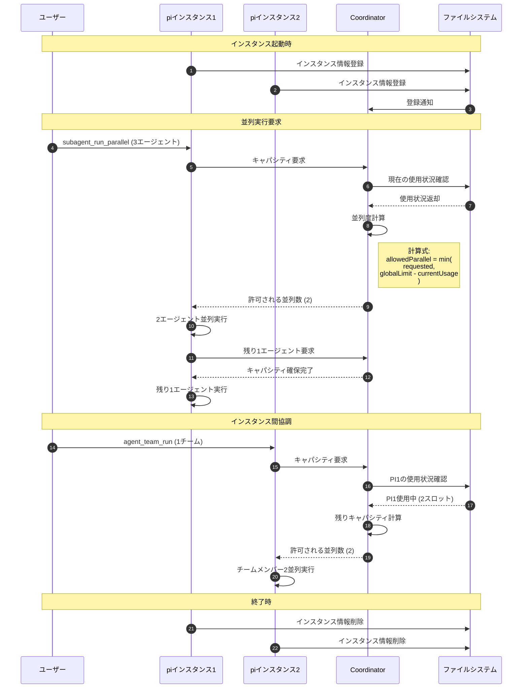
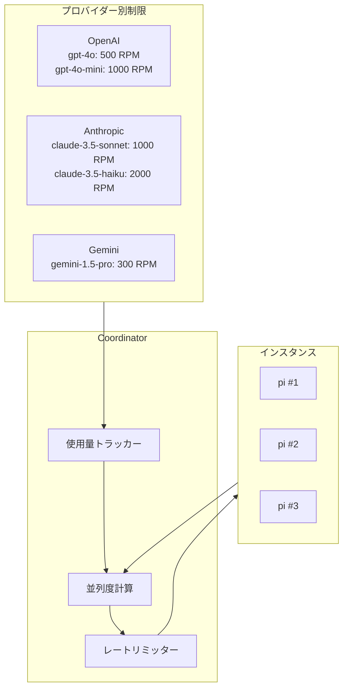
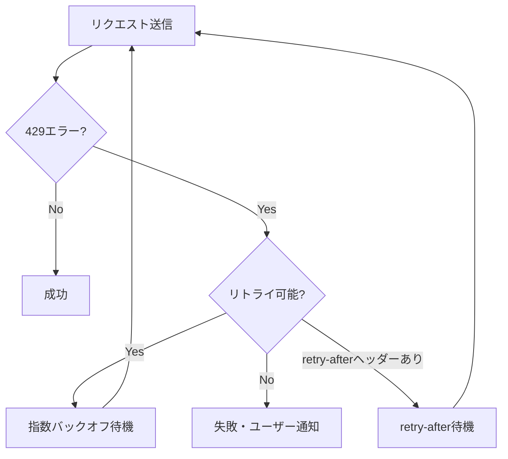

# クロスインスタンスランタイム

> パンくず: [Home](../README.md) > [User Guide](./) > クロスインスタンスランタイム

## 概要

クロスインスタンスランタイムは、複数のpiインスタンス間での並列実行数を自動調整する機能です。プロバイダー（OpenAI、Anthropic等）およびモデル別にレート制限を管理し、429エラー（レート制限超過）を回避しながら最適な並列度を実現します。

## 機能一覧

### ツール

| ツール名 | 説明 |
|---------|------|
| `pi_instance_status` | 現在起動中のpiインスタンス一覧と各インスタンスの状態を表示 |
| `pi_model_limits` | プロバイダー/モデル別のレート制限設定と現在の使用状況を表示 |

### コマンド

| コマンド | 説明 |
|---------|------|
| `/pi-instances` | piインスタンス一覧を表示 |
| `/pi-limits` | モデル別レート制限を表示 |
| `/pi-limits-reset` | レート制限カウンターをリセット（管理者用） |

## アーキテクチャ

### シーケンス図



### プロバイダー/モデル別制限



## 設定

### 環境変数

| 変数名 | デフォルト | 説明 |
|--------|----------|------|
| `PI_COORDINATOR_PATH` | `~/.pi-coordinator` | Coordinatorの状態保存パス |
| `PI_COORDINATOR_POLL_MS` | `500` | 状態確認のポーリング間隔（ミリ秒） |
| `PI_COORDINATOR_LOCK_TIMEOUT_MS` | `10000` | ロック取得タイムアウト（ミリ秒） |
| `PI_COORDINATOR_HEARTBEAT_MS` | `5000` | インスタンス生存確認間隔（ミリ秒） |

### プロバイダー別制限のカスタマイズ

`.pi/lib/provider-limits.ts` で定義された制限を環境変数で上書き可能：

```bash
# OpenAI GPT-4oのRPM制限
PI_PROVIDER_LIMIT_OPENAI_GPT4O_RPM=1000

# Anthropic Claude 3.5 SonnetのRPM制限
PI_PROVIDER_LIMIT_ANTHROPIC_CLAUDE35SONNET_RPM=2000
```

## 使用例

### インスタンス状態確認

```
> pi_instance_status

Active pi Instances (2):
┌─────────────────────────────────────┬──────────┬─────────────────┬───────────┐
│ Instance ID                         │ PID      │ Model           │ Active    │
├─────────────────────────────────────┼──────────┼─────────────────┼───────────┤
│ pi-abc123def456                     │ 12345    │ gpt-4o          │ 3 agents  │
│ pi-xyz789ghi012                     │ 67890    │ claude-3.5-sonnet │ 1 team   │
└─────────────────────────────────────┴──────────┴─────────────────┴───────────┘

Global Capacity: 5/8 LLMs active
```

### モデル別制限確認

```
> pi_model_limits

Provider/Model Rate Limits:
┌──────────────────────┬─────────┬──────────┬───────────┐
│ Model                │ RPM     │ Current  │ Remaining │
├──────────────────────┼─────────┼──────────┼───────────┤
│ openai/gpt-4o        │ 500     │ 120      │ 380       │
│ openai/gpt-4o-mini   │ 1000    │ 50       │ 950       │
│ anthropic/claude-3.5 │ 1000    │ 200      │ 800       │
│ anthropic/claude-3.5 │ 2000    │ 30       │ 1970      │
└──────────────────────┴─────────┴──────────┴───────────┘
```

## エラーハンドリング

### 429エラー（レート制限超過）時の動作



### Adaptive Rate Controller

429エラーから学習し、自動的に並列度を調整：

```typescript
// 適応的ペナルティ計算
adaptivePenalty.raise(reason: string): void
  - penalty = min(maxPenalty, penalty + reasonWeights[reason])
  - effectiveParallelism = max(1, floor(baseLimit / (penalty + 1)))

adaptivePenalty.lower(): void
  - penalty = penalty * decayMultiplier (default: 0.5)
```

## トラブルシューティング

### よくある問題

| 問題 | 原因 | 解決策 |
|------|------|--------|
| 並列実行が期待より少ない | 他インスタンスがリソース使用中 | `pi_instance_status` で確認 |
| 429エラー頻発 | プロバイダー制限超過 | 並列度を下げる、または制限を確認 |
| インスタンスが表示されない | Coordinatorパス不一致 | `PI_COORDINATOR_PATH` を確認 |

---

## 関連トピック

- [サブエージェント](./08-subagents.md) - サブエージェントの詳細
- [エージェントチーム](./09-agent-teams.md) - チーム実行の詳細
- [設定](../04-reference/01-configuration.md) - 環境変数の詳細

## 次のトピック

[→ 検索ツール](./15-search-tools.md)
