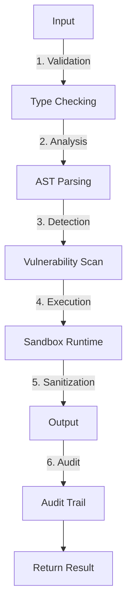

# Dynamic Tools

> パンくず: [Home](../../README.md) > [User Guide](../README.md) > Dynamic Tools

## 概要

Dynamic Toolsは、piセッション内でランタイムにツールを作成・実行する機能です。コード変更なしでタスク固有のツールを動的に生成し、セキュリティと品質の保証を提供します。

### 主な機能

- **ランタイムコード生成**: 必要に応じてツールを作成
- **安全性保証**: 複数層のバリデーション
- **品質チェック**: 自動化されたツール品質評価
- **リフレクション**: ツールの内省と改善

### なぜ動的ツールか

1. **適応性**: コード変更なしでタスク固有のツールを作成可能
2. **迅速なプロトタイピング**: ツールアイデアを素早くテスト
3. **特化**: タスク特化のツールを生成
4. **効率性**: セッション間で動的ツールを再利用

## セキュリティモデル

### バリデーション層



### 安全機能

- **ファイルシステムアクセス禁止**: ツールは直接ファイルにアクセス不可
- **ネットワークアクセス禁止**: ツールはネットワーク呼び出し不可
- **型安全性**: 全ての入出力がバリデーションされる
- **実行タイムアウト**: 制限時間での実行
- **メモリ制限**: メモリ制約されたランタイム

### 安全レベル

```typescript
enum SafetyLevel {
  STRICT = 0,    // 全バリデーション、例外なし
  MODERATE = 1,  // 標準バリデーション
  PERMISSIVE = 2 // 最小限のバリデーション（開発のみ）
}
```

| レベル | 説明 | 使用場面 |
|--------|------|---------|
| STRICT | 最も厳密、全バリデーション | 本番環境 |
| MODERATE | 標準的なバリデーション | 開発・本番 |
| PERMISSIVE | 最小限のバリデーション | プロトタイピングのみ |

## ツールライフサイクル

### 作成

```typescript
// 動的ツールを作成
const result = await create_tool({
  name: "summarize_text",
  description: "テキストをキーポイントに要約",
  parameters: {
    type: "object",
    properties: {
      text: { type: "string", description: "要約するテキスト" },
      maxLength: { type: "number", default: 3 }
    }
  },
  implementation: `/**
   * テキストをキーポイントに要約
   * @param {string} text - 要約するテキスト
   * @param {number} maxLength - 最大キーポイント数
   * @returns {Array<string>} キーポイント
   */
  function summarize_text(text, maxLength = 3) {
    const sentences = text.split('. ');
    const keyPoints = sentences
      .slice(0, maxLength * 2)
      .filter(s => s.length > 10)
      .slice(0, maxLength);
    return keyPoints;
  }`,
  safetyLevel: SafetyLevel.MODERATE
});
```

### 実行

```typescript
// 作成したツールを使用
const summary = await run_dynamic_tool({
  toolName: "summarize_text",
  parameters: {
    text: "素早い茶色の狐が怠惰な犬を飛び越えます。犬は気にしていないようです。これは英語の古典的な文です。",
    maxLength: 2
  }
});
// 戻り値: ["素早い茶色の狐が怠惰な犬を飛び越えます", "犬は気にしていないようです"]
```

### 一覧表示

```typescript
// 全動的ツールを一覧表示
const tools = await list_dynamic_tools();
console.log(tools);
/*
[
  {
    name: "summarize_text",
    description: "テキストをキーポイントに要約",
    createdAt: "2026-02-25T02:00:00Z",
    usageCount: 5,
    safetyLevel: 1
  }
]
*/
```

### 削除

```typescript
// ツールを削除
await delete_dynamic_tool({
  toolName: "summarize_text"
});
```

## 利用可能なツール

### create_tool

新しい動的ツールを作成します。

**パラメータ**:
```typescript
interface CreateToolParams {
  name: string;                    // ツール名（一意）
  description: string;             // ツールの説明
  parameters: JSONSchema;          // パラメータスキーマ
  implementation: string;         // JavaScript実装
  safetyLevel?: SafetyLevel;       // 安全レベル（デフォルト: MODERATE）
  tags?: string[];                 // ツールタグ
}
```

**使用例**:
```typescript
await create_tool({
  name: "calculate_similarity",
  description: "コサイン類似度を使用してテキストの類似度を計算",
  parameters: {
    type: "object",
    properties: {
      text1: { type: "string" },
      text2: { type: "string" }
    },
    required: ["text1", "text2"]
  },
  implementation: `
    function calculate_similarity(text1, text2) {
      const tokens1 = text1.toLowerCase().split(/\\s+/);
      const tokens2 = text2.toLowerCase().split(/\\s+/);
      const uniqueTokens = [...new Set([...tokens1, ...tokens2])];

      const vec1 = uniqueTokens.map(t => tokens1.includes(t) ? 1 : 0);
      const vec2 = uniqueTokens.map(t => tokens2.includes(t) ? 1 : 0);

      const dotProduct = vec1.reduce((a, b, i) => a + b * vec2[i], 0);
      const mag1 = Math.sqrt(vec1.reduce((a, b) => a + b * b, 0));
      const mag2 = Math.sqrt(vec2.reduce((a, b) => a + b * b, 0));

      return dotProduct / (mag1 * mag2);
    }
  `,
  safetyLevel: SafetyLevel.MODERATE,
  tags: ["similarity", "text-analysis"]
});
```

### run_dynamic_tool

動的ツールを実行します。

**パラメータ**:
```typescript
interface RunDynamicToolParams {
  toolName: string;       // 実行するツール名
  parameters: object;     // 入力パラメータ
  timeout?: number;      // 実行タイムアウト（ms、デフォルト: 5000）
}
```

**使用例**:
```typescript
const result = await run_dynamic_tool({
  toolName: "calculate_similarity",
  parameters: {
    text1: "猫がマットに座った",
    text2: "犬がマットに座った"
  },
  timeout: 10000
});
// 戻り値: 0.816 (高い類似度)
```

### list_dynamic_tools

利用可能な全動的ツールを一覧表示します。

**戻り値**:
```typescript
interface DynamicToolInfo {
  name: string;
  description: string;
  createdAt: string;
  usageCount: number;
  safetyLevel: SafetyLevel;
  tags: string[];
}
```

**使用例**:
```typescript
const tools = await list_dynamic_tools();
tools.forEach(tool => {
  console.log(`- ${tool.name}: ${tool.description}`);
  console.log(`  使用回数: ${tool.usageCount}`);
  console.log(`  安全レベル: ${tool.safetyLevel}`);
});
```

### delete_dynamic_tool

動的ツールを削除します。

**パラメータ**:
```typescript
interface DeleteToolParams {
  toolName: string;  // 削除するツール名
}
```

**使用例**:
```typescript
await delete_dynamic_tool({
  toolName: "calculate_similarity"
});
```

### tool_reflection

ツールの品質と改善の機会を分析します。

**パラメータ**:
```typescript
interface ToolReflectionParams {
  toolName: string;
  includeUsageHistory?: boolean;
}
```

**戻り値**:
```typescript
interface ToolReflection {
  qualityScore: number;        // 0-1
  issues: string[];           // 発見された品質問題
  suggestions: string[];      // 改善提案
  usageStats: {
    totalRuns: number;
    averageExecutionTime: number;
    errorRate: number;
  };
}
```

**使用例**:
```typescript
const reflection = await tool_reflection({
  toolName: "calculate_similarity",
  includeUsageHistory: true
});
/*
{
  qualityScore: 0.85,
  issues: [
    "エッジケースのエラーハンドリングがない（空文字列）",
    "Unicodeの適切な処理がされていない"
  ],
  suggestions: [
    "入力バリデーションを追加",
    "より高い精度のために適切なNLPライブラリの使用を検討"
  ],
  usageStats: {
    totalRuns: 42,
    averageExecutionTime: 2.3,
    errorRate: 0.05
  }
}
*/
```

## ベストプラクティス

### 1. ツール設計

```typescript
// ✅ 良い: 明確な名前、型付きパラメータ
await create_tool({
  name: "extract_json_from_text",
  description: "テキストからJSONを抽出して検証",
  parameters: {
    type: "object",
    properties: {
      text: { type: "string", description: "解析対象テキスト" },
      schema: { type: "object", description: "検証スキーマ" }
    },
    required: ["text"]
  },
  implementation: `
    function extract_json_from_text(text, schema) {
      const jsonMatch = text.match(/\\{[\\s\\S]*\\}/);
      if (!jsonMatch) throw new Error('JSON not found');

      const parsed = JSON.parse(jsonMatch[0]);

      // スキーマ検証
      if (schema) {
        // 簡易検証ロジック
        Object.keys(schema).forEach(key => {
          if (!(key in parsed)) {
            throw new Error(\`Missing required field: \${key}\`);
          }
        });
      }

      return parsed;
    }
  `
});

// ❌ 悪い: 曖昧な名前、型なしパラメータ
await create_tool({
  name: "process_data",
  description: "データで何かをする",
  parameters: {
    type: "object"
  },
  implementation: `
    function process_data(input) {
      // 実装が不明確
      return input;
    }
  `
});
```

### 2. エラーハンドリング

```typescript
// ✅ 良い: 適切なエラーハンドリング
await create_tool({
  name: "safe_divide",
  description: "安全な除算",
  parameters: {
    type: "object",
    properties: {
      a: { type: "number" },
      b: { type: "number" }
    },
    required: ["a", "b"]
  },
  implementation: `
    function safe_divide(a, b) {
      if (typeof b !== 'number' || b === 0) {
        throw new Error('0で割ることはできません');
      }
      if (typeof a !== 'number') {
        throw new Error('aは数値である必要があります');
      }
      return a / b;
    }
  `
});

// ❌ 悪い: エラーハンドリングなし
await create_tool({
  name: "divide",
  description: "除算",
  implementation: `
    function divide(a, b) {
      return a / b;  // b=0でInfinityまたはエラー
    }
  `
});
```

### 3. パフォーマンス

```typescript
// ✅ 良い: 効率的な実装
await create_tool({
  name: "find_duplicates",
  description: "重複を見つける",
  parameters: {
    type: "object",
    properties: {
      items: { type: "array" }
    },
    required: ["items"]
  },
  implementation: `
    function find_duplicates(items) {
      const seen = new Set();
      const duplicates = new Set();

      for (const item of items) {
        if (seen.has(item)) {
          duplicates.add(item);
        } else {
          seen.add(item);
        }
      }
      return Array.from(duplicates);
    }
  `
});

// ❌ 悪い: 非効率な実装
await create_tool({
  name: "find_duplicates_slow",
  description: "重複を見つける（遅い）",
  implementation: `
    function find_duplicates_slow(items) {
      const duplicates = [];

      for (let i = 0; i < items.length; i++) {
        for (let j = i + 1; j < items.length; j++) {
          if (items[i] === items[j] && !duplicates.includes(items[i])) {
            duplicates.push(items[i]);
          }
        }
      }
      return duplicates;
    }
  `
});
```

### 4. ドキュメンテーション

```typescript
// ✅ 良い: ドキュメント化されている
await create_tool({
  name: "fibonacci",
  description: "フィボナッチ数を計算",
  parameters: {
    type: "object",
    properties: {
      n: { type: "number", description: "インデックス（0ベース）" }
    },
    required: ["n"]
  },
  implementation: `
    /**
     * フィボナッチ数を計算
     * @param {number} n - インデックス（0ベース）
     * @returns {number} インデックスnのフィボナッチ数
     * @throws {Error} nが負の数または数値でない場合
     */
    function fibonacci(n) {
      if (!Number.isInteger(n) || n < 0) {
        throw new Error('nは0以上の整数である必要があります');
      }
      if (n <= 1) return n;

      let prev = 0, curr = 1;
      for (let i = 2; i <= n; i++) {
        [prev, curr] = [curr, prev + curr];
      }
      return curr;
    }
  `
});

// ❌ 悪い: ドキュメントなし
await create_tool({
  name: "fib",
  description: "フィボナッチ",
  implementation: `
    function fib(n) {
      if (n <= 1) return n;
      return fib(n - 1) + fib(n - 2);
    }
  `
});
```

## 高度な使用法

### 品質チェック

ツールは作成時に自動的に品質評価されます:

```typescript
interface QualityMetrics {
  complexity: number;        // 循環的複雑度
  maintainability: number;  // 保守性インデックス
  testability: number;      // テスト容易性
  documentation: number;    // ドキュメント網羅率
}

// ツール作成時に品質チェックが自動実行
const result = await create_tool({ /* ... */ });
if (result.qualityScore < 0.7) {
  console.warn('ツール品質が閾値を下回っています');
  console.log('問題:', result.qualityIssues);
}
```

### リフレクションループ

リフレクションを使用してツールを反復的に改善:

```typescript
// 初期ツールを作成
await create_tool({
  name: "text_analyzer",
  description: "テキストを分析",
  parameters: {
    type: "object",
    properties: {
      text: { type: "string" }
    },
    required: ["text"]
  },
  implementation: `
    function text_analyzer(text) {
      return {
        length: text.length,
        words: text.split(/\\s+/).length,
        sentences: text.split(/[.!?]/).length
      };
    }
  `
});

// 数回ツールを実行
for (const input of testInputs) {
  await run_dynamic_tool({
    toolName: "text_analyzer",
    parameters: { text: input }
  });
}

// リフレクションして改善
const reflection = await tool_reflection({
  toolName: "text_analyzer"
});

if (reflection.qualityScore < 0.9) {
  // 改善して再作成
  await delete_dynamic_tool({ toolName: "text_analyzer" });

  await create_tool({
    name: "text_analyzer",
    description: "テキストを分析（改善版）",
    parameters: {
      type: "object",
      properties: {
        text: { type: "string" },
        options: {
          type: "object",
          properties: {
            countParagraphs: { type: "boolean", default: true },
            detectLanguage: { type: "boolean", default: true }
          }
        }
      },
      required: ["text"]
    },
    implementation: `
      function text_analyzer(text, options = {}) {
        const baseMetrics = {
          length: text.length,
          words: text.split(/\\s+/).length,
          sentences: text.split(/[.!?]/).length
        };

        if (options.countParagraphs !== false) {
          baseMetrics.paragraphs = text.split(/\\n\\n+/).length;
        }

        if (options.detectLanguage !== false) {
          // 簡易言語検出
          const hasHiragana = /[\\u3040-\\u309F]/.test(text);
          baseMetrics.language = hasHiragana ? 'ja' : 'en';
        }

        return baseMetrics;
      }
    `
  });
}
```

### 監査ログ

全ツール操作はログに記録されます:

```typescript
// 監査ログを取得
const auditLog = await get_tool_audit_log({
  toolName: "my_tool",
  since: "2026-02-24"
});

/*
[
  {
    timestamp: "2026-02-25T02:00:00Z",
    operation: "CREATE",
    userId: "user@example.com",
    details: {
      name: "my_tool",
      safetyLevel: 1,
      initialQualityScore: 0.85
    }
  },
  {
    timestamp: "2026-02-25T02:05:00Z",
    operation: "EXECUTE",
    userId: "user@example.com",
    details: {
      parameters: { /* ... */ },
      result: { /* ... */ },
      executionTime: 1.2
    }
  },
  {
    timestamp: "2026-02-25T02:10:00Z",
    operation: "EXECUTE",
    userId: "user@example.com",
    details: {
      parameters: { /* ... */ },
      error: "Invalid input",
      executionTime: 0.1
    }
  }
]
*/
```

### 複雑なデータ構造

```typescript
await create_tool({
  name: "transform_data",
  description: "データを変換",
  parameters: {
    type: "object",
    properties: {
      data: {
        type: "array",
        items: {
          type: "object",
          properties: {
            id: { type: "number" },
            name: { type: "string" },
            value: { type: "number" }
          }
        }
      },
      transform: {
        type: "object",
        properties: {
          type: { type: "string", enum: ["sum", "avg", "group", "sort"] },
          field: { type: "string" }
        }
      }
    },
    required: ["data", "transform"]
  },
  implementation: `
    function transform_data(data, transform) {
      switch (transform.type) {
        case 'sum':
          return data.reduce((acc, item) => acc + item[transform.field], 0);

        case 'avg':
          const sum = data.reduce((acc, item) => acc + item[transform.field], 0);
          return sum / data.length;

        case 'group':
          const groups = {};
          data.forEach(item => {
            const key = item[transform.field];
            if (!groups[key]) groups[key] = [];
            groups[key].push(item);
          });
          return groups;

        case 'sort':
          return [...data].sort((a, b) =>
            a[transform.field] - b[transform.field]
          );

        default:
          throw new Error(\`未知の変換タイプ: \${transform.type}\`);
      }
    }
  `
});

// 使用例
const result = await run_dynamic_tool({
  toolName: "transform_data",
  parameters: {
    data: [
      { id: 1, name: "A", value: 10 },
      { id: 2, name: "B", value: 20 },
      { id: 3, name: "C", value: 30 }
    ],
    transform: { type: "sum", field: "value" }
  }
});
// 戻り値: 60
```

## 制限と制約

### サンドボックス制限

- **ファイルシステムアクセス**: `fs`モジュール使用不可
- **ネットワークアクセス**: `http`/`https`リクエスト不可
- **プロセス実行**: `child_process`使用不可
- **タイムアウト**: デフォルト5秒、最大30秒
- **メモリ**: 最大100MB

### 実装制限

- **外部モジュール**: Node.jsビルトインのみ使用可能
- **非同期処理**: 非同期コードは`async/await`でラップ
- **グローバル変数**: ツールスコープ外へのアクセス不可

## トラブルシューティング

### ツール実行タイムアウト

**問題**: ツール実行がタイムアウトする

**解決策**:
```typescript
// タイムアウトを延長
const result = await run_dynamic_tool({
  toolName: "heavy_computation",
  parameters: { /* ... */ },
  timeout: 30000  // 30秒
});

// または、より効率的な実装にリファクタリング
await delete_dynamic_tool({ toolName: "heavy_computation" });
// 改善版を作成
```

### セキュリティエラー

**問題**: 「安全ではない操作がブロックされました」というエラー

**解決策**:
```typescript
// 安全レベルを確認
const reflection = await tool_reflection({
  toolName: "my_tool"
});

// 制限された操作を回避した実装を作成
await create_tool({
  name: "safe_version",
  description: "安全バージョン",
  safetyLevel: SafetyLevel.STRICT,
  implementation: `/* 安全な実装 */`
});
```

### 品質スコアが低い

**問題**: ツールの品質スコアが0.7未満

**解決策**:
```typescript
const reflection = await tool_reflection({
  toolName: "my_tool",
  includeUsageHistory: true
});

console.log('問題:', reflection.issues);
console.log('提案:', reflection.suggestions);

// 提案に基づいてツールを再作成
await delete_dynamic_tool({ toolName: "my_tool" });
// 改善された実装で作成
```

## 関連トピック

- [拡張機能](01-extensions.md) - 全拡張機能の概要
- [サブエージェント](08-subagents.md) - タスク委任
- [エージェントチーム](09-agent-teams.md) - マルチエージェント実行

## 次のトピック

[ → 検索ツール](15-search-tools.md) - 高速コード検索
