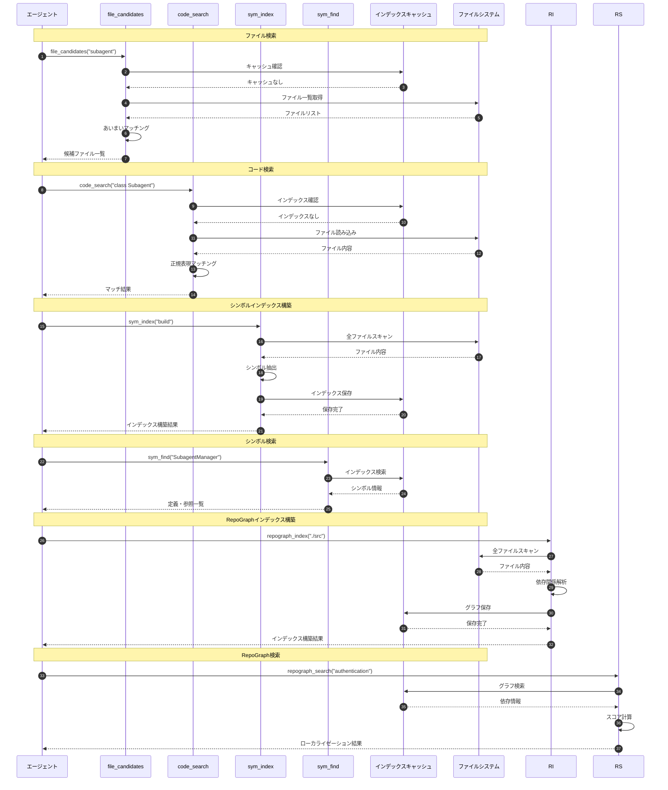
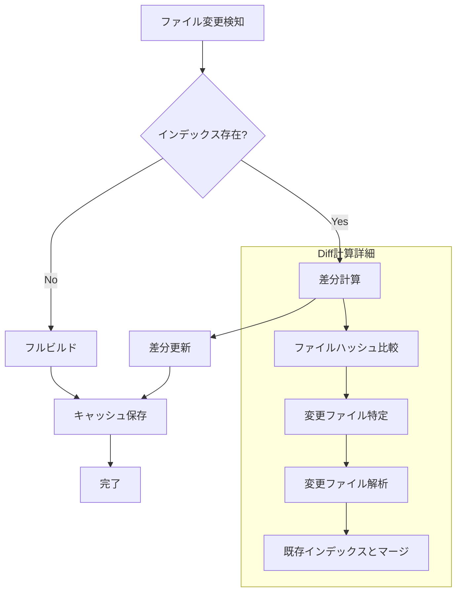

# 検索ツール

> パンくず: [Home](../../README.md) > [User Guide](../README.md) > 検索ツール

## 概要

検索ツールは、コードベース内のファイル、コード、シンボルを高速に検索するためのツールセットです。大規模なコードベースでも効率的にナビゲーションできるよう、複数の検索方式を提供します。

## ツール一覧

| ツール名 | 説明 | 主な用途 |
|---------|------|---------|
| `file_candidates` | ファイルパスのあいまい検索 | 目的のファイルを素早く特定 |
| `code_search` | コード内容の全文検索 | 特定のパターンや関数を検索 |
| `sym_index` | シンボルインデックスの構築・更新 | 高速なシンボル検索の準備 |
| `sym_find` | シンボルの定義・参照検索 | 関数・クラスの定義場所を特定 |

## RepoGraphツール

### 概要

RepoGraphは、コードローカライゼーション手法として行レベルの依存グラフを構築し、タスクに関連するコード位置を特定する機能です。SWE-benchで+32.8%の改善を達成した論文の手法を実装しています。

### 特徴

- **行レベルグラフ**: コード行をノード、依存関係をエッジとするグラフ構築
- **AST解析**: tree-sitterによる正確な定義/参照抽出
- **標準ライブラリフィルタリング**: ノイズとなる標準ライブラリを除外
- **エゴグラフ検索**: キーワードからk-hopサブグラフを抽出
- **自動コンテキスト拡張**: サブエージェント/エージェントチームへの統合

### ツール一覧

| ツール名 | 説明 |
|---------|------|
| `repograph_index` | RepoGraphインデックスの構築 |
| `repograph_query` | インデックスをクエリ |
| `repograph_localize` | タスクからコード位置を特定 |

### repograph_index

プロジェクト全体の依存グラフインデックスを構築します。

```typescript
repograph_index({
  path: "./src",              // 対象パス
  force: false                // 強制再構築フラグ
})
```

**戻り値の例:**

```json
{
  "action": "index",
  "path": "./src",
  "filesIndexed": 45,
  "nodes": 1234,
  "edges": 2876,
  "timeMs": 520,
  "indexPath": ".pi/search/repograph/index.json"
}
```

### repograph_search

依存グラフを使用してコードの位置を特定します。特にバグの原因特定や影響範囲の調査に有効です。SWE-benchで+32.8%の改善を達成した手法です。

```typescript
await repograph_search({
  query: "authentication token validation",  // 検索クエリ
  topK: 5,                                   // 上位K件
  includeDependencies: true,                 // 依存関係を含める
  basePath: "./src"                         // 検索対象パス
})
```

**戻り値の例:**

```json
{
  "query": "authentication token validation",
  "results": [
    {
      "path": "src/auth/token-validator.ts",
      "line": 15,
      "score": 0.92,
      "confidence": "high",
      "dependencies": [
        "src/auth/jwt.ts",
        "src/auth/config.ts"
      ],
      "dependents": [
        "src/api/middleware/auth.ts",
        "src/controllers/user.ts"
      ],
      "snippet": "export function validateToken(token: string): ValidationResult {"
    },
    {
      "path": "src/auth/jwt.ts",
      "line": 42,
      "score": 0.87,
      "confidence": "high",
      "dependencies": [
        "src/auth/config.ts"
      ],
      "dependents": [
        "src/auth/token-validator.ts"
      ],
      "snippet": "export function decodeJWT(token: string): JWTPayload | null {"
    }
  ],
  "totalResults": 5,
  "searchTimeMs": 23
}
```

## RepoGraphの活用

### 基本的な使用例

```typescript
// 1. シンボル参照を検索
const references = repograph_query({
  type: "symbol_refs",
  symbol: "AuthService"
});

// 2. 各参照の依存関係を確認
for (const ref of references) {
  const related = repograph_query({
    type: "related",
    nodeId: `${ref.file}:${ref.line}`,
    depth: 1
  });
  console.log(`Impact at ${ref.file}:${ref.line}:`, related);
}
```

### エゴグラフ探索（k-hop）

RepoGraphの核心機能。キーワードからk-hopのサブグラフを抽出します。

```
seed node (keyword match)
  └── 1-hop: 直接的な呼び出し元/呼び出し先
      └── 2-hop: 間接的な依存関係
          └── 3-hop: さらに遠い関係（デフォルトでは使用しない）
```

**推奨設定:**

- `k=1`: 直接的な関連のみ（高速、精度高）
- `k=2`: バランス型（デフォルト、推奨）
- `k=3`: 広範囲（遅い、ノイズ増加）

### パフォーマンス

| プロジェクト規模 | ファイル数 | ノード数 | インデックスサイズ |
|-----------------|-----------|----------|------------------|
| 小規模 | <100 | <5,000 | <1MB |
| 中規模 | 100-1000 | 5,000-50,000 | 1-10MB |
| 大規模 | >1000 | >50,000 | >10MB |

### トラブルシューティング

#### インデックスが見つからない

```bash
Error: RepoGraph index not found. Run repograph_index first.
```

**解決策:**

```typescript
repograph_index({ path: "./src" })
```

#### キーワードが抽出されない

```bash
Error: No keywords could be extracted from the task description.
```

**解決策:**

- タスク説明に具体的な識別子を含める
- 関数名、クラス名、ファイル名を明示的に記載

#### 結果が空

**原因:**

- インデックスに対象ファイルが含まれていない
- キーワードがコードベースに存在しない

**解決策:**

```typescript
// インデックスの統計を確認
repograph_query({ type: "stats" })

// 対象ファイルが含まれているか確認
repograph_query({ type: "file", file: "path/to/file.ts" })
```

## 各ツールの詳細

### file_candidates

ファイルパスに基づくあいまい検索を行います。

```
file_candidates({
  query: "search tools",      // 検索クエリ
  maxResults: 20,             // 最大結果数
  fileTypes: [".ts", ".js"],  // 対象ファイル拡張子（オプション）
  excludePatterns: ["node_modules", "dist"]  // 除外パターン（オプション）
})
```

**戻り値の例:**

```json
{
  "candidates": [
    {
      "path": ".pi/extensions/search/index.ts",
      "score": 0.95,
      "matches": ["search", "tools"]
    },
    {
      "path": ".pi/skills/search-tools/SKILL.md",
      "score": 0.87,
      "matches": ["search", "tools"]
    }
  ]
}
```

### code_search

コード内容の全文検索（正規表現対応）を行います。

```
code_search({
  pattern: "function\\s+\\w+Search",  // 検索パターン（正規表現）
  filePattern: "*.ts",                // 対象ファイル（glob）
  contextLines: 3,                    // 前後のコンテキスト行数
  maxResults: 50                      // 最大結果数
})
```

**戻り値の例:**

```json
{
  "results": [
    {
      "file": ".pi/extensions/search/tools/code_search.ts",
      "line": 45,
      "column": 10,
      "match": "function codeSearch",
      "context": ["  /**", "   * コード検索関数", "   */", "  function codeSearch(query: string) {", "    return searchIndex.find(query);", "  }"]
    }
  ],
  "totalMatches": 3
}
```

### sym_index

シンボルインデックスを構築・更新します。プロジェクトの規模に応じてインクリメンタル更新をサポート。

```
sym_index({
  action: "build",                    // "build" | "update" | "clear"
  paths: [".pi/extensions"],          // 対象パス（オプション）
  forceRebuild: false                 // 強制再構築フラグ
})
```

**戻り値の例:**

```json
{
  "action": "build",
  "filesIndexed": 127,
  "symbolsFound": 1842,
  "timeMs": 350,
  "indexSize": "2.4MB"
}
```

### sym_find

シンボルの定義場所および参照場所を検索します。

```
sym_find({
  symbol: "subagent_run",             // シンボル名
  type: "definition",                 // "definition" | "references" | "both"
  includeDecl: true                   // 宣言を含める
})
```

**戻り値の例:**

```json
{
  "symbol": "subagent_run",
  "definitions": [
    {
      "file": ".pi/extensions/subagents.ts",
      "line": 1250,
      "column": 15,
      "kind": "function",
      "signature": "async function subagent_run(subagentId: string, task: string): Promise<SubagentResult>"
    }
  ],
  "references": [
    {
      "file": ".pi/extensions/agent-teams.ts",
      "line": 320,
      "column": 8,
      "context": "const result = await subagent_run(agent.id, task)"
    },
    {
      "file": ".pi/extensions/rsa.ts",
      "line": 89,
      "column": 12,
      "context": "results.push(await subagent_run(delegate, subtask))"
    }
  ],
  "totalReferences": 15
}
```

### repograph_index

コードベースの依存グラフを構築します。RepoGraphはSWE-benchで+32.8%の改善を達成したコードローカライゼーション手法です。

```typescript
await repograph_index({
  basePath: "./src",              // 対象ディレクトリ
  exclude: ["node_modules", "dist", "build"],  // 除外ディレクトリ
  includeTests: true              // テストファイルを含めるか
})
```

**戻り値の例:**

```json
{
  "status": "success",
  "filesIndexed": 156,
  "dependencies": 1234,
  "timeMs": 450,
  "graphStats": {
    "nodes": 156,
    "edges": 1234,
    "avgDegree": 7.9,
    "maxDepth": 12
  }
}
```

### repograph_search

依存グラフを使用してコードの位置を特定します。特にバグの原因特定や影響範囲の調査に有効です。

```typescript
await repograph_search({
  query: "authentication token validation",  // 検索クエリ
  topK: 5,                                   // 上位K件
  includeDependencies: true,                 // 依存関係を含める
  basePath: "./src"                         // 検索対象パス
})
```

**戻り値の例:**

```json
{
  "query": "authentication token validation",
  "results": [
    {
      "path": "src/auth/token-validator.ts",
      "line": 15,
      "score": 0.92,
      "confidence": "high",
      "dependencies": [
        "src/auth/jwt.ts",
        "src/auth/config.ts"
      ],
      "dependents": [
        "src/api/middleware/auth.ts",
        "src/controllers/user.ts"
      ],
      "snippet": "export function validateToken(token: string): ValidationResult {"
    },
    {
      "path": "src/auth/jwt.ts",
      "line": 42,
      "score": 0.87,
      "confidence": "high",
      "dependencies": [
        "src/auth/config.ts"
      ],
      "dependents": [
        "src/auth/token-validator.ts"
      ],
      "snippet": "export function decodeJWT(token: string): JWTPayload | null {"
    }
  ],
  "totalResults": 5,
  "searchTimeMs": 23
}
```

## ツール選択ガイド

状況に応じて適切な検索ツールを選択します。

| 状況 | 推奨ツール | 理由 |
|------|-----------|------|
| 特定の機能のファイルを見つける | `file_candidates` | ファイル名パス検索が高速 |
| コードの意味で検索 | `code_search` | セマンティック検索 |
| 関数・クラスの定義・参照を特定 | `sym_find` | シンボルレベルの正確な検索 |
| バグの原因を特定する | `repograph_search` | 依存関係から影響範囲を調査 |
| コールグラフを探索 | `sym_find` + `repograph_search` | 呼び出し階層を可視化 |
| リファクタリングの影響範囲調査 | `repograph_search` | 依存先・依存元を一覧 |

## RepoGraphの活用

### バグローカライゼーション

```typescript
// 1. 依存グラフを構築
await repograph_index({ basePath: "./src" });

// 2. バグに関するクエリで検索
const bugLocation = await repograph_search({
  query: "authentication fails after token refresh",
  topK: 3
});

// 3. 依存関係を確認
console.log("依存先:", bugLocation.results[0].dependencies);
console.log("依存元:", bugLocation.results[0].dependents);

// 4. 影響範囲を調査
const impactedFiles = await repograph_search({
  query: "token refresh",
  includeDependencies: true
});
```

### リファクタリングの事前調査

```typescript
// 変更対象のファイルとその影響範囲を確認
const impactAnalysis = await repograph_search({
  query: "deprecated authentication module",
  includeDependents: true
});

// 影響を受けるファイルの一覧を取得
const affectedFiles = new Set();
impactAnalysis.results.forEach(result => {
  result.dependents.forEach(dep => affectedFiles.add(dep));
  result.dependencies.forEach(dep => affectedFiles.add(dep));
});

console.log("影響を受けるファイル:", Array.from(affectedFiles));
```

## シーケンス図

### 検索フロー全体



### インクリメンタルインデックス更新



## 使用例

### コードベース調査のワークフロー

```typescript
// 1. インデックス構築
await sym_index({ action: "build" });
await repograph_index({ basePath: "./src" });

// 2. 定義検索
await sym_find({ symbol: "Agent", type: "definition" });

// 3. 関連ファイル検索
await file_candidates({ query: "agent types" });

// 4. 詳細検索
await code_search({ pattern: "interface Agent" });

// 5. 依存関係調査
await repograph_search({ query: "Agent initialization", includeDependencies: true });
```

### 特定機能の影響範囲調査

```typescript
// 1. 参照箇所特定
await sym_find({ symbol: "runSubagent", type: "references" });

// 2. 呼び出しコンテキスト確認
await code_search({
  pattern: "runSubagent\\s*\\(",
  contextLines: 2
});

// 3. テストファイル検索
await file_candidates({ query: "subagent test" });

// 4. 依存関係から影響範囲を確認
await repograph_search({
  query: "subagent execution",
  includeDependencies: true,
  includeDependents: true
});
```

## パフォーマンス最適化

### インデックス戦略

| プロジェクト規模 | 推奨戦略 | 説明 |
|-----------------|---------|------|
| 小規模（<100ファイル） | オンデマンド | 検索時に都度スキャン |
| 中規模（100-1000ファイル） | 起動時ビルド | 起動時にインデックス構築 |
| 大規模（>1000ファイル） | 永続キャッシュ | インデックスをファイルに永続化 |

### キャッシュ設定

```bash
# インデックスキャッシュの有効化
PI_SEARCH_CACHE_ENABLED=true

# キャッシュパス
PI_SEARCH_CACHE_PATH=~/.pi-search-cache

# キャッシュTTL（秒）
PI_SEARCH_CACHE_TTL=86400

# 最大キャッシュサイズ（MB）
PI_SEARCH_CACHE_MAX_SIZE=500
```

## トラブルシューティング

### よくある問題

| 問題 | 原因 | 解決策 |
|------|------|--------|
| 検索結果が空 | インデックス未構築 | `sym_index({ action: "build" })` を実行 |
| 検索が遅い | キャッシュ無効 | キャッシュ設定を確認 |
| 結果が古い | インデックス古い | `sym_index({ action: "update" })` を実行 |
| メモリ不足 | 大規模プロジェクト | 永続キャッシュを有効化 |

### インデックス状態確認

```typescript
// シンボルインデックス状態
await sym_index({
  action: "status"
})

// 戻り値:
{
  "indexed": true,
  "lastUpdated": "2026-02-25T13:00:00Z",
  "fileCount": 127,
  "symbolCount": 1842,
  "cacheSize": "2.4MB",
  "staleFiles": 3
}

// RepoGraphインデックス状態
const repoStatus = await get_repograph_status({
  basePath: "./src"
})

// 戻り値:
{
  "indexed": true,
  "lastUpdated": "2026-02-25T14:00:00Z",
  "fileCount": 156,
  "dependencyCount": 1234,
  "graphNodes": 156,
  "graphEdges": 1234
}
```

---

## 関連トピック

- [拡張機能概要](./01-extensions.md) - 全拡張機能の一覧
- [search-toolsスキル](../../.pi/skills/search-tools/SKILL.md) - 検索ツールのスキル定義
- [repograph-localizationスキル](../../.pi/skills/repograph-localization/SKILL.md) - RepoGraphコードローカライゼーション

## 次のトピック

[→ ユーティリティ](./11-utilities.md)
