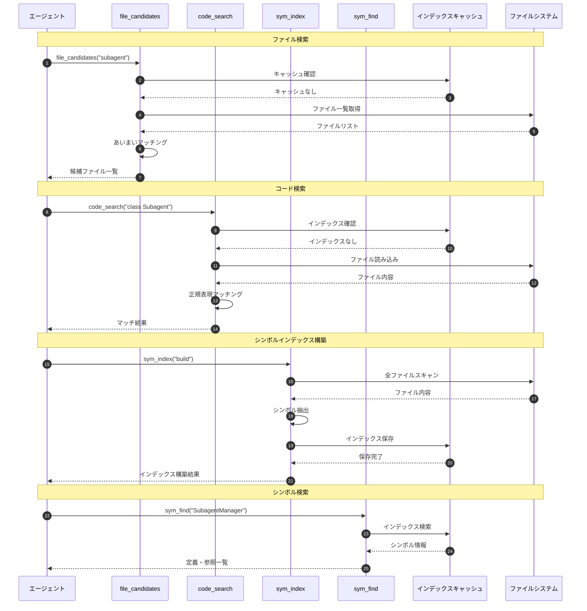
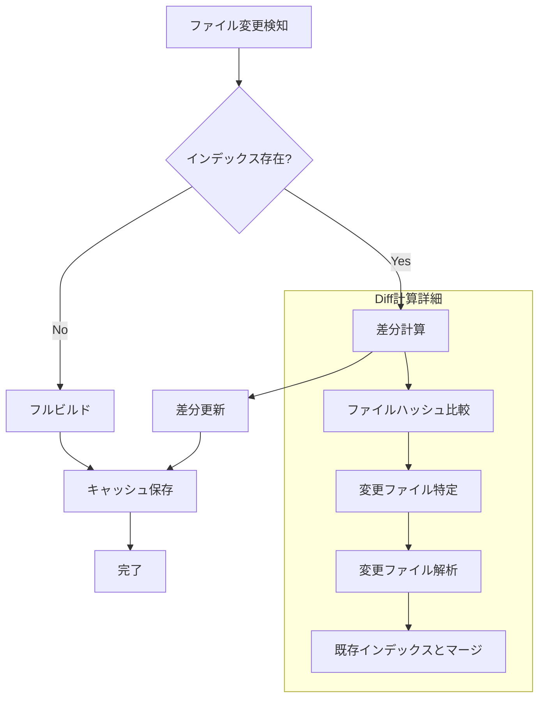

# 検索ツール

> パンくず: [Home](../../README.md) > [User Guide](../README.md) > 検索ツール

## 概要

検索ツールは、コードベース内のファイル、コード、シンボルを高速に検索するためのツールセットです。大規模なコードベースでも効率的にナビゲーションできるよう、複数の検索方式を提供します。

## ツール一覧

| ツール名 | 説明 | 主な用途 |
|---------|------|---------|
| `file_candidates` | ファイルパスのあいまい検索 | 目的のファイルを素早く特定 |
| `code_search` | コード内容の全文検索 | 特定のパターンや関数を検索 |
| `sym_index` | シンボルインデックスの構築・更新 | 高速なシンボル検索の準備 |
| `sym_find` | シンボルの定義・参照検索 | 関数・クラスの定義場所を特定 |

## 各ツールの詳細

### file_candidates

ファイルパスに基づくあいまい検索を行います。

```
file_candidates({
  query: "search tools",      // 検索クエリ
  maxResults: 20,             // 最大結果数
  fileTypes: [".ts", ".js"],  // 対象ファイル拡張子（オプション）
  excludePatterns: ["node_modules", "dist"]  // 除外パターン（オプション）
})
```

**戻り値の例:**

```json
{
  "candidates": [
    {
      "path": ".pi/extensions/search/index.ts",
      "score": 0.95,
      "matches": ["search", "tools"]
    },
    {
      "path": ".pi/skills/search-tools/SKILL.md",
      "score": 0.87,
      "matches": ["search", "tools"]
    }
  ]
}
```

### code_search

コード内容の全文検索（正規表現対応）を行います。

```
code_search({
  pattern: "function\\s+\\w+Search",  // 検索パターン（正規表現）
  filePattern: "*.ts",                // 対象ファイル（glob）
  contextLines: 3,                    // 前後のコンテキスト行数
  maxResults: 50                      // 最大結果数
})
```

**戻り値の例:**

```json
{
  "results": [
    {
      "file": ".pi/extensions/search/tools/code_search.ts",
      "line": 45,
      "column": 10,
      "match": "function codeSearch",
      "context": ["  /**", "   * コード検索関数", "   */", "  function codeSearch(query: string) {", "    return searchIndex.find(query);", "  }"]
    }
  ],
  "totalMatches": 3
}
```

### sym_index

シンボルインデックスを構築・更新します。プロジェクトの規模に応じてインクリメンタル更新をサポート。

```
sym_index({
  action: "build",                    // "build" | "update" | "clear"
  paths: [".pi/extensions"],          // 対象パス（オプション）
  forceRebuild: false                 // 強制再構築フラグ
})
```

**戻り値の例:**

```json
{
  "action": "build",
  "filesIndexed": 127,
  "symbolsFound": 1842,
  "timeMs": 350,
  "indexSize": "2.4MB"
}
```

### sym_find

シンボルの定義場所および参照場所を検索します。

```
sym_find({
  symbol: "subagent_run",             // シンボル名
  type: "definition",                 // "definition" | "references" | "both"
  includeDecl: true                   // 宣言を含める
})
```

**戻り値の例:**

```json
{
  "symbol": "subagent_run",
  "definitions": [
    {
      "file": ".pi/extensions/subagents.ts",
      "line": 1250,
      "column": 15,
      "kind": "function",
      "signature": "async function subagent_run(subagentId: string, task: string): Promise<SubagentResult>"
    }
  ],
  "references": [
    {
      "file": ".pi/extensions/agent-teams.ts",
      "line": 320,
      "column": 8,
      "context": "const result = await subagent_run(agent.id, task)"
    },
    {
      "file": ".pi/extensions/rsa.ts",
      "line": 89,
      "column": 12,
      "context": "results.push(await subagent_run(delegate, subtask))"
    }
  ],
  "totalReferences": 15
}
```

## シーケンス図

### 検索フロー全体



### インクリメンタルインデックス更新



## パフォーマンス最適化

### インデックス戦略

| プロジェクト規模 | 推奨戦略 | 説明 |
|-----------------|---------|------|
| 小規模（<100ファイル） | オンデマンド | 検索時に都度スキャン |
| 中規模（100-1000ファイル） | 起動時ビルド | 起動時にインデックス構築 |
| 大規模（>1000ファイル） | 永続キャッシュ | インデックスをファイルに永続化 |

### キャッシュ設定

```bash
# インデックスキャッシュの有効化
PI_SEARCH_CACHE_ENABLED=true

# キャッシュパス
PI_SEARCH_CACHE_PATH=~/.pi-search-cache

# キャッシュTTL（秒）
PI_SEARCH_CACHE_TTL=86400

# 最大キャッシュサイズ（MB）
PI_SEARCH_CACHE_MAX_SIZE=500
```

## 使用例

### コードベース調査のワークフロー

```
1. sym_index({ action: "build" })           // インデックス構築
2. sym_find({ symbol: "Agent", type: "definition" })  // 定義検索
3. file_candidates({ query: "agent types" })          // 関連ファイル検索
4. code_search({ pattern: "interface Agent" })        // 詳細検索
```

### 特定機能の影響範囲調査

```
1. sym_find({ symbol: "runSubagent", type: "references" })  // 参照箇所特定
2. code_search({ pattern: "runSubagent\\s*\\(", contextLines: 2 })  // 呼び出しコンテキスト確認
3. file_candidates({ query: "subagent test" })  // テストファイル検索
```

## トラブルシューティング

### よくある問題

| 問題 | 原因 | 解決策 |
|------|------|--------|
| 検索結果が空 | インデックス未構築 | `sym_index({ action: "build" })` を実行 |
| 検索が遅い | キャッシュ無効 | キャッシュ設定を確認 |
| 結果が古い | インデックス古い | `sym_index({ action: "update" })` を実行 |
| メモリ不足 | 大規模プロジェクト | 永続キャッシュを有効化 |

### インデックス状態確認

```
sym_index({
  action: "status"
})

// 戻り値:
{
  "indexed": true,
  "lastUpdated": "2026-02-16T13:00:00Z",
  "fileCount": 127,
  "symbolCount": 1842,
  "cacheSize": "2.4MB",
  "staleFiles": 3
}
```

---

## 関連トピック

- [拡張機能概要](./01-extensions.md) - 全拡張機能の一覧
- [search-toolsスキル](/.pi/skills/search-tools/SKILL.md) - 検索ツールのスキル定義

## 次のトピック

[→ ユーティリティ](./11-utilities.md)
