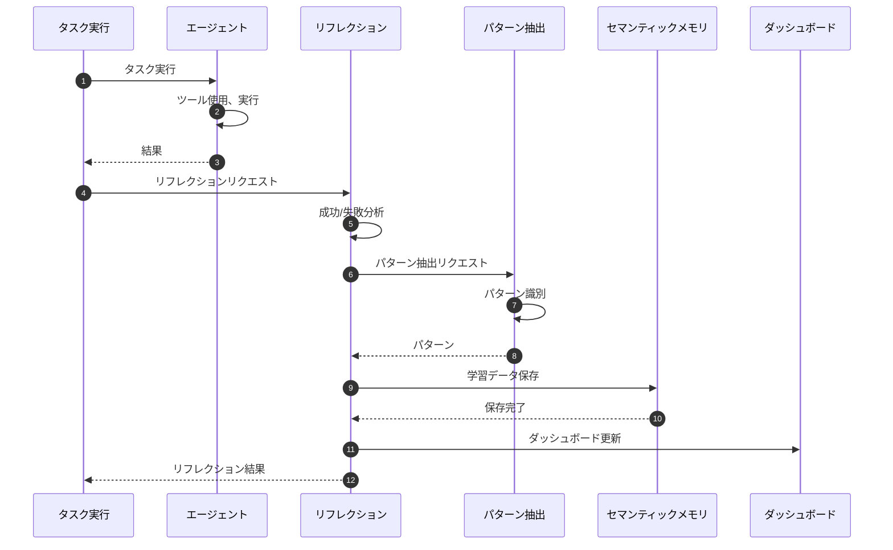
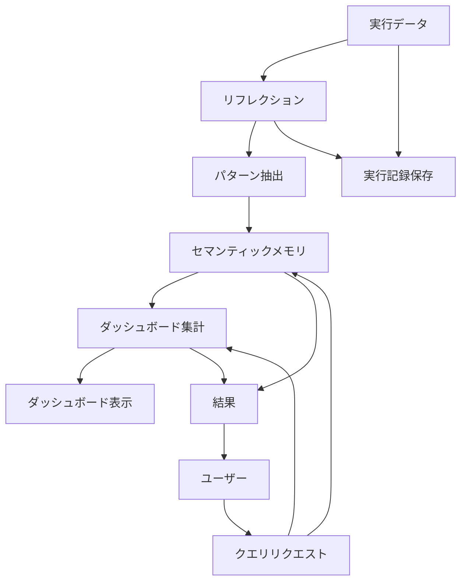

# Self-Improvement System

> パンくず: [Home](../../README.md) > [User Guide](../README.md) > Self-Improvement System

## 概要

自己改善システムは、エージェントが自身の実行経験から学習し、時間の経過とともに改善する仕組みを提供します。

- **自動リフレクション**: エージェントが自身のパフォーマンスを分析
- **パターン認識**: 成功パターンと失敗パターンを識別
- **経験再生**: 過去の実行から学習
- **継続的改善**: 学んだ教訓を将来のタスクに適用

### コンポーネント

1. **自己改善リフレクション** (`.pi/extensions/self-improvement-reflection.ts`)
2. **自己改善ダッシュボード** (`.pi/extensions/self-improvement-dashboard.ts`)
3. **自己改善データプラットフォーム** (`.pi/extensions/self-improvement-data-platform.ts`)
4. **セマンティックメモリ** (`.pi/lib/semantic-memory.ts`)
5. **パターン抽出** (`.pi/lib/pattern-extraction.ts`)

## リフレクションシステム

### 仕組み

```
┌─────────────┐
│   タスク     │
│  実行       │
└──────┬──────┘
       │
       ▼
┌─────────────┐     ┌──────────────────┐
│   結果      │────▶│  自己リフレクション  │
└─────────────┘     └────────┬─────────┘
                             │
                             ▼
                    ┌─────────────────┐
                    │  分析と学習      │
                    └────────┬────────┘
                             │
                             ▼
                    ┌─────────────────┐
                    │  将来のタスク    │
                    │  に適用         │
                    └─────────────────┘
```

### トリガー条件

リフレクションは以下のタイミングで実行されます:

- タスク完了時（成功・失敗問わず）
- エージェントチーム実行後
- サブエージェント実行後
- 明示的なリフレクションリクエスト

### リフレクション指標

```typescript
interface ReflectionMetrics {
  taskSuccessRate: number;        // 直近Nタスクの成功率
  averageCompletionTime: number;   // 平均完了時間
  commonErrorPatterns: string[];  // 再発するエラーパターン
  successfulPatterns: string[];   // 成功アプローチ
  delegationEffectiveness: number; // 委任の有効性
}
```

## ダッシュボード

### ダッシュボードの表示

```bash
# 自己改善ダッシュボードを開く
pi self-improvement-dashboard
```

### ダッシュボード指標

1. **全体パフォーマンス**
   - 完了タスク数
   - 成功率
   - 平均完了時間

2. **学習トレンド**
   - 時系列の成功率
   - パフォーマンス改善
   - パターン認識精度

3. **エージェント固有データ**
   - エージェントごとのパフォーマンス
   - エージェントの強みプロファイル
   - 特定された弱点

### ダッシュボードビュー

```typescript
// プログラムでダッシュボードデータを取得
const dashboardData = await get_self_improvement_dashboard();

/*
{
  overview: {
    totalTasks: 1234,
    successRate: 0.87,
    averageTime: 45.2
  },
  trends: [
    { date: "2026-02-20", successRate: 0.82 },
    { date: "2026-02-21", successRate: 0.84 },
    { date: "2026-02-22", successRate: 0.85 },
    { date: "2026-02-23", successRate: 0.86 },
    { date: "2026-02-24", successRate: 0.87 }
  ],
  agents: {
    "code-reviewer": {
      tasks: 234,
      successRate: 0.92,
      averageTime: 12.3
    },
    "implementer": {
      tasks: 567,
      successRate: 0.85,
      averageTime: 38.5
    }
  },
  patterns: {
    successful: [
      "code_searchの前にfile_candidatesを使用",
      "大規模タスクはDAGに分解して並列実行"
    ],
    errors: [
      "バイナリファイルの読み取りを試みる",
      "委任時のコンテキスト不足"
    ]
  }
}
*/
```

## データプラットフォーム

### ストレージ

すべての自己改善データは `.pi/data/self-improvement/` に保存されます:

```
.pi/data/self-improvement/
├── executions/          # 実行記録
├── reflections/         # リフレクション結果
├── patterns/            # 識別されたパターン
├── embeddings/          # セマンティック埋め込み
└── dashboard.json      # 集計ダッシュボードデータ
```

### クエリ

```typescript
// 過去の実行をクエリ
const executions = await query_executions({
  agentId: "code-reviewer",
  since: "2026-02-20",
  minSuccessRate: 0.9
});

// パターンをクエリ
const patterns = await query_patterns({
  type: "successful",
  category: "code-review"
});

// セマンティック類似性でクエリ
const similar = await query_similar_executions({
  query: "authentication token validation",
  topK: 5
});
```

## 使用例

### 例1: 自己改善を有効化

```typescript
// サブエージェントのリフレクションを有効化
await subagent_run({
  subagentId: "code-reviewer",
  task: "認証モジュールをレビュー",
  config: {
    selfImprovement: {
      enabled: true,
      reflectionLevel: "detailed"
    }
  }
});
```

### 例2: リフレクション結果を表示

```typescript
const reflection = await get_reflection({
  runId: "run-abc123"
});

console.log(reflection.analysis);
/*
{
  outcome: "success",
  metrics: {
    completionTime: 34.2,
    tokenUsage: 1234,
    toolCalls: 8
  },
  insights: [
    "検索ツールを効果的に使用してコードを特定",
    "並列サブエージェント委任で改善可能"
  ],
  learnings: [
    "100ファイル超のコードレビューではagent-teamを使用",
    "ここではシンボル検索がコード検索より正確"
  ]
}
*/
```

### 例3: 学習パターンを適用

```typescript
// システムは学習したパターンを自動的に適用
// また、明示的にパターンベースの実行をリクエスト可能

await subagent_run({
  subagentId: "researcher",
  task: "決済システムを分析",
  config: {
    useLearnedPatterns: true,
    patternThreshold: 0.8  // 信頼度0.8以上のパターンのみ使用
  }
});
```

## 結果の解釈

### 成功トレンド

```
成功率
100% |                     *
 90% |                   *   *
 80% |                 *       *
 70% |               *           *
     +------------------------------------
       Feb 20  21  22  23  24  25
```

**上昇トレンド**: 学習が機能していることを示します。

**平坦化**: 新しい戦略が必要な可能性があります。

**低下**: 最近の変更やタスク複雑度を調査してください。

### パターン信頼度

パターンには信頼度スコア（0-1）があります:

- **0.9-1.0**: 非常に信頼性が高く、常に適用すべき
- **0.7-0.9**: 信頼性が高く、使用を推奨
- **0.5-0.7**: 暫定的、コンテキストを考慮すべき
- **< 0.5**: 信頼性が低く、注意して使用

### エージェント推奨

```typescript
// タスクに対する推奨を取得
const recommendations = await get_agent_recommendations({
  taskType: "code-review",
  taskSize: "large"
});

/*
{
  recommendedAgent: "agent_team_code-review-team",
  confidence: 0.92,
  reason: "大規模コードレビューは複数視点で実行すべき",
  alternativeAgents: [
    { agentId: "code-reviewer", confidence: 0.75 },
    { agentId: "design-discovery-team", confidence: 0.60 }
  ]
}
*/
```

## シーケンス図

### リフレクションフロー



### ダッシュボードデータフロー



## 設定

### 自己改善設定

```typescript
// .pi/config.json
{
  "selfImprovement": {
    "enabled": true,
    "reflectionLevel": "detailed",  // "minimal" | "standard" | "detailed"
    "patternThreshold": 0.7,
    "dashboardRefreshInterval": 60,  // 秒
    "dataRetentionDays": 90
  }
}
```

### 環境変数

```bash
# 自己改善機能の有効化
PI_SELF_IMPROVEMENT_ENABLED=true

# リフレクションレベル
PI_REFLECTION_LEVEL=detailed

# データ保存パス
PI_SELF_IMPROVEMENT_DATA_PATH=~/.pi/self-improvement

# データ保持期間（日）
PI_SELF_IMPROVEMENT_RETENTION_DAYS=90
```

## トラブルシューティング

### よくある問題

| 問題 | 原因 | 解決策 |
|------|------|--------|
| ダッシュボードが空 | 実行データなし | タスクを実行してデータ収集 |
| パターンが表示されない | 実行回数不足 | さらにタスクを実行 |
| 学習が反映されない | パターン信頼度低 | パターン閾値を調整 |

### データのリセット

```bash
# すべての自己改善データをリセット
pi self-improvement reset --all

# 特定エージェントのデータのみリセット
pi self-improvement reset --agent code-reviewer
```

---

## 関連トピック

- [拡張機能概要](./01-extensions.md) - 全拡張機能の一覧
- [self-improvementスキル](../../.pi/skills/self-improvement/SKILL.md) - 自己改善のスキル定義
- [自己反省](../../.pi/skills/self-reflection/SKILL.md) - 自己反省の手続き

## 次のトピック

[→ DAG実行](./18-dag-execution.md)

---

# 自己改善深化フェーズ - モジュール統合ガイド

## 概要

本ドキュメントは、自己改善深化フェーズで実装された4つの哲学的モジュールの統合方法を説明します。

## モジュール一覧

| モジュール | ファイル | 哲学的基盤 | 主な機能 |
|-----------|---------|-----------|---------|
| アポリア共生型推論 | `aporetic-reasoning.ts` | デリダ、準矛盾論理 | 両極維持、パレート最適化 |
| 創造的破壊 | `creative-destruction.ts` | ニーチェ、ドゥルーズ、デリダ、ハイデガー、仏教 | 前提破壊、再構築 |
| 超メタ認知 | `hyper-metacognition.ts` | 自己参照、形式化検出 | 4層メタ認知、無限後退認識 |
| 非線形思考 | `nonlinear-thought.ts` | 連想心理学、創発論 | 連想生成、収束検出 |

## 基本的な使用方法

### 1. アポリア共生型推論

```typescript
import {
  createAporeticEngine,
  performAporeticInference,
  type AporiaDetection,
  type Evidence
} from './lib/aporetic-reasoning';

// エンジン作成
const engine = createAporeticEngine({
  tensionThreshold: 0.7,
  decisionThreshold: 0.85
});

// アポリア定義
const aporia: AporiaDetection = {
  type: 'completeness-vs-speed',
  pole1: { concept: '完全性', value: '品質重視', arguments: [] },
  pole2: { concept: '速度', value: '効率重視', arguments: [] },
  tensionLevel: 0.7,
  description: '完全性と速度のトレードオフ',
  context: '開発タスク',
  resolution: 'maintain-tension'
};

// 証拠の準備
const evidenceList: Evidence[] = [
  {
    type: 'observation',
    value: '品質の確保が必要',
    strength: 0.7,
    source: 'user-feedback',
    timestamp: new Date(),
    likelihoods: new Map([['重要', 0.8]])
  }
];

// 推論実行
const result = performAporeticInference(engine, aporia, evidenceList, {
  urgencyLevel: 0.5,
  reversibility: true
});

// パレートフロントの確認
console.log(result.paretoFront);
// 推奨決定（もしあれば）
console.log(result.recommendedDecision);
```

### 2. 創造的破壊

```typescript
import {
  createCreativeDestructionEngine,
  registerPremise,
  performDestruction,
  performChainDestruction,
  optimizeDestruction
} from './lib/creative-destruction';

// エンジン作成
const engine = createCreativeDestructionEngine({
  maxDestructionDepth: 3,
  destructionIntensity: 0.7
});

// 前提登録
const premise1 = registerPremise(engine, '正しい答えが存在する', 'epistemic', 0.9);
const premise2 = registerPremise(engine, '常に効率を追求すべき', 'normative', 0.7);

// 単一破壊
const result = performDestruction(engine, premise1.id);
console.log(result.remnants);
console.log(result.exposed);

// 連鎖破壊
const chain = performChainDestruction(engine, premise2.id, 2);
console.log(chain.finalReconstruction);

// パレート最適破壊戦略
const strategies = optimizeDestruction(engine);
console.log(strategies[0].expectedEffects);
```

### 3. 超メタ認知

```typescript
import {
  createHyperMetacognitionEngine,
  performHyperMetacognition,
  getThinkingQualityAssessment
} from './lib/hyper-metacognition';

// エンジン作成
const engine = createHyperMetacognitionEngine({
  maxCognitiveDepth: 3,
  formalizationRiskThreshold: 0.6
});

// 超メタ認知実行
const state = performHyperMetacognition(engine, '思考内容', 'コンテキスト');

// 各層の確認
console.log(state.layer0.observations); // 直接思考
console.log(state.layer1.evaluation);   // メタ認知
console.log(state.layer2.observations); // 超メタ認知
console.log(state.layer3.limitations);  // 限界認識

// 思考品質評価
const assessment = getThinkingQualityAssessment(state);
console.log(assessment.overallScore);
console.log(assessment.strengths);
console.log(assessment.weaknesses);
```

### 4. 非線形思考

```typescript
import {
  createNonLinearThoughtEngine,
  registerSeed,
  generateNonLinearThoughts,
  generateParallelThoughts,
  getParetoOptimalInsights
} from './lib/nonlinear-thought';

// エンジン作成
const engine = createNonLinearThoughtEngine({
  defaultParameters: {
    maxDepth: 5,
    breadth: 3,
    randomnessWeight: 0.3,
    surprisePreference: 0.5
  }
});

// シード登録
const seed1 = registerSeed(engine, '矛盾', 'paradox');
const seed2 = registerSeed(engine, '創造', 'concept');

// 並列思考生成
const chains = generateParallelThoughts(engine, [seed1.id, seed2.id]);

// パレート最適洞察の取得
const optimalInsights = getParetoOptimalInsights(engine);
console.log(optimalInsights);
```

## 統合ワークフロー

4つのモジュールを統合した完全なワークフロー例：

```typescript
import { createAporeticEngine, performAporeticInference } from './lib/aporetic-reasoning';
import { createCreativeDestructionEngine, registerPremise, performDestruction } from './lib/creative-destruction';
import { createHyperMetacognitionEngine, performHyperMetacognition } from './lib/hyper-metacognition';
import { createNonLinearThoughtEngine, registerSeed, generateNonLinearThoughts } from './lib/nonlinear-thought';

function integratedSelfImprovement(thought: string, aporia: AporiaDetection) {
  // Phase 1: 超メタ認知で現在の思考を分析
  const metaEngine = createHyperMetacognitionEngine();
  const metaState = performHyperMetacognition(metaEngine, thought);

  // Phase 2: アポリア共生型推論で両極を維持
  const aporiaEngine = createAporeticEngine();
  const aporiaResult = performAporeticInference(aporiaEngine, aporia, []);

  // Phase 3: 創造的破壊で前提を破壊
  const destructionEngine = createCreativeDestructionEngine();
  const premise = registerPremise(destructionEngine, 'この問題には解決策がある', 'epistemic', 0.8);
  const destruction = performDestruction(destructionEngine, premise.id);

  // Phase 4: 非線形思考で新しい視点を生成
  const nonlinearEngine = createNonLinearThoughtEngine();
  registerSeed(nonlinearEngine, thought, 'question');
  const chain = generateNonLinearThoughts(nonlinearEngine);

  // 統合結果を返す
  return {
    metacognitiveState: metaState,
    aporiaResolution: aporiaResult,
    destructionResult: destruction,
    thoughtChain: chain,
    qualityAssessment: getThinkingQualityAssessment(metaState)
  };
}
```

## 既存モジュールとの統合

### belief-updater.ts との統合

```typescript
import { updateBelief, createPrior, type Evidence } from './lib/belief-updater';
import { createAporeticEngine, updateBeliefState } from './lib/aporetic-reasoning';

// ベイズ信念をアポリア信念に変換
function convertBayesianToAporetic(
  prior: Distribution,
  evidence: Evidence[]
): AporeticBeliefState {
  // ... 変換ロジック
}
```

### thinking-process.ts との統合

```typescript
import { selectThinkingMode, type ThinkingMode } from './lib/thinking-process';
import { createHyperMetacognitionEngine, performHyperMetacognition } from './lib/hyper-metacognition';

// 思考モードをメタ認知で評価
function evaluateThinkingMode(mode: ThinkingMode, thought: string): number {
  const engine = createHyperMetacognitionEngine();
  const state = performHyperMetacognition(engine, thought);
  // モードの適合性を評価
  return state.integratedEvaluation.thinkingQuality;
}
```

### aporia-handler.ts との統合

```typescript
import { detectAporia, handleAporia } from './lib/aporia-handler';
import { createAporeticEngine, integrateResolution } from './lib/aporetic-reasoning';

// アポリア検出から共生型推論へ
function aporiaToInference(text: string) {
  const aporias = detectAporia(text);
  const engine = createAporeticEngine();

  for (const aporia of aporias) {
    const resolution = handleAporia(aporia);
    integrateResolution(engine, resolution);
  }

  return engine;
}
```

## ベイズ最適化の観点

各モジュールでは以下のベイズ/最適化手法が統合されています：

### パレート最適化

- `aporetic-reasoning.ts`: 両極の達成度を多目的最適化
- `creative-destruction.ts`: 創造性vs安定性のパレートフロント
- `nonlinear-thought.ts`: 新規性vs有用性のパレートフロント

### ベイズ信念更新

- `aporetic-reasoning.ts`: 両極の信念強度を証拠に基づき更新
- `hyper-metacognition.ts`: 思考品質の信念を更新

### 不確実性の定量化

- 全モジュールで信頼度/不確実性を計算
- エントロピーによる不確実性の測定

## 注意事項

1. **アポリアの統合を避ける**: 両極を維持し、ヘーゲル的弁証法に陥らない
2. **無限後退の認識**: 超メタ認知では実用的な停止点を設定
3. **形式化への警戒**: 形式化パターンを検出し、創造性を維持
4. **責任ある決断**: 決断は「正しい」ものではなく、責任ある選択として行う

## テスト

テストファイル: `tests/self-improvement-deep.test.ts`

```bash
npx vitest run tests/self-improvement-deep.test.ts
```

## 参照

- [7つの哲学的視座](../.pi/skills/self-improvement/SKILL.md)
- [アポリア対処](../.pi/lib/aporia-handler.ts)
- [ベイズ信念更新](../.pi/lib/belief-updater.ts)
- [思考プロセス](../.pi/lib/thinking-process.ts)

---

# 思考・推論自己改善モジュール使用例

## 概要

これら3つのモジュールは連携して動作し、エージェントの推論能力を継続的に改善します：

1. **belief-updater.ts**: ベイズ推論による信念更新
2. **learnable-mode-selector.ts**: 経験から学習する思考モード選択
3. **experience-replay.ts**: 過去のセッションからの学習と再利用

## 基本的な使用フロー

### 1. ベイズ信念更新

```typescript
import {
  createPrior,
  updateBelief,
  createBayesianBelief,
  getMostProbable,
  Evidence
} from './.pi/lib/belief-updater';

// 事前分布を作成
const prior = createPrior(['hypothesis-a', 'hypothesis-b', 'hypothesis-c']);

// 証拠を作成
const evidence: Evidence = {
  type: 'positive',
  value: 'hypothesis-aを支持するデータ',
  strength: 0.8,
  source: 'observation',
  timestamp: new Date()
};

// ベイズ更新を実行
const posterior = updateBelief(prior, evidence);

// 最も確率の高い仮説を取得
const { hypothesis, probability } = getMostProbable(posterior);
console.log(`最も可能性が高い仮説: ${hypothesis} (${(probability * 100).toFixed(1)}%)`);
```

### 2. 学習可能な思考モード選択

```typescript
import {
  createLearnableSelector,
  selectMode,
  updatePriors
} from './.pi/lib/learnable-mode-selector';
import { createThinkingContext } from './.pi/lib/thinking-process';

// セレクターを作成
let selector = createLearnableSelector({
  learningRate: 0.1,
  explorationRate: 0.1
});

// 思考コンテキストを作成
const context = createThinkingContext('パフォーマンスを分析する');

// モードを選択
const result = selectMode(selector, context);
console.log(`選択されたモード: ${result.selectedMode}`);
console.log(`信頼度: ${(result.confidence * 100).toFixed(1)}%`);

// フィードバックに基づいて学習
selector = updatePriors(selector, result.selectedMode, {
  mode: result.selectedMode,
  context,
  success: true,
  effectiveness: 0.8,
  timestamp: new Date()
});
```

### 3. 経験再生システム

```typescript
import {
  createExperienceReplay,
  store,
  retrieve,
  learn,
  createThinkingSession,
  completeSession
} from './.pi/lib/experience-replay';
import { createThinkingContext } from './.pi/lib/thinking-process';

// 経験再生システムを作成
let replay = createExperienceReplay({
  maxSessions: 1000,
  similarityThreshold: 0.3
});

// セッションを作成
const context = createThinkingContext('コードをレビューする');
let session = createThinkingSession(context);

// セッションを完了
session = completeSession(session, {
  status: 'success',
  effectiveness: 0.85,
  lessonsLearned: ['criticalモードが有効だった']
});

// セッションを保存
replay = store(replay, session);

// 類似経験を検索
const similarExperiences = retrieve(replay, context);
similarExperiences.forEach(exp => {
  console.log(`類似度: ${(exp.similarity * 100).toFixed(1)}%`);
  console.log(`適用可能性: ${exp.applicability}`);
});

// パターンを学習
const learningResult = learn(replay);
console.log(`抽出されたパターン数: ${learningResult.patterns.size}`);
```

## 統合使用例

以下は、3つのモジュールを統合して使用する完全な例です：

```typescript
import {
  createLearnableSelector,
  selectMode,
  updatePriors
} from './.pi/lib/learnable-mode-selector';
import {
  createExperienceReplay,
  store,
  retrieve,
  learn,
  createThinkingSession,
  addStepToSession,
  completeSession
} from './.pi/lib/experience-replay';
import {
  createThinkingContext,
  addThinkingStep,
  ThinkingMode
} from './.pi/lib/thinking-process';

// 初期化
let selector = createLearnableSelector();
let replay = createExperienceReplay();

async function processTask(task: string): Promise<void> {
  // 1. コンテキスト作成
  const context = createThinkingContext(task);

  // 2. 類似経験を検索
  const similarExperiences = retrieve(replay, context, { maxResults: 3 });

  // 3. 類似経験から学習があれば適用
  if (similarExperiences.length > 0) {
    console.log(`類似経験が${similarExperiences.length}件見つかりました`);
    similarExperiences.forEach(exp => {
      console.log(`- 類似度: ${(exp.similarity * 100).toFixed(1)}%`);
      exp.session.outcome.lessonsLearned.forEach(lesson => {
        console.log(`  教訓: ${lesson}`);
      });
    });
  }

  // 4. 思考モードを選択
  const modeResult = selectMode(selector, context);
  console.log(`選択されたモード: ${modeResult.selectedMode}`);

  // 5. セッションを開始
  let session = createThinkingSession(context);

  // 6. 思考プロセスを実行（簡易版）
  const updatedContext = addThinkingStep(
    context,
    `タスク「${task}」を${modeResult.selectedMode}モードで分析`,
    modeResult.confidence
  );

  session = addStepToSession(session, {
    mode: modeResult.selectedMode,
    phase: context.phase,
    thought: `タスク「${task}」を${modeResult.selectedMode}モードで分析`,
    confidence: modeResult.confidence,
    timestamp: new Date()
  });

  // 7. セッションを完了
  const effectiveness = modeResult.confidence; // 簡易的な有効性評価
  session = completeSession(session, {
    status: effectiveness > 0.5 ? 'success' : 'partial',
    effectiveness,
    lessonsLearned: [`${modeResult.selectedMode}モードが使用された`]
  });

  // 8. 経験を保存
  replay = store(replay, session);

  // 9. フィードバックに基づいて学習
  selector = updatePriors(selector, modeResult.selectedMode, {
    mode: modeResult.selectedMode,
    context,
    success: effectiveness > 0.5,
    effectiveness,
    timestamp: new Date()
  });

  console.log(`タスク完了: 有効性 ${(effectiveness * 100).toFixed(1)}%`);
}

// 使用例
processTask('パフォーマンスボトルネックを分析する');
processTask('新しいAPIを設計する');
processTask('コードをレビューする');

// 定期的にパターンを学習
const learningResult = learn(replay);
console.log(`学習済みパターン: ${learningResult.patterns.size}件`);
```

## API リファレンス

### belief-updater

| 関数 | 説明 |
|------|------|
| `createPrior(hypotheses)` | 事前分布を作成 |
| `updateBelief(prior, evidence)` | ベイズ更新を実行 |
| `getMostProbable(distribution)` | 最も確率の高い仮説を取得 |
| `calculateEntropy(distribution)` | エントロピーを計算 |
| `klDivergence(p, q)` | KLダイバージェンスを計算 |

### learnable-mode-selector

| 関数 | 説明 |
|------|------|
| `createLearnableSelector(config)` | セレクターを作成 |
| `selectMode(selector, context)` | 思考モードを選択 |
| `updatePriors(selector, mode, outcome)` | フィードバックから学習 |
| `evaluateSelectorPerformance(selector)` | パフォーマンス統計を取得 |

### experience-replay

| 関数 | 説明 |
|------|------|
| `createExperienceReplay(config)` | 経験再生システムを作成 |
| `store(replay, session)` | セッションを保存 |
| `retrieve(replay, context, options)` | 類似経験を検索 |
| `learn(replay)` | パターンを抽出 |
| `createThinkingSession(context)` | セッションを作成 |
| `completeSession(session, outcome)` | セッションを完了 |

## 設定オプション

### LearnableSelectorConfig

```typescript
{
  learningRate: number;      // 学習率（0-1、デフォルト0.1）
  explorationRate: number;   // 探索率（0-1、デフォルト0.1）
  initialPriors?: Record<ThinkingMode, number>;  // 初期事前分布
}
```

### ExperienceReplayConfig

```typescript
{
  maxSessions: number;           // 最大セッション数（デフォルト1000）
  similarityThreshold: number;   // 類似度閾値（0-1、デフォルト0.3）
  learningInterval: number;      // 学習間隔（セッション数、デフォルト10）
  patternMinOccurrences: number; // パターン最小出現回数（デフォルト3）
}
```

## ベストプラクティス

1. **定期的な学習**: 10〜20セッションごとに `learn()` を呼び出してパターンを更新
2. **フィードバックループ**: 各タスク完了後に `updatePriors()` で学習
3. **類似経験の活用**: 新規タスク開始時に `retrieve()` で過去の経験を参照
4. **統計の監視**: `evaluateSelectorPerformance()` で選択器のパフォーマンスを監視
5. **メモリ管理**: `maxSessions` を適切に設定してメモリ使用量を制御

## 既知の制限事項

1. パターン抽出は単純な頻度ベースのアプローチを使用
2. 類似度計算はキーワードベースの簡易実装
3. 大量のセッション（10000以上）では検索性能が低下する可能性

## 関連ファイル

- `.pi/lib/thinking-process.ts`: 思考プロセス基盤
- `.pi/lib/belief-updater.ts`: ベイズ信念更新
- `.pi/lib/learnable-mode-selector.ts`: 学習可能モード選択
- `.pi/lib/experience-replay.ts`: 経験再生システム
- `tests/belief-updater.test.ts`: ベイズ更新テスト
- `tests/learnable-mode-selector.test.ts`: モード選択テスト
- `tests/experience-replay.test.ts`: 経験再生テスト
