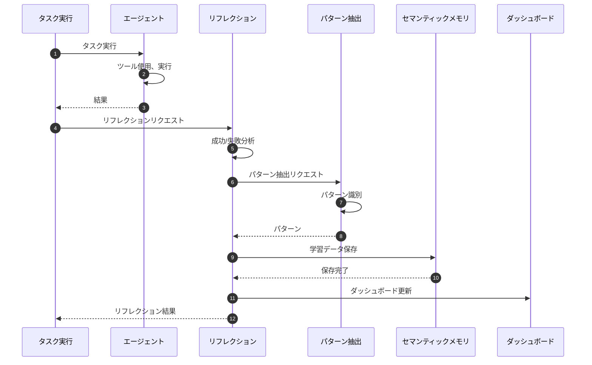
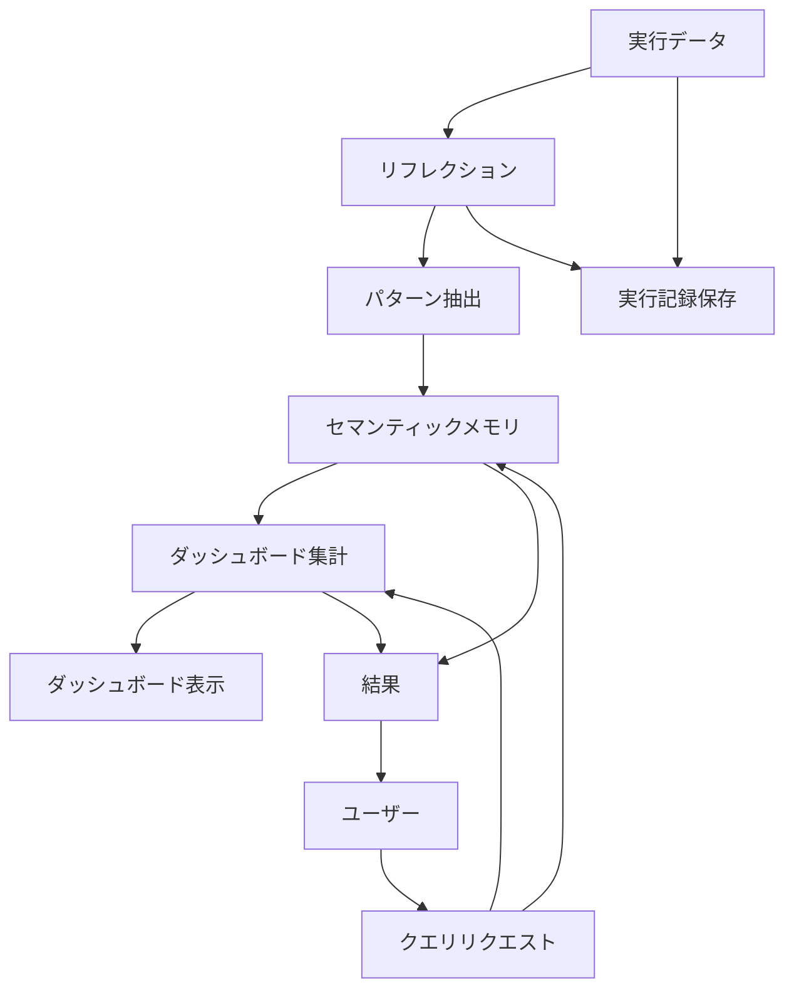

# Self-Improvement System

> パンくず: [Home](../../README.md) > [User Guide](../README.md) > Self-Improvement System

## 概要

自己改善システムは、エージェントが自身の実行経験から学習し、時間の経過とともに改善する仕組みを提供します。

- **自動リフレクション**: エージェントが自身のパフォーマンスを分析
- **パターン認識**: 成功パターンと失敗パターンを識別
- **経験再生**: 過去の実行から学習
- **継続的改善**: 学んだ教訓を将来のタスクに適用

### コンポーネント

1. **自己改善リフレクション** (`.pi/extensions/self-improvement-reflection.ts`)
2. **自己改善ダッシュボード** (`.pi/extensions/self-improvement-dashboard.ts`)
3. **自己改善データプラットフォーム** (`.pi/extensions/self-improvement-data-platform.ts`)
4. **セマンティックメモリ** (`.pi/lib/semantic-memory.ts`)
5. **パターン抽出** (`.pi/lib/pattern-extraction.ts`)

## リフレクションシステム

### 仕組み

```
┌─────────────┐
│   タスク     │
│  実行       │
└──────┬──────┘
       │
       ▼
┌─────────────┐     ┌──────────────────┐
│   結果      │────▶│  自己リフレクション  │
└─────────────┘     └────────┬─────────┘
                             │
                             ▼
                    ┌─────────────────┐
                    │  分析と学習      │
                    └────────┬────────┘
                             │
                             ▼
                    ┌─────────────────┐
                    │  将来のタスク    │
                    │  に適用         │
                    └─────────────────┘
```

### トリガー条件

リフレクションは以下のタイミングで実行されます:

- タスク完了時（成功・失敗問わず）
- エージェントチーム実行後
- サブエージェント実行後
- 明示的なリフレクションリクエスト

### リフレクション指標

```typescript
interface ReflectionMetrics {
  taskSuccessRate: number;        // 直近Nタスクの成功率
  averageCompletionTime: number;   // 平均完了時間
  commonErrorPatterns: string[];  // 再発するエラーパターン
  successfulPatterns: string[];   // 成功アプローチ
  delegationEffectiveness: number; // 委任の有効性
}
```

## ダッシュボード

### ダッシュボードの表示

```bash
# 自己改善ダッシュボードを開く
pi self-improvement-dashboard
```

### ダッシュボード指標

1. **全体パフォーマンス**
   - 完了タスク数
   - 成功率
   - 平均完了時間

2. **学習トレンド**
   - 時系列の成功率
   - パフォーマンス改善
   - パターン認識精度

3. **エージェント固有データ**
   - エージェントごとのパフォーマンス
   - エージェントの強みプロファイル
   - 特定された弱点

### ダッシュボードビュー

```typescript
// プログラムでダッシュボードデータを取得
const dashboardData = await get_self_improvement_dashboard();

/*
{
  overview: {
    totalTasks: 1234,
    successRate: 0.87,
    averageTime: 45.2
  },
  trends: [
    { date: "2026-02-20", successRate: 0.82 },
    { date: "2026-02-21", successRate: 0.84 },
    { date: "2026-02-22", successRate: 0.85 },
    { date: "2026-02-23", successRate: 0.86 },
    { date: "2026-02-24", successRate: 0.87 }
  ],
  agents: {
    "code-reviewer": {
      tasks: 234,
      successRate: 0.92,
      averageTime: 12.3
    },
    "implementer": {
      tasks: 567,
      successRate: 0.85,
      averageTime: 38.5
    }
  },
  patterns: {
    successful: [
      "code_searchの前にfile_candidatesを使用",
      "大規模タスクはDAGに分解して並列実行"
    ],
    errors: [
      "バイナリファイルの読み取りを試みる",
      "委任時のコンテキスト不足"
    ]
  }
}
*/
```

## データプラットフォーム

### ストレージ

すべての自己改善データは `.pi/data/self-improvement/` に保存されます:

```
.pi/data/self-improvement/
├── executions/          # 実行記録
├── reflections/         # リフレクション結果
├── patterns/            # 識別されたパターン
├── embeddings/          # セマンティック埋め込み
└── dashboard.json      # 集計ダッシュボードデータ
```

### クエリ

```typescript
// 過去の実行をクエリ
const executions = await query_executions({
  agentId: "code-reviewer",
  since: "2026-02-20",
  minSuccessRate: 0.9
});

// パターンをクエリ
const patterns = await query_patterns({
  type: "successful",
  category: "code-review"
});

// セマンティック類似性でクエリ
const similar = await query_similar_executions({
  query: "authentication token validation",
  topK: 5
});
```

## 使用例

### 例1: 自己改善を有効化

```typescript
// サブエージェントのリフレクションを有効化
await subagent_run({
  subagentId: "code-reviewer",
  task: "認証モジュールをレビュー",
  config: {
    selfImprovement: {
      enabled: true,
      reflectionLevel: "detailed"
    }
  }
});
```

### 例2: リフレクション結果を表示

```typescript
const reflection = await get_reflection({
  runId: "run-abc123"
});

console.log(reflection.analysis);
/*
{
  outcome: "success",
  metrics: {
    completionTime: 34.2,
    tokenUsage: 1234,
    toolCalls: 8
  },
  insights: [
    "検索ツールを効果的に使用してコードを特定",
    "並列サブエージェント委任で改善可能"
  ],
  learnings: [
    "100ファイル超のコードレビューではagent-teamを使用",
    "ここではシンボル検索がコード検索より正確"
  ]
}
*/
```

### 例3: 学習パターンを適用

```typescript
// システムは学習したパターンを自動的に適用
// また、明示的にパターンベースの実行をリクエスト可能

await subagent_run({
  subagentId: "researcher",
  task: "決済システムを分析",
  config: {
    useLearnedPatterns: true,
    patternThreshold: 0.8  // 信頼度0.8以上のパターンのみ使用
  }
});
```

## 結果の解釈

### 成功トレンド

```
成功率
100% |                     *
 90% |                   *   *
 80% |                 *       *
 70% |               *           *
     +------------------------------------
       Feb 20  21  22  23  24  25
```

**上昇トレンド**: 学習が機能していることを示します。

**平坦化**: 新しい戦略が必要な可能性があります。

**低下**: 最近の変更やタスク複雑度を調査してください。

### パターン信頼度

パターンには信頼度スコア（0-1）があります:

- **0.9-1.0**: 非常に信頼性が高く、常に適用すべき
- **0.7-0.9**: 信頼性が高く、使用を推奨
- **0.5-0.7**: 暫定的、コンテキストを考慮すべき
- **< 0.5**: 信頼性が低く、注意して使用

### エージェント推奨

```typescript
// タスクに対する推奨を取得
const recommendations = await get_agent_recommendations({
  taskType: "code-review",
  taskSize: "large"
});

/*
{
  recommendedAgent: "agent_team_code-review-team",
  confidence: 0.92,
  reason: "大規模コードレビューは複数視点で実行すべき",
  alternativeAgents: [
    { agentId: "code-reviewer", confidence: 0.75 },
    { agentId: "design-discovery-team", confidence: 0.60 }
  ]
}
*/
```

## シーケンス図

### リフレクションフロー



### ダッシュボードデータフロー



## 設定

### 自己改善設定

```typescript
// .pi/config.json
{
  "selfImprovement": {
    "enabled": true,
    "reflectionLevel": "detailed",  // "minimal" | "standard" | "detailed"
    "patternThreshold": 0.7,
    "dashboardRefreshInterval": 60,  // 秒
    "dataRetentionDays": 90
  }
}
```

### 環境変数

```bash
# 自己改善機能の有効化
PI_SELF_IMPROVEMENT_ENABLED=true

# リフレクションレベル
PI_REFLECTION_LEVEL=detailed

# データ保存パス
PI_SELF_IMPROVEMENT_DATA_PATH=~/.pi/self-improvement

# データ保持期間（日）
PI_SELF_IMPROVEMENT_RETENTION_DAYS=90
```

## トラブルシューティング

### よくある問題

| 問題 | 原因 | 解決策 |
|------|------|--------|
| ダッシュボードが空 | 実行データなし | タスクを実行してデータ収集 |
| パターンが表示されない | 実行回数不足 | さらにタスクを実行 |
| 学習が反映されない | パターン信頼度低 | パターン閾値を調整 |

### データのリセット

```bash
# すべての自己改善データをリセット
pi self-improvement reset --all

# 特定エージェントのデータのみリセット
pi self-improvement reset --agent code-reviewer
```

---

## 関連トピック

- [拡張機能概要](./01-extensions.md) - 全拡張機能の一覧
- [self-improvementスキル](../../.pi/skills/self-improvement/SKILL.md) - 自己改善のスキル定義
- [自己反省](../../.pi/skills/self-reflection/SKILL.md) - 自己反省の手続き

## 次のトピック

[→ DAG実行](./18-dag-execution.md)
