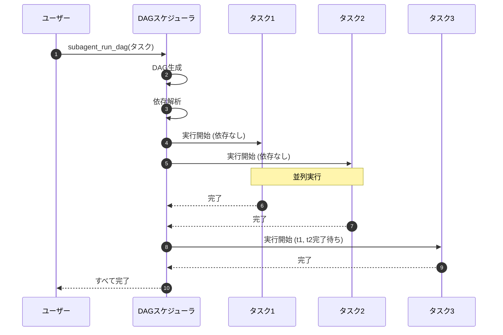
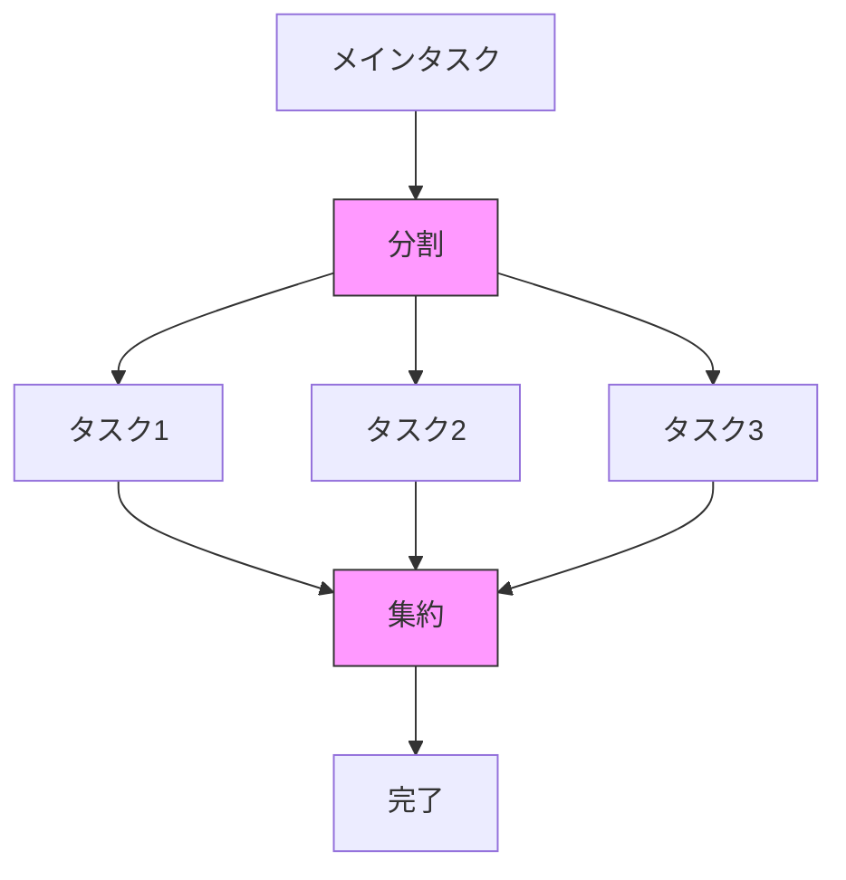

# DAG Execution

> パンくず: [Home](../../README.md) > [User Guide](../README.md) > DAG Execution

## 概要

DAG（有向非巡回グラフ）実行は、インテリジェントな並列タスク実行を可能にします。

- **自動分解**: タスクをサブタスクに分解
- **依存管理**: 正しい順序でタスクを実行
- **並列実行**: 独立したタスクを同時に実行
- **重みベーススケジューリング**: 重要なタスクを優先

### いつDAG実行を使用すべきか

- 複雑なマルチステップタスク
- 明確なサブタスク依存関係があるタスク
- 並列実行で時間を節約できるシナリオ
- 実行の細かい制御が必要な場合

## DAG生成

### 自動DAG作成

```typescript
await subagent_run_dag({
  subagentId: "researcher",
  task: "コードベース全体を分析: アーキテクチャ、パターン、潜在的な問題",
  config: {
    maxParallelTasks: 5,
    taskTimeout: 300
  }
});
```

### DAG構造

```
         [アーキテクチャ分析]
                  │
         ┌────────┼────────┐
         │        │        │
    [Core]   [Utils]   [API]
         │        │        │
         └────────┼────────┘
                  │
         [レポート生成]
```

### DAG表現

```typescript
interface DAGTask {
  id: string;
  name: string;
  description: string;
  dependencies: string[];  // このタスクが依存するタスクID
  weight: number;          // 重要度/優先度
  estimatedTime: number;   // 見込み完了時間
}

interface DAG {
  tasks: DAGTask[];
  executionOrder: string[][];  // 並列実行可能なタスクのレベル
}
```

## DAGパターン

### Fan-outパターン

複数の独立したタスクを並列に実行します。

```
[メインタスク]
     │
     ├─────────┬─────────┬─────────┐
     │         │         │         │
 [タスク1]  [タスク2]  [タスク3]  [タスク4]
     │         │         │         │
     └─────────┴─────────┴─────────┘
               │
         [集計]
```

**例**: 複数のコードモジュールを独立して分析。

```typescript
await subagent_run_dag({
  subagentId: "code-analyzer",
  task: "全モジュールを分析: core, utils, api, auth, ui",
  dagConfig: {
    pattern: "fan-out",
    fanOutCount: 5
  }
});
```

### Fan-inパターン

結果を最終タスクにフィードする複数のタスクを実行します。

```
[タスク1]     [タスク2]     [タスク3]
     │            │            │
     └────────────┴────────────┘
                  │
          [結果の集約]
```

**例**: 複数のソースから情報を収集し、統合します。

```typescript
await subagent_run_dag({
  subagentId: "researcher",
  task: "ドキュメント、コード、例から認証パターンを研究し、ガイドを作成",
  dagConfig: {
    pattern: "fan-in"
  }
});
```

### Diamondパターン

分岐して再結合します。

```
    [A]
     │
   [B] [C]
     │   │
    [D] [E]
     │   │
    [F]   │
     └───┘
      [G]
```

**例**: 複雑なマルチステップ分析。

```typescript
await subagent_run_dag({
  subagentId: "analyst",
  task: "パフォーマンス問題を分析: メトリクス、ログ、コード、ボトルネック、レポート",
  dagConfig: {
    pattern: "diamond"
  }
});
```

## 使用例

### 例1: コードベース分析

```typescript
const result = await subagent_run_dag({
  subagentId: "researcher",
  task: "コードベース全体を分析: アーキテクチャ、パターン、依存関係、潜在的な問題",
  config: {
    maxParallelTasks: 8,
    timeout: 600
  }
});

console.log(result.dagStructure);
/*
{
  tasks: [
    { id: "t1", name: "アーキテクチャ分析", dependencies: [], weight: 1.0 },
    { id: "t2", name: "パターン分析", dependencies: [], weight: 0.8 },
    { id: "t3", name: "依存関係分析", dependencies: [], weight: 0.7 },
    { id: "t4", name: "問題特定", dependencies: ["t1", "t2", "t3"], weight: 0.9 }
  ],
  executionOrder: [
    ["t1", "t2", "t3"],  // レベル1: 並列実行
    ["t4"]               // レベル2: レベル1完了後
  ]
}
*/
```

### 例2: マルチファイル処理

```typescript
await subagent_run_dag({
  subagentId: "implementer",
  task: "すべてのサービスを新しいエラーハンドリングパターンにリファクタリング",
  dagConfig: {
    filePattern: "src/services/*.ts",
    taskPerFile: true,
    maxParallelTasks: 10
  }
});
```

### 例3: カスタムDAG

```typescript
// カスタムDAG構造を定義
const customDAG: DAG = {
  tasks: [
    { id: "gather", name: "要件収集", dependencies: [], weight: 1.0 },
    { id: "design", name: "ソリューション設計", dependencies: ["gather"], weight: 0.9 },
    { id: "implement", name: "実装", dependencies: ["design"], weight: 1.0 },
    { id: "test", name: "テスト", dependencies: ["implement"], weight: 0.8 },
    { id: "document", name: "ドキュメント化", dependencies: ["implement"], weight: 0.7 }
  ],
  executionOrder: [
    ["gather"],
    ["design"],
    ["implement"],
    ["test", "document"]
  ]
};

await subagent_run_dag({
  subagentId: "implementer",
  task: "新機能を構築",
  dag: customDAG
});
```

## DAG内のエラーハンドリング

### エラー伝播

デフォルトでは、タスク内のエラーにより依存タスクの実行が阻止されます。

```
[A] → [B] → [C]
       ✗ (エラー)
       │
       ▼
   [Cがブロック]
```

### エラーハンドリング戦略

**1. エラー時も継続**
```typescript
await subagent_run_dag({
  subagentId: "researcher",
  task: "複数モジュールを分析",
  config: {
    errorHandling: "continue",  // 他のタスクは継続
    failOnFirstError: false
  }
});
```

**2. 失敗タスクをリトライ**
```typescript
await subagent_run_dag({
  subagentId: "implementer",
  task: "複数ファイルを処理",
  config: {
    retryStrategy: {
      maxRetries: 3,
      backoffMs: 1000
    }
  }
});
```

**3. エラーコールバック**
```typescript
await subagent_run_dag({
  subagentId: "researcher",
  task: "コードベースを分析",
  config: {
    onError: async (taskId, error) => {
      console.error(`タスク ${taskId} が失敗:`, error);
      // エラーをログ、実行を継続
    }
  }
});
```

## ベストプラクティス

### 1. タスクの粒度

```typescript
// ❌ 粒度が細かすぎる（オーバーヘッドが大きい）
await subagent_run_dag({
  task: "すべてのファイルを読み込んで行数をカウント"
});

// ✅ 適切な粒度
await subagent_run_dag({
  task: "各モジュールを分析: コード品質、パターン、依存関係",
  dagConfig: {
    taskPerModule: true
  }
});
```

### 2. 依存管理

```typescript
// ❌ 不要な依存（並列性が低下）
{
  tasks: [
    { id: "t1", dependencies: [] },
    { id: "t2", dependencies: ["t1"] },  // 不要!
    { id: "t3", dependencies: ["t1", "t2"] }
  ]
}

// ✅ 最小限の依存（並列性が最大化）
{
  tasks: [
    { id: "t1", dependencies: [] },
    { id: "t2", dependencies: [] },  // 独立!
    { id: "t3", dependencies: ["t1", "t2"] }  // 両方を待機
  ]
}
```

### 3. タイムアウト

```typescript
// タスク複雑度に応じて適切なタイムアウトを設定
await subagent_run_dag({
  subagentId: "researcher",
  task: "大規模コードベースを分析",
  config: {
    taskTimeout: 300,      // タスクごとのタイムアウト
    overallTimeout: 3600   // DAG全体のタイムアウト
  }
});
```

### 4. モニタリング

```typescript
// DAG実行をリアルタイムでモニタリング
const runId = await subagent_run_dag({ /* ... */ });

// ステータスを確認
const status = await subagent_status({ runId });
console.log(status.dagProgress);
/*
{
  completed: 5,
  total: 10,
  currentTasks: ["t6", "t7", "t8"],
  elapsedTime: 123.4
}
*/
```

## シーケンス図

### DAG実行フロー



### Fan-outパターン



## 設定

### DAG設定

```typescript
// .pi/config.json
{
  "dagExecution": {
    "enabled": true,
    "maxParallelTasks": 8,
    "defaultTaskTimeout": 300,
    "defaultOverallTimeout": 3600,
    "retryStrategy": {
      "maxRetries": 3,
      "backoffMs": 1000,
      "backoffMultiplier": 2
    },
    "errorHandling": "fail-fast"  // "fail-fast" | "continue" | "continue-on-dependency-failure"
  }
}
```

### 環境変数

```bash
# DAG実行の有効化
PI_DAG_EXECUTION_ENABLED=true

# 最大並列タスク数
PI_DAG_MAX_PARALLEL=8

# デフォルトタスクタイムアウト（秒）
PI_DAG_TASK_TIMEOUT=300

# DAG全体タイムアウト（秒）
PI_DAG_OVERALL_TIMEOUT=3600
```

## トラブルシューティング

### よくある問題

| 問題 | 原因 | 解決策 |
|------|------|--------|
| タスクが実行されない | 依存ループ | DAG構造を確認、循環依存を削除 |
| 並列実行されない | 依存関係が多い | 不要な依存を削除 |
| タイムアウト頻発 | タスクが大きすぎる | タスクをより小さく分解 |

### DAGの検証

```typescript
// DAG構造を検証
const validation = await validate_dag({ dag: myDAG });

/*
{
  valid: false,
  errors: [
    "タスク t5 に循環依存があります",
    "タスク t7 に未定義の依存 t99 があります"
  ],
  warnings: [
    "タスク t3 の依存が多すぎる（並列性が低下）"
  ]
}
*/
```

---

## 関連トピック

- [拡張機能概要](./01-extensions.md) - 全拡張機能の一覧
- [task-plannerスキル](../../.pi/skills/task-planner/SKILL.md) - タスク計画のスキル定義
- [サブエージェント](./08-subagents.md) - サブエージェント実行

## 次のトピック

[→ ライブモニタリング](./19-live-monitoring.md)
