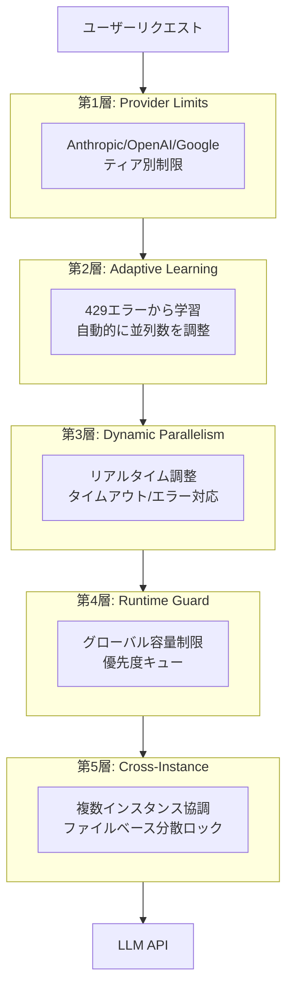
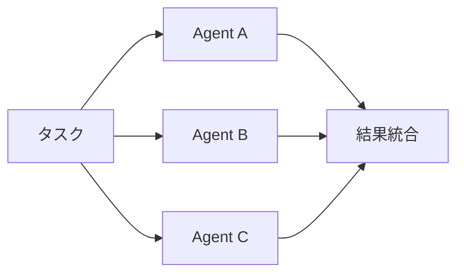
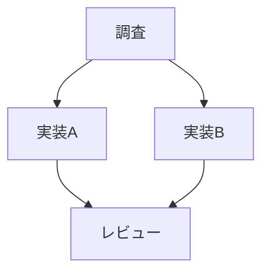
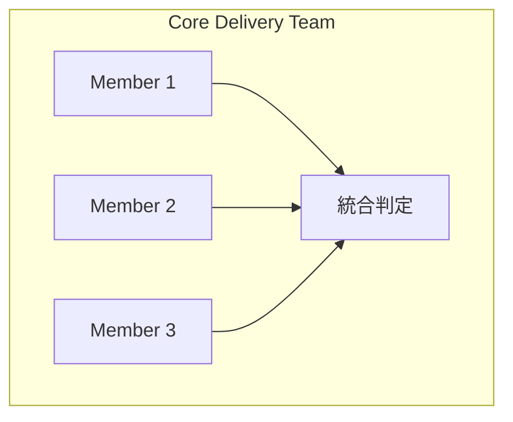
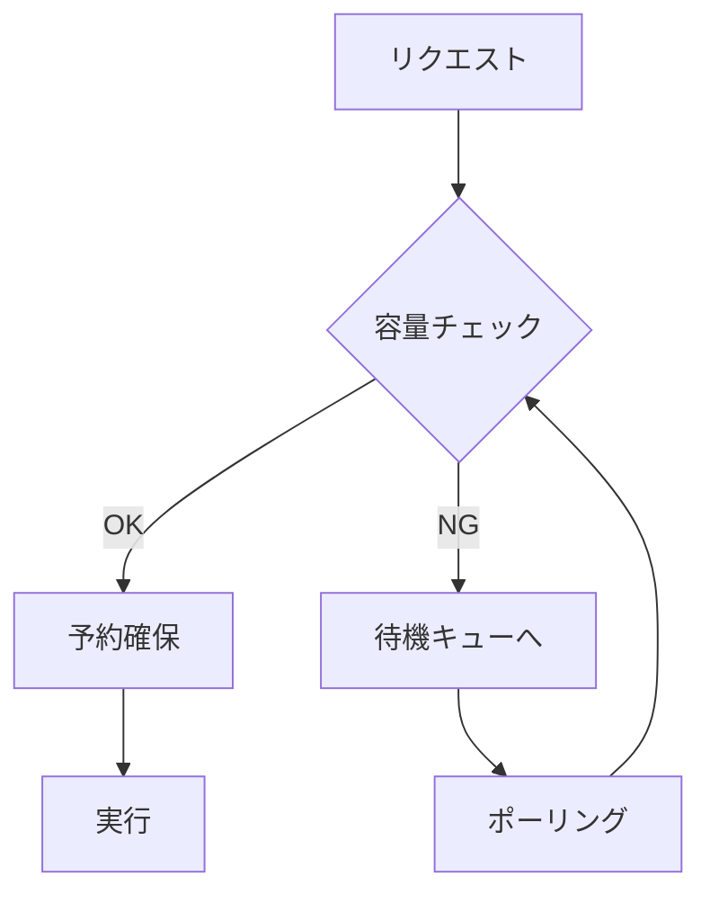
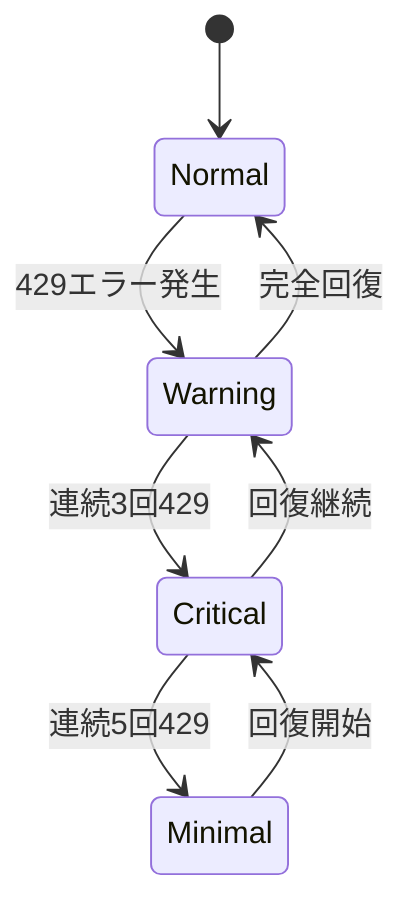
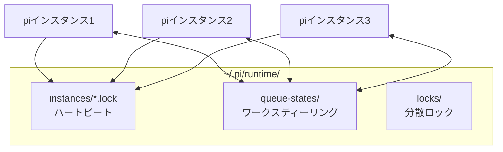
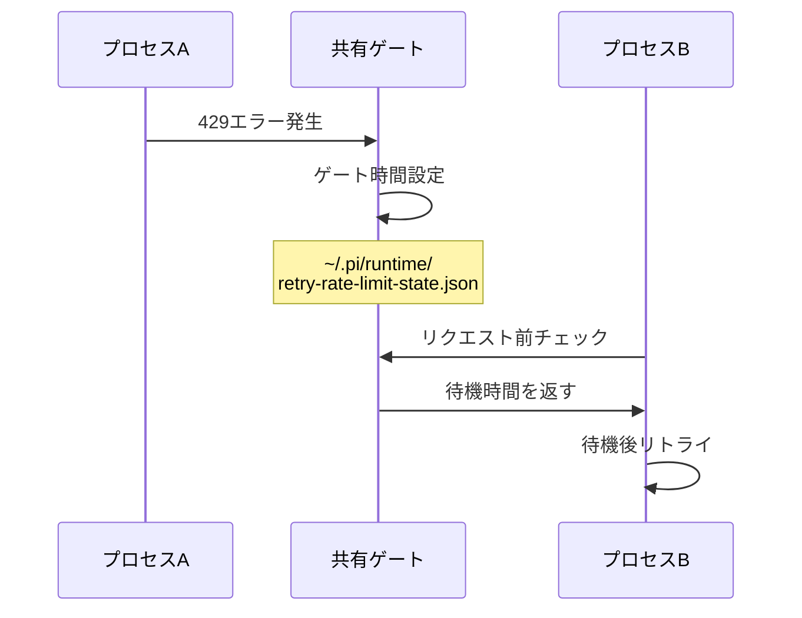

# 並列LLM呼び出しアーキテクチャ

> パンくず: [Home](../../README.md) > [ユーザーガイド](../README.md#ユーザーガイド) > 並列LLM呼び出しアーキテクチャ

## 目次

- [概要：5層の防御システム](#概要5層の防御システム)
- [並列実行パターン](#並列実行パターン)
  - [Fan-out（並列実行）](#fan-out並列実行)
  - [DAG/Diamond（依存関係あり）](#dagdiamond依存関係あり)
  - [Team並列（エージェントチーム）](#team並列エージェントチーム)
- [並列数制御の工夫](#並列数制御の工夫)
  - [Runtime Load Guard](#runtime-load-guard)
  - [動的並列数計算](#動的並列数計算)
- [レート制限への対応](#レート制限への対応)
  - [学習アルゴリズム](#学習アルゴリズム)
  - [予測的スロットリング](#予測的スロットリング)
- [クロスインスタンス協調](#クロスインスタンス協調)
  - [アーキテクチャ](#アーキテクチャ)
  - [並列数分配](#並列数分配)
  - [分散ロック（TOCTOU安全）](#分散ロックtoctou安全)
- [エラー処理とリトライ](#エラー処理とリトライ)
  - [指数バックオフ](#指数バックオフ)
  - [共有レート制限ゲート](#共有レート制限ゲート)
  - [エラー分類](#エラー分類)
- [設定方法](#設定方法)
  - [環境変数](#環境変数)
  - [プロファイル](#プロファイル)
  - [プロバイダ制限のカスタマイズ](#プロバイダ制限のカスタマイズ)

---

## 概要：5層の防御システム

piは、LLM APIのレート制限に対して5層の防御システムを備えています。各層が独立して動作し、単一障害点を防ぐ設計になっています。



### 各層の役割

| 層 | 役割 | 説明 |
|----|------|------|
| 第1層 | Provider Limits | プロバイダ/モデルごとの既定制限を適用 |
| 第2層 | Adaptive Learning | 429エラーから学習し、並列数を自動調整 |
| 第3層 | Dynamic Parallelism | タイムアウトやエラーにリアルタイム対応 |
| 第4層 | Runtime Guard | グローバルな容量制限と優先度キューを管理 |
| 第5層 | Cross-Instance | 複数のpiインスタンス間で協調 |

**重要**: デフォルト設定で十分に動作します。詳細を理解せずとも、piは自動的に最適な並列数を維持します。

---

## 並列実行パターン

piは3つの並列実行パターンをサポートしています。タスクの性質に応じて使い分けてください。

### Fan-out（並列実行）

依存関係のないタスクを同時実行するパターンです。



**コード例**:

```typescript
// 複数のエージェントを並列実行
const results = await subagent_run_parallel(
  ["researcher", "analyst", "fact-checker"],
  { task: "市場調査を実施" }
);
```

**特徴**:
- 依存関係のないタスクを同時実行
- DynTaskMASによる優先度スケジューリング
- デフォルト並列数: 4

### DAG/Diamond（依存関係あり）

依存関係を持つタスクをDAG（有向非巡回グラフ）として実行するパターンです。



**コード例**:

```typescript
// 依存関係を自動検出してDAG実行
const result = await subagent_run_dag({
  task: "機能を実装してテストを追加",
  autoGenerate: true,  // 依存関係を自動推論
  maxConcurrency: 3
});
```

**依存関係ルール**:

| エージェント | 依存先 | 理由 |
|-------------|--------|------|
| `implementer` | `researcher` | 調査結果が実装に必要 |
| `reviewer` | `implementer` | 実装後にレビュー |
| `tester` | `implementer` | 実装後にテスト |

### Team並列（エージェントチーム）

エージェントチームを使った並列実行パターンです。



**コード例**:

```typescript
const result = await agent_team_run({
  teamId: "core-delivery-team",
  task: "アーキテクチャを設計",
  strategy: "parallel"
});
```

---

## 並列数制御の工夫

### Runtime Load Guard

グローバルな容量制限を管理し、優先度キューでリクエストを制御します。



**優先度キュー**:

| クラス | 優先度 | 用途 |
|--------|--------|------|
| interactive | critical, high | ユーザー対話 |
| standard | normal | 通常タスク |
| batch | low, background | バックグラウンド |

**飢餓防止**: 60秒待機で自動的に優先度昇格

### 動的並列数計算

実効並列数は以下の式で計算されます：

```typescript
// 実効並列数の計算式
effectiveParallelism = 
  baselineParallelism *           // ベースライン（デフォルト4）
  adaptivePenaltyFactor *          // 429学習によるペナルティ
  crossInstanceFactor;             // 他インスタンスとの分配
```

---

## レート制限への対応

### 学習アルゴリズム

429エラーから学習し、並列数を動的に調整します。



**調整ルール**:

| 状況 | アクション |
|------|-----------|
| 429エラー | 並列数を30%削減 |
| 連続3回429 | 追加で50%削減 |
| 連続5回429 | 最小値（1）に設定 |
| 2分間+成功 | 5%ずつ回復 |

### 予測的スロットリング

429エラーが発生する前に、確率に基づいて事前に制限をかけます。

```typescript
// 429確率が15%を超えたら事前に制限
if (probability > 0.15) {
  const reductionFactor = 1 - probability * 0.5;
  recommendedConcurrency = Math.floor(current * reductionFactor);
}
```

**確率計算の重み**:

| 期間 | 重み |
|------|------|
| 直近10分 | 40% |
| 直近30分 | 15% |
| 直近1時間 | 5% |
| 連続429回数 | 20% |

---

## クロスインスタンス協調

### アーキテクチャ

複数のpiプロセスが協調して動作するための仕組みです。



### 並列数分配

インスタンス数で並列数を均等分割します。

```typescript
// インスタンス数で均等分割
const contendingCount = getContendingInstanceCount();
const myLimit = Math.floor(totalMaxLlm / contendingCount);

// ワークロードベースの動的分配
const myShare = (1 / (myPending + 1)) / totalInverseWorkload;
const dynamicLimit = Math.round(totalMaxLlm * myShare);
```

### 分散ロック（TOCTOU安全）

競合状態を防ぐため、原子的なファイル操作を使用します。

```typescript
// 原子的取得: O_EXCLフラグで競合状態を防止
const fd = openSync(lockFile, "wx");  // 排他作成
writeSync(fd, JSON.stringify(lock));
```

---

## エラー処理とリトライ

### 指数バックオフ

リトライ時の待機時間を指数関数的に増加させます。

```typescript
// バックオフ遅延の計算
delay = initialDelayMs * multiplier^(attempt-1)
// 例: 1000ms * 2^2 = 4000ms (3回目)

// ジッターで同期化を防止
// - full: random(0, delay)
// - partial: random(delay/2, delay)
// - none: delay（stableプロファイル）
```

### 共有レート制限ゲート

プロセス間でレート制限情報を共有し、無駄なリトライを防ぎます。



**ゲート遅延**: `baseDelay * 2^(hits-1)`, 最大120秒

### エラー分類

圧力エラー（pressure error）を分類し、適切に対処します。

```typescript
// 圧力エラーの分類
classifyPressureError(error):
  "429" / "rate limit" → rate_limit
  "timeout" / "timed out" → timeout
  "capacity" / "overload" → capacity
  cancelled → cancelled
  その他 → other
```

---

## 設定方法

### 環境変数

| 変数 | 説明 | デフォルト |
|------|------|-----------|
| `PI_AGENT_MAX_TOTAL_LLM` | グローバルLLM並列数上限 | 12 |
| `PI_AGENT_MAX_PARALLEL_SUBAGENTS` | サブエージェント並列数 | 4 |
| `PI_AGENT_MAX_TOTAL_REQUESTS` | 総リクエスト数上限 | 16 |
| `PI_AGENT_CAPACITY_WAIT_MS` | 容量確保最大待機時間 | 60000 |
| `PI_AGENT_CAPACITY_POLL_MS` | 容量ポーリング間隔 | 1000 |
| `PI_ENABLE_PREEMPTION` | タスク先取り有効 | true |
| `PI_PROVIDER_TIER` | プロバイダティア上書き | - |
| `PI_STABLE_RUNTIME_PROFILE` | 安定プロファイル使用 | false |

### プロファイル

```bash
# 安定プロファイル（決定的動作）
PI_STABLE_RUNTIME_PROFILE=true

# デバッグモード
PI_DEBUG_CONCURRENCY=1
PI_DEBUG_DYNAMIC_PARALLELISM=1
```

### プロバイダ制限のカスタマイズ

```json
// ~/.pi/runtime/provider-limits.json
{
  "anthropic": {
    "claude-sonnet-4-*": {
      "rpm": 1000,
      "tpm": 80000,
      "concurrency": 5
    }
  }
}
```

---

## 関連トピック

- [サブエージェント](./15-subagents.md) - サブエージェントの基本的な使い方
- [エージェントチーム](./16-agent-teams.md) - エージェントチームの設定と実行
- [DAG実行ガイド](../../.pi/APPEND_SYSTEM.md#dag-execution-guide-recommended) - DAG実行の詳細

## 次のトピック

[→ 設定リファレンス](../03-reference/README.md)
