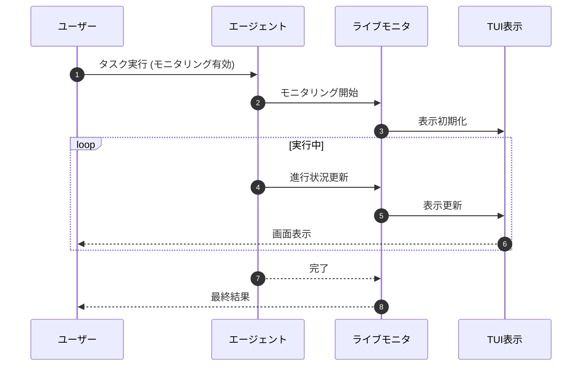
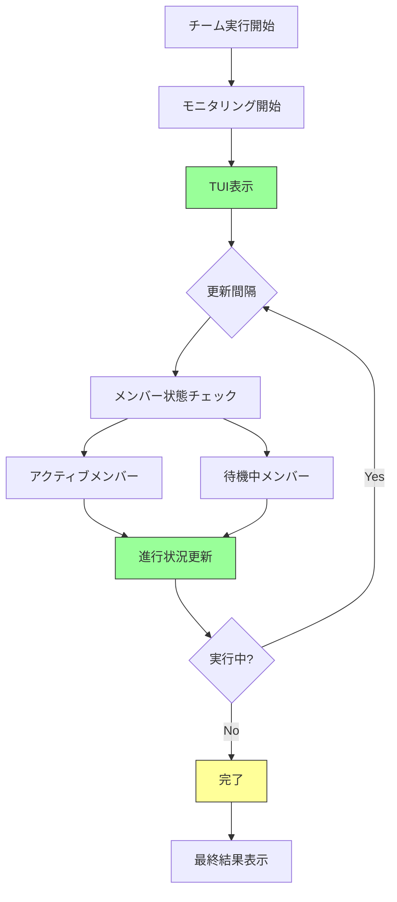

# Live Monitoring

> パンくず: [Home](../../README.md) > [User Guide](../README.md) > Live Monitoring

## 概要

ライブモニタリングは、エージェントとチームの実行に対するリアルタイムの可視化を提供します。

- **リアルタイム更新**: 進行状況をリアルタイムで確認
- **TUI表示**: ターミナルベースの視覚化
- **エージェントステータス**: 個別エージェントの状態を追跡
- **チームオーケストレーション**: マルチエージェントワークフローをモニタリング

## TUI表示

### サブエージェントライブモニタ

```
┌─────────────────────────────────────────────────────────┐
│ SUBAGENT: code-reviewer                    Run: #1234    │
├─────────────────────────────────────────────────────────┤
│ Status: In Progress                                     │
│ Progress: ████████████░░░░░░░  60%                      │
│                                                          │
│ Current Task: 認証モジュールを分析中                    │
│ Elapsed: 00:02:34    Est. Remaining: 00:01:30          │
│                                                          │
│ Tools Used:                                              │
│   • file_candidates          (2.1s)                      │
│   • code_search              (1.8s)                      │
│   • read                     (5.2s)                      │
│                                                          │
│ Token Usage: 1,234 / 5,000                              │
└─────────────────────────────────────────────────────────┘
```

### エージェントチームライブモニタ

```
┌─────────────────────────────────────────────────────────┐
│ TEAM: core-delivery-team                    Run: #5678    │
├─────────────────────────────────────────────────────────┤
│ Round: 3 / 5                                           │
│                                                          │
│ Active Agents: 4 / 6                                    │
│                                                          │
│ [✓] researcher        2.1s  要件を分析中             │
│ [✓] architect         3.4s  設計プランを作成         │
│ [▶] implementer      12.3s  機能を実装中...           │
│ [▶] tester           5.7s  テストを記述中...           │
│ [ ] reviewer         --    待機中                   │
│ [ ] doc-writer       --    待機中                   │
│                                                          │
│ Messages Exchanged: 7                                   │
│ Overall Progress: ████████░░░░░░░  40%                  │
└─────────────────────────────────────────────────────────┘
```

## リアルタイム指標

### サブエージェント指標

```typescript
interface SubagentLiveMetrics {
  runId: string;
  subagentId: string;
  status: "pending" | "running" | "completed" | "failed";
  progress: number;  // 0-1
  currentTask?: string;
  elapsedTime: number;  // 秒
  estimatedRemaining?: number;  // 秒
  tokenUsage: {
    input: number;
    output: number;
    total: number;
  };
  toolsUsed: Array<{
    name: string;
    duration: number;
    success: boolean;
  }>;
}
```

### チーム指標

```typescript
interface TeamLiveMetrics {
  runId: string;
  teamId: string;
  round: number;
  totalRounds: number;
  activeMembers: number;
  totalMembers: number;
  memberStatus: Array<{
    agentId: string;
    status: string;
    currentTask?: string;
    elapsedTime: number;
  }>;
  messageCount: number;
  overallProgress: number;
}
```

## 使用例

### 例1: サブエージェント実行をモニタリング

```bash
# サブエージェントのライブモニタリングを有効化
PI_LIVE_MONITOR=true subagent_run({
  subagentId: "code-reviewer",
  task: "コードベース全体をレビュー"
})

# ライブモニタが自動的に開始
# 'q'を押して終了
```

### 例2: チーム実行をモニタリング

```bash
# エージェントチームのライブモニタリングを有効化
PI_LIVE_MONITOR=true agent_team_run({
  teamId: "core-delivery-team",
  task: "新しい認証システムを実装",
  strategy: "sequential"
})

# 全チームメンバーをリアルタイムで確認
```

### 例3: プログラムによるモニタリング

```typescript
// サブエージェント実行のライブ指標を取得
const metrics = await get_subagent_live_metrics({
  runId: "run-abc123"
});

// 更新をサブスクライブ
const subscription = await subscribe_subagent_updates({
  runId: "run-abc123",
  onUpdate: (metrics) => {
    console.log(`進行状況: ${metrics.progress * 100}%`);
    console.log(`現在のタスク: ${metrics.currentTask}`);
  }
});

// 後でアンサブスクライブ
await unsubscribe_subagent_updates({ runId: "run-abc123" });
```

### 例4: チームモニタリング

```typescript
// チーム実行のライブ指標を取得
const teamMetrics = await get_team_live_metrics({
  runId: "run-xyz789"
});

console.log("アクティブメンバー:", teamMetrics.activeMembers);
teamMetrics.memberStatus.forEach(member => {
  console.log(`  ${member.agentId}: ${member.status}`);
});

// チーム更新をサブスクライブ
await subscribe_team_updates({
  runId: "run-xyz789",
  onUpdate: (metrics) => {
    console.log(`ラウンド: ${metrics.round}/${metrics.totalRounds}`);
    console.log(`進行状況: ${metrics.overallProgress * 100}%`);
  }
});
```

## カスタマイズ

### TUI設定

```typescript
// .pi/config.json
{
  "liveMonitor": {
    "refreshInterval": 500,  // 500msごとに更新
    "showTokenUsage": true,
    "showToolsUsed": true,
    "colorScheme": "dark",
    "showProgress": true,
    "compactMode": false
  }
}
```

### カスタム指標表示

```typescript
// サブスクライブしてカスタム指標を表示
await subscribe_subagent_updates({
  runId: "run-abc123",
  onUpdate: (metrics) => {
    // カスタム表示ロジック
    console.clear();
    console.log(`═════════════════════════════════════════════`);
    console.log(`SUBAGENT: ${metrics.subagentId}`);
    console.log(`Status: ${metrics.status.toUpperCase()}`);
    console.log(`Progress: ${"█".repeat(Math.floor(metrics.progress * 20))}`);
    console.log(`Task: ${metrics.currentTask || "Waiting..."}`);
    console.log(`Time: ${formatTime(metrics.elapsedTime)}`);
    console.log(`Tokens: ${metrics.tokenUsage.total}`);
    console.log(`═════════════════════════════════════════════`);
  }
});
```

## シーケンス図

### モニタリングフロー



### チームモニタリング



## 設定

### モニタリング設定

```typescript
// .pi/config.json
{
  "liveMonitor": {
    "enabled": true,
    "refreshInterval": 500,  // ミリ秒
    "autoStart": false,      // 自動開始
    "showTokenUsage": true,
    "showToolsUsed": true,
    "showProgress": true,
    "colorScheme": "dark",    // "dark" | "light"
    "compactMode": false,
    "columns": {
      "agentId": 20,
      "status": 15,
      "task": 40,
      "time": 10
    }
  }
}
```

### 環境変数

```bash
# ライブモニタリングの有効化
PI_LIVE_MONITOR=true

# 更新間隔（ミリ秒）
PI_LIVE_MONITOR_REFRESH=500

# カラースキーム
PI_LIVE_MONITOR_COLOR_SCHEME=dark

# コンパクトモード
PI_LIVE_MONITOR_COMPACT=false

# 自動開始
PI_LIVE_MONITOR_AUTO_START=false
```

## キーボードショートカット

### TUI操作

| キー | アクション |
|------|-----------|
| `q` | モニタリングを終了 |
| `r` | 表示をリフレッシュ |
| `p` | 進行状況バーの表示/非表示 |
| `t` | トークン使用量の表示/非表示 |
| `h` | ヘルプ表示 |
| `s` | コンパクトモードの切り替え |

## トラブルシューティング

### よくある問題

| 問題 | 原因 | 解決策 |
|------|------|--------|
| 表示が更新されない | リフレッシュ間隔が長い | 更新間隔を短縮 |
| 画面が乱れる | ターミナルサイズが小さい | ターミナルサイズを拡大 |
| モニタが開始されない | 設定が無効 | PI_LIVE_MONITOR=trueを設定 |

### ログ確認

```typescript
// モニタリングログを取得
const logs = await get_monitoring_logs({
  runId: "run-abc123"
});

/*
[
  {
    timestamp: "2026-02-25T02:00:00Z",
    level: "info",
    message: "モニタリング開始"
  },
  {
    timestamp: "2026-02-25T02:00:05Z",
    level: "info",
    message: "進行状況: 20%",
    details: { ... }
  }
]
*/
```

---

## 関連トピック

- [拡張機能概要](./01-extensions.md) - 全拡張機能の一覧
- [サブエージェント](./08-subagents.md) - サブエージェント実行
- [エージェントチーム](./09-agent-teams.md) - エージェントチーム実行

## 次のトピック

[→ メディエータ](./20-mediator.md)
