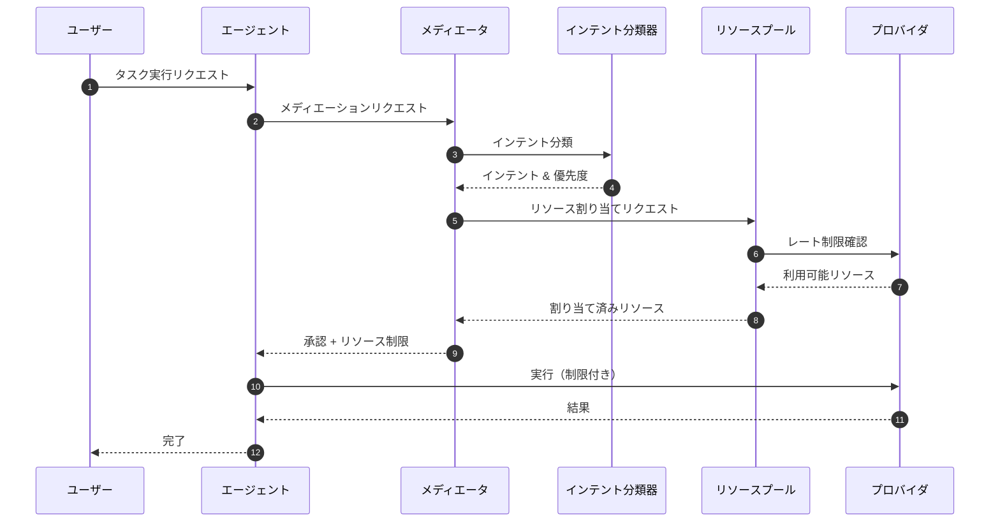
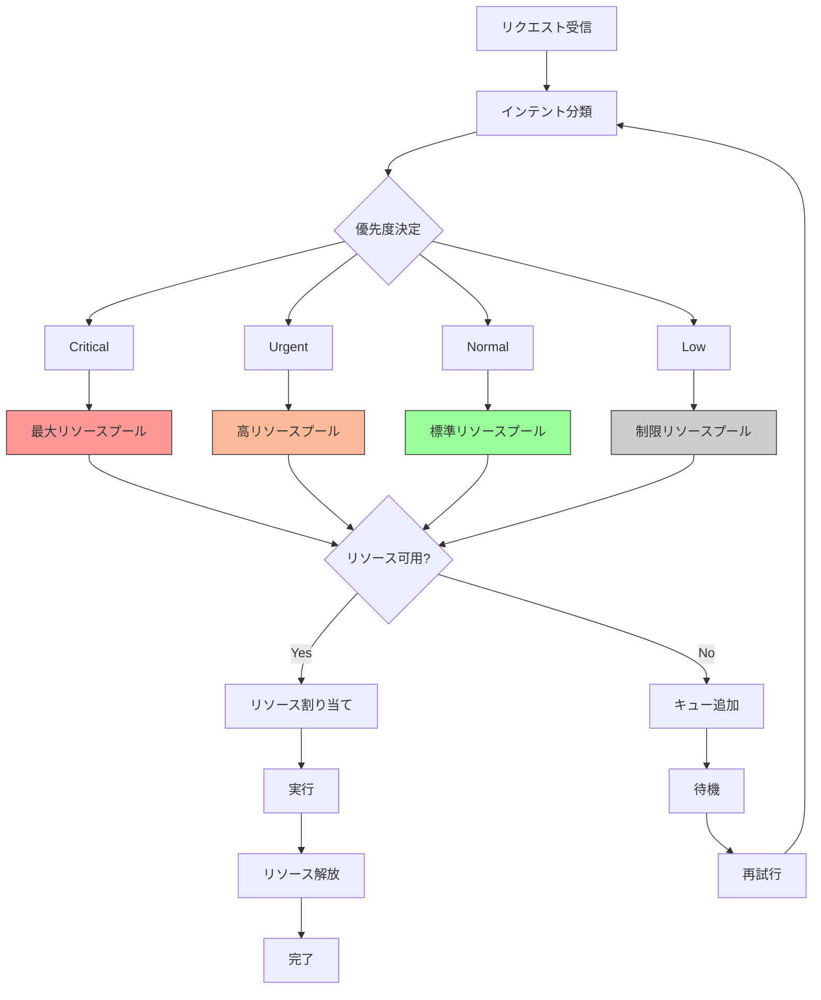

# Mediator

> パンくず: [Home](../../README.md) > [User Guide](../README.md) > Mediator

## 概要

メディエータは、インテントに基づくリソース調整機能を提供します。

- **インテント認識**: 操作の背後にある意図を理解
- **リソース制限**: スマートなリソース割り当て
- **競合解決**: 競合するリクエストを処理
- **公平性**: リソースへの公平なアクセスを保証

## インテントに基づく制限

### 仕組み

```
リクエスト → インテント分析 → リソース割り当て → 実行
                ↓
         [インテント分類器]
           /    |    \
   安全性   緊急度   複雑さ
     ↓        ↓         ↓
  制限調整   優先順位   時間割り当て
```

### インテントタイプ

```typescript
enum IntentType {
  SAFE = "safe",              // 低リスク、通常の制限
  URGENT = "urgent",          // 高優先度、制限緩和
  COMPLEX = "complex",        // 複雑タスク、時間延長
  EXPERIMENTAL = "experimental", // サンドボックス、制限
  CRITICAL = "critical"       // クリティカルパス、最大リソース
}
```

## リソース調整

### 調整対象リソース

1. **レート制限**: プロバイダごとのAPIレート制限
2. **トークン**: 同時操作間のトークン使用量
3. **時間**: 実行時間の割り当て
4. **メモリ**: メモリ使用量の制限

### 調整アルゴリズム

```typescript
interface MediationRequest {
  requestId: string;
  agentId: string;
  intent: IntentType;
  requestedResources: {
    maxTokens: number;
    maxTime: number;
    priority: number;
  };
}

interface MediationResponse {
  approved: boolean;
  allocatedResources: {
    maxTokens: number;
    maxTime: number;
  };
  reason?: string;
}
```

## 使用例

### 例1: インテントに基づく実行

```typescript
// クリティカルタスクが優先度を取得
await subagent_run({
  subagentId: "implementer",
  task: "重大なセキュリティ脆弱性を修正",
  config: {
    mediation: {
      intent: IntentType.CRITICAL,
      priority: 1.0
    }
  }
});
```

### 例2: カスタム調整

```typescript
// チーム実行全体に調整を適用
await agent_team_run({
  teamId: "bug-war-room",
  task: "すべてのクリティカルバグを修正",
  config: {
    mediation: {
      enabled: true,
      defaultIntent: IntentType.URGENT,
      fairDistribution: true
    }
  }
});
```

### 例3: 調整ステータスのクエリ

```typescript
// 現在の調整ステータスを確認
const status = await get_mediation_status();

/*
{
  activeRequests: 3,
  queueDepth: 5,
  averageWaitTime: 2.3,
  resourceUtilization: {
    tokens: 0.75,
    rateLimit: 0.82,
    time: 0.45
  }
}
*/
```

### 例4: インテントの自動分類

```typescript
// タスク内容からインテントを自動分類
const classification = await classify_intent({
  task: "セキュリティ脆弱性を緊急に修正"
});

/*
{
  intent: IntentType.CRITICAL,
  confidence: 0.95,
  keywords: ["security", "vulnerability", "urgent"],
  recommendedPriority: 1.0
}
*/
```

## 設定

### 調整設定

```typescript
// .pi/config.json
{
  "mediation": {
    "enabled": true,
    "defaultStrategy": "fair-share",
    "intentClassifiers": {
      "critical": ["security", "vulnerability", "hotfix", "urgent"],
      "urgent": ["bug", "fix", "asap", "error"],
      "complex": ["refactor", "migration", "architecture", "analysis"],
      "experimental": ["prototype", "proof-of-concept", "experimental"],
      "safe": ["document", "test", "review", "check"]
    },
    "resourcePools": {
      "default": {
        "maxConcurrent": 5,
        "maxTokensPerTask": 5000,
        "maxTimePerTask": 300
      },
      "critical": {
        "maxConcurrent": 1,
        "maxTokensPerTask": 10000,
        "maxTimePerTask": 600
      },
      "urgent": {
        "maxConcurrent": 3,
        "maxTokensPerTask": 7000,
        "maxTimePerTask": 450
      },
      "complex": {
        "maxConcurrent": 2,
        "maxTokensPerTask": 8000,
        "maxTimePerTask": 600
      }
    }
  }
}
```

### 環境変数

```bash
# メディエーションの有効化
PI_MEDIATION_ENABLED=true

# デフォルト戦略
PI_MEDIATION_STRATEGY=fair-share

# 最大同時実行数
PI_MEDIATION_MAX_CONCURRENT=5

# プロバイダレート制限（リクエスト/分）
PI_MEDIATION_RATE_LIMIT=500

# タスクあたりの最大トークン数
PI_MEDIATION_MAX_TOKENS=5000

# タスクあたりの最大時間（秒）
PI_MEDIATION_MAX_TIME=300
```

## インテント分類ルール

### キーワードベース分類

```typescript
const intentRules = {
  critical: {
    keywords: ["security", "vulnerability", "hotfix", "critical"],
    priority: 1.0,
    boost: 2.0  // リソース倍率
  },
  urgent: {
    keywords: ["bug", "fix", "error", "urgent", "asap"],
    priority: 0.8,
    boost: 1.5
  },
  complex: {
    keywords: ["refactor", "migration", "architecture", "analysis"],
    priority: 0.6,
    boost: 1.3
  },
  experimental: {
    keywords: ["prototype", "experimental", "poc"],
    priority: 0.3,
    boost: 0.5  // リソース制限
  },
  safe: {
    keywords: ["document", "test", "review"],
    priority: 0.5,
    boost: 1.0
  }
};
```

## シーケンス図

### メディエーションフロー



### リソース割り当てフロー



## ベストプラクティス

### 1. インテントの明示

```typescript
// ✅ 良い: インテントを明示
await subagent_run({
  subagentId: "implementer",
  task: "セキュリティ脆弱性を修正",
  config: {
    mediation: {
      intent: IntentType.CRITICAL
    }
  }
});

// ❌ 悪い: インテントが不明瞭
await subagent_run({
  subagentId: "implementer",
  task: "何か修正"
});
```

### 2. チームでの調整

```typescript
// チーム全体に一貫した調整を適用
await agent_team_run({
  teamId: "urgent-fix-team",
  task: "クリティカルバグを修正",
  config: {
    mediation: {
      enabled: true,
      defaultIntent: IntentType.URGENT,
      fairDistribution: true
    }
  }
});
```

### 3. リソースモニタリング

```typescript
// 定期的に調整ステータスを確認
const status = await get_mediation_status();

if (status.resourceUtilization.rateLimit > 0.9) {
  console.warn("レート制限に接近");
  // タスクをスケジュール調整
}
```

## トラブルシューティング

### よくある問題

| 問題 | 原因 | 解決策 |
|------|------|--------|
| リクエストが保留される | キューが満杯 | 待機時間を増やすか、優先度を上げる |
| リソース不足 | 多数の同時実行 | 並列実行数を減らす |
| レート制限エラー | プロバイダ制限 | 適切なインテントを設定 |

### 調整ログの確認

```typescript
// 調整ログを取得
const logs = await get_mediation_logs({
  since: "2026-02-24",
  limit: 100
});

/*
[
  {
    timestamp: "2026-02-25T02:00:00Z",
    requestId: "req-123",
    agentId: "implementer",
    intent: "critical",
    approved: true,
    allocatedResources: {
      maxTokens: 10000,
      maxTime: 600
    },
    reason: "クリティカルタスク"
  },
  ...
]
*/
```

---

## 関連トピック

- [拡張機能概要](./01-extensions.md) - 全拡張機能の一覧
- [クロスインスタンスランタイム](./12-cross-instance-runtime.md) - マルチインスタンス調整
- [サブエージェント](./08-subagents.md) - サブエージェント実行

## 次のトピック

[→ GitHubエージェント](./21-github-agent.md)
