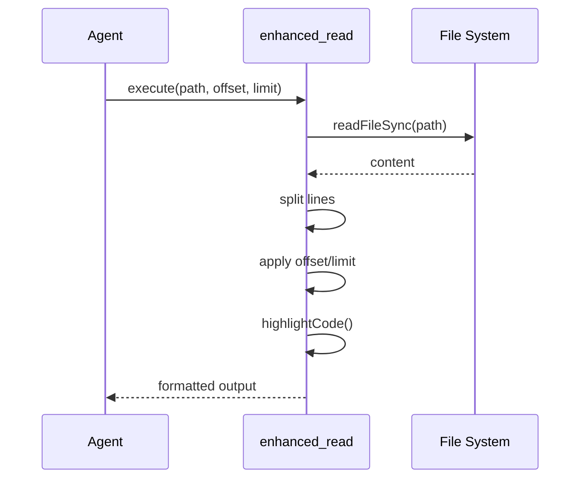
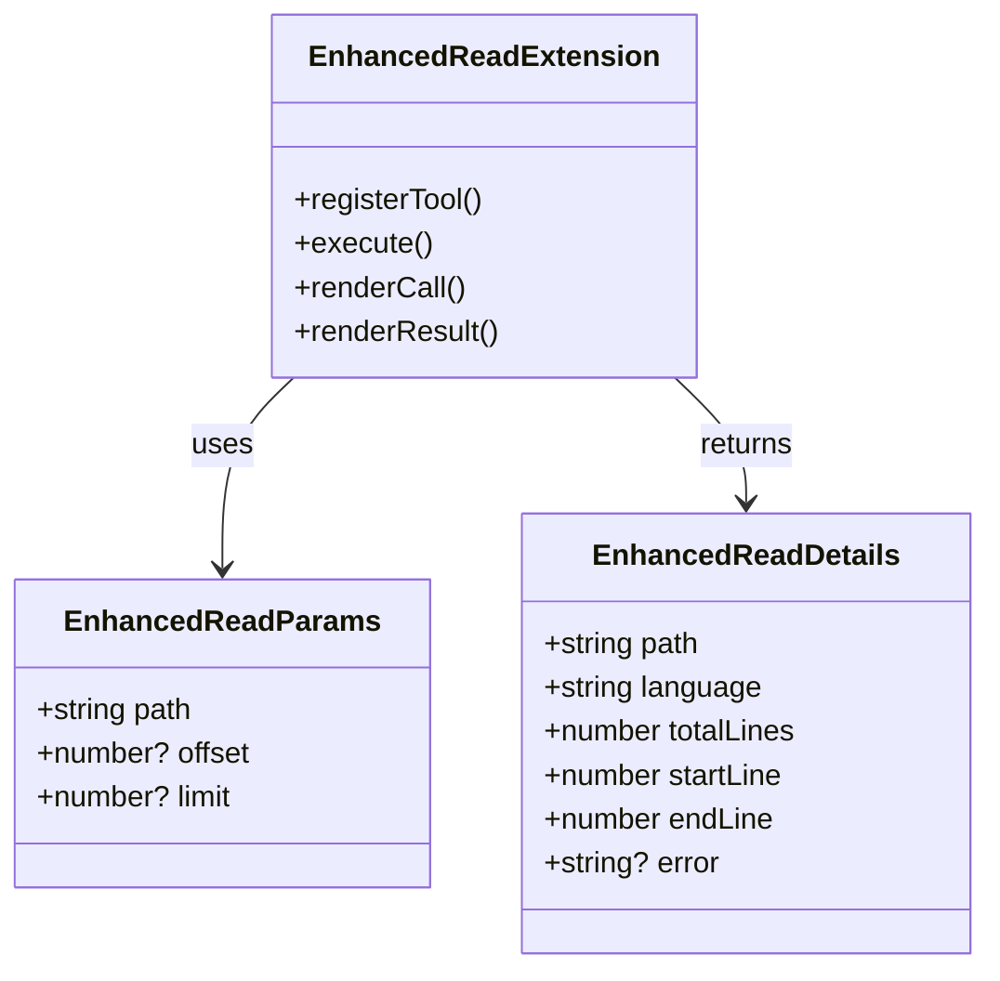
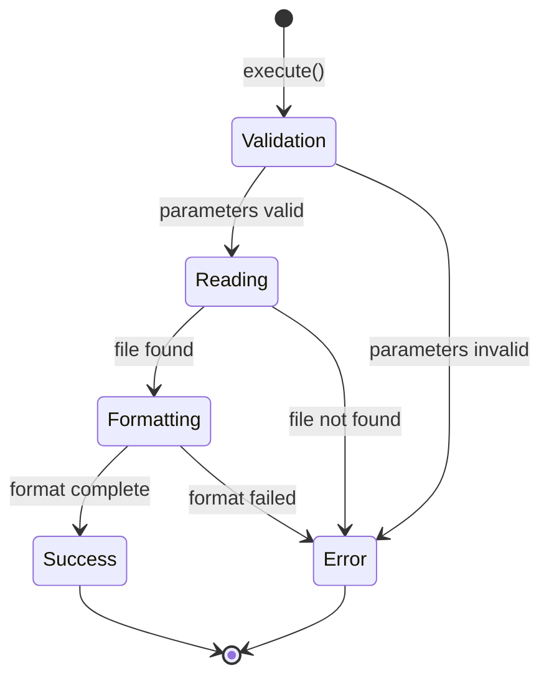

# ABDD Extension

> パンくず: [Home](../../README.md) > [User Guide](../README.md) > ABDD Extension

## 概要

ABDD（As-Built Driven Development）拡張機能は、実態コードから自動的にドキュメントを生成し、意図記述と実態記述の乖離を検出・解消するためのツールセットです。コードから自動生成されるMermaid図付きドキュメントと、人間が定義する意図記述を比較し、ドキュメントの整合性を維持します。

## 主な機能

- **実態ドキュメント生成**: コードから自動的に構造化されたドキュメントを生成
- **JSDoc自動生成**: TypeScriptファイルから簡潔かつ正確なJSDocを自動生成
- **乖離検出**: 意図と実態の不一致を自動的に検出
- **ワークフロー実行**: 生成→検証→修正の一連のプロセスを自動化

## ABDDの概要

ABDD（As-Built Driven Development）は「実態駆動開発」の略で、以下のサイクルを回すことでドキュメントとコードの整合性を維持します:

```
┌─────────────────────────────────────────────────────────┐
│                    ABDD サイクル                         │
├─────────────────────────────────────────────────────────┤
│                                                         │
│  1. 実態コード                                          │
│       │                                                │
│       ▼                                                │
│  2. 自動生成ドキュメント（Mermaid図付き）              │
│       │                                                │
│       ├──────────────────────┐                        │
│       ▼                      ▼                        │
│  3. 意図記述（人間）     4. 乖離検出                │
│       │                      │                        │
│       └──────────────────────┘                        │
│                  │                                    │
│                  ▼                                    │
│  5. 修正（コードまたは意図記述）                       │
│                  │                                    │
│                  └────────────────────────────────┘   │
│                                                         │
└─────────────────────────────────────────────────────────┘
```

## 使用方法

### 実態ドキュメントの生成

コードから自動的にドキュメントを生成します。

```typescript
await abdd_generate({
  dryRun: false,
  verbose: true
});
```

**生成される内容**:
- ABDD構造化ヘッダー（@abdd.meta, @abdd.explain）
- Mermaid図（シーケンス図、クラス図、状態遷移図）
- パブリックAPIのドキュメント
- 不変条件のドキュメント

**出力例**:
```
Generating ABDD documentation...
Processing .pi/extensions/enhanced-read.ts...
  ✓ Generated ABDD header
  ✓ Generated Mermaid sequence diagram
  ✓ Generated Mermaid class diagram
Processing .pi/extensions/github-agent.ts...
  ✓ Generated ABDD header
  ✓ Generated Mermaid sequence diagram

Done! Processed 2 files.
```

### JSDocの生成

TypeScriptファイルからJSDocコメントを自動生成します。

```typescript
await abdd_jsdoc({
  dryRun: false,
  verbose: true,
  check: false,
  regenerate: false
});
```

**生成されるJSDocの例**:

```typescript
// 生成前
export function formatWithLineNumbers(lines: string[], startLine: number): string {
  const maxLineNum = startLine + lines.length - 1;
  const width = maxLineNum.toString().length;
  return lines.map((line, index) => {
    const lineNum = (startLine + index).toString().padStart(width, " ");
    return `${lineNum} | ${line}`;
  }).join("\n");
}

// 生成後
/**
 * @summary 行番号付きでコードをフォーマット
 * @param lines - コード行の配列
 * @param startLine - 開始行番号（1始まり）
 * @returns 行番号付きコード文字列
 */
export function formatWithLineNumbers(lines: string[], startLine: number): string {
  // ...
}
```

### 乖離検出

意図記述と実態コードの乖離を検出します。

```typescript
await abdd_analyze({
  verbose: true,
  checkInvariants: true,
  checkValues: true,
  checkJSDoc: true,
  useAST: true
});
```

**検出される乖離の種類**:

1. **価値観の不一致 (value_mismatch)**: 意図記述とコードの設計判断が異なる
2. **不変条件違反 (invariant_violation)**: コードが宣言された不変条件を満たしていない
3. **契約違反 (contract_breach)**: パブリックAPIが宣言されたインターフェースに従っていない
4. **JSDoc欠落 (missing_jsdoc)**: パブリックシンボルにJSDocが存在しない

**出力例**:
```
Analyzing ABDD documentation...
Processing .pi/extensions/enhanced-read.ts...

✓ 意図記述: ツール拡張機能
✓ 実態: enhanced_readツールを登録
✓ 乖離: なし

Processing .pi/extensions/github-agent.ts...

⚠ 意図記述: "コード検索"
✗ 実態: searchコマンドが存在しない
⚠ 乖離: 契約違反 - 高重要度

Detected 1 divergence (1 high, 0 medium, 0 low)
```

### ワークフロー実行

生成→検証→修正の完全なサイクルを実行します。

```typescript
await abdd_workflow({
  mode: "fast",
  dryRun: false,
  verbose: true,
  timeoutMs: 300000,
  continueOnError: true
});
```

## パラメータ詳細

### abdd_generate

| パラメータ | 型 | 必須 | 説明 |
|-----------|---|------|------|
| `dryRun` | boolean | いいえ | ドライランモード（実際に書き込まない） |
| `verbose` | boolean | いいえ | 詳細ログを表示 |

### abdd_jsdoc

| パラメータ | 型 | 必須 | 説明 |
|-----------|---|------|------|
| `dryRun` | boolean | いいえ | ドライランモード |
| `check` | boolean | いいえ | CI用チェックモード（失敗時にエラー終了） |
| `verbose` | boolean | いいえ | 詳細ログを表示 |
| `limit` | number | いいえ | 処理するファイル数の上限 |
| `batchSize` | number | いいえ | バッチ処理サイズ |
| `file` | string | いいえ | 特定のファイルのみ処理 |
| `regenerate` | boolean | いいえ | 既存のJSDocを再生成 |
| `force` | boolean | いいえ | 強制的に再生成 |
| `noCache` | boolean | いいえ | キャッシュを使用しない |
| `metrics` | boolean | いいえ | 品質メトリクスを表示 |

### abdd_analyze

| パラメータ | 型 | 必須 | 説明 |
|-----------|---|------|------|
| `verbose` | boolean | いいえ | 詳細ログを表示 |
| `checkInvariants` | boolean | いいえ | 不変条件チェックを実行（デフォルト: true） |
| `checkValues` | boolean | いいえ | 価値観チェックを実行（デフォルト: true） |
| `checkJSDoc` | boolean | いいえ | JSDoc欠落チェックを実行（デフォルト: true） |
| `useAST` | boolean | いいえ | ASTベースの検出を使用（デフォルト: true） |

### abdd_workflow

| パラメータ | 型 | 必須 | 説明 |
|-----------|---|------|------|
| `mode` | string | いいえ | 実行モード: `fast`（デフォルト）または `strict` |
| `dryRun` | boolean | いいえ | ドライランモード |
| `verbose` | boolean | いいえ | 詳細ログを表示 |
| `timeoutMs` | number | いいえ | 各ステップのタイムアウト（ミリ秒、デフォルト: 300000 = 5分） |
| `continueOnError` | boolean | いいえ | エラー時も続行（デフォルト: true） |

## ABDDヘッダーの構造

ABDD拡張機能は各TypeScriptファイルに構造化されたヘッダーコメントを追加します。

### @abdd.meta

ファイルのメタデータを記述:

```typescript
/**
 * @abdd.meta
 * path: .pi/extensions/enhanced-read.ts
 * role: ツール拡張機能
 * why: 構文ハイライトと行番号、範囲指定機能を備えたファイル読み込み機能を提供するため
 * related: @mariozechner/pi-coding-agent, node:fs
 * public_api: enhanced_read
 * invariants: offset は1以上、limit は指定時1以上
 * side_effects: ファイルシステムからの読み取り
 * failure_modes: ファイル不存在、範囲外の offset/limit 指定
 */
```

**フィールド説明**:
- `path`: ファイルパス
- `role`: ファイルの役割
- `why`: なぜこのファイルが存在するのか
- `related`: 関連するファイルやモジュール
- `public_api`: 公開されるAPI/関数名
- `invariants`: このコードが満たすべき不変条件
- `side_effects`: 副作用（ファイルI/O、ネットワークなど）
- `failure_modes`: 失敗モードの記述

### @abdd.explain

コードの詳細な説明を記述:

```typescript
/**
 * @abdd.explain
 * overview: 指定されたファイルパスの内容を読み込み、行番号と構文ハイライトを付与して返す拡張機能。
 * what_it_does:
 *   - パラメータに基づきファイルの一部、または全体を非同期で読み込む
 *   - 開始行（offset）と最大行数（limit）による範囲指定を適用する
 *   - 行番号をフォーマットし、コードの言語を判定して構文ハイライトを適用する
 * why_it_exists:
 *   - 大きなファイルを効率的に確認するために部分的な読み込みを可能にする
 *   - コードの可読性を向上させるためにハイライトと行番号を付与する
 * scope:
 *   in: path（文字列）, offset（数値, 省略可）, limit（数値, 省略可）
 *   out: 構文ハイライトされたテキスト, EnhancedReadDetails メタデータ
 */
```

**フィールド説明**:
- `overview`: 概要説明
- `what_it_does`: 具体的な機能の説明
- `why_it_exists`: 存在理由
- `scope.in`: 入力スコープ
- `scope.out`: 出力スコープ

## 使用事例

### 事例1: 新しい拡張機能の開発

新しい拡張機能を作成した際のドキュメント生成:

```typescript
// 1. 拡張機能のコードを作成
// .pi/extensions/my-extension.ts

// 2. ABDDドキュメントを生成
await abdd_generate({
  dryRun: false,
  verbose: true
});

// 3. JSDocを生成
await abdd_jsdoc({
  dryRun: false,
  verbose: true
});

// 4. 乖離を検出
await abdd_analyze({
  verbose: true
});
```

### 事例2: コード変更後のドキュメント更新

コードを変更した後のドキュメント同期:

```typescript
// コード変更後、JSDocを再生成
await abdd_jsdoc({
  regenerate: true,
  dryRun: false
});

// 乖離がないか確認
await abdd_analyze({
  verbose: true
});
```

### 事例3: CIでのドキュメントチェック

CIパイプラインでJSDocとドキュメントの整合性をチェック:

```typescript
// CI用チェック（問題がある場合はエラー終了）
await abdd_jsdoc({
  check: true,
  dryRun: true
});

await abdd_analyze({
  checkInvariants: true,
  checkJSDoc: true
});
```

### 事例4: 完全なワークフロー実行

開発サイクルの完了時に完全なABDDワークフローを実行:

```typescript
// strictモードで完全なワークフローを実行
await abdd_workflow({
  mode: "strict",
  dryRun: false,
  verbose: true,
  continueOnError: false
});
```

## Mermaid図の生成

ABDD拡張機能は自動的にMermaid図を生成します。

### シーケンス図

関数やメソッドの呼び出しフローを可視化:



### クラス図

拡張機能の構造を可視化:



### 状態遷移図

ツールの状態遷移を可視化:



## 乖離の種類と対応

### value_mismatch（価値観の不一致）

**例**:
```typescript
/**
 * @abdd.explain
 * what_it_does:
 *   - ユーザー入力を検証する
 *   - 入力が空の場合はエラーを返す
 */
function validateInput(input: string): void {
  // 実際には空の入力も許可してしまう
  if (input === undefined || input === null) {
    throw new Error("Invalid input");
  }
}
```

**対応**: 意図記述またはコードを修正して整合させる

### invariant_violation（不変条件違反）

**例**:
```typescript
/**
 * @abdd.meta
 * invariants: offset は1以上
 */
function readFile(path: string, offset: number): string {
  // offsetのチェックがないため、不変条件違反
  return fs.readFileSync(path).split("\n").slice(offset - 1).join("\n");
}
```

**対応**: 不変条件のチェックを追加する

### missing_jsdoc（JSDoc欠落）

**例**:
```typescript
// パブリック関数にJSDocがない
export function calculateDistance(x1: number, y1: number, x2: number, y2: number): number {
  return Math.sqrt((x2 - x1) ** 2 + (y2 - y1) ** 2);
}
```

**対応**: JSDocを追加または自動生成を実行

## トラブルシューティング

### スクリプトが見つからないエラー

**エラー**: `スクリプトが見つかりません: scripts/generate_abdd.ts`

**原因**: スクリプトファイルが存在しないか、パスが間違っています。

**解決策**:
- `scripts/` ディレクトリが存在することを確認
- 必要なスクリプトファイルが存在することを確認

### タイムアウトエラー

**エラー**: `実行がタイムアウトしました`

**原因**: ファイル数が多く、処理に時間がかかりすぎています。

**解決策**:
- `limit` パラメータで処理するファイル数を制限
- `timeoutMs` パラメータでタイムアウトを延長
- `batchSize` パラメータでバッチサイズを調整

```typescript
await abdd_generate({
  verbose: true,
  // タイムアウトを10分に延長
});

await abdd_jsdoc({
  limit: 50,
  batchSize: 10
});
```

### JSDocが生成されない

**原因**: キャッシュが古いか、ファイルが除外されています。

**解決策**:
- `noCache: true` でキャッシュを無効化
- `regenerate: true` で再生成
- `file` パラメータで特定のファイルを指定

```typescript
await abdd_jsdoc({
  regenerate: true,
  noCache: true,
  file: ".pi/extensions/my-extension.ts"
});
```

## ベストプラクティス

### 1. 開発サイクルに統合

コード変更のたびにABDDツールを実行する:

```typescript
// 開発中: 頻繁にチェック
await abdd_jsdoc({ check: true, dryRun: true });

// PR前に: 完全なワークフロー
await abdd_workflow({ mode: "strict" });
```

### 2. CI/CDパイプラインへの統合

CIで自動的にドキュメントの整合性をチェック:

```bash
# .github/workflows/ci.yml
- name: Check ABDD Documentation
  run: |
    pi abdd_jsdoc --check
    pi abdd_analyze
```

### 3. 意図記述の定期的なレビュー

定期的に意図記述を見直し、現在の設計と整合しているか確認:

```typescript
await abdd_analyze({
  verbose: true,
  checkInvariants: true,
  checkValues: true
});
```

### 4. ドライランモードでの検証

実際に書き込む前にドライランで確認:

```typescript
// まずドライランで確認
await abdd_generate({ dryRun: true, verbose: true });
await abdd_jsdoc({ dryRun: true, verbose: true });

// 問題なければ実行
await abdd_generate({ dryRun: false });
await abdd_jsdoc({ dryRun: false });
```

## 制限事項

- **TypeScriptファイルのみ**: TypeScriptファイルにのみ対応しています
- **パブリックシンボル**: エクスポートされたシンボルのみがJSDoc生成の対象です
- **複雑な型**: 高度なジェネリクスや条件型のJSDoc生成は限定的です
- **スクリプト依存**: Node.jsとtsxが必要です

## 関連トピック

- [ABDDスキル](../../skills/abdd/SKILL.md) - ABDDの詳細なスキル定義
- [拡張機能一覧](01-extensions.md) - すべての拡張機能の概要
- [ツール開発](../03-development/) - 拡張機能の開発方法

## 次のトピック

[ → 開発ガイド目次](../03-development/)
