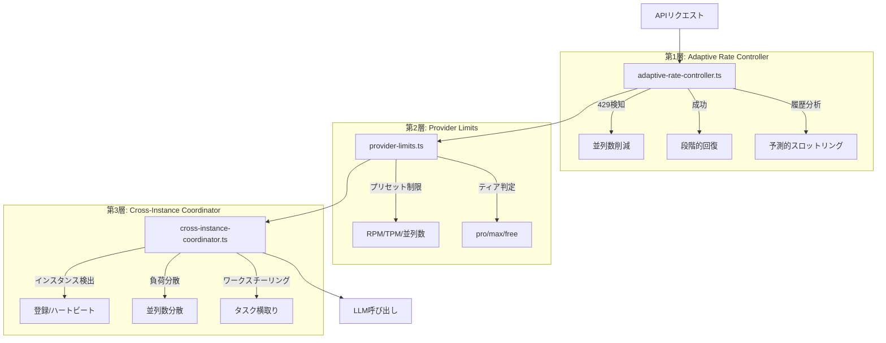
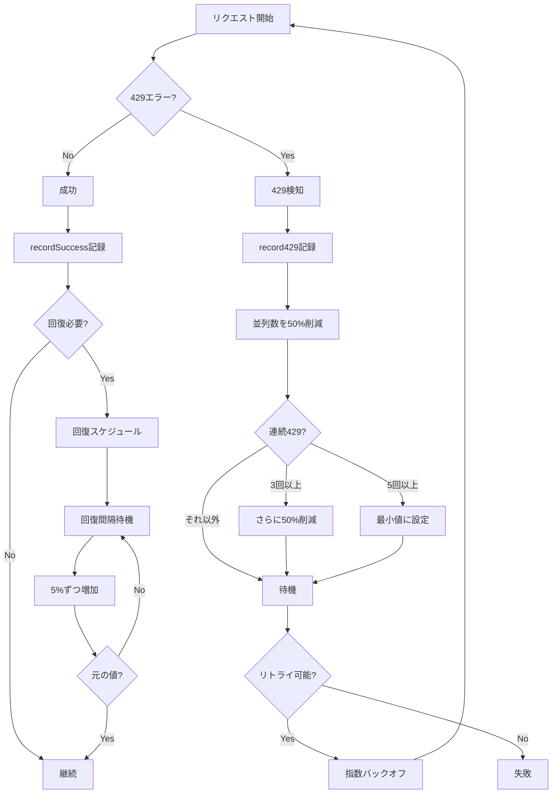

# 429エラー処理実装リファレンス

> パンくず: [Home](../README.md) > [Reference](./) > 429エラー処理実装

## 概要

このドキュメントは、piにおける429エラー（レート制限超過）処理の実装詳細を説明する。429エラーからの自動復旧、予測的スロットリング、クロスインスタンス協調の3層アーキテクチャで構成される。

### 3層アーキテクチャ



## 429検知〜回復フロー



## 実装ファイル一覧

| ファイル | 役割 | 主なAPI |
|---------|------|--------|
| `.pi/lib/adaptive-rate-controller.ts` | 429学習エンジン | `record429`, `recordSuccess`, `getEffectiveLimit` |
| `.pi/lib/provider-limits.ts` | プロバイダー制限定義 | `resolveLimits`, `getConcurrencyLimit`, `getRpmLimit` |
| `.pi/lib/cross-instance-coordinator.ts` | インスタンス間協調 | `registerInstance`, `getMyParallelLimit`, `safeStealWork` |
| `.pi/lib/runtime-config.ts` | 設定値の一元管理 | `getRuntimeConfig` |
| `.pi/extensions/cross-instance-runtime.ts` | 拡張機能 | `pi_instance_status`, `pi_model_limits` |
| `.pi/extensions/pi-coding-agent-rate-limit-fix.ts` | パッチ | Retry-After解析 |

## Adaptive Rate Controller API

### コアAPI

#### record429

429エラーを記録し、並列数を削減する。

```typescript
function record429(provider: string, model: string, details?: string): void
```

**動作:**
- 並列数を `reductionFactor` (0.5) で削減
- 連続429カウントをインクリメント
- 3回連続でさらに50%削減
- 5回連続で最小値(1)に設定

#### recordSuccess

成功を記録し、回復スケジュールを開始する。

```typescript
function recordSuccess(provider: string, model: string): void
```

**動作:**
- 連続429カウントをリセット
- 並列数が元の値未満の場合、回復をスケジュール

#### getEffectiveLimit

プロバイダー/モデルの有効な並列制限を取得する。

```typescript
function getEffectiveLimit(
  provider: string,
  model: string,
  presetLimit: number
): number
```

**戻り値:** 学習済み制限 × グローバル乗数

#### getSchedulerAwareLimit

スケジューラ対応の制限を取得する（予測的スロットリング適用済み）。

```typescript
function getSchedulerAwareLimit(
  provider: string,
  model: string,
  baseLimit?: number
): number
```

**戻り値:** 適応制限と予測制限の小さい方

### 通知API

#### notifyScheduler429

スケジューラに429エラーを通知する。

```typescript
function notifyScheduler429(
  provider: string,
  model: string,
  details?: string
): void
```

#### notifySchedulerSuccess

スケジューラに成功を通知する。

```typescript
function notifySchedulerSuccess(
  provider: string,
  model: string,
  responseMs?: number
): void
```

### 予測API

#### analyze429Probability

429発生確率を分析する。

```typescript
function analyze429Probability(provider: string, model: string): number
```

**戻り値:** 0.0〜1.0の確率値

**計算式:**
- 直近10分の429: 重み0.4
- 30分以内の429: 重み0.15
- 1時間以内の429: 重み0.05
- 連続429回数: 重み0.2

#### getPredictiveAnalysis

予測分析の詳細を取得する。

```typescript
function getPredictiveAnalysis(
  provider: string,
  model: string
): PredictiveAnalysis
```

**戻り値:**
```typescript
interface PredictiveAnalysis {
  provider: string;
  model: string;
  predicted429Probability: number;    // 429確率
  shouldProactivelyThrottle: boolean; // 先制的スロットル要否
  recommendedConcurrency: number;     // 推奨並列数
  nextRiskWindow?: {                  // 次のリスク期間
    start: Date;
    end: Date;
  };
  confidence: number;                 // 信頼度
}
```

## 設定パラメータ

### 環境変数

| 変数名 | デフォルト | 説明 |
|--------|----------|------|
| `PI_PROVIDER_TIER` | - | プロバイダーのティア（pro/max/free） |
| `PI_TOTAL_MAX_LLM` | 6 | 全インスタンス合計の最大LLM数 |
| `PI_HEARTBEAT_INTERVAL_MS` | 15000 | ハートビート間隔 |
| `PI_HEARTBEAT_TIMEOUT_MS` | 60000 | ハートビートタイムアウト |
| `PI_DEBUG_COORDINATOR` | 0 | コーディネーターデバッグログ |
| `PI_ENABLE_WORK_STEALING` | true | ワークスチーリング有効化 |

### 実行時設定

| パラメータ | デフォルト | 説明 |
|-----------|----------|------|
| `reductionFactor` | 0.5 | 429時の並列数削減率（50%削減） |
| `recoveryFactor` | 1.05 | 回復時の並列数増加率（5%増加） |
| `recoveryIntervalMs` | 120000 | 回復チェック間隔（2分） |
| `predictiveEnabled` | true | 予測的スロットリング有効化 |
| `predictiveThreshold` | 0.15 | 先制的スロットル発動閾値 |

### 設定変更API

```typescript
// グローバル乗数設定（全制限に適用）
setGlobalMultiplier(0.8); // 全制限を80%に

// 回復パラメータ設定
configureRecovery({
  recoveryIntervalMs: 180000,  // 3分
  reductionFactor: 0.7,        // 30%削減
  recoveryFactor: 1.1,         // 10%増加
});

// 予測設定
setPredictiveEnabled(true);
setPredictiveThreshold(0.2); // 20%以上で発動
```

## 使用例

### 基本的な使用

```typescript
import {
  notifyScheduler429,
  notifySchedulerSuccess,
  getSchedulerAwareLimit,
} from "./adaptive-rate-controller";

// 429エラー記録
try {
  await apiClient.makeRequest();
  notifySchedulerSuccess("anthropic", "claude-sonnet-4-20250514", 1500);
} catch (error) {
  if (isRateLimitError(error)) {
    notifyScheduler429("anthropic", "claude-sonnet-4-20250514", error.message);
  }
}

// 制限取得
const limit = getSchedulerAwareLimit("anthropic", "claude-sonnet-4-20250514", 4);
console.log(`Effective limit: ${limit}`);
```

### 予測的スロットリング

```typescript
import {
  getPredictiveAnalysis,
  shouldProactivelyThrottle,
} from "./adaptive-rate-controller";

const analysis = getPredictiveAnalysis("anthropic", "claude-sonnet-4-20250514");

if (analysis.shouldProactivelyThrottle) {
  console.log(`High 429 risk: ${(analysis.predicted429Probability * 100).toFixed(1)}%`);
  console.log(`Recommended concurrency: ${analysis.recommendedConcurrency}`);

  if (analysis.nextRiskWindow) {
    console.log(`Risk window: ${analysis.nextRiskWindow.start} - ${analysis.nextRiskWindow.end}`);
  }
}
```

### クロスインスタンス協調

```typescript
import {
  registerInstance,
  getMyParallelLimit,
  updateWorkloadInfo,
} from "./cross-instance-coordinator";

// インスタンス登録
registerInstance(sessionId, process.cwd());

// 並列数取得
const myLimit = getMyParallelLimit();
console.log(`My parallel limit: ${myLimit}`);

// ワークロード更新
updateWorkloadInfo(pendingTasks.length, avgLatencyMs);
```

### ワークスチーリング

```typescript
import {
  shouldAttemptWorkStealing,
  safeStealWork,
  getStealingStats,
} from "./cross-instance-coordinator";

// スチーリング判定
if (shouldAttemptWorkStealing()) {
  const entry = await safeStealWork();
  if (entry) {
    console.log(`Stole task: ${entry.id} from ${entry.instanceId}`);
  }
}

// 統計取得
const stats = getStealingStats();
console.log(`Success rate: ${(stats.successRate * 100).toFixed(1)}%`);
```

## 状態確認

### サマリー出力

```typescript
import { formatAdaptiveSummary } from "./adaptive-rate-controller";

console.log(formatAdaptiveSummary());
```

出力例:
```
Adaptive Rate Controller
========================

Global Multiplier: 1.00
Recovery Interval: 120s
Reduction Factor: 0.50
Recovery Factor: 1.05
Predictive: enabled (threshold: 0.15)

Learned Limits:
  anthropic:claude-sonnet-4-20250514: OK (4), no 429, total: 0
  openai:gpt-4o: REDUCED (2/4), last429: 45s ago, total: 3, 429_prob: 12.5%
```

### コーディネーターステータス

```typescript
import { getCoordinatorStatus } from "./cross-instance-coordinator";

const status = getCoordinatorStatus();
console.log(`Active instances: ${status.activeInstanceCount}`);
console.log(`My limit: ${status.myParallelLimit}`);
```

---

## 関連トピック

- [クロスインスタンスランタイム](../02-user-guide/12-cross-instance-runtime.md) - ユーザーガイド
- [pi-coding-agent-rate-limit-fix](../patches/pi-coding-agent-rate-limit-fix.md) - パッチ説明

## 次のトピック

[→ 設定リファレンス](./01-configuration.md)
