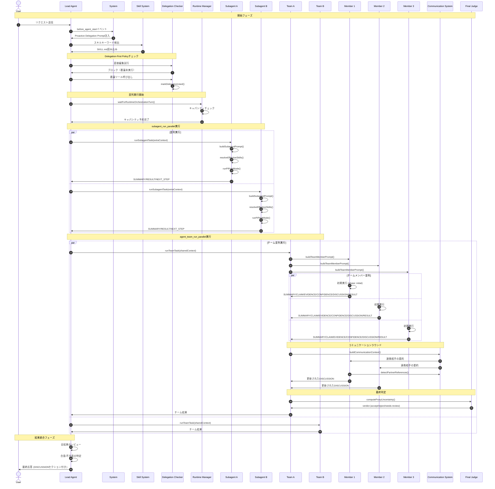
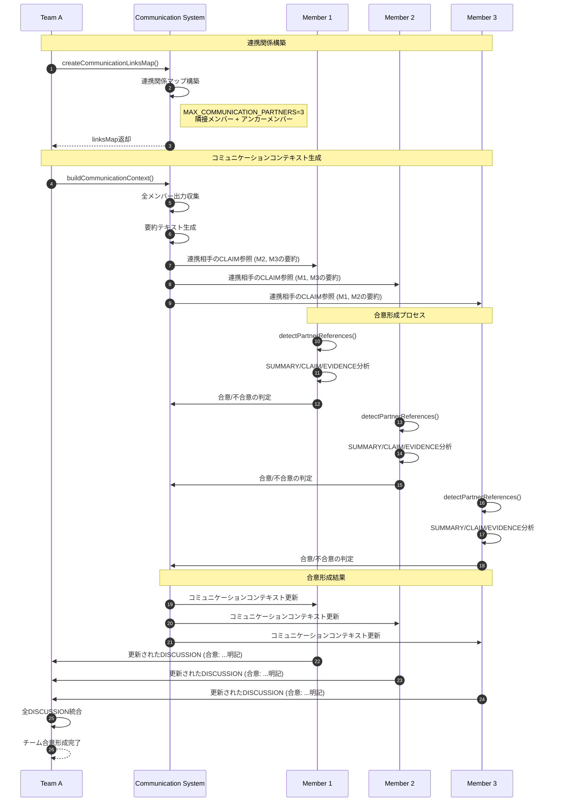
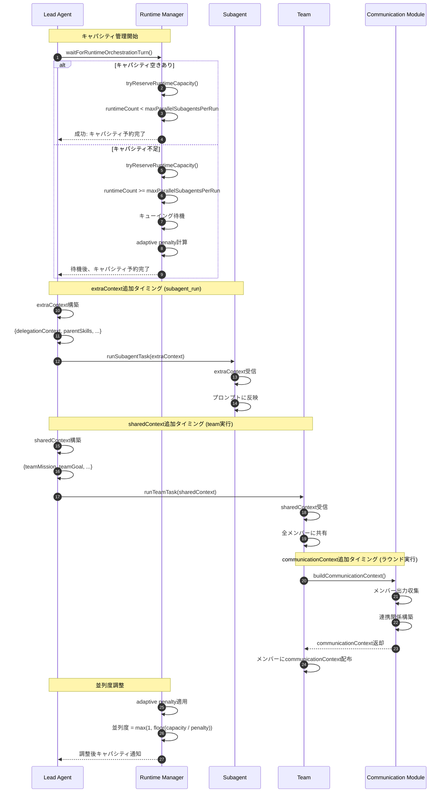
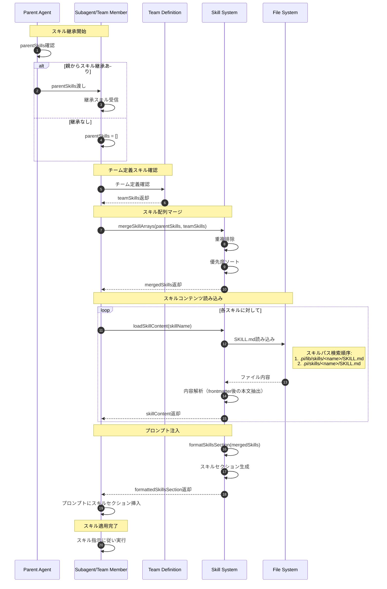
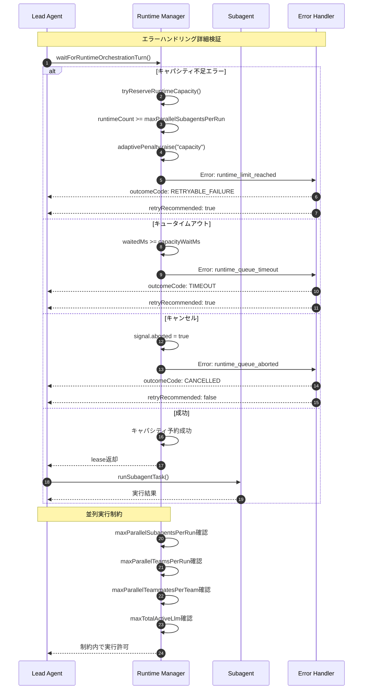
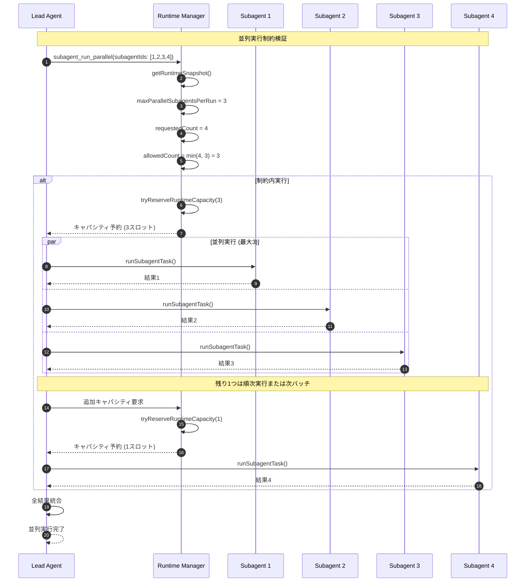

# Subagents と Agent Teams のシーケンス図

このドキュメントは、pi coding agentのsubagentsとagent teamsを組み合わせた場合の実行フローを詳細に示すMermaidシーケンス図集です。

## 目次

1. [全体フロー（subagents + agent teams）](#1-全体フローsubagents--agent-teams)
2. [コミュニケーションラウンド詳細](#2-コミュニケーションラウンド詳細)
3. [キャパシティ管理とコンテキスト追加タイミング](#3-キャパシティ管理とコンテキスト追加タイミング)
4. [スキル読み込みと継承](#4-スキル読み込みと継承)
5. [エラーハンドリング詳細](#5-エラーハンドリング詳細)
6. [並列実行制約](#6-並列実行制約)

---

## 1. 全体フロー（subagents + agent teams）

ユーザーリクエストから最終出力までの完全なシーケンス図。

### シーケンス図



### 各ステップの説明

| ステップ | フェーズ | 説明 | ソースコード |
|---------|---------|------|-------------|
| 1-5 | 開始 | User -> Lead Agent -> System -> Skill System | `.pi/APPEND_SYSTEM.md` |
| 6-9 | Delegation-First | 直接編集ブロック、委譲強制 | `.pi/extensions/subagents.ts:75-82` |
| 10-13 | キャパシティ | waitForRuntimeOrchestrationTurn、tryReserveRuntimeCapacity | `.pi/extensions/agent-runtime.ts:330-430` |
| 14-21 | Subagent並列 | runSubagentTask with extraContext | `.pi/extensions/subagents.ts:1820-2050` |
| 22-46 | Team並列 | runTeamTask with sharedContext、コミュニケーションラウンド | `.pi/extensions/agent-teams.ts:2816-3900` |
| 47-49 | 最終判定 | computeProxyUncertainty、runFinalJudge | `.pi/extensions/agent-teams/judge.ts` |
| 50-52 | 統合 | 全結果レビュー、合意形成 | `.pi/APPEND_SYSTEM.md:115-150` |

---

## 2. コミュニケーションラウンド詳細

エージェントチーム内でのコミュニケーションラウンドの詳細フロー。

### シーケンス図



### 通信リンク構築ルール

```
createCommunicationLinksMap(members):
  1. 隣接メンバーとリンク（循環）
     - member[i] -> member[i-1]
     - member[i] -> member[i+1]

  2. アンカーメンバーとリンク（双方向）
     - consensus, synthesizer, reviewer, lead, judge

  3. 最大パートナー数: 3 (MAX_COMMUNICATION_PARTNERS)
```

### DISCUSSION出力形式

```
DISCUSSION:
[メンバー名]の主張に言及:
- 同意点: [具体的な内容]
- 懸念点: [具体的な内容と根拠]
合意: [合意内容の要約]
```

### ソースコード参照

| 関数 | 場所 |
|------|------|
| `createCommunicationLinksMap()` | `.pi/extensions/agent-teams/communication.ts:90-130` |
| `buildCommunicationContext()` | `.pi/extensions/agent-teams/communication.ts:160-210` |
| `detectPartnerReferences()` | `.pi/extensions/agent-teams/communication.ts:220-250` |
| `sanitizeCommunicationSnippet()` | `.pi/extensions/agent-teams/communication.ts:140-160` |

---

## 3. キャパシティ管理とコンテキスト追加タイミング

ランタイムキャパシティの管理と、各種コンテキストが追加されるタイミング。

### シーケンス図



### コンテキスト追加タイミングと内容

| コンテキスト種別 | 追加タイミング | パラメータ | 内容 | ソースコード |
|----------------|--------------|----------|------|-------------|
| **extraContext** | `subagent_run` / `subagent_run_parallel` 呼び出し時 | `extraContext: string` | タスク固有の補足情報 | `subagents.ts:1592-1820` |
| **sharedContext** | `agent_team_run` / `agent_team_run_parallel` 呼び出し時 | `sharedContext: string` | チーム全体で共有する指示 | `agent-teams.ts:2816-3300` |
| **communicationContext** | コミュニケーションラウンド実行時 | 自動生成 | 連携相手の要約・CLAIM/EVIDENCE/CONFIDENCE | `communication.ts:160-210` |
| **parentSkills** | サブエージェント/チームメンバー委譲時 | `parentSkills: string[]` | 親エージェントから継承するスキル | `subagents.ts:1044-1054` |

### キャパシティ制約

| 制約 | デフォルト値 | stable profile | 説明 |
|------|------------|---------------|------|
| `maxParallelSubagentsPerRun` | 4 | 2 | 1回の実行で同時実行可能なsubagent数 |
| `maxParallelTeamsPerRun` | 3 | 1 | 1回の実行で同時実行可能なチーム数 |
| `maxParallelTeammatesPerTeam` | 6 | 3 | 1チーム内で同時実行可能なメンバー数 |
| `maxTotalActiveLlm` | 8 | 4 | システム全体でのアクティブLLM数 |
| `maxTotalActiveRequests` | 6 | 2 | システム全体でのアクティブリクエスト数 |
| `maxConcurrentOrchestrations` | 2 | 2 | 同時オーケストレーション数 |
| `capacityWaitMs` | 30000 | 12000 | キャパシティ待機タイムアウト |
| `reservationTtlMs` | 60000 | 45000 | 予約TTL |

### Feature Flags (v2.0.0+)

| 環境変数 | 値 | デフォルト | 説明 |
|---------|---|-----------|------|
| `PI_OUTPUT_SCHEMA_MODE` | legacy/dual/strict | **strict** | 出力検証モード |
| `PI_ADAPTIVE_PENALTY_MODE` | legacy/enhanced | **enhanced** | ペナルティ制御モード |
| `PI_JUDGE_WEIGHTS_PATH` | ファイルパス | (なし) | Judge重み設定ファイル |

### Adaptive Penalty

```
adaptivePenalty.raise(reason):
  # Legacy mode: linear decay
  - penalty = min(maxPenalty, penalty + 1)

  # Enhanced mode (default since v2.0.0): exponential decay + reason weights
  - decayMultiplier = 0.5 (exponential)
  - reasonWeights = { rate_limit: 2.0, capacity: 1.5, timeout: 1.0, schema_violation: 0.5 }
  - effectiveStep = reasonWeights[reason] || 1.0
  - penalty = min(maxPenalty, penalty + effectiveStep)

adaptivePenalty.lower():
  # Legacy mode
  - penalty = max(0, penalty - 1)

  # Enhanced mode
  - penalty = penalty * decayMultiplier

adaptivePenalty.applyLimit(baseLimit):
  - IF penalty <= 0: RETURN baseLimit
  - RETURN max(1, floor(baseLimit / (penalty + 1)))
```

**Feature Flag**: `PI_ADAPTIVE_PENALTY_MODE` (default: `enhanced`)

---

## 4. スキル読み込みと継承

スキルの読み込み、継承、プロンプトへの注入フロー。

### シーケンス図



### スキル継承の優先順位

```
resolveEffectiveSkills(agent, parentSkills):
  1. parentSkills（親エージェントから継承）
  2. agent.skills（エージェント定義のスキル）
  3. mergeSkillArrays()で重複排除してマージ
```

### スキルセクション形式

```xml
<available_skills>
  <skill>
    <name>skill-name</name>
    <description>スキルの説明</description>
    <location>/path/to/skill/SKILL.md</location>
  </skill>
</available_skills>
```

### スキル読み込みトリガー

検出パターン（MANDATORY load trigger）:
- キーワード: "git", "commit", "branch", "push", "pull", "merge", "rebase", "stash"
- 日本語: "コミット", "ブランチ", "プッシュ", "マージ", "リベース", "コンフリクト"

### ソースコード参照

| 関数 | 場所 |
|------|------|
| `mergeSkillArrays()` | `subagents.ts:1023-1040`, `agent-teams.ts:1922-1945` |
| `resolveEffectiveSkills()` | `subagents.ts:1044-1054` |
| `loadSkillContent()` | `agent-teams.ts:1973-2015` |
| `formatSkillsSection()` | `subagents.ts:1054-1090` |

---

## 5. エラーハンドリング詳細

キャパシティ不足、タイムアウト、キャンセル等のエラーハンドリングフロー。

### シーケンス図



### エラーコードと対応

| エラー | outcomeCode | retryRecommended | 説明 |
|--------|-------------|-----------------|------|
| `runtime_limit_reached` | RETRYABLE_FAILURE | true | キャパシティ不足 |
| `runtime_queue_timeout` | TIMEOUT | true | キュータイムアウト |
| `runtime_queue_aborted` | CANCELLED | false | ユーザーキャンセル |

### 拡張エラー分類 (v2.0.0+)

| ExtendedOutcomeCode | 説明 | retryRecommended | 判定条件 |
|---------------------|------|-----------------|----------|
| `SCHEMA_VIOLATION` | 出力形式がスキーマに違反 | true | 必須フィールド欠落、CONFIDENCE範囲外 |
| `LOW_SUBSTANCE` | 意図のみで実質的成果物がない | true | RESULTが空または意図のみ |
| `EMPTY_OUTPUT` | 出力が空 | true | テキストなし |
| `PARSE_ERROR` | JSON/構造化パース失敗 | true | 構文エラー |

```typescript
// セマンティックエラー分類
classifySemanticError(output, error): { code, details? }
  - SCHEMA_VIOLATION: スキーマ検証失敗
  - LOW_SUBSTANCE: 実質的成果物なし
  - EMPTY_OUTPUT: 空出力
  - PARSE_ERROR: パース失敗
```

### Final Judge判定

| 条件 | 信号 | 説明 |
|------|------|------|
| `uSys >= 0.6` | high_system_uncertainty | システム全体の不確実性が高い |
| `failedRatio >= 0.3` | teammate_failures | チームメンバーの失敗率が高い |

### Judge重み設定 (v2.0.0+)

```typescript
// デフォルト重み設定 (DEFAULT_JUDGE_WEIGHTS)
{
  intraWeights: {
    failedRatio: 0.38,      // 失敗率の重み
    lowConfidence: 0.26,    // 低信頼度の重み
    noEvidence: 0.20,       // 証拠なしの重み
    contradiction: 0.16     // 矛盾の重み
  },
  interWeights: {
    conflictRatio: 0.42,    // コンフリクト率
    confidenceSpread: 0.28, // 信頼度ばらつき
    failedRatio: 0.20,
    noEvidence: 0.10
  },
  sysWeights: {
    uIntra: 0.45,           // メンバー内不確実性
    uInter: 0.35,           // メンバー間不確実性
    failedRatio: 0.20
  }
}
```

**カスタム重み設定**: `PI_JUDGE_WEIGHTS_PATH` 環境変数でJSONファイルを指定可能

### Judge説明可能性 (v2.0.0+)

```typescript
computeProxyUncertaintyWithExplainability():
  - explanation.intraFactors: [内要因の詳細リスト]
  - explanation.interFactors: [間要因の詳細リスト]
  - explanation.sysFactors: [システム要因の詳細リスト]
  - explanation.breakdown: { uIntra, uInter, uSys の内訳 }

formatJudgeExplanation(explanation):
  // 人間可読な説明を生成
  "uIntra計算: failedRatio(0.38)*0.12 + lowConfidence(0.26)*0.08 + ..."
```

### スキーマ検証 (v2.0.0+)

```typescript
// 出力スキーマ検証モード
PI_OUTPUT_SCHEMA_MODE:
  - "legacy": 正規表現ベース検証（非推奨）
  - "dual": 正規表現 + スキーマ検証（差分ログ出力）
  - "strict": スキーマ検証のみ（デフォルト）

// スキーマ定義
SCHEMAS.subagent:
  - SUMMARY: required, min 10 chars
  - RESULT: required, min 20 chars
  - CONFIDENCE: optional, 0.00-1.00
  - CLAIM: optional
  - EVIDENCE: optional
  - DISCUSSION: optional
  - NEXT_STEP: optional

SCHEMAS.teamMember:
  - SUMMARY: required, min 10 chars
  - CLAIM: required
  - EVIDENCE: required
  - CONFIDENCE: required, 0.00-1.00
  - DISCUSSION: required
  - RESULT: required, min 20 chars
```

---

## 6. 並列実行制約

並列実行時の制約とバッチ処理のフロー。

### シーケンス図



### 並列実行制約の詳細

```
resolveSubagentParallelCapacity():
  1. baselineParallelism = min(
       configuredParallelLimit,
       activeAgents.length,
       maxTotalActiveLlm
     )
  2. effectiveParallelism = adaptivePenalty.applyLimit(baselineParallelism)
  3. バッチ処理で制約を超えるリクエストを処理
```

### チーム並列実行の制約

```
resolveTeamParallelCapacity():
  1. baselineTeamParallelism = min(
       configuredTeamParallelLimit,
       enabledTeams.length,
       maxTotalActiveRequests
     )
  2. effectiveTeamParallelism = adaptivePenalty.applyLimit(baselineTeamParallelism)
  3. desiredLlmBudgetPerTeam = maxTotalActiveLlm / effectiveTeamParallelism
  4. baselineMemberParallelism = min(
       configuredMemberParallelLimit,
       maxEnabledMembersPerTeam,
       desiredLlmBudgetPerTeam
     )
```

---

## 出力形式

### サブエージェント出力形式

```
SUMMARY: <短い要約>
CLAIM: <1文の中核主張>
EVIDENCE: <カンマ区切りの証拠, file:line参照可能>
CONFIDENCE: <0.00-1.00>
DISCUSSION: <他エージェント参照, 合意/不合意, コンセンサス>
RESULT:
<主な回答>
NEXT_STEP: <具体的次アクション または none>
```

### チームメンバー出力形式

```
SUMMARY: <日本語の短い要約>
CLAIM: <日本語で1文の中核主張>
EVIDENCE: <根拠をカンマ区切り。可能なら file:line>
CONFIDENCE: <0.00-1.00>
DISCUSSION: <他メンバーのoutputを参照し、同意点/不同意点を記述>
            <合意形成時は「合意: [要約]」を明記>
RESULT:
<日本語の結果本文>
NEXT_STEP: <日本語で次のアクション、不要なら none>
```

### Final Judge出力

```
verdict: "accept" | "reject" | "needs-review"
confidence: 0.00-1.00
reason: <説明>
nextStep: <推奨アクション>
uIntra: <メンバー内不確実性>
uInter: <メンバー間不確実性>
uSys: <システム不確実性>
collapseSignals: [<検出された問題のリスト>]
```

---

## 関連ドキュメント

- [Pi README](/.pi/../README.md)
- [Extensions](/docs/02-user-guide/01-extensions.md)
- [Skills](/docs/04-reference/skill-guide.md)
- [Orchestration Migration Guide v2.0](/.pi/docs/orchestration-migration-v2.md)
- [Agent Runtime](/.pi/extensions/agent-runtime.ts)
- [Subagents Extension](/.pi/extensions/subagents.ts)
- [Agent Teams Extension](/.pi/extensions/agent-teams.ts)
- [Communication Module](/.pi/extensions/agent-teams/communication.ts)
- [Judge Module](/.pi/extensions/agent-teams/judge.ts)
- [Output Schema](/.pi/lib/output-schema.ts)
- [Adaptive Penalty](/.pi/lib/adaptive-penalty.ts)
- [Agent Errors](/.pi/lib/agent-errors.ts)
- [Text Parsing Utils](/.pi/lib/text-parsing.ts)

---

## v2.0.0 変更履歴

| 日付 | 変更内容 |
|------|---------|
| 2026-02-15 | P0-1: JSON Schema契約実装、デフォルトstrict移行 |
| 2026-02-15 | P0-3: Judge説明可能性・重み設定外部化 |
| 2026-02-15 | P1-4: Enhanced Adaptive Penalty（指数減衰・理由別重み） |
| 2026-02-15 | P1-5: 拡張エラー分類（SCHEMA_VIOLATION等） |
| 2026-02-15 | 共通ユーティリティ抽出（text-parsing.ts） |
