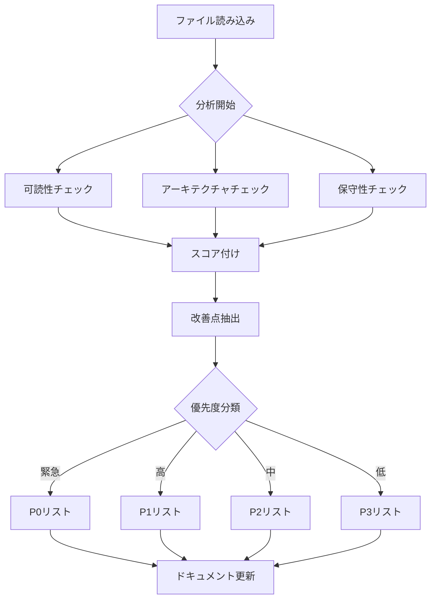
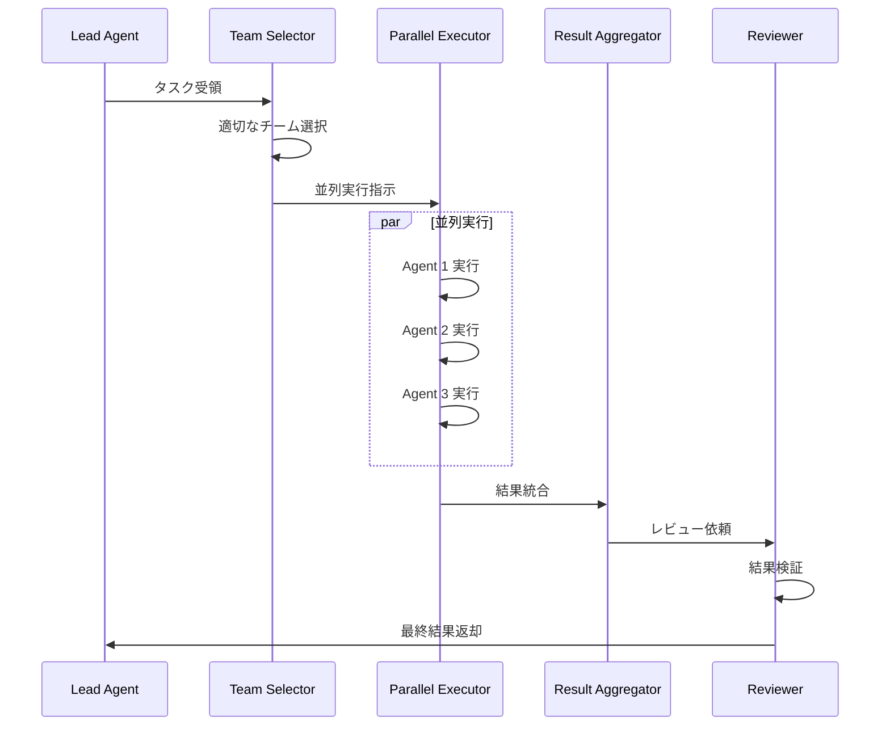
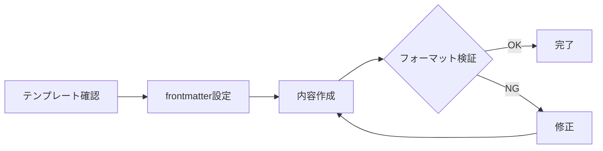

# レビュー結果サマリー

> パンくず: [Home](../README.md) > [Code Review Report](./README.md) > レビュー結果サマリー

## 概要

このドキュメントは、pi-plugin/mekannプロジェクトのコードレビュー結果のサマリーを提供します。レビューは可読性、アーキテクチャ、保守性の3つの観点から実施されました。

## 全体的な評価

### 総合スコア

| 評価項目 | スコア | 評価 |
|---------|-------|------|
| **可読性** | 8.2/10 | 良好 |
| **アーキテクチャ** | 7.5/10 | 改善余地あり |
| **保守性** | 7.8/10 | 改善余地あり |
| **セキュリティ** | 8.5/10 | 良好 |
| **ドキュメント** | 9.0/10 | 優秀 |

### 総合評価: **B+（良好）**

プロジェクト全体は良好な状態にあります。特にドキュメント品質が高く、新規参加者でも理解しやすい構造になっています。一方で、アーキテクチャ面では一部の拡張機能の肥大化が見られ、モジュール分割の改善が推奨されます。

## 強み

1. **包括的なドキュメント**: 各スキル、拡張機能に詳細なドキュメントが付随
2. **一貫したコーディング規約**: TypeScriptの型定義が適切に使用されている
3. **豊富なスキル定義**: 8つのスキルが整理され、再利用可能
4. **委任ファースト政策**: Delegation-First Policyにより品質確保

## 改善領域

1. **大規模ファイルの分割**: `agent-teams.ts`（176KB）、`subagents.ts`（93KB）など
2. **エラーハンドリングの統一**: 一部でtry-catchのパターンが不統一
3. **テストカバレッジ**: テストファイルの追加が推奨される

## 優先度別改善項目

### P0（緊急）: 即時対応

| 項目 | 影響範囲 | 対応方針 |
|------|---------|---------|
| なし | - | - |

現在、P0レベルの緊急課題は特定されていません。

### P1（高）: 次回リリース

| 項目 | 影響範囲 | 対応方針 |
|------|---------|---------|
| agent-teams.tsの分割 | オーケストレーション全体 | 機能単位でモジュール分割 |
| subagents.tsの分割 | サブエージェント実行 | コア/ユーティリティ分離 |
| テストフレームワーク導入 | 全体 | Jest/Vitest導入検討 |

### P2（中）: 計画的対応

| 項目 | 影響範囲 | 対応方針 |
|------|---------|---------|
| エラーハンドリング統一 | 拡張機能全体 | 共通エラークラス導入 |
| ログフォーマット統一 | 全体 | 構造化ログへの移行 |
| 型定義の厳格化 | ライブラリ層 | strictNullChecks有効化 |

### P3（低）: 時間的余裕時

| 項目 | 影響範囲 | 対応方針 |
|------|---------|---------|
| コメントの日本語統一 | 一部ファイル | 翻訳・統一 |
| import順序の統一 | 全体 | eslint-plugin-import導入 |
| 未使用コードの削除 | 一部ファイル | デッドコード削除 |

## コード品質スコア一覧

### 拡張機能（主要ファイル）

| ファイル | 行数 | 可読性 | アーキテクチャ | 保守性 | 総合 |
|---------|-----|-------|--------------|-------|------|
| `agent-teams.ts` | 176KB | 7.0 | 6.5 | 6.8 | 6.8 |
| `subagents.ts` | 93KB | 7.5 | 7.0 | 7.2 | 7.2 |
| `loop.ts` | 83KB | 7.2 | 7.0 | 7.0 | 7.1 |
| `rsa.ts` | 41KB | 8.0 | 7.5 | 7.8 | 7.8 |
| `agent-runtime.ts` | 54KB | 7.8 | 7.5 | 7.5 | 7.6 |
| `dynamic-tools.ts` | 31KB | 8.0 | 8.0 | 8.0 | 8.0 |
| `plan.ts` | 23KB | 8.5 | 8.0 | 8.2 | 8.2 |
| `question.ts` | 23KB | 8.5 | 8.5 | 8.5 | 8.5 |

### ライブラリ（主要ファイル）

| ファイル | 行数 | 可読性 | アーキテクチャ | 保守性 | 総合 |
|---------|-----|-------|--------------|-------|------|
| `output-schema.ts` | 中 | 8.5 | 8.5 | 8.5 | 8.5 |
| `adaptive-penalty.ts` | 中 | 8.0 | 8.0 | 8.0 | 8.0 |
| `concurrency.ts` | 中 | 8.5 | 8.5 | 8.5 | 8.5 |
| `storage-lock.ts` | 小 | 9.0 | 9.0 | 9.0 | 9.0 |
| `text-parsing.ts` | 中 | 8.0 | 8.0 | 8.0 | 8.0 |

### スキル定義

| スキル | 可読性 | 実用性 | 総合 |
|--------|-------|-------|------|
| `code-review` | 9.0 | 9.0 | 9.0 |
| `git-workflow` | 9.0 | 9.5 | 9.3 |
| `clean-architecture` | 8.5 | 8.5 | 8.5 |
| `harness-engineering` | 8.5 | 8.0 | 8.3 |
| `agent-estimation` | 8.0 | 8.5 | 8.3 |
| `logical-analysis` | 8.5 | 8.0 | 8.3 |
| `dynamic-tools` | 8.0 | 8.0 | 8.0 |
| `alma-memory` | 7.5 | 7.5 | 7.5 |

## 詳細分析

### コードレビューフロー（Mermaid）

### 委任オーケストレーションフロー（Mermaid）

### ドキュメント作成フロー（Mermaid）

## 評価基準

### スコア定義

| スコア | 評価 | 基準 |
|-------|------|------|
| 9.0-10.0 | 優秀 | ベストプラクティス準拠、改善点なし |
| 8.0-8.9 | 良好 | 軽微な改善点あり、実用上問題なし |
| 7.0-7.9 | 改善余地あり | 中程度の改善点あり、計画的対応推奨 |
| 6.0-6.9 | 要改善 | 重大な改善点あり、優先対応推奨 |
| 0.0-5.9 | 不可 | 重大な問題あり、即時対応必須 |

### 評価観点

#### 可読性（Readability）
- 命名の明確さ
- コードフローの論理性
- 認知的負荷の低さ
- コメントの質

#### アーキテクチャ（Architecture）
- モジュール境界の明確さ
- 結合度の低さ
- レイヤリングの適切さ
- 拡張性

#### 保守性（Maintainability）
- テスト容易性
- ドキュメント整合性
- 依存関係の管理
- エラーハンドリング

---

## 関連トピック

- [アーキテクチャ図](./02-architecture-diagram.md) - システム構造の視覚化
- [判断基準と意思決定フロー](./03-decision-flow.md) - 開発時の判断指針
- [改善推奨事項](./04-recommendations.md) - 具体的な改善アクション

## 次のトピック

[ アーキテクチャ図を見る ](./02-architecture-diagram.md)
