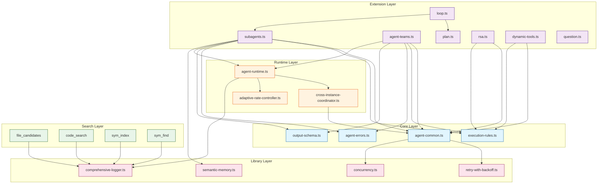
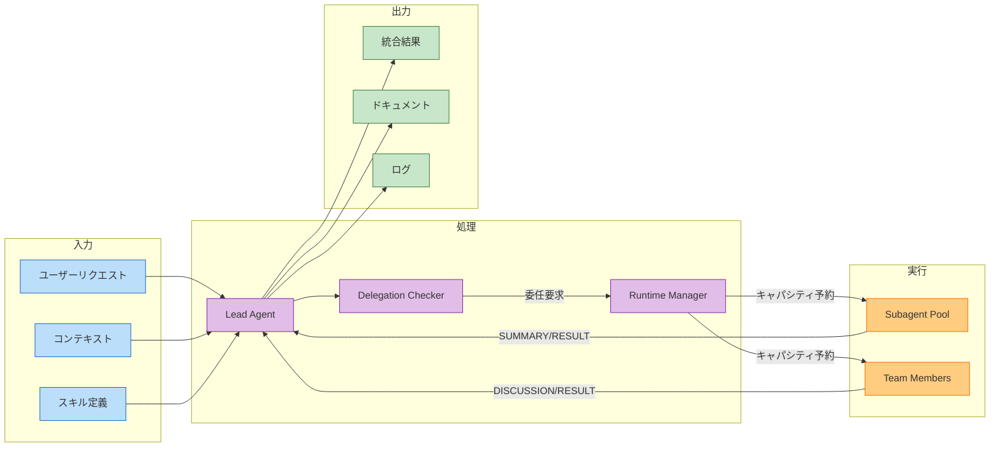
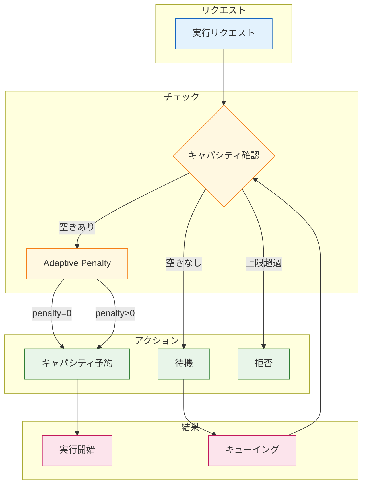
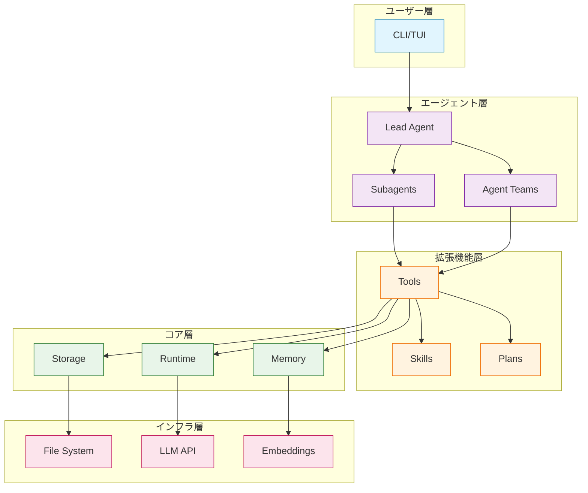
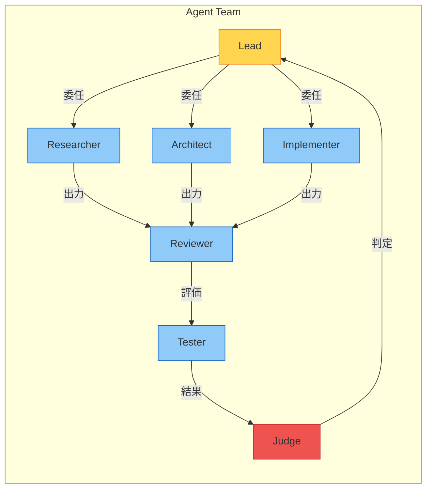
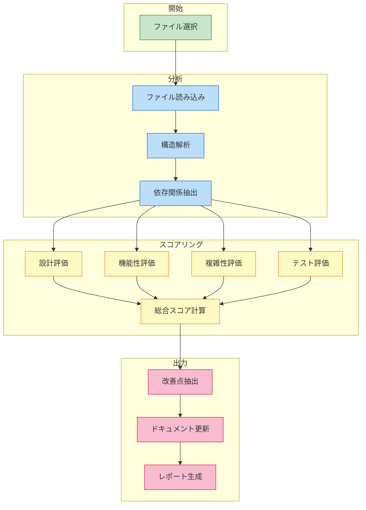
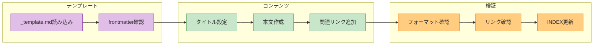
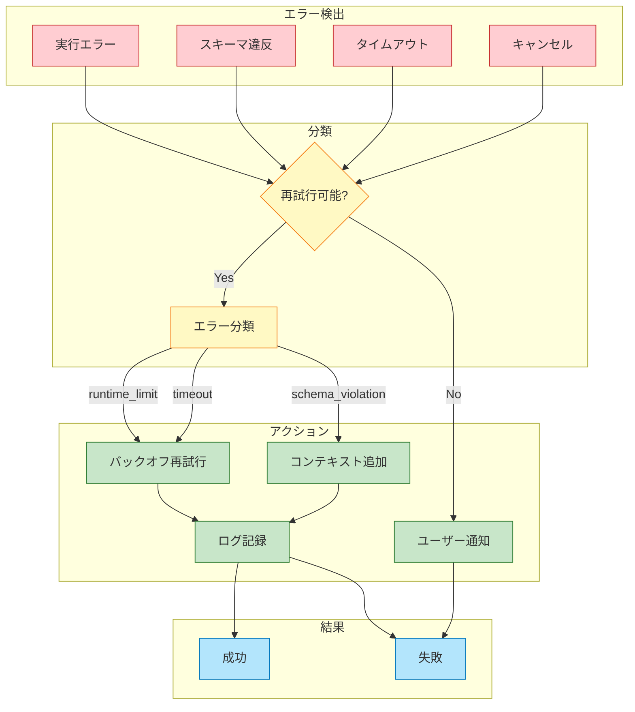
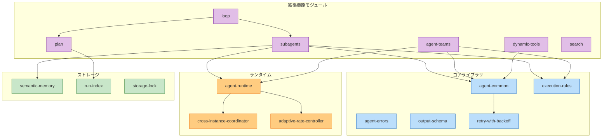

# システムアーキテクチャ図

> パンくず: [Home](../README.md) > [Code Review Report](./README.md) > Architecture Diagram

## 概要

本ドキュメントは、pi-plugin/mekannプロジェクトのシステムアーキテクチャをMermaid図で可視化します。

---

## 1. 拡張機能依存関係図

### 全体構成

### 依存関係の方向性

- **上から下へ**: 高レベル抽象から低レベル実装へ
- **Extension → Core → Library**: 適切な依存方向
- **双方向依存なし**: 循環依存は存在しない

---

## 2. データフロー図

### 委任オーケストレーションデータフロー

### キャパシティ管理データフロー

---

## 3. コンポーネント関係図

### レイヤー構成

### エージェントチーム構成

---

## 4. 実行フロー図

### コードレビュー実行フロー

### ドキュメント作成フロー

---

## 5. エラーハンドリングフロー

---

## 6. モジュール境界図

---

## 関連ドキュメント

- [レビューサマリー](./01-summary.md)
- [判断基準フロー](./03-decision-flow.md)
- [改善推奨事項](./04-recommendations.md)
- [Subagents & Agent Teams Sequence Diagrams](../subagents-agent-teams-sequence-diagrams.md)

[ → 判断基準フローを見る](./03-decision-flow.md)
