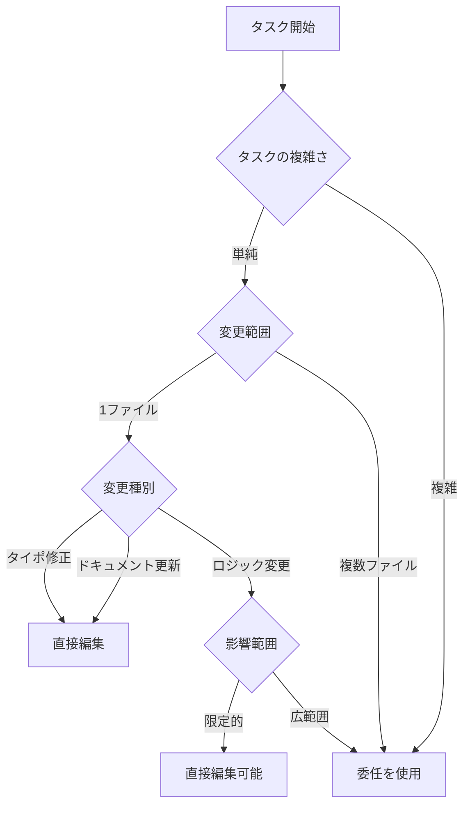
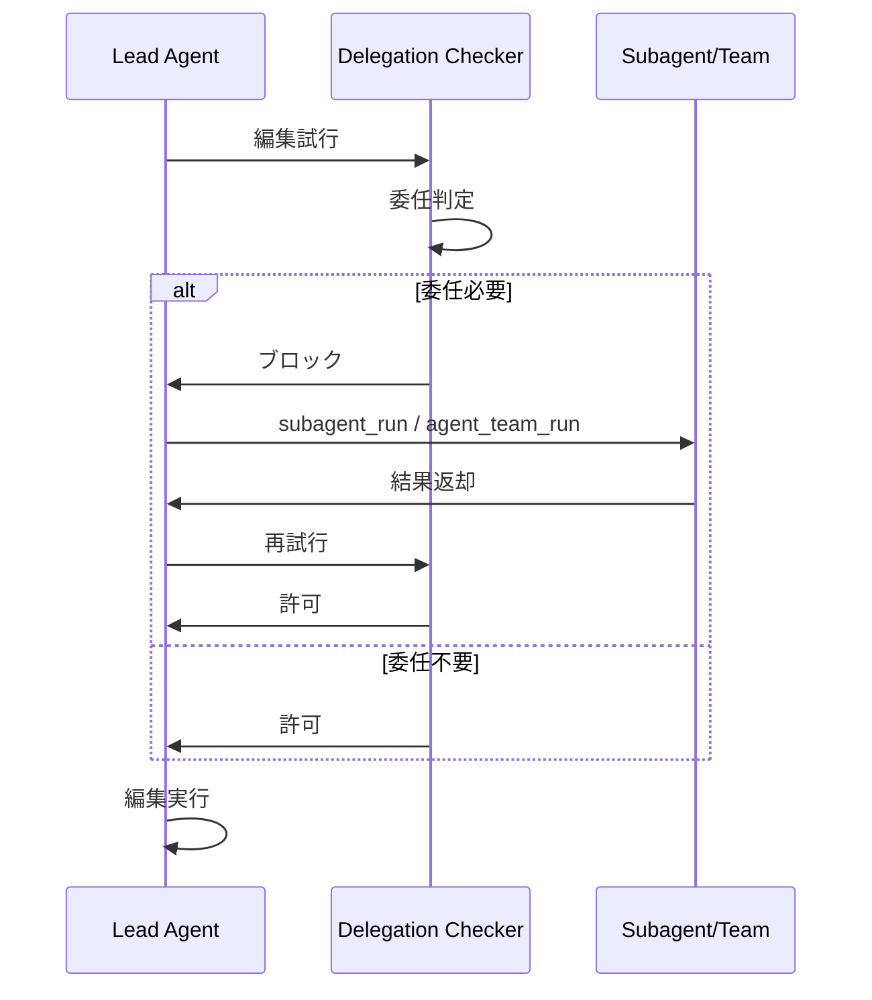
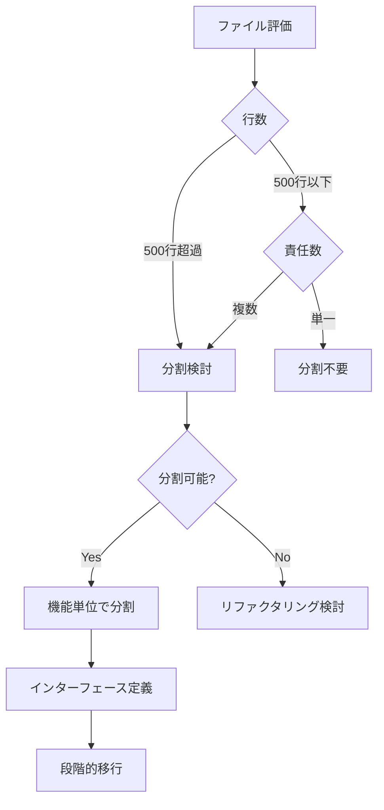
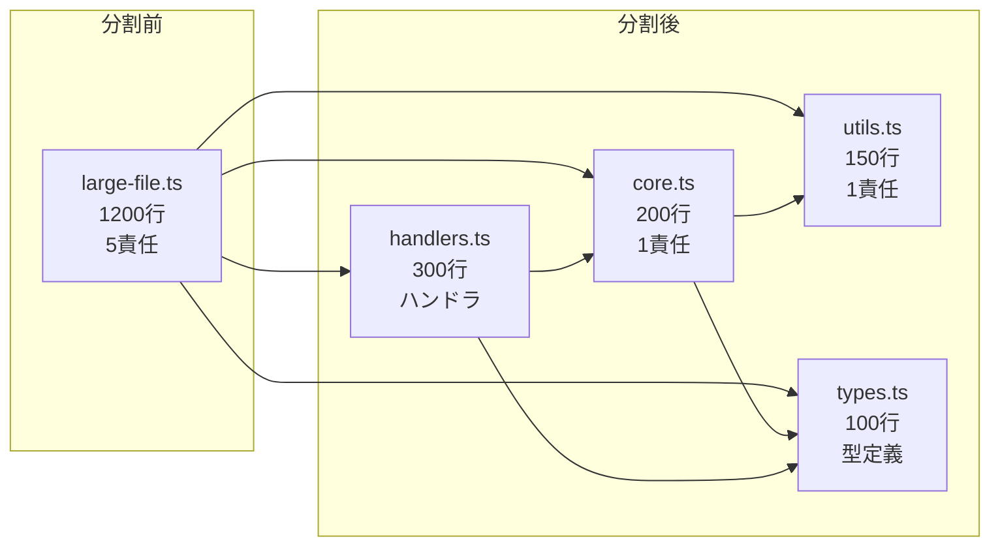
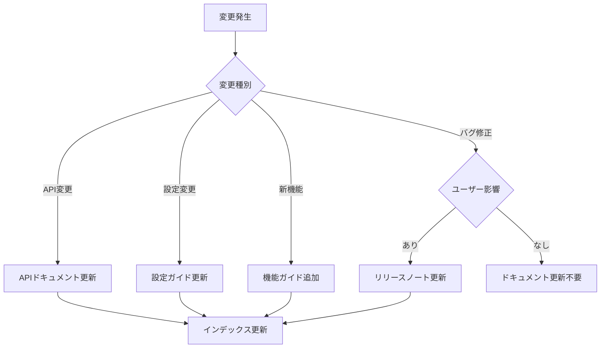
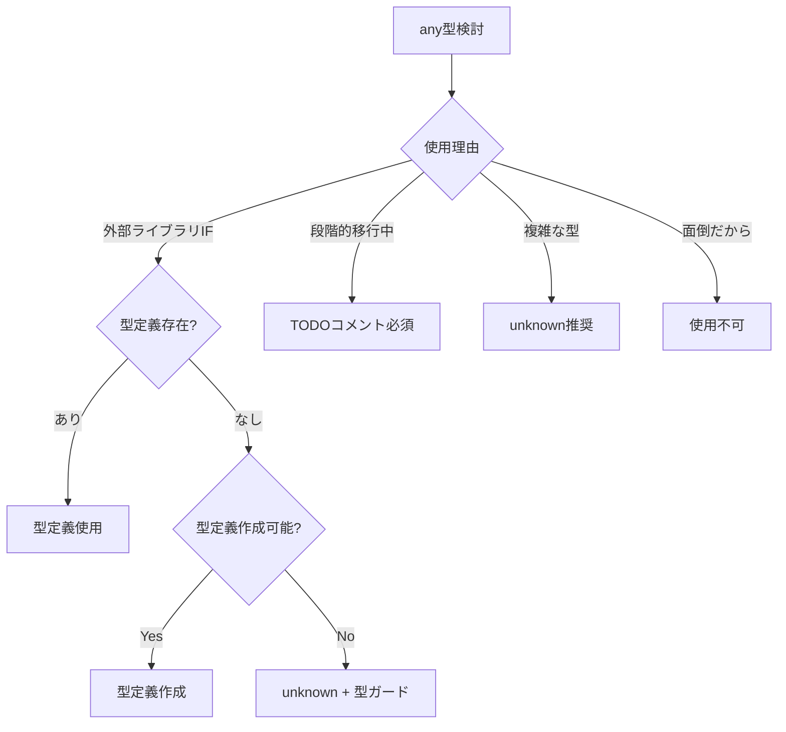
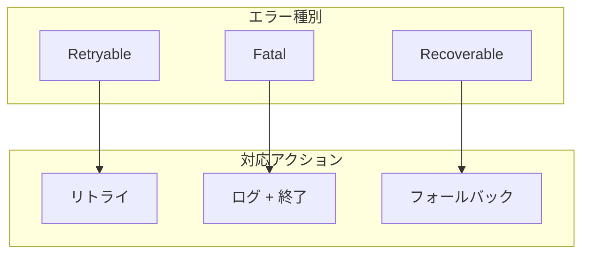
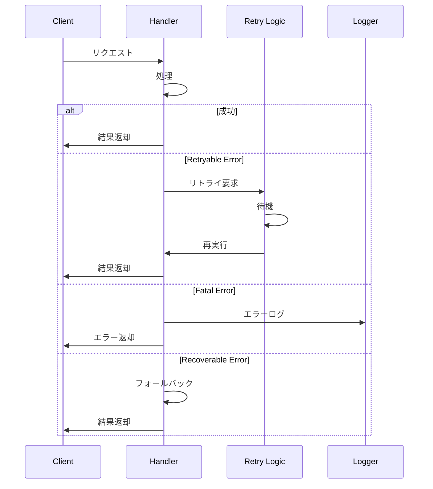
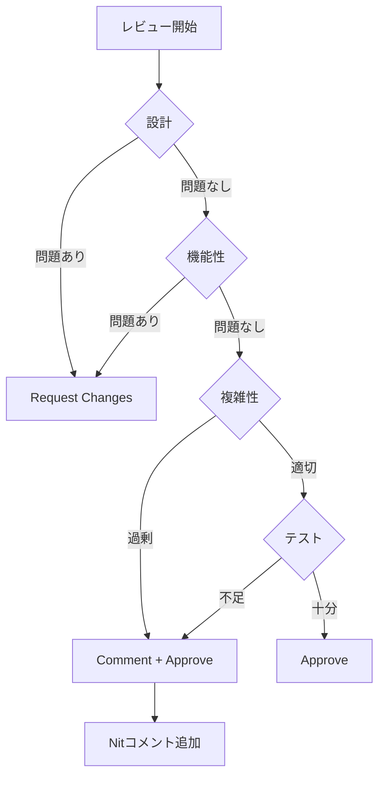
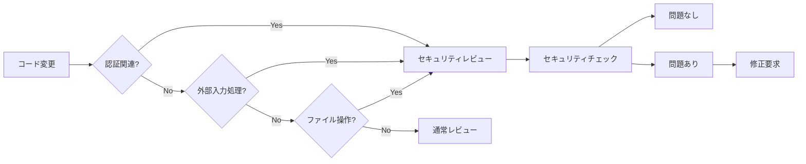

# 判断基準と意思決定フロー

> パンくず: [Home](../README.md) > [Code Review Report](./README.md) > 判断基準と意思決定フロー

## 概要

このドキュメントは、pi-plugin/mekannプロジェクトにおける開発時の判断基準と意思決定フローを定義します。委任の使用、ファイル分割、ドキュメント更新、型安全性、エラーハンドリングに関する指針を提供します。

## 1. 委任の使用判断基準

### 委任を使用すべき場合



### 判断基準一覧

| 条件 | 委任 | 直接編集 |
|------|------|---------|
| 変更ファイル数 | 3ファイル以上 | 1-2ファイル |
| タスク種別 | 設計判断が必要 | 機械的修正 |
| 影響範囲 | 複数モジュール | 単一モジュール |
| テスト必要性 | 新規テスト作成 | テスト不要 |
| ドキュメント影響 | 更新必要 | 更新不要 |

### 委任フロー



### 委任ツール選択

| ツール | 使用場面 |
|--------|---------|
| `subagent_run` | 単一の独立タスク |
| `subagent_run_parallel` | 複数の独立タスク（並列実行） |
| `agent_team_run` | 協調が必要な複雑なタスク |
| `agent_team_run_parallel` | 複数のチームタスク（並列実行） |

## 2. ファイル分割判断基準

### 分割フロー



### 分割基準

| 指標 | 分割不要 | 分割検討 | 分割必須 |
|------|---------|---------|---------|
| 行数 | < 300行 | 300-500行 | > 500行 |
| 責任数 | 1つ | 2-3つ | 4つ以上 |
| 依存関係 | 単方向 | 双方向1つ | 循環あり |
| テスト容易性 | 高い | 中程度 | 低い |

### ファイル分割パターン



### 分割手順

1. **現状分析**: 責任の境界を特定
2. **インターフェース定義**: 公開APIを明確化
3. **新規ファイル作成**: 機能単位で分割
4. **段階的移行**: インポートパス更新
5. **テスト更新**: 各モジュールのテスト追加
6. **削除**: 元ファイルの不要部分削除

## 3. ドキュメント更新判断基準

### 更新フロー



### 更新基準

| 変更種別 | ドキュメント更新 | 対象ファイル |
|---------|----------------|-------------|
| 新規関数追加 | 必要 | APIドキュメント |
| 関数シグネチャ変更 | 必要 | APIドキュメント |
| 設定項目追加 | 必要 | 設定ガイド |
| バグ修正 | ユーザー影響時のみ | リリースノート |
| 内部リファクタリング | 不要 | - |
| パフォーマンス改善 | 大幅改善時 | リリースノート |

### フロントマター必須項目

```yaml
---
title: ページタイトル        # 必須
category: getting-started | user-guide | development | reference | meta  # 必須
audience: new-user | daily-user | developer | contributor  # 必須
last_updated: YYYY-MM-DD    # 必須
tags: []                    # 任意
related: []                 # 任意
---
```

## 4. 型安全性の判断基準

### any型使用の可否



### 判断基準

| 状況 | 判定 | 対応 |
|------|------|------|
| 外部ライブラリで型定義なし | 条件付き許可 | `unknown` + 型ガード |
| 段階的TypeScript移行中 | 条件付き許可 | TODOコメント + 期限設定 |
| 複雑なJSONレスポンス | 条件付き許可 | Zod等でのランタイム検証 |
| 面倒だから | 不可 | 適切な型定義を作成 |
| 第三方ライブラリの callback | 条件付き許可 | 可能な限り型付け |

### 型定義のベストプラクティス

```typescript
// 悪い例
function process(data: any): any {
  return data.value;
}

// 良い例
interface InputData {
  value: string;
}

function process(data: InputData): string {
  return data.value;
}

// 外部ライブラリ用の妥協例
function handleExternal(data: unknown): Result {
  if (!isExternalData(data)) {
    throw new TypeError('Invalid data format');
  }
  return processExternal(data);
}
```

## 5. エラーハンドリング判断基準

### エラー分類



### エラー種別と対応

| エラー種別 | 分類 | 対応 |
|-----------|------|------|
| ネットワークタイムアウト | Retryable | 指数バックオフでリトライ |
| API レート制限 | Retryable | 待機後にリトライ |
| ファイルロック競合 | Retryable | 短い待機後にリトライ |
| メモリ不足 | Fatal | ログ出力して終了 |
| 設定ファイル破損 | Fatal | ログ出力して終了 |
| 権限エラー | Fatal | ユーザー通知して終了 |
| データフォーマット不正 | Recoverable | デフォルト値使用 |
| オプション機能のエラー | Recoverable | 機能無効化して継続 |

### エラーハンドリングパターン



### エラーメッセージガイドライン

| 項目 | 良い例 | 悪い例 |
|------|-------|-------|
| 具体性 | `Failed to read config.json: ENOENT` | `Error reading file` |
| 復旧方法 | `Run 'pi init' to create config` | `Config not found` |
| コンテキスト | `In extension loader at line 42` | `Something went wrong` |
| ユーザー向け | `Configuration file is missing` | `ENOENT: no such file` |

## 6. コードレビュー時の判断基準

### レビュー判定フロー



### LGTM判定基準

| 判定 | 基準 | アクション |
|------|------|-----------|
| **LGTM** | コードの健康状態が維持/改善 | 即時マージ |
| **LGTM with Comments** | 軽微な改善提案あり | マージ後対応 |
| **Request Changes** | コードの健康状態を悪化させる | 修正後に再レビュー |

### レビューコメント分類

| 分類 | 説明 | 必須対応 |
|------|------|---------|
| **Must** | バグ、セキュリティ問題 | はい |
| **Should** | 可読性、保守性の改善 | 推奨 |
| **Nit** | スタイル、一貫性 | 任意 |
| **Question** | 確認事項 | 回答のみ |

## 7. セキュリティ判断基準

### セキュリティチェックリスト



### セキュリティ確認事項

| 項目 | チェック内容 |
|------|-------------|
| 入力検証 | 外部入力のサニタイズ |
| 認証・認可 | 適切な権限チェック |
| 機密情報 | ログ出力の除外 |
| 依存関係 | 脆弱性のあるパッケージ |
| ファイルアクセス | パストラバーサル対策 |

---

## 関連トピック

- [レビュー結果サマリー](./01-summary.md) - 全体的な評価
- [アーキテクチャ図](./02-architecture-diagram.md) - システム構造の視覚化
- [改善推奨事項](./04-recommendations.md) - 具体的な改善アクション
- [APPEND_SYSTEM.md](../../.pi/APPEND_SYSTEM.md) - プロジェクトルール

## 次のトピック

[ 改善推奨事項を見る ](./04-recommendations.md)
