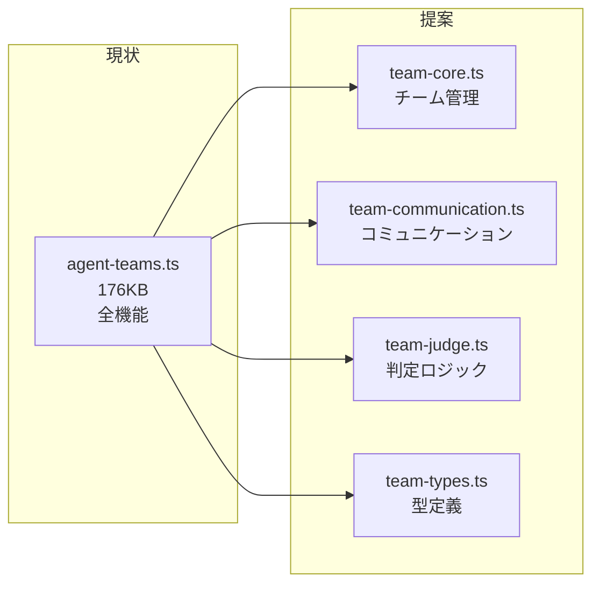
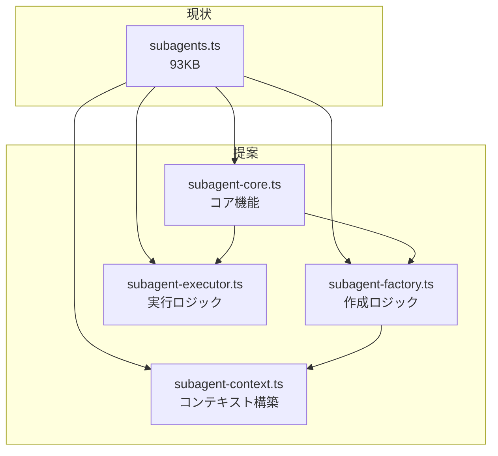
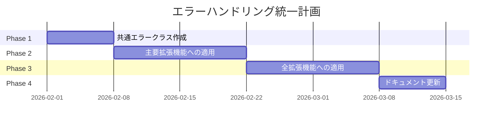
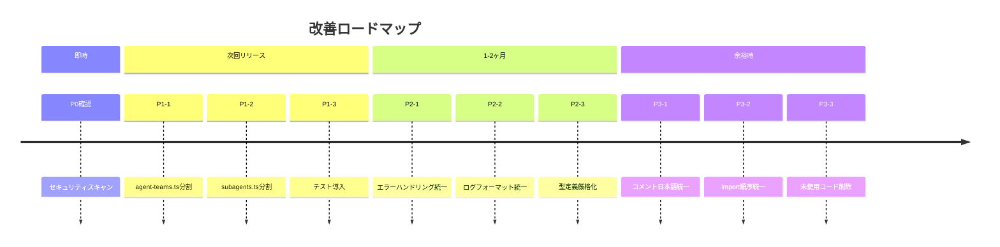

# 改善推奨事項

> パンくず: [Home](../README.md) > [Code Review Report](./README.md) > 改善推奨事項

## 概要

このドキュメントは、pi-plugin/mekannプロジェクトのコードレビュー結果に基づく具体的な改善推奨事項を提供します。優先度（P0〜P3）別に分類し、各項目について対応方針と影響範囲を明記しています。

## 優先度定義

| 優先度 | 定義 | 対応期限 | 影響 |
|--------|------|---------|------|
| **P0（緊急）** | システム停止、セキュリティ脆弱性 | 即時（24時間以内） | 業務停止リスク |
| **P1（高）** | 機能不全、重大な品質問題 | 次回リリース | ユーザー影響大 |
| **P2（中）** | 保守性の低下、技術的負債 | 計画的対応（1-2ヶ月） | 将来的な影響 |
| **P3（低）** | 軽微な改善、スタイル統一 | 時間的余裕時 | 品質向上 |

## P0（緊急）: 即時対応

現在、P0レベルの緊急課題は特定されていません。

### チェック項目

- [ ] セキュリティ脆弱性のスキャン実施
- [ ] 依存パッケージの脆弱性確認
- [ ] 本番環境でのエラー監視

## P1（高）: 次回リリース

### 1. agent-teams.tsの分割

| 項目 | 詳細 |
|------|------|
| **対象ファイル** | `.pi/extensions/agent-teams.ts`（176KB） |
| **問題点** | 単一ファイルが肥大化し、保守性が低下 |
| **影響範囲** | チームオーケストレーション全体 |
| **対応方針** | 機能単位でモジュール分割 |

#### 分割計画



#### 具体的な作業

1. 型定義を `team-types.ts` に抽出
2. コミュニケーション処理を `agent-teams/communication.ts` に移動（既存）
3. 判定ロジックを `agent-teams/judge.ts` に移動（既存）
4. コア機能を `team-core.ts` に整理
5. インポートパスの更新

### 2. subagents.tsの分割

| 項目 | 詳細 |
|------|------|
| **対象ファイル** | `.pi/extensions/subagents.ts`（93KB） |
| **問題点** | サブエージェント作成・実行・管理が混在 |
| **影響範囲** | サブエージェント実行全体 |
| **対応方針** | コア/作成/実行/管理の分離 |

#### 分割計画



### 3. テストフレームワーク導入

| 項目 | 詳細 |
|------|------|
| **現状** | テストファイルが存在しない |
| **影響範囲** | リファクタリング時の品質保証 |
| **対応方針** | Jest または Vitest の導入 |

#### 推奨構成

```bash
# パッケージインストール
npm install -D vitest @vitest/coverage-v8

# テストディレクトリ構成
tests/
├── unit/
│   ├── extensions/
│   │   ├── subagents.test.ts
│   │   └── agent-teams.test.ts
│   └── lib/
│       ├── output-schema.test.ts
│       └── adaptive-penalty.test.ts
└── integration/
    └── orchestration.test.ts
```

#### 優先テスト項目

1. `output-schema.ts` - スキーマ検証ロジック
2. `adaptive-penalty.ts` - ペナルティ計算
3. `text-parsing.ts` - テキスト解析ユーティリティ
4. `subagents.ts` - サブエージェント作成・実行

## P2（中）: 計画的対応

### 1. エラーハンドリング統一

| 項目 | 詳細 |
|------|------|
| **現状** | try-catchパターンが不統一 |
| **影響範囲** | 拡張機能全体 |
| **対応方針** | 共通エラークラス導入 |

#### 推奨実装

```typescript
// lib/errors.ts
export class PiError extends Error {
  constructor(
    message: string,
    public code: string,
    public retryable: boolean = false
  ) {
    super(message);
    this.name = 'PiError';
  }
}

export class RuntimeLimitError extends PiError {
  constructor(message: string) {
    super(message, 'RUNTIME_LIMIT_REACHED', true);
  }
}

export class SchemaValidationError extends PiError {
  constructor(message: string) {
    super(message, 'SCHEMA_VIOLATION', true);
  }
}
```

#### 移行計画



### 2. ログフォーマット統一

| 項目 | 詳細 |
|------|------|
| **現状** | ログ出力フォーマットが不統一 |
| **影響範囲** | デバッグ、監視 |
| **対応方針** | 構造化ログへの移行 |

#### 推奨ログフォーマット

```json
{
  "timestamp": "2026-02-17T02:30:00.000Z",
  "level": "INFO",
  "context": "subagents",
  "operation": "runSubagentTask",
  "message": "Subagent execution started",
  "metadata": {
    "subagentId": "researcher-001",
    "runtimeCount": 2
  }
}
```

### 3. 型定義の厳格化

| 項目 | 詳細 |
|------|------|
| **現状** | `strictNullChecks` が一部で無効 |
| **影響範囲** | 型安全性 |
| **対応方針** | 段階的に `strict` モードへ移行 |

#### 移行手順

1. 新規ファイルは `strict` モードで作成
2. 既存ファイルを1つずつ修正
3. 全ファイル修正後に `tsconfig.json` を更新

#### 対象ファイル

| ファイル | 現状 | 目標 |
|---------|------|------|
| `output-schema.ts` | strict | strict |
| `adaptive-penalty.ts` | strict | strict |
| `subagents.ts` | 緩い | strict |
| `agent-teams.ts` | 緩い | strict |

## P3（低）: 時間的余裕時

### 1. コメントの日本語統一

| 項目 | 詳細 |
|------|------|
| **現状** | 一部ファイルで英語と日本語が混在 |
| **影響範囲** | 可読性 |
| **対応方針** | 日本語に統一 |

#### 対象ファイル

- `.pi/extensions/*.ts` の一部
- `.pi/lib/*.ts` の一部

### 2. import順序の統一

| 項目 | 詳細 |
|------|------|
| **現状** | import順序が不統一 |
| **影響範囲** | 可読性、コードレビュー |
| **対応方針** | eslint-plugin-import 導入 |

#### 推奨設定

```json
// .eslintrc.json
{
  "plugins": ["import"],
  "rules": {
    "import/order": ["error", {
      "groups": [
        "builtin",
        "external",
        "internal",
        "parent",
        "sibling",
        "index"
      ],
      "newlines-between": "always",
      "alphabetize": { "order": "asc" }
    }]
  }
}
```

### 3. 未使用コードの削除

| 項目 | 詳細 |
|------|------|
| **現状** | 一部で未使用の関数・変数が存在 |
| **影響範囲** | コードベースの整理 |
| **対応方針** | デッドコード削除 |

#### 対象

- エクスポートされているが使用されていない関数
- コメントアウトされたコードブロック
- 使用されていない型定義

## 改善アクションまとめ



## 進捗管理

### トラッキング方法

各改善項目は以下の方法で進捗を管理します：

1. **GitHub Issues**: 各項目をIssueとして作成
2. **プロジェクトボード**: P0〜P3のカラムで管理
3. **マイルストーン**: リリース単位で設定

### 完了基準

| 優先度 | 完了基準 |
|--------|---------|
| P0 | 本番環境での動作確認完了 |
| P1 | コードレビュー承認 + テスト追加 |
| P2 | コードレビュー承認 |
| P3 | マージ完了 |

---

## 関連トピック

- [レビュー結果サマリー](./01-summary.md) - 全体的な評価
- [アーキテクチャ図](./02-architecture-diagram.md) - システム構造の視覚化
- [判断基準と意思決定フロー](./03-decision-flow.md) - 開発時の判断指針

## 次のトピック

[ ドキュメントインデックスに戻る ](./README.md)
