# 詳細システムアーキテクチャ図

## 1. DAG実行システム（subagent_run_dag）

### 1.1 DAG実行の全体フロー

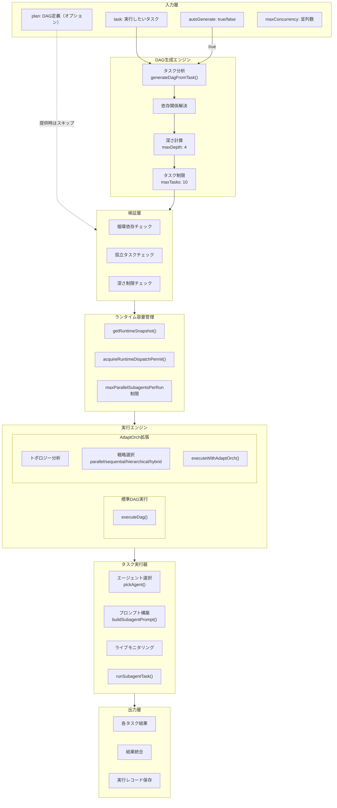

### 1.2 DAG自動生成のアルゴリズム

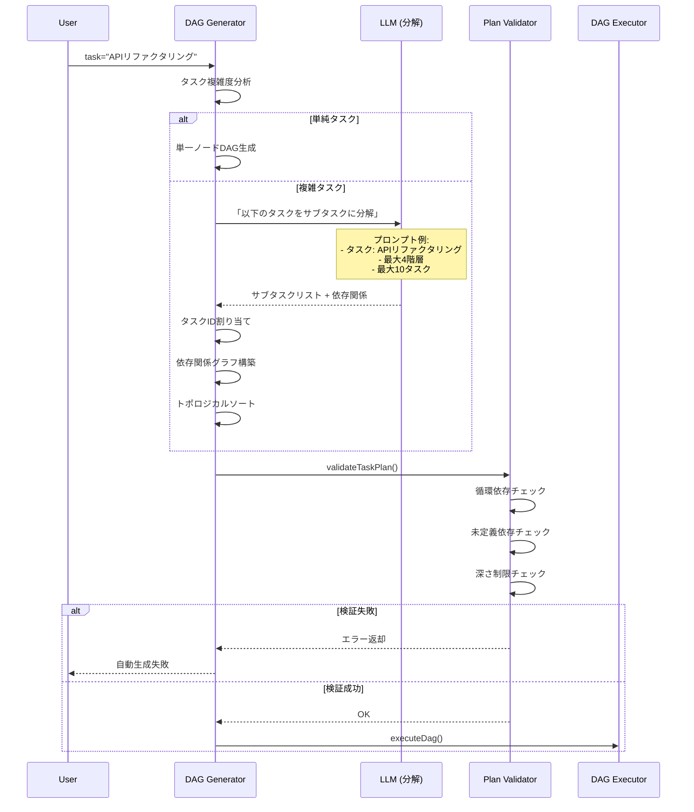

### 1.3 DAG実行の並列制御

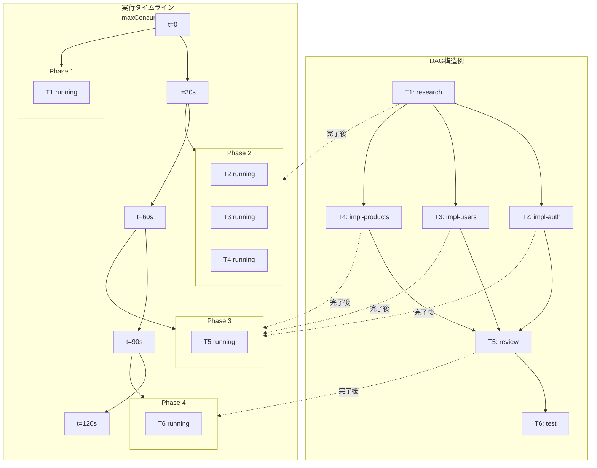

### 1.4 AdaptOrchトポロジー認識実行

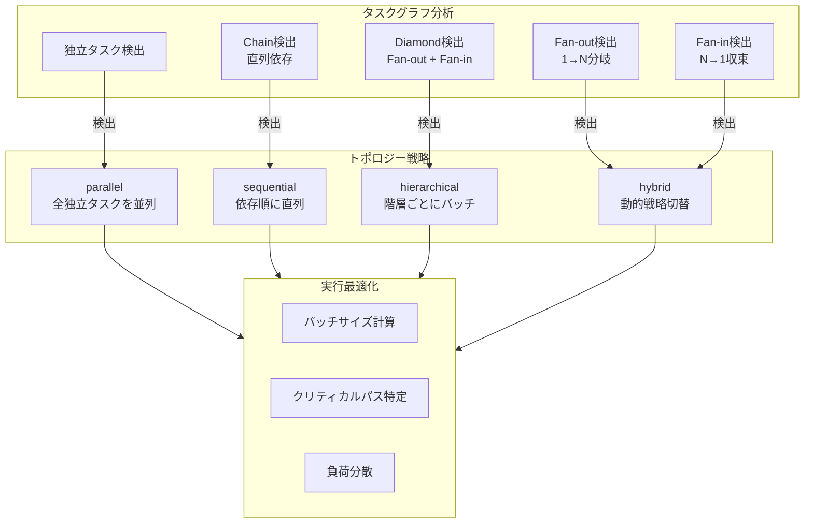

## 2. ツールコンパイラシステム（compile_tools / execute_compiled）

### 2.1 ツール融合の仕組み

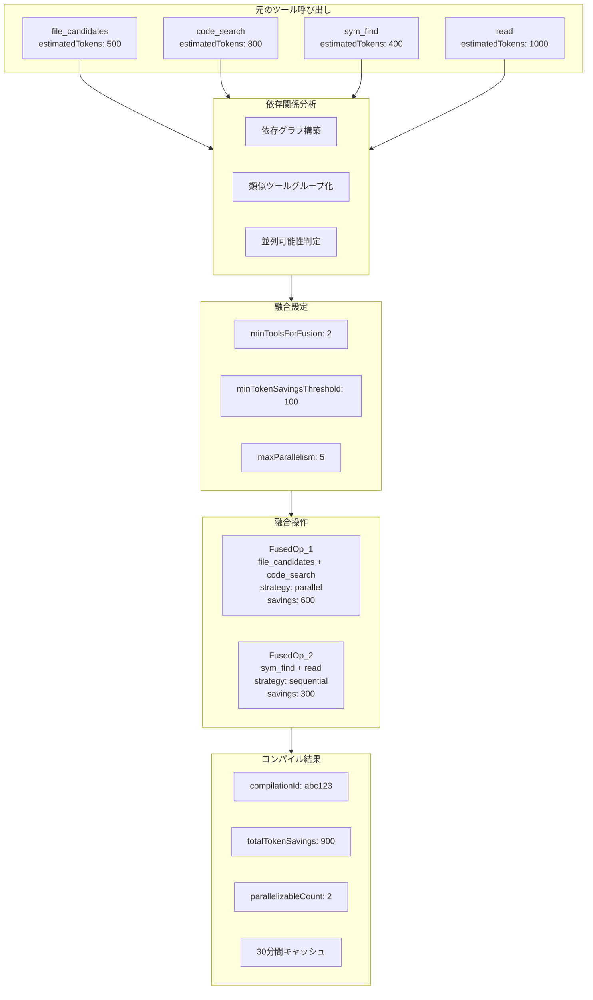

### 2.2 融合操作の実行フロー

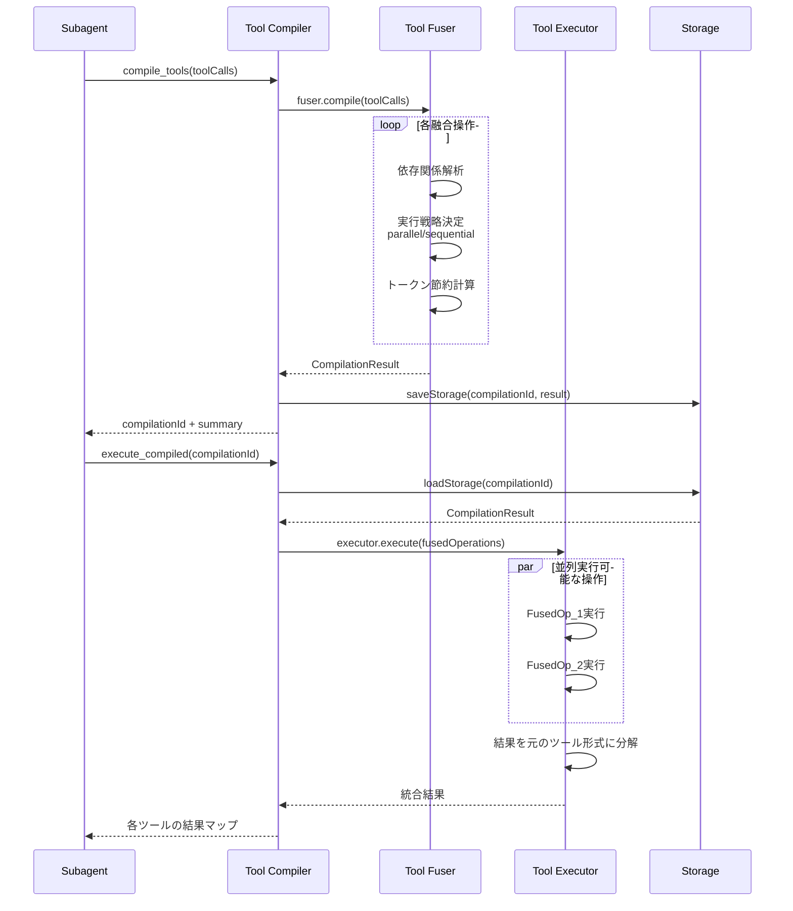

## 3. インデックスシステム

### 3.1 インデックスシステム全体図

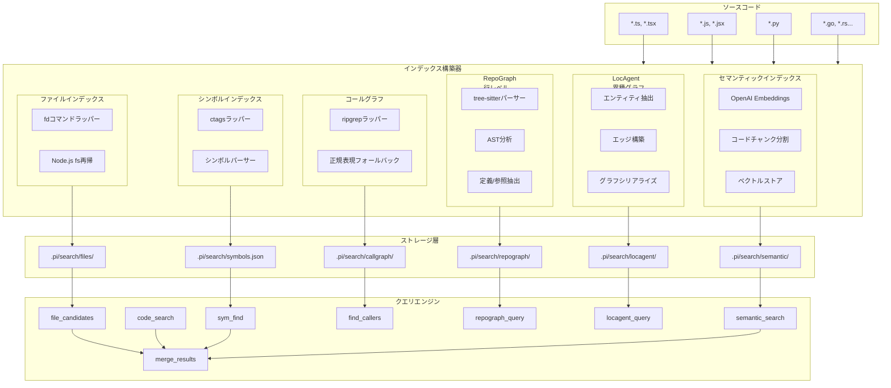

### 3.2 RepoGraph vs LocAgent の比較

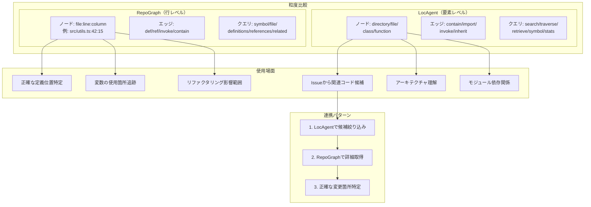

### 3.3 セマンティックインデックス構築フロー

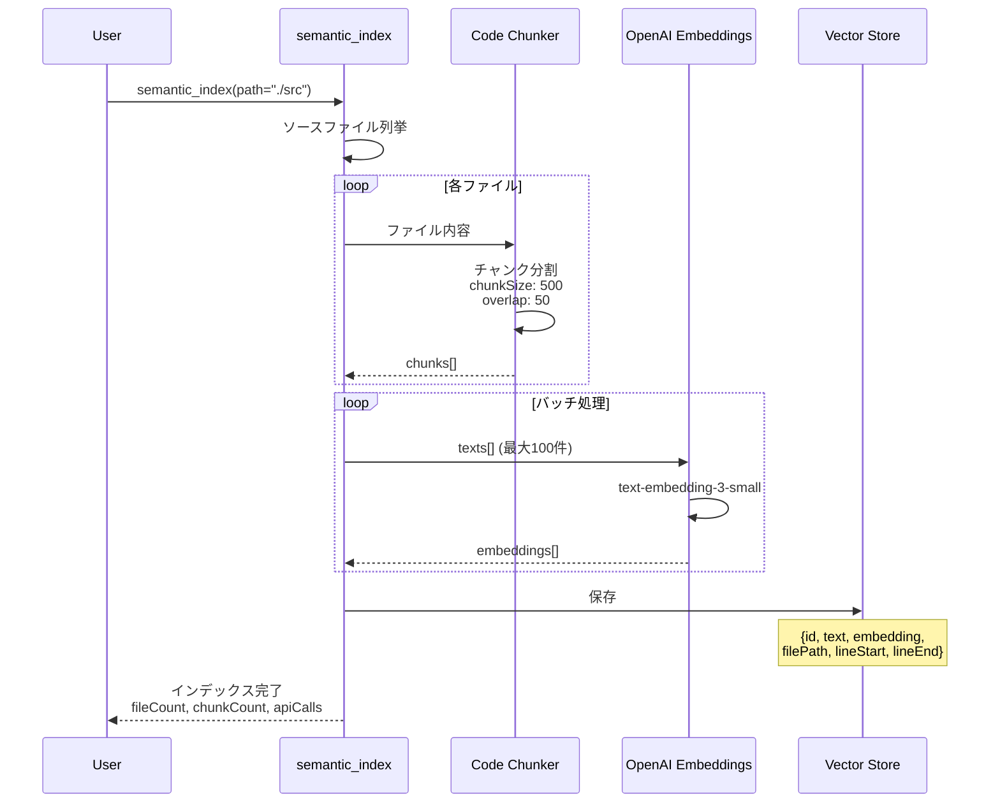

### 3.4 検索ツールの統合（merge_results）

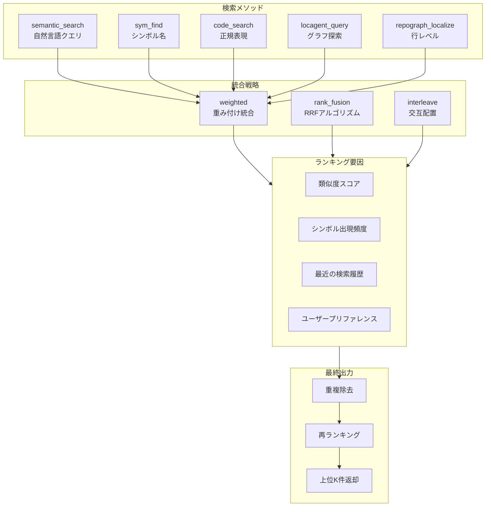

## 4. スキルレジストリシステム

### 4.1 スキル解決フロー

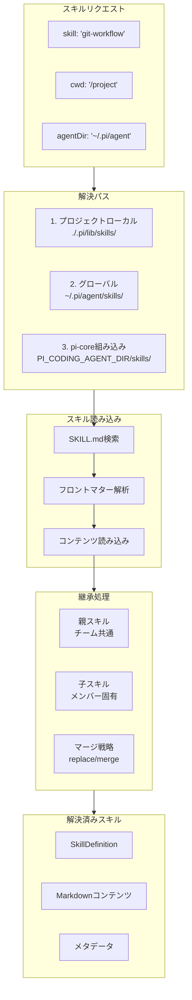

## 5. システム連携図

### 5.1 完全なタスク実行フロー

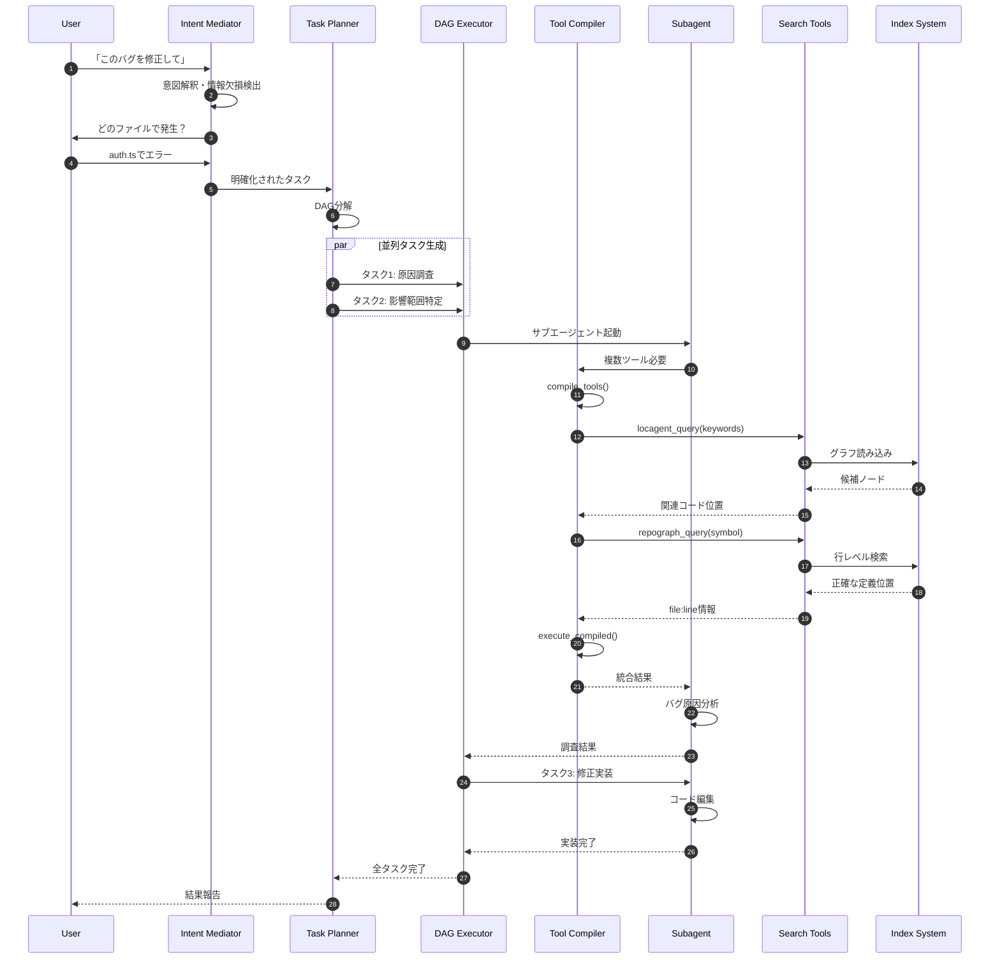

## 6. パフォーマンス特性

### 6.1 各インデックスの性能比較

| インデックス | 構築時間 | サイズ | クエリ速度 | 精度 | 用途 |
|------------|---------|--------|-----------|------|------|
| file_candidates | 即時 | 小 | 速い | 高 | ファイル列挙 |
| sym_index | 数秒 | 中 | 速い | 高 | シンボル検索 |
| call_graph_index | 数十秒 | 大 | 普通 | 中 | 呼び出し関係 |
| repograph_index | 数分 | 大 | 普通 | 非常高 | 正確な位置特定 |
| locagent_index | 数秒 | 中 | 速い | 高 | Issue解決 |
| semantic_index | 数分 | 大 | 普通 | 中〜高 | 意味検索 |

### 6.2 DAG実行のスケーラビリティ

```mermaid
xychart-beta
    title "DAG実行時間 vs タスク数"
    x-axis [1, 5, 10, 20, 50]
    y-axis "実行時間(秒)" 0 --> 300
    bar "Sequential" [30, 150, 300, 600, 1500]
    bar "DAG(max=3)" [30, 60, 90, 150, 300]
    bar "DAG(max=5)" [30, 45, 60, 90, 180]
```
