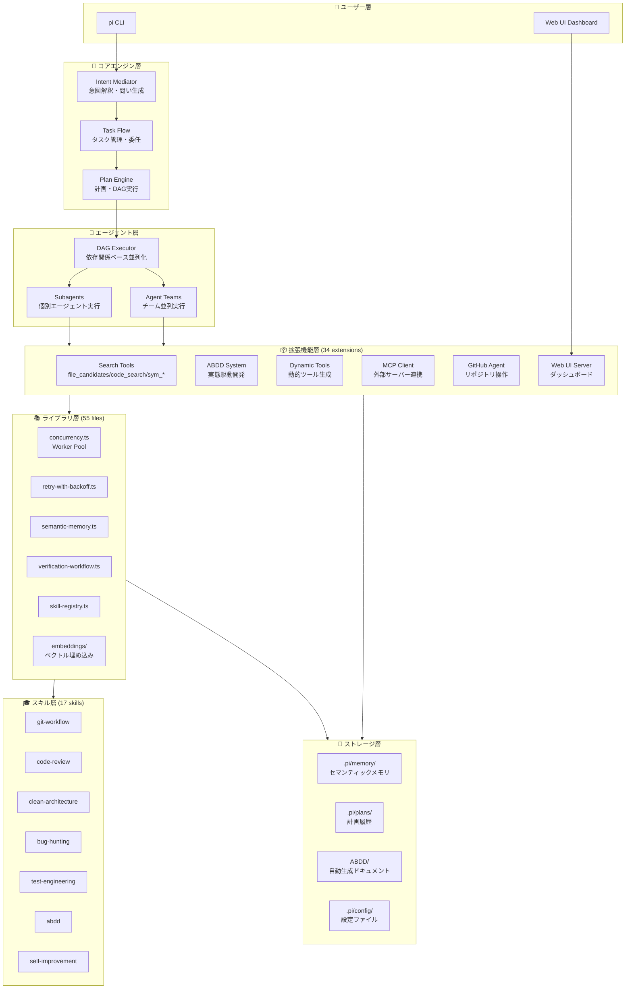
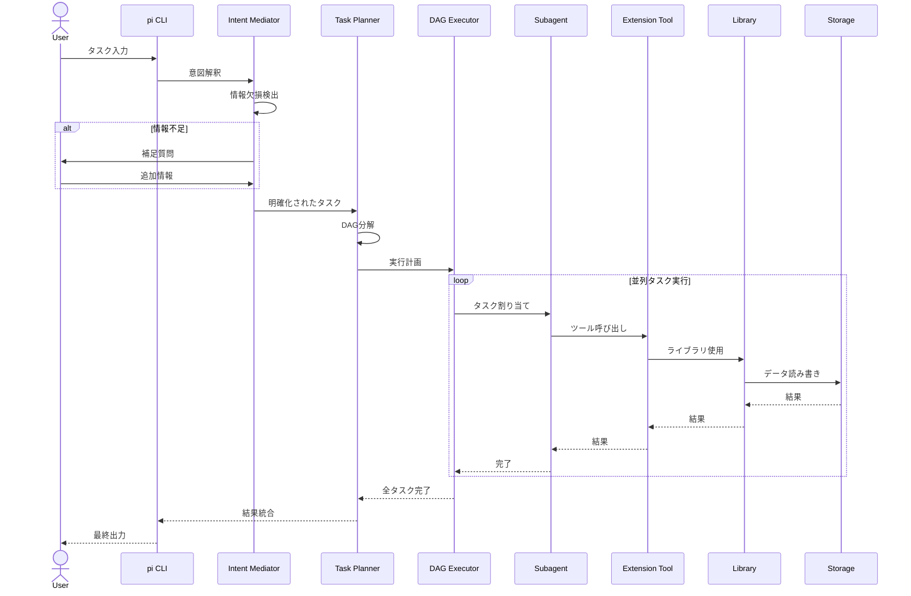
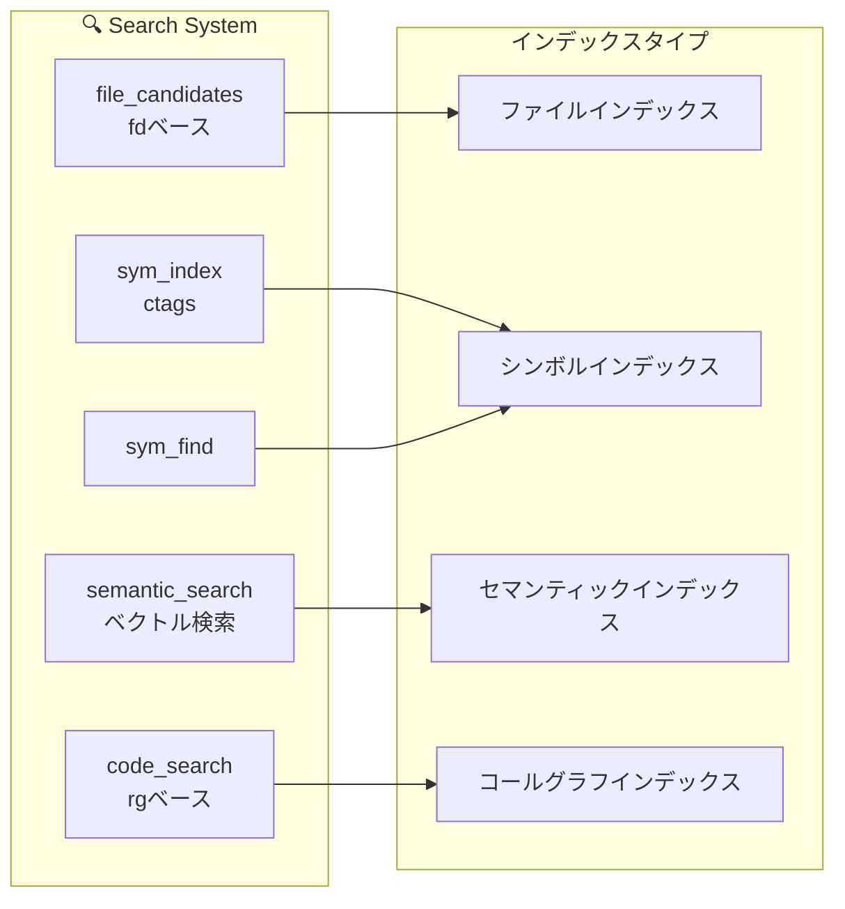
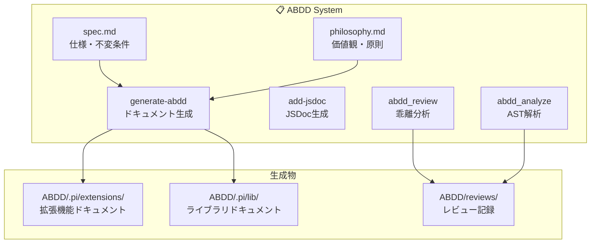
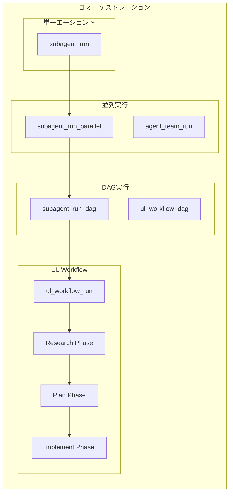
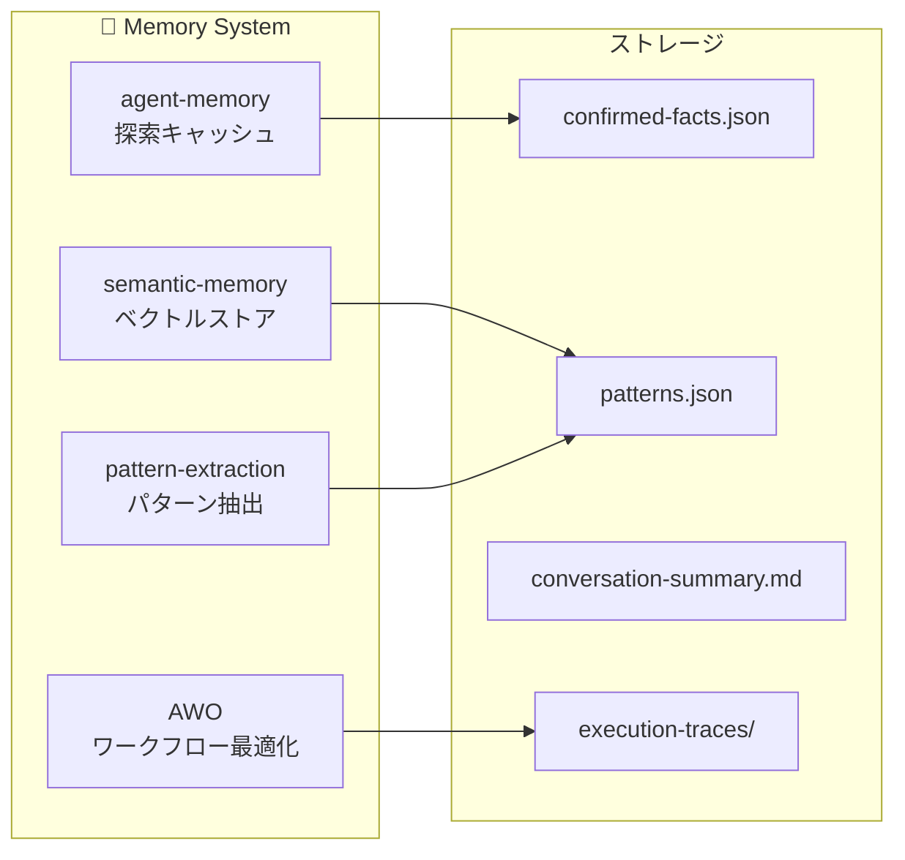
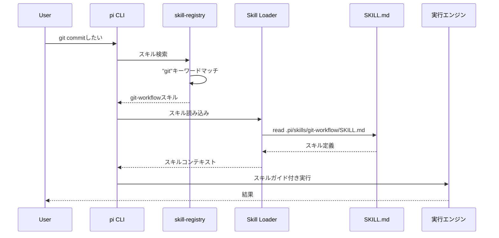

# システムアーキテクチャ図

## 概要

本ドキュメントはmekann/pi拡張コレクションの全体アーキテクチャを視覚化する。

## レイヤー構造図

## データフロー図

## サブシステム詳細

### 1. 検索システム

### 2. ABDDシステム

### 3. エージェントオーケストレーション

### 4. メモリシステム

## コンポーネント依存関係

```mermaid
graph TD
    A[question] --> B[user-input]
    C[mediator_interpret] --> D[intent-mediator]
    E[task_*] --> F[task-flow]
    G[plan_*] --> H[plan.ts]
    I[subagent_*] --> J[subagents.ts]
    K[agent_team_*] --> L[agent-teams.ts]
    M[abdd_*] --> N[abdd.ts]
    O[file_candidates] --> P[search/file-candidates.ts]
    Q[code_search] --> R[search/code-search.ts]
    S[sym_index] --> T[search/symbol-index.ts]
    U[sym_find] --> V[search/symbol-find.ts]
    W[create_tool] --> X[dynamic-tools.ts]
    Y[mcp_*] --> Z[mcp-client.ts]
    AA[repo_audit] --> BB[repo-audit-orchestrator.ts]
    CC[loop_run] --> DD[loop.ts]
    EE[self_reflect] --> FF[self-improvement-reflection.ts]
```

## スキル呼び出しフロー

## 技術スタック

| 層 | 技術 |
|----|------|
| ランタイム | Node.js / TypeScript |
| プロセス管理 | Worker Threads |
| 検索 | fd, ripgrep, ctags |
| ベクトル検索 | OpenAI Embeddings |
| ブラウザ自動化 | Playwright |
| ドキュメント | Markdown + Mermaid |
| 設定 | JSON / YAML |

## 関連ドキュメント

- [.pi/INDEX.md](.pi/INDEX.md) - リポジトリ構造マップ
- [.pi/NAVIGATION.md](.pi/NAVIGATION.md) - タスク別ソースマッピング
- [ABDD/index.md](ABDD/index.md) - ABDDシステム詳細
